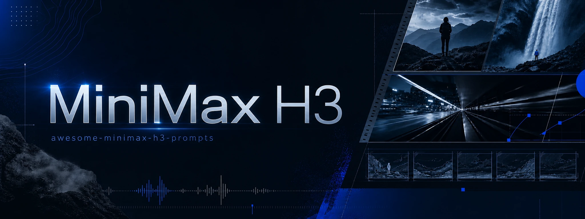

  

# Awesome MiniMax H3 Prompts

Curated MiniMax H3 video prompts with WebM examples and creator attribution,
by [BeatAPI](https://beatapi.io).

**[Browse the live prompt gallery](https://beatapi.io/minimax-h3-prompts)** ·
**[Use MiniMax H3 via API](https://beatapi.io/minimax-h3-api)** ·
**[中文说明](./README.zh-CN.md)** ·
**[Contribute a prompt](https://github.com/BeatAPI/awesome-minimax-h3-prompts/issues/new?template=prompt.yml)**

## Prompt gallery

<!-- GENERATED_VIDEO_GALLERY_START -->

**Browse by use case:** [Stories & Films](./prompts/use-cases/stories-films.md) · [Action & Fantasy](./prompts/use-cases/action-fantasy.md) · [Ads & Products](./prompts/use-cases/ads-products.md) · [Music & Performance](./prompts/use-cases/music-performance.md) · [Vlog & Social](./prompts/use-cases/vlog-social.md)

**[Browse all 300 prompts](./prompts/README.md)**

### 1. Modern warfare FPS gameplay

<strong>Prompt</strong> — Camera: First-person perspective at eye level with authentic handheld player movement, as if recorded directly from a modern AAA military shooter. The player carries a highly...

~~~~text
Camera: First-person perspective at eye level with authentic handheld player movement, as if recorded directly from a modern AAA military shooter. The player carries a highly detailed assault rifle with realistic animations, visible hands, tactical gloves, dynamic reload mechanics, and weapon sway.  **Opening Action:** The video immediately begins with the player already aiming down a roadway inside a modern military base. Multiple enemy soldiers are visible in the distance near sandbags, barricades, and military vehicles. The player carefully tracks one target, making small aim corrections while maintaining ADS (aim down sights). Fire several controlled bursts immediately at the visible enemies, producing realistic muzzle flashes, shell casings ejecting, smoke, recoil, hit reactions, and dust impacts around the targets. Continue firing in multiple short bursts while adjusting aim between enemies, simulating authentic FPS gameplay rather than scripted animation.  **Movement:** After the opening firefight, lower slightly from ADS and begin advancing cautiously along the road beside concrete barriers, Hesco walls, and parked military vehicles. Frequently check left and right corners, briefly stop to reacquire targets, then raise the weapon and fire additional controlled bursts whenever enemies appear ahead. Continue pushing forward with deliberate player-controlled movement, using cover naturally and maintaining believable tactical pacing.  **Environment:** Large modern military base with guard towers, armored vehicles, shipping containers, blast barriers, damaged buildings, smoke plumes, burning debris, scattered shell casings, dust clouds, and atmospheric battlefield haze. Cool natural daylight mixed with smoke and orange firelight creates a cinematic battlefield atmosphere.  **Camera Motion:** Authentic player-controlled movement with subtle head bob, weapon sway, natural mouse-look adjustments, small left-right corrections while aiming, realistic recoil, smooth tracking of moving targets, brief pauses before shooting, and fluid forward progression. Avoid cinematic camera moves—everything should feel like genuine live gameplay captured by a skilled player.  **Visual Quality:** Ultra-photorealistic, AAA game graphics with realistic PBR materials, detailed weapon models, physically accurate lighting, volumetric smoke, dynamic particle effects, crisp textures, realistic bullet impacts, muzzle flash illumination, motion blur only during rapid movement, and high-end military shooter presentation.  **Gameplay UI:** Display a realistic modern FPS HUD inspired by games like PUBG, Battlefield, or Call of Duty (without copying exact copyrighted assets). Include:  * Central dynamic crosshair or reticle * Ammo counter with magazine and reserve ammunition * Fire mode indicator * Compass at the top * Squad/team status panel * Mini-map in the upper corner * Health bar * Tactical equipment icons (grenades, medkit) * Hit markers when bullets connect * Directional damage indicators * Kill notification feed * Objective marker in the distance * Subtle interaction prompts and realistic HUD animations  The HUD should feel polished, modern, and fully integrated into the gameplay, enhancing the illusion of authentic recorded footage from a contemporary military FPS.
~~~~

**Source:** [@Just_sharon7](https://x.com/Just_sharon7/status/2083064417798025721) · 15s · 16:9 · gameplay

---

### 2. Luxury perfume commercial

<strong>Prompt</strong> — Scene 1 (0–3s) – Luxury Reveal A luxury perfume bottle slowly emerges from darkness, standing on a glossy black pedestal. Soft golden light beams gradually reveal the...

~~~~text
Scene 1 (0–3s) – Luxury Reveal
A luxury perfume bottle slowly emerges from darkness, standing on a glossy black pedestal. Soft golden light beams gradually reveal the crystal-clear glass, while subtle volumetric fog creates depth. Extreme macro shot, cinematic lighting, ultra-realistic reflections, premium luxury commercial aesthetic.

Scene 2 (3–6s) – Precision Details
Extreme close-up of the perfume bottle as rich golden fragrance liquid gently swirls inside. The camera performs a smooth cinematic orbit, capturing intricate glass textures, flawless craftsmanship, and sparkling highlights. Ultra-detailed, photorealistic, premium commercial quality.

Scene 3 (6–9s) – AI Transformation
The perfume bottle seamlessly dissolves into glowing golden particles before instantly reforming into a futuristic luxury edition, maintaining perfect proportions and visual consistency. Dynamic orbit camera, seamless transformation, cinematic lighting, premium visual effects.

Scene 4 (9–12s) – Environment Transition
Without a single cut, the background transforms from a luxurious black studio into a futuristic neon metropolis. The perfume bottle remains perfectly consistent while the camera performs a dramatic dolly-in. Hyper-realistic, cinematic, high-end advertising style.

Scene 5 (12–15s) – Hero Finale
Slow-motion hero shot of the luxury perfume bottle elegantly rotating as glowing golden particles float around it. Premium black background, flawless reflections, cinematic logo reveal, luxury commercial ending, 8K photorealistic, blockbuster advertising quality.
~~~~

**Source:** [@CaliraVal](https://x.com/CaliraVal/status/2083059583308751079) · 15s · 16:9 · product commercial

---

### 3. 1980s open-source family comedy

<strong>Prompt</strong> — Use the supplied image as the exact opening frame. Create a hilarious, high-budget 1980s live-action family comedy movie scene, photographed on a real soundstage with practical...

~~~~text
Use the supplied image as the exact opening frame. Create a hilarious, high-budget 1980s live-action family comedy movie scene, photographed on a real soundstage with practical robot costumes, animatronics, handmade props, vintage wardrobe, and authentic 35mm film color.

The entire group suddenly hears something above them. Everyone’s eyes dart upward at the same moment. The men, women, children, and robots dramatically tilt their heads back, point toward the ceiling, and erupt into chaotic celebration. They gasp, scream, laugh, jump, wave their arms, slap each other on the shoulders, and completely lose their minds with exaggerated 1980s comedy reactions. The children bounce excitedly. The adults stumble into one another. The robots flash their eyes, flap their mechanical arms, spin clumsily, and celebrate with funny practical animatronic movements.

One man shouts:

“OPEN SOURCE?!”

The entire crowd answers together:

“MINIMAX H3!”

They cheer wildly as one robot attempts a victory dance, loses its balance, and is caught by the shocked family at the final second.

Fast, energetic comic timing with believable ensemble choreography. Begin with a brief locked group shot, then a subtle handheld push-in as the chaos escalates. Keep every original person, robot, shirt design, and the large headline clearly recognizable. Preserve facial identity, wardrobe, composition, lighting, and 1980s production design.

Authentic optical softness, warm tungsten lighting, rich film grain, slight gate weave, practical effects, natural motion blur, expressive physical acting, polished studio-comedy sound mix, triumphant synthesizer sting, cheering, robot beeps, and comedic percussion.

No CGI, no digital-looking robots, no morphing, no extra people, no duplicated characters, no distorted faces, no rewritten text, no spelling changes, no modern clothing, no style shifts, and do not turn the scene into animation.
~~~~

**Source:** [@BrentLynch](https://x.com/BrentLynch/status/2083020024340693185) · 12s · 16:9 · comedy

---

### 4. Radio operator evacuation bridge

<strong>Prompt</strong> — FORMAT 15 seconds | 16:9 | photoreal live-action war thriller Fictional Sahelian city at blue-hour dawn. Urgent, human, suspenseful, non-graphic. REFERENCE CONTROL Image 1 =...

~~~~text
FORMAT
15 seconds | 16:9 | photoreal live-action war thriller
Fictional Sahelian city at blue-hour dawn.
Urgent, human, suspenseful, non-graphic.

REFERENCE CONTROL
Image 1 = locked AMINA identity and wardrobe.
Preserve face, close-cropped hair, deep-brown skin, navy field jacket, silver earpiece, canvas satchel, analogue radio, boots and determined expression.

Image 2 = locked environment.
Preserve concrete bridge, dry riverbed, dense low-rise city, rooftop antennae, dusty atmosphere, cool-blue shadows and restrained amber dawn.

No real countries, flags, organizations or landmarks.

STORY
Amina is the last radio operator keeping an evacuation bridge open. Communications fail during a distant attack. She must activate the backup relay and transmit clearance before automatic controls close the bridge.

00–02s — CHANNEL OFFLINE
Extreme close-up inside a dark concrete communications room.

Amina grips the analogue radio as red emergency lights pulse. Dust trembles, cables quiver, broken static fills the room.

Automated voice:
“Emergency channel offline.”

She looks up and immediately moves.

02–04s — BRIDGE CLOSING
Wide aerial-oblique rooftop view.

Civilians cross the bridge through windblown dust.

Checkpoint signal flickers green → red as shutdown begins.

A distant shockwave moves through city haze. No visible casualties.

04–06.5s — RUN
Low handheld tracking behind Amina running through a damaged service corridor.

Emergency lights flash, dust falls, cables briefly spark, boots hit wet concrete.

She pushes through a heavy metal door into blowing dust.

06.5–09s — FLASHBACK
Two minutes earlier.

Medium side-profile on rooftop.

Amina sees the unstable bridge signal, manually rotates the antenna and connects her radio to backup power.

Slow camera push. Wind moves her satchel strap as first amber sunlight reaches her jacket.

09–12.5s — TRANSMISSION
Rapid cross-cut montage:

frequency dial locks →
antenna aligns →
bridge cables vibrate →
red signal flashes →
Amina speaks into radio:

“Channel Seven, keep the bridge open.”

Overhead shot: civilians continue crossing.

Sharp hard cuts, brief black frames, natural motion blur.

12.5–15s — SIGNAL RESTORED
Sound suddenly drops.

Amina listens on the rooftop.

Clear radio tone.

Checkpoint signal changes red → steady green.

Evacuation continues.

Amina exhales and watches the bridge as dawn reaches the city.

Slow push toward her face.
Cut to black.

CAMERA
Large-format live-action realism.
Precise nonlinear cross-cutting.
Handheld tracking, aerial-oblique coverage, restrained push-ins and close details.
Natural motion blur, fine film grain, subtle gate weave.
No impossible camera movement.

ENVIRONMENT + PHYSICS
Cool-blue shadows against muted amber sunrise.
Deep blacks, dusty atmosphere, weathered concrete.

Wind realistically affects dust, clothing, cables and antenna equipment.
All movement and interactions remain physically believable.

AUDIO
Stereo radio static, electrical hum, wind, boots, antenna creaks, distant low artillery and helicopter rotors.

Restrained suspenseful sub-bass builds through the montage.

VISUAL
Photoreal cinematic war-thriller footage.
Immense scale contrasted with one determined operator.
Grounded, tense and human.

No subtitles, text, logos, watermarks, political messaging, flags or military insignia.

CONTINUITY
Same Amina identity, wardrobe, radio and satchel throughout.
Same bridge, city, atmosphere and dawn lighting.
Maintain geographic and temporal continuity across all shots.
~~~~

**Source:** [@Diplomeme](https://x.com/Diplomeme/status/2082770042630943156) · 15s · 16:9 · cinematic story

---

### 5. Giant koi park incident

<strong>Prompt</strong> — 15-second, 16:9 vertical, continuous single-take video that looks like authentic smartphone footage accidentally captured by a passerby in a city park. Overcast natural daylight,...

~~~~text
15-second, 16:9 vertical, continuous single-take video that looks like authentic smartphone footage accidentally captured by a passerby in a city park. Overcast natural daylight, subtle handheld shake, limited phone stabilization, occasional autofocus adjustment, and realistic smartphone compression. The absurd event is filmed with a completely serious, unscripted documentary feeling.  0–3s: [Handheld medium shot] A middle-aged man wearing a dark business suit and tie crouches beside the stone edge of a pond. With a completely serious expression, he slowly scatters pieces of bread from a paper bag to several ordinary koi. Small ripples spread across the water as the fish gather in front of him.  3–7s: [Camera instinctively moves closer] An abnormally huge orange-and-white koi suddenly surges out of the murky water, briefly lifting its upper body above the surface and biting down on the entire bread bag in the man’s left hand. He freezes for half a second, then grips the bag with both hands and leans backward. Startled, the person filming steps back. The image briefly loses focus before locking onto the man and the giant fish again.  7–11s: [Close handheld action shot] The giant koi pulls violently toward the deeper part of the pond. The wet paper bag stretches, the man’s arms tense, and his leather shoes slide repeatedly across the wet stone. His knee strikes the edge of the pond. He tries to brace himself with his right foot, but the sole loses traction and his center of gravity moves past the edge. Water, pieces of bread, and fallen leaves scatter from the force as the camera operator hurriedly moves sideways.  11–15s: [Impact and final hold] The paper bag suddenly tears. The man loses all support and pitches forward into the pond, creating one heavy, realistic splash. The camera quickly tilts downward while keeping the center of the pond visible. The man resurfaces with duckweed covering his head and his wet tie stuck across his face. The giant koi calmly swims past him with the remains of the bread bag still in its mouth. The camera holds on the man’s stunned expression while the koi casually swims away beside him.  Keep the man’s face, dark suit, tie, and paper bag visually consistent throughout. The koi must retain the same orange-and-white markings and enormous size. The pulling, sliding, loss of balance, and fall must show believable weight, inertia, traction, and water displacement. Natural park ambience and a realistic splash only. No dialogue, no subtitles, no music. Avoid cuts, character teleportation, changes in the fish’s size, extra limbs, and cartoonish acting.
~~~~

**Source:** [@underwoodxie96](https://x.com/underwoodxie96/status/2082747838782386563) · 15s · 16:9 · viral short

---

### 6. Greenhouse tea isekai anime

<strong>Prompt</strong> — 高品質アニメ映像。...

~~~~text
高品質アニメ映像。

作品トーンと世界観は、透明感のある夏のガラス温室から、紅茶の渦の内側に存在するオリジナルの小さな不思議の国へ連続する、上品で夢幻的な叙情ファンタジー。澄んだ白、水色、琥珀色、淡い金色を主役にし、怖さや混沌ではなく、好奇心、浮遊感、静かな高揚を描く。今回は1枚のソース参照画像image1のみを使用し、image1をキャラクター、衣装、2D手描き画風、配色、現実側のガラス温室背景の唯一の参照として扱う。

【同一人物固定】
image1と完全に同じ一人の少女を全編で維持する。小さく繊細な同じ顔立ち、大きな青緑色の宝石のような瞳、同じ目の形、多層の虹彩と白いキャッチライト、淡い頬、細いまつ毛、真珠のような白銀髪、柔らかな長いウェーブ、編み込みを含むまとめ髪、淡い金色のリボン、青い雫形の髪飾りを固定する。表情変化でも目、眉、まぶた、口、視線の順を守る。白い長袖のハイネックドレス、淡い水色の刺繍と縁取り、淡い金色の腰リボン、華奢で上品な体格、白・水色・淡い金色の人物固有配色を変えない。現実の温室と不思議の国に同時に複数の少女を存在させず、光学トランジションの前後で同じ一人の少女として連続させる。変えてよいのは表情、視線、呼吸、歩行、手の動き、髪と袖とスカート裾の自然な揺れだけ。別人化、顔の平均化、衣装変更、装飾欠落、分身、余分な人物、既存作品を想起させる有名キャラクターを出さない。
【2D hand-drawn／2D手描き画風固定】
image1の細く淡い青灰色と暖灰色の線、透明感のある二層以上の色影、柔らかなグラデーション、白・ミルキーブルー・澄んだ空色・琥珀色・淡い金色の明るい配色を全編で維持する。白銀髪の真珠質ハイライト、瞳の多層反射、肌の淡い発光感、ドレスの皺と刺繍、花、葉、ガラス、白い家具、床タイル、紅茶まで高密度の手描き筆致で描く。布は柔らかく、ガラスは透明で硬質、紅茶は澄んだ琥珀色、異世界の道と建築は半透明の白いガラス質として素材を描き分ける。太い輪郭にしない。簡略TVアニメにしない。平坦な単層セル影にしない。低密度背景にしない。滑らかなCG・3Dにしない。半写実にしない。実写にしない。くすんだ色や画風混合にしない。

【舞台と小物固定】
現実側はimage1と同じ明るいガラス温室。白い窓枠と屋根骨格、青空と白い雲、外の緑と白い花、白い丸テーブル、白い金属椅子、淡い青灰色の床タイルを維持する。開始時はimage1の少女の顔、目、髪、衣装、温室背景、白・水色・淡い金色の配色、明るさ、柔らかなコントラストを維持し、追加される小物はティーポットだけ。小物の所有者はimage1の少女一人だけ。透明なガラスのティーポット一つ、透明なティーカップ一つ、透明なソーサー一つだけを使う。開始状態ではティーカップはソーサー中央に置かれ、底に浅い琥珀色の紅茶が入っている。少女は右手でティーポットの取っ手を持ち、左手はソーサーの横へ軽く添える。ティーポット、カップ、ソーサーを増殖、交換、変形させない。不思議の国ではこれらを人物や巨大な小道具として複製しない。
少女の表情は、目→眉→まぶた→口→視線の順に変化させる。まず左右の目の中にある小さなキャッチライトがわずかに明るくなり、次に眉が少し上がり、その後まぶたが柔らかく開き、口元に小さな驚きと微笑みが生まれ、最後に視線が渦の中心へ下がる。反射線、窓枠、光点を顔中央へ重ねず、顔と両目を常に明瞭に保つ。

最初のカメラ高は白い丸テーブルと同じ低い位置。少女の斜め前から、手前にティーカップとソーサーを大きく、奥に少女の胸上と顔を明瞭に置く。背景消失軸は床タイルと右側の窓枠が温室奥へ斜めに伸びる方向へ揃える。この構図の目的は、少女、ポット先端、カップ中央の着水点を最初の一画で同時に読ませること。
少女が右手首だけをゆっくり傾けると、ティーポットの先端から一筋だけの琥珀色の紅茶がカップ中央へ落ちる。ポット先端、液体の筋、着水点を一画で読み取れるようにし、紅茶はテーブル外へこぼれない。この着水点を変化の起点とする。着水点から一つの時計回りの渦が生まれ、青空の反射と淡い金色の日差しを巻き込みながら、琥珀、青、白の三色の螺旋へ育つ。

カメラはテーブルと同じ低い位置からカップの斜め上へ滑らかに上がり、人物サイズを胸上の中景から背景の顔が読める近景へ保ったまま、紅茶面へ近づく。背景消失軸は温室奥から円形のカップ中央へ収束させる。この移動の目的は、現実の着水点を異世界への案内線へ変えること。

螺旋の半分がまだ琥珀色の紅茶、もう半分が細い光の道になっている形成中の中間状態を短く明瞭に見せる。続いて螺旋が画面全体を満たした瞬間、その同じ回転方向、曲率、色の並びを保ったまま、一本の光の道へ完成する。暗転、瞬間移動、破裂、液体の中を溺れる表現にせず、紅茶面から異世界の俯瞰へ連続する光学的な形状一致として接続する。

変化後の完成状態である不思議の国は、傾いた白いガラスの庭道、空中でゆっくり反転する白い花壇、輪のように連なる温室アーチ、上下が穏やかに入れ替わる空色の庭で構成する。文字盤、数字、看板、動物、人型住民は出さない。

カメラ高は少女の胸より少し低い位置へ移り、同じ少女の斜め前を後退しながら、胸から膝までの中景で追従する。背景消失軸は琥珀と青の光の道が円形アーチの奥へ伸びる方向へ揃える。この移動の目的は、紅茶の渦だった曲線が少女を導く冒険路へ変わったことを読ませること。

少女は光の道に沿って軽やかに三歩進み、第一歩で傾いた庭道へ乗り、第二歩で浮かぶ白い床片を渡り、第三歩で円形のガラスアーチをくぐる。各足裏を順に接地させ、髪、袖、スカート裾は歩みより少し遅れて同じ風向きへ揺れる。滑走、飛行、急回転に見せない。

少女がアーチをくぐると、周囲の白い花が外側から順に淡い水色へ染まり、頭上のガラス骨格がゆっくり四分の一回転して上下の庭をつなぐ。少女自身は直立を保ち、重力方向を急変させない。

カメラは胸より少し低い位置を保って少女の肩越しへ短く回り込み、人物サイズを胸上に寄せる。背景消失軸は前方の光の道が作る一つの円へ収束させる。この移動の目的は、少女の冒険の先に帰還路が生まれることを示すこと。光の道は再び一つの時計回りの螺旋となり、その円周が現実のティーカップの縁と同じ形、大きさ、角度へ整列する。

カメラは螺旋の中心を通り、琥珀色の紅茶面の極近景から現実の温室へ滑らかに引く。カメラ高はテーブルと同じ低い位置へ戻り、人物サイズを奥の胸上へ戻す。背景消失軸は円形のカップ中央から床タイルと窓枠が温室奥へ伸びる開始方向へ戻す。この移動の目的は、異世界の冒険を一杯の紅茶の中へ回収し、少女の感情へ報酬を返すこと。同じ少女が帰還した連続性を保つ。

終端では少女が右手のティーポットを垂直へ戻し、紅茶の筋をきれいに止め、ティーポットを胸より低い高さで保持する。左手はソーサー横に添えたまま。カップ内の最後の渦がゆっくり縮み、中心に青と淡い金の小さな反射一つだけを残して静止する。

カメラはテーブル高さの斜め前で、手前の静かな紅茶面、奥の少女の三分の四顔と穏やかな微笑みを同時に読ませる。紅茶面の反射が完全に止まり、少女の両目、ティーポット、カップ、渦の名残が一画で明瞭になった瞬間に切る。

液体を黒く濁らせない。渦を黒い穴、荒れた水面、別形状の物体へ変えない。顔を歪ませない。手指を増やさない。余分な人物や余分な食器を出さない。ストロボ、激しい明滅、強い水平フレア、白飛びなし。文字、字幕、ロゴ、透かしなし。BGMなし、音楽なし、環境音なし、フォーリーなし、音響生成なし。
~~~~

**Source:** [@haruuraeadss](https://x.com/haruuraeadss/status/2082798959014064531) · 15s · 16:9 · anime

---

### 7. I made a comedy special with Hailuo H3 and the timing is spot on

<strong>Prompt</strong> — Style: Live stand-up comedy special, intimate comedy club, professional multi-camera production, warm stage lighting, packed audience around small tables, sharp HD broadcast look,...

~~~~text
Style: Live stand-up comedy special, intimate comedy club, professional multi-camera production, warm stage lighting, packed audience around small tables, sharp HD broadcast look, natural facial expressions, authentic comedic timing, clean microphone audio, realistic audience reactions, subtle handheld audience camera, 15-second video, 5 cinematic cuts

0–3s: [Wide Establishing → Medium Push-In]
A comedian stands center stage holding a microphone as the audience settles. The comedian smiles and says:

Comedian: “I asked AI to organize my life yesterday”

Brief beat

3–6s: [Medium Close-Up]
The comedian maintains a completely serious expression

Comedian: “It looked at my schedule and said, ‘Actually... I’m just a language model.’”

Audience immediately laughs

6–9s: [Side Angle + Audience Reaction]
The comedian waits for the laughter, then slowly nods

Comedian: “Even artificial intelligence has boundaries”

Quick cut to the front row laughing and clapping

9–12s: [Tight Close-Up]
The comedian leans toward the microphone

Comedian: “My mom thinks AI is listening to everything we say”

Beat

Comedian: “Mom... nobody wants that podcast”

Audience erupts into louder laughter

12–15s: [Medium → Wide Ending]
The comedian waits for silence, then delivers the final line:

Comedian: “AI isn't replacing us. It saw our search history and declined the position”

Big audience laugh. The comedian smiles and lowers the microphone as the camera pulls out to reveal the applauding club

Production details: Keep the same comedian, outfit, microphone, stage and audience throughout. Prioritize precise comedic timing, short pauses before punchlines, believable facial expressions and natural audience reactions. Never cut during a punchline. Audience laughter starts only after the punchline lands. No canned laughter, no overlapping dialogue, coherent eyelines, realistic club acoustics, professional live comedy special editing
~~~~

**Source:** [@azed_ai](https://x.com/azed_ai/status/2087208466264076759) · 15s · 16:9 · product commercial

---

### 8. Created with Minimax H3 in

<strong>Prompt</strong> — Animate the uploaded CHUNG LEE movie poster as a 10-second cinematic martial-arts motion poster while preserving the original artwork, characters, typography, composition and...

~~~~text
Animate the uploaded CHUNG LEE movie poster as a 10-second cinematic martial-arts motion poster while preserving the original artwork, characters, typography, composition and layout.

Bring the static poster to life with rich cinematic colors — crimson red, golden yellow, fiery orange, electric blue, emerald green and magenta. Animate the lanterns, drifting smoke, flying dust, sparks, debris and the surrounding crowd.

Give CHUNG LEE subtle drunken-master movement: shifting shoulders, flowing hair, a confident expression and a casual lift of the gourd with liquid splashing in slow motion.

Then make “CHUNG LEE” the ultimate visual flex — dramatic brush-stroke reveals, golden particles, energy trails and a powerful 3D pop-out effect that makes the title feel like it is breaking out of the poster.

Add glowing red energy around the Chinese characters, dynamic martial-arts impacts, moving background fighters, cinematic camera movement and bursts of colorful light.

Finish with a dramatic push toward the CHUNG LEE title, then pull back to reveal the complete poster before locking into the final frame.

No redesign. No new text. No distorted typography. Preserve the original poster — just make it move.

Animation made with Minimax H3
~~~~

**Source:** [@MonetizationDon](https://x.com/MonetizationDon/status/2087183007874453795) · 23s · 16:9 · music video

---

### 9. Human Cakes MiniMax h3 local

<strong>Prompt</strong> — Shaky handheld smartphone footage, pure first-person view, bright clear Manhattan street under shiny midday sun.The camera jerks, sways and shakes heavily like a real phone held...

~~~~text
Shaky handheld smartphone footage, pure first-person view, bright clear Manhattan street under shiny midday sun.The camera jerks, sways and shakes heavily like a real phone held by someone walking backward in panic. Sharp sunlight, hard shadows, clean blue sky above brick buildings and dry asphalt. Strong natural motion blur and smartphone digital noise.
Continuous 20-second sequence (new subject + vehicle every 5 seconds):
[0s–5s] Operator walks backward from a white man in a black agent suit and sunglasses. The operator’s hand silently points urgently behind the man. The man turns his head, eyes widening in shock as he sees a bright red sports car drifting sideways at high speed toward him. The car slides in at an angle with screeching tires and physically slams into his body first — the impact throws him hard against the hood. Only after the physical hit does his body dissipate into a chaotic spray of tiny randomized fragments — almost pure thick cream mixed with very small irregular cake crumbs, no large pieces. The intricate cream explosion splatters in all directions, coating the red hood, windshield and street in messy streaks and droplets. The suit is ripped off by the force and either sticks to the car or drops to the ground. Cream heavily sprays across the lens.
[5s–10s] Camera keeps shaking and moving back. A Black woman in a business blazer. Operator silently points hard behind her. She turns, face reacting with sudden fear as a dark blue SUV drifts sharply toward her. The SUV locks brakes mid-drift and physically smashes into her body first. Immediately after the impact her body dissipates into an intricate burst of tiny randomized particles — mostly thick chocolate cream with only minuscule dark cake crumbs. The fine cream spray coats the blue SUV surface and asphalt in dense, chaotic patterns. The blazer and skirt are torn away, parts sticking to the vehicle mixed with cream, the rest dropping naturally. Chocolate cream heavily splatters the lens.
[10s–15s] Operator still walking backward, phone shaking. An Asian man in a hoodie. Operator silently points behind him. The man turns and freezes in panic seeing a white delivery van sliding into a wide drift. The van physically crashes into his body first. Right after the hit he dissipates into a highly randomized spray of tiny fragments — almost entirely cream with very small scattered sponge and fruit particles. The intricate cream explosion covers the van and pavement in messy droplets and streaks. The hoodie and jeans are stripped off, some cloth remaining on the van mixed with cream, the rest falling with natural physics. Cream hits the lens hard.
[15s–20s] Camera continues with heavy smartphone shake. A Latina woman in a trench coat. Operator silently points urgently behind her. She spins around, eyes wide in terror as a black pickup truck performs a long cinematic drift straight at her. The truck physically hits her body first. Only then does her body dissipate into a fine, chaotic spray of tiny randomized particles — mostly thick caramel cream with only minute golden crumbs. The intricate cream blast coats the truck hood, grille and ground in dense, irregular patterns. The trench coat is ripped off, sections sticking to the truck with cream, the rest falling realistically. Cream and tiny fragments cascade over the vehicle and street, heavily streaking the lens.
Throughout: constant heavy smartphone-style camera shake and jitter, natural motion blur, dense cream sprays and tiny randomized particles hitting the lens, realistic cloth physics, cinematic vehicle drifts, clear physical body impact first followed by dissipation into almost pure cream with only very small irregular cake crumbs (never large pieces or whole shapes), photorealistic, bright clear daylight, raw live smartphone footage look. No text, no logos, no stabilisation.
~~~~

**Source:** [@sadlemonjuice](https://x.com/sadlemonjuice/status/2087131708223046088) · 15s · 43:24 · cinematic story

---

### 10. Create a 15-second ultra-photorealistic live-action war sequence set in the

<strong>Prompt</strong> — Create a 15-second ultra-photorealistic live-action war sequence set in the United States in 1947, designed to look like authentic historical footage captured on a 1940s film...

~~~~text
Create a 15-second ultra-photorealistic live-action war sequence set in the United States in 1947, designed to look like authentic historical footage captured on a 1940s film camera. The entire scene must feel grounded, documentary-like, raw, and physically realistic.
Environment: A rural American town in 1947 with wooden houses, old brick buildings, telephone poles, dirt roads, vintage American cars from the 1940s, wooden fences, farmland, and period-accurate street details. Overcast afternoon light, light fog, drifting smoke, dust in the air, damaged buildings, scattered debris, and a tense wartime atmosphere.
Characters: American soldiers wearing historically accurate late-1940s military uniforms, helmets, boots, and equipment. Civilians wear authentic 1940s American clothing. Natural faces, realistic skin texture, sweat, dirt, fatigue, and believable body movements.
0–3s — Establishing Shot:
Wide handheld shot of a quiet rural American street suddenly filled with smoke and confusion. Vintage 1940s vehicles are parked along the road while soldiers move quickly between wooden buildings. Civilians rush toward safer areas.
3–6s — Tension:
Camera moves through the street at shoulder height, following several soldiers as distant gunfire is heard. They immediately react and take cover behind a vintage vehicle and a brick wall. Their movements are cautious and realistic.
6–10s — Combat:
Fast handheld tracking shot as the soldiers move between cover while distant gunfire impacts the environment. Small pieces of wood, dust, and debris fall naturally from nearby impacts. Weapon recoil, movement, and body weight must be physically accurate. Keep the violence realistic and restrained.
10–13s — Human Moment:
Camera briefly focuses on a soldier helping an injured civilian move behind cover. Their breathing, facial expressions, body language, and movement should feel natural and unscripted.
13–15s — Final Shot:
Camera pulls back into a wide shot of the American town as smoke slowly moves through the street. Soldiers remain behind cover while vintage vehicles and damaged buildings fill the background. The scene ends with an authentic, tense 1940s documentary feeling.
Visual Style: Ultra-photorealistic live-action, authentic 1940s American environment, vintage 35mm film texture, subtle film grain, natural imperfections, realistic exposure, handheld documentary cinematography, muted historical color palette, realistic smoke and dust, natural shadows, accurate depth of field.
Physics: Strictly obey real-world gravity, momentum, inertia, friction, recoil, weight, collision physics, and human biomechanics. No exaggerated explosions, impossible movements, superhero behavior, or choreographed-looking combat.
Negative Prompt: modern buildings, modern cars, smartphones, modern clothing, modern weapons, futuristic technology, CGI appearance, video-game graphics, fantasy, superhero action, excessive explosions, excessive blood, gore, impossible physics, unrealistic recoil, slow-motion physics, distorted faces, extra limbs, floating objects, plastic skin, artificial-looking environments.
~~~~

**Source:** [@RuzainaMeer](https://x.com/RuzainaMeer/status/2087117707816714552) · 15s · 16:9 · music video

---

### 11. Created with MiniMax H3.

<strong>Prompt</strong> — A young Western female street photographer walks through a lively downtown street and notices an elderly man sitting outside a café with his small dog. She carefully composes the...

~~~~text
A young Western female street photographer walks through a lively downtown street and notices an elderly man sitting outside a café with his small dog. She carefully composes the candid moment through her camera, captures the photo, then turns the camera toward the viewer to proudly show the shot she just took. She smiles, says “Look at that,” then continues walking through the city. Ultra-photorealistic visuals, natural handheld documentary movement, realistic camera interaction, authentic facial expressions, accurate hand movements, realistic dog behavior, natural daylight, cinematic depth of field, continuous character consistency, immersive city ambience, premium documentary realism.
~~~~

**Source:** [@aiwithaly](https://x.com/aiwithaly/status/2087102541146522089) · 15s · 16:9 · music video

---

### 12. Second Storyboard Image to video using MiniMax H3 on

<strong>Prompt</strong> — &quot;[REFERENCE CONTROL] Use the uploaded PART 2 storyboard image for: “THE LAST POP BEFORE CLOSING” as the STRICT PRIMARY visual and narrative reference. This video continues...

~~~~text
"[REFERENCE CONTROL]

Use the uploaded PART 2 storyboard image for:

“THE LAST POP BEFORE CLOSING”

as the STRICT PRIMARY visual and narrative reference.

This video continues DIRECTLY from PART 1.

PART 1 ended with:

- Fizz’s final carbonation bubble drifting toward the ceiling fan
- Fizz and Crunch failing to reach it
- Chill calmly studying the situation
- Chill noticing his silver spoon tool
- Chill removing the spoon from his back
- Chill saying:

<d>[English] I have an idea.</d>

PART 2 begins at that EXACT story moment.

Use the storyboard to lock:

- Fizz’s exact glossy red soda-can design
- Crunch’s exact bright-yellow snack-bag design
- Chill’s exact blue ice-cream-cup design
- their faces, shoes, gloves and proportions
- Chill’s spoon
- the ONE surviving bubble
- shopping basket
- snack bowl / tray
- freezer
- cold mist
- hanging price tags
- ceiling fan
- same convenience-store architecture
- same nighttime lighting
- same tiny-mascot scale
- Part 2 rescue progression
- final three-character payoff

Generate a FINISHED cinematic 3D animated sequence.

DO NOT animate or reproduce the storyboard sheet itself.

The final video must NOT contain:

- storyboard borders
- panel numbers
- timestamps
- captions
- storyboard headers
- production notes
- prop/reference sheets
- character turnaround drawings
- page background
- watermarks
- brand logos
- unnecessary text overlays

Translate the storyboard’s 15 one-second panels into approximately:

# 8 COHERENT CINEMATIC SHOTS

Do NOT use fifteen frantic one-second cuts.

Story progression:

Chill reveals the plan
→ trio races ahead of bubble
→ Chill uses freezer air
→ bubble changes direction
→ Crunch catches it temporarily
→ bubble escapes again
→ Chill triggers price-tag chain reaction
→ bubble descends
→ Fizz makes one perfect jump
→ bubble returns
→ Fizz recharges
→ friends celebrate
→ warm final shelf payoff.

==================================================
VIDEO GOAL
==================================================

Duration:

# EXACTLY 15 SECONDS

Story range:

PART 2 — 0:15 to 0:30

Aspect ratio:
16:9 landscape

Frame-rate feeling:
cinematic 24 fps

Visual medium:
premium stylized 3D product-mascot animation

Genre:

- miniature adventure
- product mascot comedy
- friendship story
- playful rescue mission

Tone:

- energetic
- clever
- cute
- visually satisfying
- comedic
- wholesome
- heartwarming
- triumphant

Dialogue:
short natural synchronized English

Audio:
native dialogue + store ambience + physical comedy SFX + original playful cinematic score

CORE PAYOFF:

Fizz thinks his “spark” depends on one final bubble.

But what actually saves that spark is:

# teamwork.

Chill supplies the idea.
Crunch supplies chaotic effort.
Fizz supplies the final leap.

==================================================
PART 2 START / END
==================================================

START:

Chill stands beneath the drifting bubble holding his silver spoon.

Fizz and Crunch look toward him.

Chill immediately begins executing his plan.

END:

Fizz has successfully regained his carbonation.

Fizz, Crunch, and Chill stand together in a warm celebratory final pose.

The story must feel COMPLETE.

No cliffhanger.

==================================================
CHARACTER IDENTITY LOCK — FIZZ
==================================================

Match PART 1 and the uploaded PART 2 storyboard EXACTLY.

FIZZ — RED SODA CAN MASCOT

Appearance:

- small glossy red aluminum soda can
- cylindrical body
- metallic silver top and bottom rims
- silver pull tab
- original fictional graphics only
- large expressive blue/dark cartoon eyes
- flexible eyebrows
- expressive mouth
- tiny arms
- white mascot gloves
- small legs
- red-and-white sneakers

Material:

- glossy aluminum
- strong store-light reflections
- subtle metallic highlights
- optional tiny condensation beads
- body remains mostly rigid

Do NOT redesign him.

PART 2 PERFORMANCE ARC:

0–3 sec:
desperate hope

3–6 sec:
excited as Chill’s plan works

6–8 sec:
celebrates too early

8–11 sec:
focused determination

11–13 sec:
heroic relief

13–15 sec:
full joyful Fizz energy

MOTION:

Fizz is:

- springy
- quick
- dramatic
- highly expressive

But his can body should not behave like rubber.

==================================================
CHARACTER IDENTITY LOCK — CRUNCH
==================================================

CRUNCH — YELLOW SNACK BAG MASCOT

Appearance:

- bright yellow flexible snack bag
- sealed ridged top
- crinkled packaging material
- original fictional package graphics
- large expressive eyes
- small expressive mouth
- thin arms
- white gloves
- tiny legs
- oversized orange sneakers

Personality:

- loyal
- excitable
- chaotic
- lovable
- desperate to help
- occasionally useful by accident

PART 2 PERFORMANCE ARC:

0–3 sec:
hopeful and ready

3–6 sec:
heroic enthusiasm

6–8 sec:
brief victory

8–10 sec:
immediate panic when bubble escapes

10–13 sec:
cheering Fizz

13–15 sec:
happy friend celebration

PACKAGING MOTION:

Use:

- small crinkles
- squash
- puffing
- top-edge wobble

Do not deform him beyond recognition.

==================================================
CHARACTER IDENTITY LOCK — CHILL
==================================================

CHILL — BLUE ICE-CREAM CUP MASCOT

Appearance:

- small mint-blue / cool-blue cylindrical ice cream cup
- white lid like a flat cap
- original minimal fictional graphics
- relaxed half-lidded eyes
- small mouth
- tiny arms
- white gloves
- tiny white shoes
- silver spoon normally attached on back

Personality:

- calm
- intelligent
- deadpan
- observant
- precise
- quietly confident

PART 2 PERFORMANCE ARC:

0–4 sec:
plan execution

4–8 sec:
calm supervision

8–11 sec:
second tactical idea

11–13 sec:
watches Fizz finish plan

13–15 sec:
small proud smile

Chill should NEVER become hyperactive.

His calmness is the joke.

==================================================
KEY PROP LOCK — THE LAST BUBBLE
==================================================

There is:

# ONE SINGLE BUBBLE.

No duplicates.

Appearance:

- transparent
- iridescent
- subtle rainbow edge
- about the size of Fizz’s head
- reflects store lights
- delicate and lightweight

Bubble trajectory for Part 2 must remain easy to follow:

ceiling fan area
→ redirected by freezer airflow
→ descends toward Crunch
→ briefly rests in bowl
→ escapes
→ drifts toward hanging price tags
→ price-tag chain reaction guides it downward
→ Fizz jumps
→ bubble enters through slightly opened pull-tab area
→ carbonation returns.

Never teleport the bubble.

Never spawn extra copies.

==================================================
KEY PROP LOCK — CHILL’S SPOON
==================================================

Use exactly one small silver spoon.

It begins in Chill’s hand because he removed it at the end of Part 1.

Uses:

1. operating / assisting with freezer opening safely
2. precisely flicking the price-tag string later

The spoon is a clever tool.

It is NOT a weapon.

No dangerous swinging.

No sharp-object action.

==================================================
KEY PROP — SHOPPING BASKET
==================================================

Small red convenience-store shopping basket relative to human scale, but large enough for the mascots to ride in.

Use it only as a comic transport device.

Safe movement.

No crashes.

No dangerous speed.

==================================================
ENVIRONMENT LOCK
==================================================

Same convenience store from Part 1.

Maintain:

- glossy tile floor
- large aisles
- soda shelf
- snack aisle
- freezers
- candy displays
- fruit display
- hanging price cards
- ceiling fan
- warm overhead practical lights
- cool freezer illumination
- midnight darkness beyond storefront windows

The store should feel enormous compared with the mascots.

Keep miniature cinematography throughout.

==================================================
WORLD / PHYSICS RULES
==================================================

Bubble:

extremely light.

It responds to:

- airflow
- small impacts
- movement
- gentle rebounds

Freezer:

cold air pushes bubble away from fan.

Snack bowl:

bubble can rest briefly without popping.

Price tags:

small hanging cardboard tags swing like pendulums and redirect the bubble through gentle contact / airflow.

Fizz’s recovery:

bubble enters Fizz through his slightly opened pull-tab opening.

Then carbonation visibly rebuilds INSIDE the can through:

- subtle internal fizz
- a few tiny external bubbles
- brighter expression
- energetic body language

Do NOT show explosive pressure.

No dangerous soda burst.

==================================================
INTEGRATED_MULTIMODAL_DESCRIPTION
==================================================

[SHOT 1 — 0:00–0:01.7]
CHILL’S PLAN BEGINS

Continue EXACTLY from Part 1.

Bubble floats high in the background near the ceiling airflow.

Fizz and Crunch turn toward Chill.

Chill holds the silver spoon.

Chill looks toward:

bubble
→ freezer aisle.

He points the spoon forward like a tiny conductor.

Chill:

<d>[English] Freezer.</d>

Fizz:

<d>[English] The freezer?</d>

Chill gives a tiny confident nod.

Crunch:

<d>[English] I love plans I don’t understand!</d>

Chill starts moving.

CAMERA:

close Chill hero angle
→ rack focus to bubble
→ fast low-angle follow as trio starts moving.

Music immediately restarts with clever playful momentum.

==================================================
[SHOT 2 — 0:01.7–0:03.3]
THE SHOPPING-BASKET DASH

Fizz and Crunch jump into / grab a small red shopping basket.

Chill pushes / steers it from behind or rides at the edge while controlling direction.

The basket rolls/slides smoothly across the polished store floor.

Use a low mascot-height tracking shot.

Bubble remains visible above and ahead.

Crunch points upward.

Crunch:

<d>[English] Faster!</d>

Fizz:

<d>[English] It’s getting away!</d>

Chill:

<d>[English] Relax.</d>

They pass:

- oversized product shelves
- cool refrigerator reflections
- hanging price tags

No collision.

No store destruction.

==================================================
[SHOT 3 — 0:03.3–0:05.1]
COLD AIR CHANGES THE GAME

They arrive at the freezer.

Chill safely uses the spoon as a tiny lever/tool to pull the freezer-door edge enough to open it.

Door opens.

# FWHOOSH.

A beautiful plume of cold mist rolls outward.

Blue-white freezer light contrasts with the warm store.

Fizz and Crunch brace themselves behind the basket.

The cold airflow reaches the drifting bubble.

The bubble slows.

Then gently curves AWAY from the ceiling fan.

Fizz’s expression instantly changes.

Fizz:

<d>[English] It’s working!</d>

Chill, completely calm:

<d>[English] Obviously.</d>

CAMERA:

freezer close-up
→ cold mist
→ follow airflow visually
→ bubble changing trajectory.

SFX:

- freezer seal opening
- gentle cold-air whoosh
- faint icy shimmer
- bubble wobble

==================================================
[SHOT 4 — 0:05.1–0:06.8]
CRUNCH GETS HIS HERO MOMENT

Bubble now floats downward through the aisle.

Crunch spots the snack bowl / tray.

His eyes widen.

Crunch:

<d>[English] My turn!</d>

He grabs the bowl.

Runs underneath the bubble.

Fizz guides him:

<d>[English] Left! Left! No—your other left!</d>

Crunch shifts.

The bubble gently drops—

# into the bowl.

Perfect catch.

Crunch freezes.

Looks down.

His eyes become huge with joy.

Crunch:

<d>[English] I GOT IT!</d>

Fizz throws both arms up.

==================================================
[SHOT 5 — 0:06.8–0:08.4]
CELEBRATED TOO EARLY

Fizz and Crunch start celebrating immediately.

Crunch lifts the bowl proudly.

Bad idea.

The movement tilts it.

The bubble gently floats back out.

All three characters track it.

Fizz and Crunch’s smiles disappear at the exact same time.

Crunch:

<d>[English] ...I don’t got it.</d>

Fizz:

<d>[English] CRUNCH!</d>

The bubble continues toward a row of hanging price tags.

Chill does not panic.

He simply turns his eyes upward.

Camera pushes in on Chill.

He notices the tags.

Then the spoon in his hand.

Second idea.

Tiny eyebrow raise.

==================================================
[SHOT 6 — 0:08.4–0:10.4]
THE PRICE-TAG CHAIN REACTION

Chill steps into position beneath the first hanging price tag.

Precisely:

he taps the hanging string with the spoon.

# tik.

First price tag swings.

It gently nudges the next hanging tag.

Second swings.

Then third.

Create a clean satisfying cascading motion:

TAG 1
→ TAG 2
→ TAG 3
→ TAG 4.

The bubble moves through this chain.

Each swinging tag / tiny air current guides it slightly lower.

No hard impact.

No popping.

Use highly satisfying visual rhythm.

Fizz watches.

His eyes widen.

Crunch:

<d>[English] He planned THAT?!</d>

Chill:

<d>[English] Mostly.</d>

Music syncs each tag movement to percussion:

tik
tik
tik
tik.

==================================================
[SHOT 7 — 0:10.4–0:12.6]
ONE PERFECT JUMP

The bubble is finally descending.

Fizz runs underneath it.

Crunch runs behind him cheering.

Chill watches calmly.

Fizz’s expression becomes focused.

No more panic.

Camera drops to dramatic low angle.

Fizz accelerates.

He jumps.

Use a brief cinematic slow-down—not full slow motion.

His arms spread.

Bubble directly above him.

Fizz opens his silver pull tab just slightly.

Fizz:

<d>[English] Come on...</d>

The bubble descends.

Closer.

Closer.

Then—

# PLOOP / FIZZ.

It slips neatly through the opening.

Fizz’s eyes widen.

Pause for one beat.

==================================================
[SHOT 8 — 0:12.6–0:15.0]
FIZZ GETS HIS SPARK BACK — FINAL PAYOFF

Immediately after the bubble enters:

# FSSSSHHH!

A playful carbonation pulse moves through Fizz.

NOT an explosion.

His red aluminum surface becomes bright and lively.

Tiny fizzy bubbles swirl around him.

His eyes light up.

His posture pops back into full confidence.

Fizz lands safely.

Fizz:

<d>[English] I’M BACK!</d>

Crunch cheers wildly.

Crunch:

<d>[English] WE SAVED THE FIZZ!</d>

Chill walks up calmly.

Fizz looks toward both friends.

For one sincere beat:

Fizz:

<d>[English] You guys saved me.</d>

Crunch immediately poses proudly.

Chill:

<d>[English] Technically, the bubble did.</d>

Small comedy beat.

Fizz laughs.

A few harmless tiny carbonation bubbles float around all three.

One bubble lands perfectly on Chill’s white lid.

Chill slowly looks upward at it.

Tiny smile.

FINAL COMPOSITION:

Fizz in the center, fully recharged.

Crunch beside him, excited and proud.

Chill beside them, calm and satisfied.

Store shelves glow warmly behind.

Small bubbles drift around them.

Optional quick match transition / cut:

the three mascots back near their product shelf, posing together like the night’s adventure is their secret.

Camera gently pulls backward.

Warm practical lights.

Cool midnight shadows.

Playful final musical chord.

FADE TO BLACK.

END STORY.

==================================================
AUDIO DESCRIPTION
==================================================

Generate synchronized native stereo audio.

Audio tone:

- playful
- tactile
- energetic
- miniature
- cinematic
- satisfying
- wholesome

==================================================
FIZZ VOICE
==================================================

Energetic youthful masculine mascot voice.

Qualities:

- charismatic
- dramatic
- quick
- lovable
- expressive

Part 2 progression:

hopeful urgency
→ premature celebration
→ focused determination
→ huge relief
→ grateful friendship.

Priority lines:

<d>[English] It’s working!</d>

<d>[English] CRUNCH!</d>

<d>[English] Come on...</d>

<d>[English] I’M BACK!</d>

<d>[English] You guys saved me.</d>

Final sincere line should be warmer and quieter than his usual show-off delivery.

==================================================
CRUNCH VOICE
==================================================

Excitable comedic mascot voice.

Qualities:

- enthusiastic
- slightly squeaky
- dramatic
- lovable
- fast reaction timing

Priority:

<d>[English] My turn!</d>

<d>[English] I GOT IT!</d>

<d>[English] ...I don’t got it.</d>

<d>[English] He planned THAT?!</d>

<d>[English] WE SAVED THE FIZZ!</d>

Use tiny packaging crinkles with body motion.

==================================================
CHILL VOICE
==================================================

Calm, understated, low-energy mascot voice.

Qualities:

- dry humor
- relaxed
- intelligent
- confident
- slightly sleepy

Priority lines:

<d>[English] Freezer.</d>

<d>[English] Obviously.</d>

<d>[English] Mostly.</d>

Final:

<d>[English] Technically, the bubble did.</d>

Deliver completely deadpan.

==================================================
STORE SOUND DESIGN
==================================================

Maintain subtle closed-store ambience:

- refrigerator hum
- freezer compressor
- ventilation
- faint building hum
- soft sneaker taps
- packaging crinkles
- shopping basket wheel/slide sounds
- tiny metal spoon clicks
- hanging card flutter
- distant night ambience

Do not introduce humans.

==================================================
FREEZER SOUND DESIGN
==================================================

When freezer opens:

- soft magnetic seal release
- cold air whoosh
- compressor hum slightly louder
- gentle mist movement

Do NOT use giant icy explosion SFX.

==================================================
PRICE TAG CHAIN SFX
==================================================

Make this extremely satisfying.

Use four slightly different light sounds:

tik
tap
tik
tap

Each synchronized to a swinging tag.

Add gentle cardboard flutter.

Music percussion should sync perfectly.

==================================================
BUBBLE SOUND DESIGN
==================================================

Bubble signature:

- tiny glassy shimmer
- fizzy air texture
- delicate elastic wobble

Bowl landing:

soft:

“plip.”

Leaving bowl:

tiny airy:

“woop.”

Returning to Fizz:

small:

“ploop”
→ immediately followed by carbonation:

“fsssshhhh.”

==================================================
NON-DIEGETIC MUSIC
==================================================

Continue the ORIGINAL miniature adventure score from Part 1.

Instrumentation:

- pizzicato strings
- marimba
- woodblocks
- brushed percussion
- muted brass
- upright bass
- tiny synth plucks
- glockenspiel
- warm orchestral accents

MUSIC ARC:

0:00–0:03
clever plan / movement energy.

0:03–0:05
freezer solution reveal.

0:05–0:07
comic triumph.

0:07–0:08.5
comedic drop after bubble escapes.

0:08.5–0:10.5
precise rhythmic chain-reaction sequence.

0:10.5–0:12.5
heroic but playful Fizz build.

0:12.5–0:15
warm celebratory theme combining motifs associated with all three mascots.

Final chord:

bright,
satisfying,
complete.

==================================================
CAMERA LANGUAGE
==================================================

PART 2 should feel slightly more cinematic and energetic than Part 1.

Use:

- floor-level tracking
- macro bubble shots
- low mascot-scale lensing
- freezer push-ins
- dramatic cool/warm lighting contrast
- overhead shot for bowl catch
- rhythmic insert shots during price-tag chain
- low-angle Fizz hero jump
- expressive reaction close-ups
- final slow pull-back

Camera progression:

0–3 sec:
quick planning/action.

3–5 sec:
cold-air spectacle.

5–8 sec:
physical comedy.

8–10 sec:
precise chain-reaction rhythm.

10–13 sec:
heroic focus.

13–15 sec:
warm emotional resolution.

Avoid:

- shaky handheld
- extreme motion blur
- chaotic whip pans
- fisheye distortion
- unreadable fast cutting
- action-movie explosions

==================================================
VISUAL STYLE
==================================================

Premium high-end stylized 3D animation.

Material quality:

Fizz:
glossy reflective aluminum.

Crunch:
soft flexible crinkly snack-film packaging.

Chill:
semi-matte coated paper/plastic ice-cream cup.

Spoon:
clean brushed silver.

Bubble:
transparent iridescent membrane.

Store:

- realistic enough product shelves
- stylized family-animation proportions
- polished floor
- soft global illumination
- cinematic depth of field
- beautiful reflections
- highly readable character silhouettes

The final result should feel like:

A PREMIUM 3D PRODUCT-MASCOT COMMERCIAL
+
A MINIATURE ANIMATED ADVENTURE FILM.

==================================================
COLOR / LIGHTING ARC
==================================================

OPENING:

warm store lighting + cool midnight shadows.

FREEZER SEQUENCE:

increase:

- cyan
- icy white
- cool blue

but keep characters’ faces readable.

PRICE-TAG SEQUENCE:

return to mixed warm/cool store tones.

FIZZ HERO JUMP:

bubble receives brightest highlight.

RECHARGE:

Fizz becomes visual focal point through:

- stronger red reflections
- small sparkling bubbles
- warm rim light

FINAL:

slightly warmer than Part 1.

Use:

- amber practicals
- rich red Fizz
- yellow Crunch
- mint-blue Chill
- subtle blue night shadows

The final shot should visually communicate:

# problem solved.

==================================================
MOTION RULES — FIZZ
==================================================

Before recovery:

quick,
slightly frantic,
high-energy.

During hero jump:

movement becomes focused and precise.

After recovery:

- chest/body held proudly
- big expressive arm gestures
- springy landing
- happy tiny hops
- playful bubbles

Keep can body rigid enough to preserve product identity.

==================================================
MOTION RULES — CRUNCH
==================================================

Use:

- energetic running
- bowl held with both hands
- packaging bounce
- little bag crinkles
- exaggerated celebration
- embarrassed deflation after bubble escapes
- proud cheering at ending

Keep him cute.

No chaotic deformation.

==================================================
MOTION RULES — CHILL
==================================================

Use controlled precision.

Actions:

- point spoon
- safely open freezer
- watch bubble path
- precise tag flick
- small eyebrow response
- quiet final approach
- understated smile

Chill must visually appear to think BEFORE acting.

==================================================
CONTINUITY RULES
==================================================

Maintain exactly:

ONE Fizz.
ONE Crunch.
ONE Chill.
ONE final bubble.
ONE spoon.

Same:

- mascot packaging designs
- facial features
- shoe colors
- glove designs
- relative heights
- store layout
- freezer
- bubble appearance
- shopping basket
- bowl
- hanging price cards

Bubble progression:

fan
→ cold-air redirect
→ bowl
→ escape
→ price tags
→ Fizz
→ inside Fizz.

Once bubble enters Fizz:

do NOT show the original giant bubble outside him again.

Small NEW carbonation bubbles may appear only AFTER Fizz has recovered.

==================================================
EMOTIONAL PRIORITY
==================================================

Although this is comedy, the ending needs one brief emotional beat.

Fizz has spent both parts obsessed with getting his sparkle back.

After he succeeds:

he looks at Crunch and Chill.

Realizes:

he could not have done it alone.

Use a tiny pause before:

<d>[English] You guys saved me.</d>

That brief sincerity makes the comedic ending feel earned.

Then immediately let Chill release tension with:

<d>[English] Technically, the bubble did.</d>

==================================================
DIALOGUE TIMING PRIORITY
==================================================

15 seconds is short.

Natural voice timing is more important than including every line.

HIGHEST PRIORITY:

1.
Chill:
<d>[English] Freezer.</d>

2.
Fizz:
<d>[English] It’s working!</d>

3.
Crunch:
<d>[English] I GOT IT!</d>

4.
Crunch:
<d>[English] ...I don’t got it.</d>

5.
Chill:
<d>[English] Mostly.</d>

6.
Fizz:
<d>[English] Come on...</d>

7.
Fizz:
<d>[English] I’M BACK!</d>

8.
Fizz:
<d>[English] You guys saved me.</d>

9.
Chill:
<d>[English] Technically, the bubble did.</d>

If timing becomes crowded:

REMOVE secondary lines.

Do NOT make dialogue unnaturally fast.

Let:

- expressions
- movement
- sound effects
- music

tell much of the story.

==================================================
SAFETY / CONTENT RULES
==================================================

Everything remains cute and family-friendly.

No injury.
No violence.
No weapons.
No broken glass.
No sharp attacks.
No dangerous ceiling fan interaction.
No exploding cans.
No destructive store damage.
No falling from dangerous heights.
No freezer entrapment.
No food contamination.
No humans stepping on characters.

...
~~~~

**Source:** [@ManuAGI01](https://x.com/ManuAGI01/status/2087066113775665414) · 15s · 16:9 · product commercial

---

### 13. First Storyboard Image to video using 's MiniMax H3 on

<strong>Prompt</strong> — &quot;[REFERENCE CONTROL] Use the uploaded PART 1 storyboard image for: “THE LAST POP BEFORE CLOSING” as the STRICT PRIMARY reference for: - Fizz’s exact red soda-can design - Crunch’s...

~~~~text
"[REFERENCE CONTROL]

Use the uploaded PART 1 storyboard image for:

“THE LAST POP BEFORE CLOSING”

as the STRICT PRIMARY reference for:

- Fizz’s exact red soda-can design
- Crunch’s exact yellow snack-bag design
- Chill’s exact blue ice-cream-cup design
- character proportions
- facial features
- arms, legs, gloves and footwear
- packaging materials
- relative mascot scale
- convenience-store environment
- soda shelves
- snack aisle
- fruit display
- shopping basket
- ceiling ventilation fan
- hanging price tags
- Chill’s spoon tool
- bubble design
- midnight lighting
- Part 1 story progression

Generate a FINISHED cinematic 3D animated sequence from the storyboard.

DO NOT animate the storyboard sheet itself.

The final video must NOT contain:

- storyboard borders
- panel numbers
- timestamps
- captions
- production notes
- character reference drawings
- prop reference drawings
- page background
- storyboard labels
- watermark
- unnecessary subtitles

Translate the 15 storyboard panels into approximately:

# 8 COHERENT CINEMATIC SHOTS

Do NOT make fifteen separate one-second cuts.

The story progression must read clearly as:

Fizz makes a flashy entrance
→ discovers only one bubble remains
→ the final bubble escapes
→ Fizz and Crunch chase it
→ repeated funny near-misses
→ bubble reaches ceiling fan
→ Fizz and Crunch cannot reach it
→ Chill quietly discovers the solution
→ cliffhanger.

==================================================
VIDEO GOAL
==================================================

Duration:

# EXACTLY 15 SECONDS

Story range:

PART 1 — 0:00 to 0:15

Aspect ratio:
16:9 landscape

Frame-rate feeling:
cinematic 24 fps

Visual medium:
premium stylized 3D animated product-mascot film

Genre:

- miniature adventure
- product mascot comedy
- friendship story
- playful rescue mission

Tone:

- energetic
- cute
- funny
- visually satisfying
- slightly suspenseful
- heartwarming
- family-friendly

Dialogue:
short synchronized English dialogue

Audio:
native dialogue + convenience-store ambience + physical comedy SFX + playful cinematic music

CORE PART 1 IDEA:

Fizz thinks he is still the fizziest product in the store...

until he discovers he has only ONE bubble left.

When that final bubble escapes, his friends launch a tiny midnight rescue mission.

==================================================
PART 1 STORY LIMIT
==================================================

START:

A quiet convenience store after closing.

Fizz suddenly makes a ridiculous heroic entrance riding a giant bubble.

END:

The final bubble is almost lost near the ceiling ventilation fan.

Fizz and Crunch are helplessly too short.

Chill studies the situation, removes the spoon from his back, smiles slightly and says:

<d>[English] I have an idea.</d>

CUT TO BLACK.

DO NOT show:

- Chill executing the solution
- freezer rescue
- shopping-basket rescue tower
- bubble returning to Fizz
- Fizz becoming fully carbonated again
- final celebration
- morning customer
- shelf ending

Save ALL successful rescue payoff for PART 2.

==================================================
CHARACTER IDENTITY LOCK — FIZZ
==================================================

Match the storyboard EXACTLY.

FIZZ — RED SODA CAN MASCOT

Appearance:

- small glossy cylindrical red aluminum soda can
- metallic silver top and bottom rims
- silver pull tab
- original fictional red label graphics
- NO recognizable real-world soda branding
- large expressive cartoon eyes integrated naturally into can body
- flexible black eyebrows
- tiny expressive mouth
- thin cartoon arms
- white four-finger-style mascot gloves
- tiny legs
- red-and-white sneakers

Surface:

- glossy lacquered aluminum
- crisp reflections
- slightly cool metal highlights
- subtle condensation if appropriate

Personality:

- energetic
- dramatic
- overconfident
- loves showing off
- easily panics
- lovable rather than annoying

PART 1 EMOTIONAL ARC:

0–2 sec:
maximum confidence

2–4 sec:
confusion

4–6 sec:
panic

6–11 sec:
desperate comic determination

11–13 sec:
fear of losing the bubble

13–15 sec:
confused hope as Chill gets an idea

IMPORTANT:

Fizz must remain clearly identifiable as the SAME red can in every shot.

Do not alter:

- shape
- height
- face placement
- silver top
- shoes
- glove style
- red color

==================================================
CHARACTER IDENTITY LOCK — CRUNCH
==================================================

CRUNCH — YELLOW SNACK BAG MASCOT

Appearance:

- small puffy rectangular snack bag
- bright warm yellow packaging
- crinkled foil/plastic texture
- sealed ridged top edge
- original fictional package graphics only
- large expressive eyes
- tiny mouth
- short flexible arms
- white gloves
- tiny legs
- oversized orange sneakers

Personality:

- enthusiastic
- loyal
- easily alarmed
- physically comedic
- wants to be heroic
- often makes things more chaotic

PART 1 PERFORMANCE:

0–2 sec:
Fizz fanboy / applause

2–4 sec:
instant concern

4–6 sec:
dramatic panic

6–10 sec:
overenthusiastic rescue attempts

10–13 sec:
full comic emergency mode

13–15 sec:
confused by Chill’s calmness

Packaging motion:

Crunch’s bag should lightly crinkle, squash and puff with emotion.

Do NOT deform him so much that his identity changes.

==================================================
CHARACTER IDENTITY LOCK — CHILL
==================================================

CHILL — BLUE ICE-CREAM CUP MASCOT

Appearance:

- compact cylindrical mint-blue / cool-blue ice cream cup
- white plastic lid resembling a flat cap
- clean original fictional cup graphics
- relaxed half-lidded expressive eyes
- small understated mouth
- tiny flexible arms
- white gloves
- small legs
- white sneakers
- one silver spoon attached vertically/diagonally to his back like a tiny tool

Personality:

- extremely calm
- intelligent
- observant
- dry sense of humor
- speaks rarely
- never panics

PART 1 PERFORMANCE:

0–5 sec:
unimpressed observer

5–10 sec:
quietly follows and studies

10–13 sec:
analyzes fan + bubble trajectory

13–15 sec:
solution clicks into place

His comedy comes from contrast:

Fizz and Crunch = chaos.

Chill = almost completely calm.

==================================================
KEY PROP LOCK — LAST BUBBLE
==================================================

The final bubble is the MAIN STORY OBJECT.

Appearance:

- one transparent soap-like carbonation bubble
- roughly the size of Fizz’s head or slightly smaller
- subtle rainbow iridescence
- reflective convenience-store lights on surface
- transparent center
- physically delicate
- readable against dark backgrounds

The bubble must remain:

# ONE SINGLE BUBBLE

Never duplicate it.

Trajectory must be physically understandable.

It moves through the story:

Fizz
→ floats upward
→ drifts into aisle
→ passes candy / price tags
→ Crunch misses it
→ bounces gently from shiny apple
→ rises toward ceiling
→ ventilation airflow begins drawing it upward.

The audience must always understand where the bubble is going.

==================================================
“1 BUBBLE LEFT” VISUAL
==================================================

At the discovery beat, briefly show a simple ORIGINAL diegetic graphic beside or reflected near Fizz:

“1 BUBBLE LEFT”

Style:

- tiny red/orange digital indicator
- simple iconography
- readable for less than one second
- not a permanent HUD
- not a video-game interface

It should feel like a comedic internal soda-status visualization.

Do NOT cover the whole frame with UI.

==================================================
ENVIRONMENT LOCK — MIDNIGHT CONVENIENCE STORE
==================================================

Maintain the uploaded storyboard environment.

Store:

- closed for the night
- organized aisles
- soda shelves
- snack shelves
- candy section
- fruit display
- shopping baskets
- small paper price tags
- refrigerators/freezers
- ceiling ventilation fans
- glossy tile floor
- large storefront windows
- shelves dramatically oversized compared with the tiny mascots

Lighting:

- warm practical ceiling lights
- soft orange shelf illumination
- cool midnight blue shadows
- occasional moonlight from storefront windows
- reflections on polished floor
- subtle refrigerator cyan light

The store should feel huge from mascot scale.

Use miniature cinematography.

==================================================
WORLD / PHYSICS RULES
==================================================

The characters are tiny product mascots living secretly inside a normal convenience store.

Maintain believable miniature scale.

Fizz jumping:
lightweight metal-can motion.

Crunch:
soft bag bounce and packaging crinkle.

Chill:
small solid cup motion with slightly heavier stable footing.

Bubble physics:

- extremely lightweight
- slow upward drift
- reacts to air currents
- gently rebounds from objects
- never behaves like a heavy ball
- never explodes in Part 1

CAUSE → EFFECT must remain readable.

Fizz releases last bubble
→ bubble rises.

Characters chase
→ air movement causes slight drift.

Crunch misses
→ bubble continues.

Bubble touches apple
→ gently redirects upward.

Ceiling fan airflow
→ bubble starts being pulled toward fan.

==================================================
INTEGRATED_MULTIMODAL_DESCRIPTION
==================================================

[SHOT 1 — 0:00–0:01.8]
MIDNIGHT — THE GREAT FIZZ ENTRANCE

Open outside / just inside the convenience store at midnight.

Establish:

- dark blue night sky
- quiet storefront
- warm store lights glowing inside

Move quickly into the soda aisle.

Suddenly—

# POP!

Fizz shoots upward from the soda shelf riding on top of a large fizzy bubble.

He balances dramatically like a tiny action hero.

Several tiny harmless carbonation bubbles trail around him.

He lands perfectly on the front edge of the shelf.

Crunch immediately applauds enthusiastically.

Chill stands nearby with half-lidded eyes and almost no reaction.

Fizz opens his arms proudly.

Fizz:

<d>[English] Still got it.</d>

Crunch:

<d>[English] That was AMAZING!</d>

Chill gives a tiny unimpressed:

<d>[English] Mm-hm.</d>

CAMERA:

wide store establish
→ fast push toward soda shelf
→ low-angle Fizz entrance
→ medium three-character reaction.

SFX:

- fizzy POP
- bubble wobble
- tiny sneaker landing
- Crunch package crinkle
- small celebratory sparkle sound

MUSIC:

playful miniature heist/adventure theme begins.

==================================================
[SHOT 2 — 0:01.8–0:03.6]
ONE BUBBLE LEFT

Medium close-up on Fizz.

He continues posing proudly.

Then—

a tiny pathetic bubble emerges from near his pull tab.

SFX:

# “pip.”

Fizz slowly looks upward.

The bubble floats beside him.

A tiny diegetic indicator flashes:

# 1 BUBBLE LEFT

Fizz’s smile disappears.

Crunch stops applauding.

Chill raises one eyebrow.

Fizz:

<d>[English] Wait...</d>

Fizz gently shakes himself.

No bubbles.

He shakes again.

Nothing.

Fizz:

<d>[English] That can’t be right.</d>

Crunch:

<d>[English] ONE?!</d>

Chill remains calm.

Camera:

Fizz hero close-up
→ tiny bubble
→ status indicator
→ reaction three-shot.

Music drops into a comic suspense note.

==================================================
[SHOT 3 — 0:03.6–0:05.4]
THE FINAL BUBBLE ESCAPES

Fizz tries increasingly silly but safe methods to make more carbonation:

tiny bounce,
small shake,
quick spin.

Nothing.

Then—

the ONE remaining bubble slowly drifts away from him.

Fizz freezes.

His pupils track it.

Fizz:

<d>[English] No no no no...</d>

Bubble clears the edge of the shelf.

Fizz reaches forward.

Too late.

Fizz:

<d>[English] MY BUBBLE!</d>

Crunch gasps dramatically.

Chill turns his eyes toward the bubble’s trajectory.

Camera follows the bubble over the shelf edge.

==================================================
[SHOT 4 — 0:05.4–0:07.5]
THE STORE-WIDE CHASE

Fizz leaps safely down from the low product display and runs after the floating bubble.

Crunch runs immediately behind him, bag bouncing and crinkling wildly.

Chill calmly climbs/slides down and follows at an efficient pace.

The camera tracks low at mascot height.

The bubble floats through the giant store aisle.

Pass:

- candy displays
- hanging price cards
- colorful product shelves
- oversized boxes
- polished tiles

Fizz stretches both hands upward while running.

Fizz:

<d>[English] Don’t let it get away!</d>

Crunch:

<d>[English] I GOT IT!</d>

Chill, quietly:

<d>[English] You don’t.</d>

Strong visual scale:

tiny mascots below,
huge supermarket aisle above.

==================================================
[SHOT 5 — 0:07.5–0:09.4]
CRUNCH’S GREAT RESCUE ATTEMPT

Crunch spots an empty decorative snack bowl / tray.

His eyes light up.

He grabs it with both hands.

Crunch:

<d>[English] Stand back!</d>

He runs underneath the bubble.

Moves bowl left.

Bubble moves right.

He moves right.

Bubble moves left.

Crunch finally jumps and thrusts the bowl upward.

MISS.

Fizz also makes a tiny dive beneath it.

MISS.

Crunch lands seated inside / behind the bowl, stunned but unharmed.

Fizz:

<d>[English] Great plan!</d>

Crunch:

<d>[English] Thank you!</d>

Beat.

Fizz:

<d>[English] I was being sarcastic!</d>

If dialogue timing is crowded, prioritize:
“Stand back!” + visual comedy.

Bubble continues forward.

==================================================
[SHOT 6 — 0:09.4–0:11.0]
THE APPLE BOUNCE

The last bubble drifts toward the fruit display.

Close macro shot:

a shiny red apple reflects the bubble and tiny running mascots.

Bubble gently touches the apple.

# boop.

It redirects upward.

Fizz arrives just beneath it.

His eyes widen.

Fizz:

<d>[English] Uh-oh.</d>

Camera tilts vertically following the bubble.

Reveal:

a ceiling ventilation fan high above.

The bubble begins drifting toward it.

Music shifts from playful chase to light suspense.

Chill stops running.

He studies the situation.

==================================================
[SHOT 7 — 0:11.0–0:13.3]
TOO SHORT

The ventilation fan rotates above.

IMPORTANT:

Do not make it threatening or dangerous-looking.

It is simply creating airflow.

The bubble begins moving upward faster.

Fizz jumps repeatedly.

Too short.

Crunch rushes behind him.

Fizz grabs a safe shelf lip / hanging display support.

Crunch holds Fizz around the legs.

They stretch upward in a ridiculous mascot chain.

Fizz:

<d>[English] Almost...</d>

Crunch:

<d>[English] I can’t stretch anymore!</d>

Fizz:

<d>[English] You’re a BAG!</d>

Crunch:

<d>[English] EXACTLY!</d>

The bubble remains just beyond reach.

Wide low-angle composition:

Fizz + Crunch foreground
→ bubble above
→ fan far overhead.

Chill watches from below.

Do NOT show either character falling dangerously.

==================================================
[SHOT 8 — 0:13.3–0:15.0]
CHILL GETS AN IDEA — CLIFFHANGER

Cut away from the chaos.

Close-up on Chill.

He calmly looks upward.

His eyes track:

bubble
→ ventilation fan
→ nearby store environment
→ spoon attached to his back.

Use a subtle visual thought sequence.

No literal thought bubble required.

His half-lidded expression changes.

One eyebrow rises.

Then—

the smallest confident smile.

Chill reaches behind himself.

Slowly removes his silver spoon.

Fizz and Crunch turn toward him.

Fizz:

<d>[English] Chill?!</d>

Crunch:

<d>[English] Why are you smiling?!</d>

Chill looks at the spoon.

Then at the bubble.

Chill:

<d>[English] I have an idea.</d>

Hold on:

Chill foreground with spoon,
Fizz and Crunch staring,
bubble suspended high in background,
fan visible above.

Music stops on a clever suspense sting.

CUT TO BLACK.

END PART 1.

==================================================
AUDIO DESCRIPTION
==================================================

Generate synchronized native stereo audio.

Soundscape should feel:

- playful
- tactile
- miniature
- energetic
- clean
- cinematic
- family-friendly

==================================================
FIZZ VOICE
==================================================

Young energetic masculine cartoon voice.

Qualities:

- quick
- confident
- charismatic
- expressive
- slightly dramatic
- high energy without becoming shrill

Emotional progression:

show-off
→ disbelief
→ panic
→ desperate determination.

Priority lines:

<d>[English] Still got it.</d>

<d>[English] Wait...</d>

<d>[English] MY BUBBLE!</d>

<d>[English] Don’t let it get away!</d>

<d>[English] Uh-oh.</d>

==================================================
CRUNCH VOICE
==================================================

Energetic comedic masculine/androgynous mascot voice.

Qualities:

- excitable
- earnest
- slightly squeaky
- lovable
- nervous

Use packaging crinkle underneath body movement.

Priority lines:

<d>[English] That was AMAZING!</d>

<d>[English] ONE?!</d>

<d>[English] Stand back!</d>

<d>[English] I can’t stretch anymore!</d>

<d>[English] Why are you smiling?!</d>

==================================================
CHILL VOICE
==================================================

Low-energy calm mascot voice.

Qualities:

- dry
- relaxed
- understated
- clever
- almost sleepy

Do NOT make him emotionless.

His minimalism is the joke.

Priority:

<d>[English] Mm-hm.</d>

Optional:

<d>[English] You don’t.</d>

Final line MUST be clear:

<d>[English] I have an idea.</d>

==================================================
STORE AMBIENCE
==================================================

Use:

- quiet refrigerator hum
- fluorescent / practical store ambience
- subtle ventilation
- distant compressor
- small shelf creaks
- soft floor squeaks
- tiny packaging rustles
- very faint outdoor night ambience

Because the store is closed:

no human voices,
no shopping crowd,
no cashier sounds.

==================================================
BUBBLE SOUND DESIGN
==================================================

Bubble gets a very subtle signature sound.

Use:

- tiny glassy shimmer
- soft fizzy sparkle
- gentle elastic “boop” on apple
- airy upward whoosh near fan

Do NOT make it sound magical or supernatural.

It is stylized carbonation.

==================================================
NON-DIEGETIC MUSIC
==================================================

Create an ORIGINAL playful miniature-adventure score.

Instrumentation:

- pizzicato strings
- muted marimba
- light bass
- tiny brass accents
- brushed percussion
- woodblocks
- playful synth plucks
- occasional glockenspiel

Music arc:

0:00–0:02
heroic-comedy entrance.

0:02–0:04
sudden “something is wrong” motif.

0:04–0:06
bubble escape acceleration.

0:06–0:10
fast playful chase rhythm.

0:10–0:13
rising light suspense.

0:13–0:15
music strips back for Chill’s realization.

Finish with:

short clever unresolved sting.

==================================================
CAMERA LANGUAGE
==================================================

The camera should emphasize the mascots’ TINY SCALE.

Use:

- low floor-level tracking
- macro product close-ups
- wide oversized aisle shots
- shelf-edge perspective
- dynamic but readable pans
- bubble-follow camera
- rack focus between characters and bubble
- low-angle ceiling reveal
- intimate reaction close-ups

Camera energy progression:

0–3 sec:
confident and playful.

3–6 sec:
tighter reactions.

6–10 sec:
faster chase.

10–13 sec:
vertical tension.

13–15 sec:
slow down for Chill’s idea.

Avoid:

- excessive handheld shake
- giant action-movie camera spins
- extreme fisheye
- incomprehensible rapid cuts
- heavy motion blur

==================================================
VISUAL STYLE
==================================================

Premium stylized 3D animated product-mascot short.

Use:

- polished CGI
- expressive cartoon animation
- glossy packaging materials
- realistic-enough product reflections
- soft global illumination
- detailed miniature environments
- cinematic depth of field
- playful squash-and-stretch
- clean readable silhouettes
- premium commercial-quality rendering
- subtle filmic motion blur
- tactile packaging surfaces

Fizz:
hard glossy aluminum.

Crunch:
soft crinkled flexible bag.

Chill:
semi-matte paper/plastic ice-cream cup.

This material contrast must remain visible.

==================================================
COLOR / LIGHTING
==================================================

Primary mascot colors:

Fizz:
bright glossy red + silver + white.

Crunch:
saturated yellow + orange.

Chill:
cool mint blue + white + silver spoon.

Environment:

- dark navy shadows
- warm amber practical lighting
- muted shelf colors
- warm wood/brown accents
- cool freezer cyan

Lighting should keep all faces readable.

No horror lighting.

No flashing emergency lights.

==================================================
MOTION RULES — FIZZ
==================================================

Fizz is lightweight and energetic.

Movement:

- springy jumps
- fast arm gestures
- exaggerated facial acting
- metallic body stays mostly rigid
- slight cartoon body squash only
- fast sneaker movement
- pull tab remains attached

Do NOT bend the can like rubber.

==================================================
MOTION RULES — CRUNCH
==================================================

Crunch can deform more than Fizz because he is flexible packaging.

Use:

- little crinkles
- puffing
- squash
- bounce
- flappy top edge
- oversized sneaker motion

Do not flatten him completely.

==================================================
MOTION RULES — CHILL
==================================================

Chill is the calmest.

Movement:

- minimal head turns
- slow eye movement
- controlled walking
- small eyebrow raises
- careful spoon removal

His final slow action should contrast strongly against the chaotic chase.

==================================================
CONTINUITY RULES
==================================================

Maintain exactly:

ONE Fizz.
ONE Crunch.
ONE Chill.
ONE final bubble.

No duplicate mascots.

No bubble duplication.

Same:

- character colors
- footwear
- glove designs
- facial layouts
- packaging shapes
- spoon
- bubble size
- store environment

Bubble trajectory must remain continuous across shots.

Fizz does NOT regain carbonation in Part 1.

Chill does NOT execute the rescue before cut to black.

==================================================
DIALOGUE TIMING PRIORITY
==================================================

15 seconds is very short.

Natural pacing is MORE important than using every optional line.

Highest-priority dialogue:

1.
Fizz:
<d>[English] Still got it.</d>

2.
Crunch:
<d>[English] ONE?!</d>

3.
Fizz:
<d>[English] MY BUBBLE!</d>

4.
Crunch:
<d>[English] Stand back!</d>

5.
Fizz:
<d>[English] Uh-oh.</d>

6.
Crunch:
<d>[English] Why are you smiling?!</d>

7.
Chill:
<d>[English] I have an idea.</d>

If needed, remove secondary dialogue.

Do NOT speed voices unnaturally.

Use facial acting and SFX to carry comedy.

==================================================
SAFETY / CONTENT RULES
==================================================

All action is playful and safe.

No injury.
No violence.
No weapons.
No dangerous machinery contact.
No character gets pulled into the fan.
No sharp-object threat.
No crashing glass.
No broken products.
No food contamination.
No human conflict.

The ventilation fan remains high and distant.

The bubble is the only object being affected by its airflow.

==================================================
NEGATIVE CONSTRAINTS
==================================================

No storyboard sheet.
No borders.
No captions.
No timestamps.
No production notes.
No reference drawings.
No watermark.
No brand logos.

No real soda brands.
No real snack brands.
No real ice-cream brands.

No duplicate Fizz.
No duplicate Crunch.
No duplicate Chill.
No duplicate bubble.

No character identity drift.
No color changes.
No shoe changes.
No glove changes.
No missing spoon.
No disappearing pull tab.

No humanoid humans joining the chase.
No customers.
No morning scene.

No bubble returning to Fizz yet.
No Part 2 resolution.

No dangerous ceiling fan contact.
No crushed mascots.
No exploding products.
No soda explosion.

No malformed hands.
No extra arms.
No extra legs.
No face distortion.
No label flicker.
No packaging morphing.

==================================================
FINAL 3-SECOND PRIORITY
==================================================

The final three seconds must create a STRONG Part 2 hook.

Bubble rises toward ceiling ventilation.

Fizz and Crunch form a ridiculous stretched chain beneath it.

They are still too short.

Fizz reaches desperately.

Crunch struggles below.

Then—

CUT TO CHILL.

...
~~~~

**Source:** [@ManuAGI01](https://x.com/ManuAGI01/status/2087065646903517354) · 15s · 16:9 · product commercial

---

### 14. Created with MiniMax H3

<strong>Prompt</strong> — Create a premium 15-second cinematic ad for Audionic Trance Airbud 850. Start with a close-up of the silver earbuds and case, then show a stylish Korean girl wearing them and...

~~~~text
Create a premium 15-second cinematic ad for Audionic Trance Airbud 850. Start with a close-up of the silver earbuds and case, then show a stylish Korean girl wearing them and walking through a luxurious Korean shopping street while enjoying a modern Korean K-pop song. Use beautiful city lights, soft bokeh, elegant fashion, natural expressions and smooth cinematic camera movement. End with one clean hero shot of the silver earbuds and case only. No phone screen, Bluetooth connection, discount text, logo end card or extra ending scene.
~~~~

**Source:** [@ayzalnooor24521](https://x.com/ayzalnooor24521/status/2087042771257540945) · 15s · 68:45 · fashion

---

### 15. T2V Hailuo MinimaxH3 Prompt [FORMAT] Create a 15-second, 16:9 retro graphic

<strong>Prompt</strong> — T2V Hailuo MinimaxH3 Prompt [FORMAT] Create a 15-second, 16:9 retro graphic opening-title sequence titled &quot;INK AFTER DARK&quot;. A stylish 1960s pulp-noir animation about a mysterious...

~~~~text
T2V Hailuo MinimaxH3 Prompt

[FORMAT]
Create a 15-second, 16:9 retro graphic opening-title sequence titled "INK AFTER DARK".
A stylish 1960s pulp-noir animation about a mysterious night writer. Bold, minimal, elegant, slightly dangerous, with dry visual wit.

[IDENTITY]
Keep one female writer visually consistent throughout: sharp angular bob haircut, narrow almond-shaped eyes, long black turtleneck, high-waisted trousers, slim silhouette, black leather gloves, calm expression, upright self-assured posture, and hard graphic highlights along one side of her face.
Use flat hand-inked 2D illustration with rough screen-print texture, imperfect paper grain, and slightly uneven ink edges.

[BEATS]
[0–3 seconds] Extreme close-up of the writer's face emerging from near-total black. A narrow cream-colored strip of light slides across her eyes. The frame abruptly opens sideways like torn paper, revealing her full silhouette walking across a burnt-red background while loose sheets of paper trail behind her like a long ribbon.

[3–6 seconds] The paper ribbon sweeps across frame and becomes a graphic wipe. Reveal her in profile at a desk. She strikes one typewriter key. On impact, the screen fractures into three bold rectangular panels: her gloved fingers, the metal typebar snapping forward, and a giant black ink letter striking paper.

[6–9 seconds] Rapid rhythmic close-ups: spinning typewriter ribbon spool, carriage return lever snapping sideways, black ink spreading through rough paper fibers. Thin cream lines cut diagonally across the screen and reorganize the images into an asymmetric editorial collage.

[9–12 seconds] Pull wide. The writer stands alone beside an enormous abstract typewriter rendered as a black geometric silhouette. She pulls one endless page upward. The rising page becomes a full-frame cream vertical wipe while scattered black letters tumble downward like physical debris.

[12–15 seconds] The letters rapidly assemble into the exact title "INK AFTER DARK" centered large on a burnt-red paper field. The writer's small black silhouette crosses beneath the title and exits frame. The title appears through sharp letter-by-letter mechanical impacts over 0.5 seconds, holds completely still through the ending. No bouncing, spinning, stretching, or fly-in typography.

[CAMERA]
Use aggressive graphic changes in scale: extreme facial close-up → full-body silhouette → macro mechanical inserts → monumental wide composition.
Camera movement should feel designed rather than realistic: fast lateral pushes, sudden graphic crops, one rapid pull-out, and precise locked compositions. Avoid conventional cinematic orbit shots.

[LIGHT]
Limited palette only: burnt red, aged cream, deep black, with tiny muted silver highlights on typewriter metal.
Hard noir side-lighting translated into flat graphic shapes. Rough vintage print stock, subtle paper scratches, coarse ink grain, slight registration offsets, and occasional frame jitter.

[EDIT]
Fast editorial rhythm with hard cuts, paper wipes, diagonal panel slices, oversized object masks, and split-screen recompositions.
Transitions must be motivated by paper, ink, typewriter mechanisms, or moving silhouettes. No soft dissolves.
Make every shot feel newly composed rather than simply zooming into the previous image.

[AUDIO]
Audio: dry typewriter key strikes, paper slides, ribbon-spool clicks, carriage-return snaps, faint room hum, and one heavy mechanical impact when the final title locks.
BGM: an original 15-second cue, 65% noir suspense and 35% cool jazz. Upright bass, brushed snare, muted vibraphone, sparse low piano, and short clipped brass accents. Begin almost empty, introduce bass at 3 seconds, rhythmic percussion at 6 seconds, a brief brass accent at 10 seconds, then freeze the final 2 seconds on one bass note and the mechanical title hit. Do not imitate an existing melody.

[NEGATIVE]
No subtitles, extra on-screen text, watermarks, platform logos, or stickers.
Do not introduce Chinese text, garbled characters, misspellings, or additional title variations. Render "INK AFTER DARK" once only.
No 3D CGI, photorealism, anime styling, glossy modern motion graphics, neon cyberpunk aesthetics, or smooth vector-clean surfaces.
Never a slideshow. Maintain active graphic motion, physical visual transitions, and continuously evolving compositions.
~~~~

**Source:** [@opener_ai](https://x.com/opener_ai/status/2087042643369099381) · 15s · 16:9 · fashion

---

### 16. Created using MiniMax H3 on .

<strong>Prompt</strong> — [CHARACTER LOCK — use attached reference sheet] Haru: teen boy, short messy dark-brown hair with warm amber rim-light on the edges, tired amber eyes, single silver earring on left...

~~~~text
[CHARACTER LOCK — use attached reference sheet]
Haru: teen boy, short messy dark-brown hair with warm amber rim-light on the
edges, tired amber eyes, single silver earring on left ear, thin dark cord
choker, oversized grey-blue windbreaker open over a longline blue hoodie, black
joggers with dangling straps, scuffed black high-top sneakers. Face, hair
silhouette, and outfit identical in every shot.

[FORMAT]
Anime television opening, 2D cel-shaded, crisp linework, 16:9, high contrast,
film grain. Total runtime 15 seconds, 12 shots, beat-synced hard cuts.

[SHOT LIST — 15s]
00.0–01.2  Black. Hard white flash. Haru's silhouette snaps in, back to camera,
           jacket billowing. Background floods CYAN.
01.2–02.4  Whip-pan to profile close-up. Downcast eyes flick up, sharp.
           Flash. Background MAGENTA.
02.4–03.2  Low-angle wide: he sprints along a rooftop ledge, coat trailing,
           paper and leaves scattering. ORANGE-RED, speed lines.
03.2–03.9  Freeze-frame mid-leap between rooftops. Pure black silhouette
           against strobing YELLOW-to-LIME.
03.9–04.7  Top-down spin: lands, one hand on concrete, dust ring bursts out.
           Snap to DEEP PURPLE.
04.7–05.3  Extreme close-up: silver earring swings, catches a lens flare.
           White flash frame.
05.3–06.2  Split-screen triptych — three duotone copies of his face
           (blue / red / green) rotating, one per beat.
06.2–07.4  Back view, walking into wind, hood snapping, hair whipping.
           Background ELECTRIC BLUE with horizontal scan lines.
07.4–08.2  Hands-in-pockets front shot, camera orbits fast around him.
           Colors cycle GREEN → PINK → WHITE across the orbit.
08.2–09.4  Seated on the ledge, knees up, head down, city lights blooming
           behind. Muted TEAL. Brief calm — no flash on this cut.
09.4–10.6  He stands, turns to camera, hair lifting, single amber rim-light
           igniting along his edge. Background goes pure WHITE.
10.6–15.0  Pull-back wide: Haru walks away toward the sunset skyline, hands in
           pockets, clothes drifting. Color settles into the warm painted
           palette of the reference sheet. Camera dollies out, holds on
           centered title-card space.

[MOTION]
Simple punchy character animation on twos. Hair and fabric always drifting.
Camera: whip pans, snap zooms, one fast orbit, one final dolly-out.

[COLOR & FX]
Full-frame color swaps on every cut, synced to an implied beat. White
flash-frames between shots 1–9. Chromatic aberration on impacts, halftone dot
bursts, quick duotone inversions, floating leaf and paper debris throughout.
Warm amber rim-light preserved on the character in every shot.

[NEGATIVE]
photorealistic, 3D render, live action, extra characters, text or logos,
changing outfit, changing hair color, distorted face, extra fingers, watermark
~~~~

**Source:** [@keneth_ai](https://x.com/keneth_ai/status/2087039444146933942) · 15s · 943:540 · music video

---

### 17. 動画プロンプトはリプ欄に

<strong>Prompt</strong> — タイトル：ENDLESS STEP / 終わらない階段 尺：15秒 ジャンル：現代アート / Op Art / Surrealism 画面：16:9 カラー：白黒モノクロ中心 BGM：なし コンセプト：「進み続けているのに、どこにも辿り着いていない」...

~~~~text
タイトル：ENDLESS STEP / 終わらない階段 尺：15秒 ジャンル：現代アート / Op Art / Surrealism 画面：16:9 カラー：白黒モノクロ中心 BGM：なし コンセプト：「進み続けているのに、どこにも辿り着いていない」 演出方針：前半は空間の異常、中盤は物理法則の崩壊、後半は人間と空間そのものの境界を崩す。ネオン・派手なグリッチ・大量の粒子は禁止。幾何学、錯視、建築、人体の融合だけで見せる。 CUT1｜0.0–1.8秒 Visuals｜何も存在しない真っ白な巨大空間。中央に一本だけ細長い黒い階段が奥へ伸びている。黒いミニマルな衣装の主人公が背中を向け、ゆっくり階段を上る。階段の表面だけが細い白黒ストライプになっている。最初は完全に静かな世界。 Camera｜24mm / F4。床ギリギリのローアングル。主人公を中央固定した完全シンメトリー構図。ゆっくり前方へドリーイン。 Motion｜主人公の歩行のみ。1歩につき約0.7秒。最後の0.5秒から階段表面のストライプがごく僅かに波打つ。 Lighting｜巨大な白いソフトボックスで空間全体を均一照明。人物と階段の下だけにシャープな黒い影。 VFX｜非常に弱い水平波状ディストーション。まだ異常だと断定できない程度。 SFX｜乾いた靴音「コツ、コツ」。極低音のルームトーン。 Emotion｜静寂。整いすぎていることへの違和感。 Transition｜足が次の段へ触れた瞬間にCUT2。 CUT2｜1.8–3.3秒 Visuals｜足元の極端なクローズアップ。靴底が階段へ触れるたび、白黒ストライプが水面のように沈み込み、波紋となって階段全体へ広がる。階段自体は固体なのに、模様だけが液体のように反応する。 Camera｜70mm / F2.8。階段より少し低い位置から足を追うローアングルトラッキング。 Motion｜足が接触 → 模様が沈む → 円状波紋が広がる → 次の一歩。足の動きはリアル、模様だけ非現実。 Lighting｜白背景を飛ばし気味にし、靴とストライプの黒を強調。 VFX｜Optical ripple、局所的なストライプ変形、軽いレンズ屈折。 SFX｜足音の直後に低い「ブゥン」という短い共鳴音。 Emotion｜世界が人物の存在に反応し始める。 Transition｜波紋が画面いっぱいへ広がりCUT3。 CUT3｜3.3–5.0秒 Visuals｜主人公の横顔ミディアム。背後の真っ白な壁に、横方向へ伸びる黒い階段がいつの間にか存在している。その階段を、もう一人の人物が壁面に対して垂直に歩いている。さらに天井には逆さになった人物が歩く。主人公本人はまだ気づいていない。 Camera｜50mm / F2.8。主人公の横顔にフォーカス。約0.7秒後、背景の異常な階段へラックフォーカス。 Motion｜主人公、壁の人物、天井の人物は全員まったく同じ歩行周期。ただし方向だけ異なる。 Lighting｜全人物へ同じ方向から光が当たっている。重力方向と影の方向が一致しない。 VFX｜Impossible perspective、非ユークリッド建築、重力不一致。 SFX｜正面の足音に、左・上方向から別の足音が薄く加わる。 Emotion｜「何かがおかしい」が明確になる瞬間。 Transition｜主人公が次の一段へ足を置く瞬間、低音と同時にCUT4。 CUT4｜5.0–6.7秒 Visuals｜足が一段に着地した瞬間、巨大空間全体が突然90°回転する。床が右側の壁へ変わり、天井だった面が床になる。しかし主人公は何事もなかったかのように同じ階段を上り続ける。階段の白黒ストライプが一気に巨大な同心円へ変形。 Camera｜18mm / F5.6。主人公正面寄りの超広角。空間回転と完全同期してカメラも90°ロール。その後、主人公だけ水平に見える角度で固定。 Motion｜空間：高速90°回転。主人公：速度一定。同心円：主人公から外側へ膨張。 Lighting｜回転開始時に0.1秒だけ光量低下。回転後は光源方向だけ元の位置を維持し、不自然な影を作る。 VFX｜90° spatial rotation、同心円ディストーション、短いモーションブラー、パース破綻。 SFX｜重い「ゴォン」＋低周波スイープ。 Emotion｜重力のルールが完全に壊れる。 Transition｜同心円の中心へカメラが吸い込まれCUT5。 CUT5｜6.7–8.5秒 Visuals｜超広角全景。上下左右、斜め、天井、壁へ無数の階段が伸びる巨大な不可能建築。人物は複数存在するが大量には増やさず、5〜7人程度。それぞれ異なる重力方向で歩いている。階段同士は交差しているように見えるが、実際には接続していない。中央の主人公だけが正常方向にいる。 Camera｜14mm / F5.6。空間中央を中心に高速オービット約100°。少しだけロールを加える。 Motion｜階段は静止。人物は一定速度で歩行。背景のストライプのみ逆方向へゆっくり移動。 Lighting｜完全モノクロ。白背景、黒い階段。影だけが異なる方向へ伸び、現実感を壊す。 VFX｜Non-Euclidean architecture、forced perspective、figure-ground ambiguity。 SFX｜異なる方向から足音が重なり、リズムが少しずつズレる。 Emotion｜空間そのものが巨大な錯視装置になった感覚。 Transition｜オービット中、主人公の顔がフレーム中央へ入りCUT6。 CUT6｜8.5–10.2秒 Visuals｜主人公の正面クローズアップ。主人公が初めて立ち止まる。顔の右側が模様になるのではなく、頬の表面そのものがゆっくり内側へ折れ始める。皮膚が建築物の壁のように変形し、顔の内部へ何百メートルも続く小さな白黒階段が現れる。片目、鼻、口の位置は正常なまま。顔の内部だけが巨大空間になっている。 Camera｜85mm / F2。顔正面。0.8秒かけてゆっくりドリーイン。最後の0.4秒で顔内部の階段へ急速接近。 Motion｜主人公は完全静止。まばたき一回。顔表面が紙を内側へ折るように段階的に陥没。内部階段の小さな人物だけが歩き続ける。 Lighting｜顔中央に柔らかい正面光。顔内部の空間はCUT1と同じ白い美術館照明。 VFX｜Face-to-architecture morph、recursive geometry、skin folding、深度拡張。顔への単純な模様貼り付けは禁止。 SFX｜周囲の足音が突然消える。顔が開く瞬間に紙を折るような乾いた音＋低い吸引音。 Emotion｜人体と建築の境界が崩れる。 Transition｜カメラが顔内部の階段へ完全に突入してCUT7。 CUT7｜10.2–12.5秒 Visuals｜顔内部の階段を歩く小さな主人公を追う。カメラが180°回転すると、これまで階段だと思っていた巨大な構造が、実は横向きになった人間の顔の輪郭だったと判明する。鼻梁が階段、唇の輪郭が通路、眼窩が巨大な円形空間になっている。さらにもう一度角度が変わると、再びただの階段に見える。「顔」と「建築」が視点によって交互に切り替わる。 Camera｜18mm / F4。人物後方から高速プッシュイン → 180°カメラロール → 一瞬静止 → ゆっくりドリーアウト。 Motion｜小さな主人公は歩行継続。巨大構造は動かさず、カメラ角度だけで顔と階段の認識が反転する。 Lighting｜均一な白黒照明。輪郭にだけ薄いサイドライトを入れ、顔として認識できるギリギリまで強調。 VFX｜Figure-ground reversal、anamorphic perspective、face/architecture ambiguity。モーフではなく「見る角度で意味が変わる」錯視を優先。 SFX｜短い逆再生音。顔として見えた瞬間だけ人間の呼吸音が一度入る。 Emotion｜「見えているものが何なのか分からない」状態。 Transition｜階段の最上部にある巨大な黒い円へ主人公が近づきCUT8。 CUT8｜12.5–15.0秒 Visuals｜主人公が階段の頂上へ到達。正面には巨大な完全な黒い円。その向こうは見えない。主人公が黒い円へ足を踏み入れる。瞬間、カメラが真上へ高速ドリーアウト。巨大な階段構造全体が一度ねじれ、メビウスの輪のようにつながっていることが判明。さらに引くと、先ほどの黒い円は実はCUT1で主人公が最初に踏み出した「階段の一段目」の黒い面だったことが分かる。構図がCUT1と完全一致。主人公が再び最初の一歩を踏み出す。 Camera｜35mmから開始。黒い円への短いプッシュイン → 真上視点へ急上昇 → 14mm相当の超ワイド → CUT1と同じ24mmローアングル構図へシームレス変形。 Motion｜階段全体がゆっくり180°ねじれてメビウス構造になる。主人公は止まらず歩き続ける。最後の0.5秒はCUT1と完全同一の動き。 Lighting｜最後まで完全モノクロ。白と黒のみ。ループ直前に一瞬だけ白黒を反転し、すぐ元へ戻す。 VFX｜Möbius topology transformation、recursive space、black-white inversion、seamless loop。 SFX｜黒い円へ入る直前に音が完全停止。CUT1の構図へ戻った瞬間、最初と同じ「コツ」という一歩目の足音。 Emotion｜「15秒間進んでいたのに、実は最初の一歩から抜け出せていなかった」。 END｜暗転なし。文字なし。ロゴなし。CUT1へ完全に戻るシームレスループ。 最重要生成ルール｜  1. 主役は常に同一人物。同じ黒い衣装・髪型・体格を固定。 2. 世界は白・黒のみ。サイバーパンク、未来都市、ネオンは禁止。 3. 階段の形状と白黒ストライプを全CUTで共通モチーフとして維持。 4. CUT6は「顔に模様を貼る」のではなく「顔内部が巨大建築空間になる」。 5. CUT7は単純な顔モーフではなく、視点によって顔と階段の認識が反転する錯視。 6. CUT8は必ずCUT1へ物理的につながるメビウス構造にする。 7. グリッチは使わない。AIらしい溶け・崩れ・余計な手足・余計な人物生成を避ける。 8. オプ・アートらしい幾何学的精度、直線、反復、同心円、白黒コントラストを優先する。
~~~~

**Source:** [@su_nagomi](https://x.com/su_nagomi/status/2086943242713813383) · 15s · 7:4 · cinematic story

---

### 18. "A hyper-realistic handheld phone video of a quiet suburban backyard on a bright

<strong>Prompt</strong> — &quot;A hyper-realistic handheld phone video of a quiet suburban backyard on a bright normal afternoon. A person casually waters plants near a fence while birds chirp, distant traffic...

~~~~text
"A hyper-realistic handheld phone video of a quiet suburban backyard on a bright normal afternoon. A person casually waters plants near a fence while birds chirp, distant traffic hums, and everything feels completely ordinary and mundane. The camera drifts naturally like a real home video, capturing the lawn, patio furniture, and blue sky with soft white clouds. After several seconds of normal peaceful activity, a deep cracking sound suddenly comes from above. Without warning, the entire sky begins dropping straight downward like a gigantic solid ceiling, with the blue sky and clouds moving as one physical surface descending toward the yard. The person looks up in shock just as the sky rapidly fills the frame, swallowing the scene in a terrifying instant. The camera jerks and falls to the ground at the last moment. No cinematic buildup, no surreal visual style, it should feel like a totally normal real-life recording interrupted by one sudden impossible and visceral event."
~~~~

**Source:** [@cocktailpeanut](https://x.com/cocktailpeanut/status/2086879654116495564) · 14s · 26:15 · music video

---

### 19. お題「宮島を散歩する猫」使ったプロンプトはリプのやつ。

<strong>Prompt</strong> — No live-action photo style, no 3D CGI rendering, no text, no subtitles, no logos, no watermarks, no distorted anatomy, no abrupt jittery motion.

~~~~text
No live-action photo style, no 3D CGI rendering, no text, no subtitles, no logos, no watermarks, no distorted anatomy, no abrupt jittery motion.
~~~~

**Source:** [@sanasana0707](https://x.com/sanasana0707/status/2086839288025710776) · 8s · 33:19 · action

---

### 20. Generated with Minimax H3 on

<strong>Prompt</strong> — Hyper-realistic cinematic fantasy action sequence, 15 seconds, aspect ratio 16:9. Daytime in a vast cold northern sea surrounded by jagged mountains and dark rocky cliffs. A fleet...

~~~~text
Hyper-realistic cinematic fantasy action sequence, 15 seconds, aspect ratio 16:9.

Daytime in a vast cold northern sea surrounded by jagged mountains and dark rocky cliffs. A fleet of large medieval wooden warships sails through rough black-blue water while armored soldiers prepare for battle on the decks. Massive sails snap violently in the wind. The ships carry burning braziers, ropes, shields, spears, banners, wooden siege weapons, and rows of armed warriors. Thick storm clouds hang low above the sea. Wind drives sea spray across the decks. The danger comes from the sky: a giant dragon approaches from behind the mountains, its enormous wings gradually emerging through the mist.

Begin with a high sweeping view of the entire fleet moving through the dangerous northern sea. Several warships sail in formation while smaller boats move between them. Soldiers look toward the distant mountains as a huge shadow passes across the water.
Shift to a low deck-level view among the warriors. Men raise shields and grab spears while officers shout commands. The camera moves toward the front of the ship as the wind suddenly becomes violent.
Cut to a distant view of the mountains. The dragon bursts through the clouds and flies directly toward the fleet, enormous wings beating through the storm mist. Its silhouette grows rapidly larger.

Return above the ships as the dragon dives toward the fleet. Sailors scramble across the decks while archers rush into position. Burning arrows are lit and giant ballistae are rotated toward the approaching creature.

Near the end, the dragon suddenly opens its jaws and releases a massive stream of fire toward the lead warship. The flames illuminate the dark sea as the crew raises shields and desperately attempts to turn the vessel.

End with the dragon flying directly above the fleet as the first fireball crashes into the lead ship, exploding across its wooden deck.

Style: hyper-realistic, cinematic, intense, fast-paced, suspenseful, fantasy atmosphere, strong sense of scale, warships, dragon battle, ocean storm, medieval warfare, fire, smoke, dynamic varied camera movement, no text, no logos, no cartoon style, no slow motion, no famous celebrity faces, no recognizable actors, no movie-star resemblance, no public-figure likenesses, no clear facial close-ups. Keep proportions. Keep style and features. Aspect ratio 16:9.
~~~~

**Source:** [@Diplomeme](https://x.com/Diplomeme/status/2086833428713116099) · 15s · 16:9 · music video

---

### 21. 但实际证明Seedance2依然能打啊！

<strong>Prompt</strong> — ​ — A young Caucasian woman, 177 cm tall, with long, straight, silky light-blonde hair and neat, airy bangs; she has light gray, clear eyes and delicate, cool-looking features....

~~~~text
​ — A young Caucasian woman, 177 cm tall, with long, straight, silky light-blonde hair and neat, airy bangs; she has light gray, clear eyes and delicate, cool-looking features. She is wearing a white, fitted, short, pleated V-neck spaghetti-strap tank top, blue fitted jeans, a brown leather belt with a large vintage-style silver buckle, and dark brown leather knee-high boots.
 — white wireless microphone.
 — round stage in the center of the arena, surrounded by crowd on all sides, LED screen above.
 — music track, exactly this track must play throughout the entire scene.

Mira performing on stage to the track — not singing, moving like a rock star, dynamic chaotic movements, aggressively moving to the beat, sharply headbanging. White microphone in hand. Not looking at the camera. Shooting only mira — super close-up, cuts allowed. No zooms — camera always physically right next to mira on stage, heavily tilted, handheld. Dark cinematic lighting — top light, soft warm light barely touching her face, deep shadows below. Realistic skin. ARRI Alexa 35, anamorphic lenses. No 3D, no VFX.
~~~~

**Source:** [@ou_zhen599](https://x.com/ou_zhen599/status/2086831315559854556) · 27s · 3:4 · music video

---

### 22. Minimax H3 keeps delivering beautiful VFX sequences.

<strong>Prompt</strong> — Epic cinematic aerial shot: Endless rolling clouds flow across towering mountain peaks during sunrise. The golden light transforms the clouds into rivers of glowing vapor. Air...

~~~~text
Epic cinematic aerial shot: Endless rolling clouds flow across towering mountain peaks during sunrise. The golden light transforms the clouds into rivers of glowing vapor. Air currents gradually sculpt the cloud formations into the gigantic word "MORNING", stretching naturally across the sky. As the sun rises higher, the cloud letters slowly dissolve into the atmosphere while brilliant light floods the frame. Interstellar meets National Geographic, majestic, emotionally powerful.
~~~~

**Source:** [@CharaspowerAI](https://x.com/CharaspowerAI/status/2086754531698725200) · 15s · 16:9 · music video

---

### 23. Created with MiniMax H3

<strong>Prompt</strong> — A Luxury perfume bottle on glossy black surface, warm amber lighting, golden smoke, dark elegant background, soft reflections, cinematic close-up, slow push-in, photorealistic 4K....

~~~~text
A Luxury perfume bottle on glossy black surface, warm amber lighting, golden smoke, dark elegant background, soft reflections, cinematic close-up, slow push-in, photorealistic 4K.
Confident woman in a burnt-orange satin dress, long dark hair, luxurious dark interior with golden lights, subtle smoke, cinematic medium shot, photorealistic 4K.
Close-up of the same woman spraying perfume on her neck. Visible fragrance mist, warm golden light, natural hair movement, shallow depth of field, cinematic beauty ad.
Same woman walking confidently toward camera in the luxury interior. Smooth tracking shot, reflective floor, warm golden lighting, subtle smoke, elegant cinematic look.
Same perfume bottle centered on glossy black surface with amber crystals and golden smoke. Dramatic spotlight, dark luxury background, slow push-in, photorealistic 4K.

Consistency:
Keep the same woman, face, hair, skin tone, outfit, and perfume bottle across all scenes. Warm amber lighting, realistic skin and movement. No extra people, distorted hands, duplicate objects, text, or logos.

Style: Luxury fragrance commercial, cinematic, photorealistic, 4K.
~~~~

**Source:** [@Lianaalane](https://x.com/Lianaalane/status/2086730655161823597) · 15s · 16:9 · product commercial

---

### 24. Audioリファレンスでエラーが出る場合は、表示上15秒でも小数点以下でわずかに超えていることがあるので、実際の尺をチェックしてみてください！

<strong>Prompt</strong> — プロンプトです。Neon仕様になってるのでGPTなどで参照キャラクターに調整して使ってみてください😆 ------------------------------------------------------- @[face ref] をNEONの顔、ピンクのボブヘア、黒い丸眼鏡の厳密な参照として使用します。 @[body ref]...

~~~~text
プロンプトです。Neon仕様になってるのでGPTなどで参照キャラクターに調整して使ってみてください😆
-------------------------------------------------------
@[face ref] をNEONの顔、ピンクのボブヘア、黒い丸眼鏡の厳密な参照として使用します。
@[body ref] をNEONの体格、黒と赤のサイバーパンク衣装、装備、ブーツの厳密な参照として使用します。
@[audio ref] は映像のリズム、カットの強弱、主要な音楽アクセントの参照として使用します。

15秒のハイエンドなサイバーパンク・キャラクター紹介映像。
主役はNEONただ一人。
クールで知的、危険な雰囲気。動作は自信に満ち、抑制されている。

構成：

0–3秒：IDENTITY REVEAL
暗いネオン照明の空間。
ブーツ、赤いジャケットのディテール、眼鏡越しの目元を短いバーストカットで見せる。
最後に顔のクローズアップ。
カットを@[audio ref] の最初の強いアクセントに合わせる。

3–6秒：NEON ALLEY
雨に濡れた未来都市の路地。
NEONがゆっくりカメラ方向へ歩く。
ローアングル、横方向のトラッキング、濡れた路面に映る赤いネオン。
人物の動きよりもカメラワークを強調。

6–9秒：TECH UNDERGROUND
赤い警告灯が点滅する地下施設。
肩越しのショット、手袋と装備のクローズアップ、短いオービットショット。
NEONは静かに周囲を観察する。

9–12秒：MEGACITY ROOFTOP
巨大な未来都市を見下ろす夜の屋上。
風でピンクの髪とジャケットがわずかに揺れる。
ワイドショットからローアングルのヒーローフレームへ切り替える。

12–15秒：FINAL HERO REVEAL
赤とマゼンタの逆光。
カメラがNEONの周囲を短く回り込み、正面のミディアムクローズアップで止まる。
NEONが眼鏡越しにカメラを見る。
最後の音楽アクセントで力強い静止ヒーローフレーム。

編集：
合計12〜15ショット。
主要カットを@[audio ref] の強拍に合わせる。
環境変更は音楽フレーズの変化に合わせる。
細かい半拍すべてにカットを入れず、強いアクセントを優先する。

一貫性：
同じ顔、同じ髪型、同じ眼鏡、同じ体格、同じ衣装を全編で維持。
衣装の黒・赤・ゴールドの配色と装備位置を維持。
キャラクターは常に一人だけ。

禁止：
複数のNEON、分身、衣装変更、髪型変更、眼鏡の消失、
顔や身体のモーフィング、過剰なアクション、文字、ロゴ、字幕、UI、
キャラクターシート風レイアウト、分割画面、白背景。
~~~~

**Source:** [@Nokosu_kansoku](https://x.com/Nokosu_kansoku/status/2086700416654594554) · 15s · 7:4 · cinematic travel

---

### 25. It came out pretty good

<strong>Prompt</strong> — cinematic 15-second ultra-realistic sequence inside a luxurious modern boardroom during daytime. Soft natural light enters through large glass windows. Four powerful...

~~~~text
cinematic 15-second ultra-realistic sequence inside a luxurious modern boardroom during daytime. Soft natural light enters through large glass windows. Four powerful industrialists in expensive tailored suits sit around a long polished dark wooden table. The atmosphere is tense and high-stakes.

The senior industrialist at the head of the table leans forward slightly and says firmly:
“This acquisition will change the entire market. Either we move now, or someone else will.”

Another industrialist across the table adjusts his cufflinks and replies calmly:
“Moving now is risky. The numbers still don’t support a full takeover.”A third industrialist places both hands on the table and speaks with intensity:
“Risk is the price of control.

The investors are already waiting for our decision.”The camera slowly pushes in as the most powerful industrialist leans back, looks at everyone, and delivers the final line with quiet authority:
“Then we take it. No more delays.”

Cinematic lighting, sharp details on suits and the wooden table, subtle tension in their faces, realistic skin textures, high-end corporate atmosphere, shallow depth of field, filmic look.
~~~~

**Source:** [@adithatipalli](https://x.com/adithatipalli/status/2086698076325253323) · 15s · 16:9 · cinematic story

---

### 26. Created with MiniMax H3

<strong>Prompt</strong> — Create a 15-second ultra-realistic cinematic lifestyle vlog video, vertical 9:16, featuring the same young woman throughout the entire video. Preserve her facial identity, facial...

~~~~text
Create a 15-second ultra-realistic cinematic lifestyle vlog video, vertical 9:16, featuring the same young woman throughout the entire video. Preserve her facial identity, facial proportions, hairstyle, skin tone and overall appearance consistently in every shot. She wears the same outfit throughout: fitted white V-neck T-shirt with a small subtle logo, blue denim jeans, natural makeup, long softly wavy brown hair.

0:00–0:01 — Wake-up:
Close-up inside a beautiful bright bedroom. The woman is lying comfortably on the bed, slowly wakes up, stretches naturally and opens her eyes. She is NOT filming a vlog yet and does not hold a phone or camera. Soft morning sunlight enters through the curtains.

0:01–0:02 — Gets up:
Medium shot. She sits up on the bed, smiles softly, fixes her hair and gets ready to start her morning. Natural, effortless movement.

0:02–0:03 — Walks to window:
She walks toward the large glass balcony door/window. Camera follows her naturally from behind/side.

0:03–0:04 — Seaside reveal:
She opens the curtains/door and looks outside. Reveal a breathtaking blue ocean, coastal hills, flowers, balcony and beautiful morning sunlight. She smiles happily while taking in the view.

0:04–0:05 — Steps outside:
She walks out onto the seaside terrace. Gentle ocean breeze moves her hair naturally. Wide cinematic shot showing the beautiful surroundings.

0:05–0:06 — VLOG START:
Only now she starts filming herself in handheld selfie-vlog style. She looks into the camera with a bright natural smile and says:
“Good morning!”

0:06–0:07 — Show the view:
She turns the camera away from herself and slowly pans across the stunning ocean, coastal mountains, flowers and terrace. Smooth handheld vlog movement.

0:07–0:08 — Back to selfie:
Selfie shot. She looks into the camera and happily says:
“This place is just perfect!”

0:08–0:09 — Location reveal:
Wide cinematic shot of the cozy seaside terrace with wooden table, chairs, plants and flowers overlooking the ocean.

0:09–0:10 — Walk to table:
Medium tracking shot as she walks toward the table, enjoying the view. Her hair and T-shirt move gently in the sea breeze.

0:10–0:11 — Sit and relax:
She sits at the seaside table, smiling peacefully and enjoying the ocean view. A refreshing orange-colored juice is placed on the table.

0:11–0:12 — Juice close-up:
Cinematic close-up of her hand picking up the glass of fresh orange juice. Beautiful ocean bokeh in the background, natural sunlight reflecting through the glass.

0:12–0:13 — Vlog toast:
Selfie shot. She raises the juice toward the camera with a cheerful smile and says:
“Cheers to good days!”

0:13–0:14 — Happy close-up:
Beautiful close-up of her smiling naturally at the camera, ocean and warm sunlight softly blurred behind her.

0:14–0:15 — Ending:
Camera moves from her toward the sparkling ocean and peaceful coastal landscape. Warm sunlight, gentle waves and a relaxing cinematic ending.

Overall Style

Ultra-realistic, cinematic travel vlog, natural handheld camera movement, realistic human motion, smooth transitions, soft morning sunlight, realistic ocean waves, gentle wind in hair and clothes, beautiful coastal atmosphere, premium lifestyle aesthetic, natural expressions, authentic vlog feeling, shallow depth of field, cinematic composition, realistic skin texture, high detail, 4K quality.
~~~~

**Source:** [@ayzalnooor24521](https://x.com/ayzalnooor24521/status/2086671141998059973) · 15s · 68:45 · vlog

---

### 27. Seocnd Storyboard image to video using 's MiniMax H3 on

<strong>Prompt</strong> — [REFERENCE CONTROL] Use the uploaded PART 2 storyboard image for: “ARI &amp; BRUNO — THE CROISSANT BLOOMS” as the STRICT PRIMARY visual, character, environment, prop, food-design,...

~~~~text
[REFERENCE CONTROL]

Use the uploaded PART 2 storyboard image for:

“ARI & BRUNO — THE CROISSANT BLOOMS”

as the STRICT PRIMARY visual, character, environment, prop, food-design, lighting, performance, and story-continuity reference.

This sequence continues DIRECTLY from PART 1.

PART 1 ended with:

- Ari believing he had accidentally ruined the raw croissants
- Bruno remaining calm and supportive
- Bruno reshaping one squashed pastry into a flower
- Ari realizing the mistake could become a new idea
- Ari saying:
  <d>[English] Then let’s make them bloom.</d>
- Ari and Bruno beginning to reshape the remaining raw pastries together

PART 2 begins AFTER they have completed the flower-shaped raw pastries and baked them.

Generate a FINISHED cinematic animated short from the storyboard.

DO NOT animate the storyboard sheet itself.

The finished video must NOT contain:

- storyboard borders
- panel numbers
- timestamps
- handwritten captions
- production notes
- character-reference drawings
- prop-reference drawings
- color swatches
- storyboard-paper background
- title/header
- page labels
- subtitles
- speech bubbles
- watermarks
- logos

The uploaded storyboard locks:

1. Ari’s exact face
2. Ari’s short tousled brown hair
3. Ari’s youthful slim proportions
4. Ari’s white/cream baker shirt
5. Ari’s rolled sleeves
6. Ari’s light apron
7. Bruno’s exact face
8. Bruno’s curly dark hair
9. Bruno’s beard
10. Bruno’s large heavyset build
11. Bruno’s cream baker clothing/apron
12. same cozy artisan bakery
13. same wooden counters and shelving
14. same warm morning lighting
15. same oven area
16. same baking tray
17. same croissant-flower concept
18. baked croissant bloom design
19. powdered sugar
20. berries/apricot accents
21. serving platter/cake stand
22. mentor-apprentice emotional relationship
23. Ari’s nervous-to-proud performance arc
24. Bruno’s calm encouraging personality

Translate the storyboard’s fifteen one-second panels into approximately:

# 8 COHERENT CINEMATIC SHOTS

Do NOT make fifteen frantic cuts.

Narrative progression:

oven reveal
→ beautiful baked transformation
→ delicate finishing
→ Ari spots imperfection
→ Bruno calmly fixes it
→ hero food reveal
→ customer reaction
→ Ari gains confidence
→ bakery comes alive
→ final mentor/apprentice payoff.

==================================================
VIDEO GOAL
==================================================

Duration:

# EXACTLY 15 SECONDS

Story range:

PART 2 — 0:15 to 0:30

Aspect ratio:
16:9 landscape

Frame-rate feeling:
cinematic 24 fps

Visual medium:
premium hand-painted 2D animated-film style

Genre:
cozy bakery story / uplifting mentor-apprentice short

Tone:

- warm
- satisfying
- tactile
- charming
- lightly comedic
- emotionally uplifting
- delicious-looking
- wholesome
- family-friendly

Dialogue:
natural synchronized English

Audio:
native dialogue + bakery ambience + baking sounds + subtle customer reactions + original cinematic score

CORE PAYOFF:

The pastries Ari thought were ruined become the bakery’s most beautiful creation.

But the real transformation is Ari:

worried apprentice
→ proud young baker.

==================================================
PART 2 START / END
==================================================

START:

Bruno safely opens the bakery oven.

Warm steam escapes.

Ari leans forward.

Their experimental flower-shaped pastries have baked beautifully.

END:

Ari confidently presents the finished Croissant Bloom.

Customers are delighted.

Bruno stands proudly beside him.

Finish with Ari and Bruno together behind the counter, glowing bakery around them.

The story must feel COMPLETE.

NO cliffhanger.

==================================================
CHARACTER IDENTITY LOCK — ARI
==================================================

Match the uploaded storyboard and Part 1 EXACTLY.

ARI — APPRENTICE BAKER

Appearance:

- young teenage boy
- warm light skin
- short tousled brown hair
- large expressive dark/brown eyes
- soft youthful face
- slim body
- narrow shoulders
- white/cream baker shirt
- rolled sleeves
- light beige apron
- simple work trousers

Do NOT alter:

- face
- age
- hairstyle
- proportions
- shirt
- apron
- coloring

PERSONALITY:

- earnest
- hardworking
- careful
- talented but inexperienced
- slightly perfectionistic
- eager to learn
- kind
- quietly creative

PART 2 PERFORMANCE ARC:

0–3 sec:
hopeful anticipation

3–5 sec:
amazed by successful bake

5–7 sec:
careful craftsmanship

7–9 sec:
brief perfectionist worry

9–11 sec:
reassured

11–13 sec:
surprised by customer approval

13–15 sec:
genuine confidence and pride

IMPORTANT:

Ari should not instantly become wildly confident.

His pride grows through the sequence.

Use small acting details:

- widened eyes
- careful hands
- tiny nervous breath
- relieved smile
- shoulders gradually relaxing
- final stronger posture

==================================================
CHARACTER IDENTITY LOCK — BRUNO
==================================================

Match PART 1 EXACTLY.

BRUNO — HEAD BAKER

Appearance:

- large heavyset adult build
- curly dark hair
- full short beard
- warm expressive eyes
- broad face
- large friendly hands
- light baker shirt
- cream apron

Personality:

- calm
- experienced
- cheerful
- patient
- encouraging
- playful
- deeply supportive of Ari

PERFORMANCE ARC:

0–3 sec:
proud anticipation

3–7 sec:
quiet mentor satisfaction

7–10 sec:
calm reassurance

10–13 sec:
lets Ari own the success

13–15 sec:
proud mentor

Bruno should NEVER steal Ari’s final hero moment.

By the ending:

Bruno moves slightly into the background while Ari presents the pastry.

His expression should communicate:

“You made this.”

==================================================
CROISSANT BLOOM — STRICT FOOD DESIGN LOCK
==================================================

This is the visual centerpiece.

Use the exact concept from the storyboard.

The finished Croissant Bloom consists of:

- multiple golden baked croissant/flower pastries
- arranged radially like overlapping flower petals
- circular bouquet-like structure
- crisp flaky laminated layers
- buttery golden-brown surface
- slightly darker toasted edges
- small berry / apricot accents clustered near center
- delicate powdered sugar finish
- presented on a round platter / cake stand

It must look:

- handmade
- delicious
- premium
- warm
- elegant
- slightly imperfect in a charming artisanal way

Do NOT make it look like:

- cake
- pizza
- giant single croissant
- plastic prop
- unrealistic floral sculpture
- magical glowing object

It remains believable pastry.

==================================================
FOOD CONTINUITY
==================================================

Part 1:

pale raw dough flowers.

Part 2:

the SAME flower pastries are now baked.

The transformation is caused by OVEN BAKING.

Correct sequence:

raw flowers
→ oven
→ baked golden flowers
→ plating
→ powdered sugar
→ fruit accents
→ finished Croissant Bloom.

No magical morph.

==================================================
ENVIRONMENT LOCK — ARI & BRUNO BAKERY
==================================================

Maintain the same artisan bakery.

Include:

- wooden counters
- warm shelving
- glass and ceramic jars
- flour containers
- bowls
- old-fashioned oven
- mixing tools
- baking trays
- rustic wood
- baskets
- cloth towels
- berries
- morning light
- subtle flour particles

Lighting:

warm morning sunlight from the window.

Secondary:

amber oven glow.

By the ending:

the bakery feels slightly brighter and livelier because customers have entered.

Do NOT change the building or create a new location.

==================================================
CUSTOMER DESIGN
==================================================

Introduce customers ONLY during the second half.

Use a very small group.

Primary customer:

a friendly bakery regular, parent with a child, or warm young adult customer.

Expression:

- curious
- delighted
- impressed
- warm

Optional additional customers near ending:

2–4 people maximum.

Keep them visually secondary.

The story remains about:

ARI + BRUNO.

No huge crowd.

No influencer cameras.

No modern social-media behavior.

==================================================
WORLD / ACTION LOGIC
==================================================

Bruno opens oven
→ heat/steam reveals baked pastries.

Ari sees they worked
→ amazement.

Pastries cool briefly / move to finishing station
→ Ari decorates.

Ari notices one uneven petal
→ perfectionist worry returns.

Bruno adjusts it gently
→ Ari learns imperfection is manageable.

Bloom completed
→ hero reveal.

Customer sees pastry
→ delighted reaction.

Praise reaches Ari
→ confidence rises.

Bruno encourages Ari
→ Ari presents it himself.

More bakery visitors notice
→ morning becomes joyful.

==================================================
INTEGRATED_MULTIMODAL_DESCRIPTION
==================================================

[SHOT 1 — 0:00–0:01.8]
THE OVEN REVEAL

Continue naturally from Part 1.

Warm bakery morning.

Bruno, wearing a safe oven cloth/mitt, opens the oven.

A soft wave of warm steam rises.

Amber oven light spills onto Bruno and Ari.

Ari leans forward from a safe distance.

Bruno carefully slides the baking tray outward.

REVEAL:

their flower-shaped pastries have puffed into beautiful golden layered blooms.

Ari’s eyes become huge.

Ari:

<d>[English] Bruno...</d>

Bruno smiles.

<d>[English] Take a look.</d>

CAMERA:

medium oven shot
→ gentle push toward tray
→ Ari reaction close-up.

SFX:

- oven door
- subtle oven crackle
- tray glide
- warm steam
- quiet bakery ambience

MUSIC:

Part 1 creative motif returns, now warmer and fuller.

==================================================
[SHOT 2 — 0:01.8–0:03.4]
THE CROISSANTS BLOOMED

Macro food hero photography-style animation.

Camera glides slowly over the tray.

Show:

- flaky golden layers
- crisp edges
- flower-like shapes
- buttery highlights
- tiny warm steam
- rich pastry texture

Ari carefully lifts/rotates the tray on the work surface.

Bruno stands behind him proudly.

Ari:

<d>[English] They actually bloomed.</d>

Bruno:

<d>[English] Told you.</d>

Ari looks toward Bruno.

Bruno adds, playfully:

<d>[English] Mostly.</d>

Tiny smile.

Keep comedy subtle.

==================================================
[SHOT 3 — 0:03.4–0:05.2]
THE FINAL DELICATE TOUCH

Move to decorating station.

The pastries are arranged into a circular floral display.

Ari focuses intensely.

Use tactile close-ups.

First:

Ari places several small red berries / apricot pieces into the center.

Then:

he gently shakes a fine layer of powdered sugar.

Powder falls through golden morning light.

Very beautiful slow visual moment.

Not full slow motion—just graceful.

Bruno watches nearby.

Bruno:

<d>[English] Easy...</d>

Ari carefully finishes.

<d>[English] Got it.</d>

SFX:

- berry placement taps
- metal shaker
- powdered sugar fall
- soft plate movement

==================================================
[SHOT 4 — 0:05.2–0:06.8]
ONE PETAL IS WRONG

Ari steps backward to admire the Croissant Bloom.

His smile begins.

Then stops.

His eyes lock onto ONE slightly tilted pastry petal.

Camera push toward the small imperfection.

Back to Ari.

His brows tighten.

Ari:

<d>[English] Wait.</d>

He leans closer.

<d>[English] That one’s crooked.</d>

Bruno looks.

Small pause.

Bruno:

<d>[English] So?</d>

Ari turns toward him, surprised.

Keep this beat light and charming.

==================================================
[SHOT 5 — 0:06.8–0:08.3]
BRUNO KNOWS JUST WHAT TO DO

Bruno steps beside Ari.

He gently reaches toward the slightly tilted pastry.

With TWO fingers:

tiny adjustment.

That is all.

The pastry sits naturally within the flower arrangement.

Bruno:

<d>[English] Handmade things don’t need to be identical.</d>

If dialogue timing is tight, shorten to:

<d>[English] Handmade isn’t perfect.</d>

Ari studies the bloom.

Bruno:

<d>[English] It has character.</d>

Ari gives a tiny relieved smile.

This should echo Part 1’s message without becoming preachy.

==================================================
[SHOT 6 — 0:08.3–0:10.0]
THE CROISSANT BLOOM — HERO REVEAL

Ari and Bruno together place the finished Croissant Bloom on a raised round serving stand.

Then both hands withdraw.

CAMERA:

start close
→ slowly dolly backward
→ reveal full pastry centerpiece.

This is the MAIN FOOD BEAUTY SHOT.

Warm morning sunlight catches:

- flaky croissant layers
- powdered sugar
- berries
- apricot pieces
- golden crust
- polished platter

Tiny flour particles sparkle naturally in the sunlight.

NO magical light.

Bruno looks toward Ari rather than the food.

Bruno is proud of HIM.

Ari quietly smiles.

No dialogue for a beat.

Let music carry the reveal.

==================================================
[SHOT 7 — 0:10.0–0:12.3]
THE FIRST CUSTOMER

The bakery door bell gently rings.

SFX:

DING.

Ari’s smile immediately becomes nervous again.

A friendly customer approaches the counter, perhaps accompanied by a child.

The customer sees the Croissant Bloom.

Stops.

Eyes widen.

Customer:

<d>[English] Oh, wow.</d>

The child / companion leans closer with delight.

Customer:

<d>[English] Who made this?</d>

Ari freezes briefly.

He looks toward Bruno.

Bruno does NOT answer.

Instead:

Bruno places one warm hand lightly on Ari’s shoulder.

Then subtly gestures toward Ari.

Ari:

<d>[English] I... did.</d>

Bruno smiles.

<d>[English] He did.</d>

Customer:

<d>[English] It’s beautiful.</d>

Close on Ari.

His nervous expression melts into surprised pride.

==================================================
[SHOT 8 — 0:12.3–0:15.0]
ARI’S MOMENT — COMPLETE PAYOFF

Transition smoothly to a slightly wider bakery view.

Two or three more customers have noticed the pastry.

Keep crowd modest.

Warm happy chatter.

Someone points at the Croissant Bloom.

Another customer smiles.

The bakery becomes gently lively.

Ari now stands behind the pastry.

His posture is visibly more confident.

Bruno steps half a pace behind him.

Ari opens one hand toward the display like a real baker presenting his work.

Ari:

<d>[English] It’s our Croissant Bloom.</d>

Bruno raises one eyebrow.

Ari realizes what he said.

Looks toward Bruno.

Bruno gently corrects:

<d>[English] Your Croissant Bloom.</d>

Ari pauses.

Warm genuine smile.

FINAL COMPOSITION:

Ari centered beside the beautiful pastry.

Bruno behind/next to him with proud mentor smile.

Croissant Bloom in foreground.

Customers softly enjoying the bakery behind.

Morning sunlight pours across the counter.

Ari looks down at the pastry.

Then at Bruno.

Ari:

<d>[English] Not bad for a mistake.</d>

Bruno laughs warmly.

<d>[English] Not bad at all.</d>

Camera slowly pulls backward.

Hold on:

Ari
+
Bruno
+
Croissant Bloom
+
warm living bakery.

FADE TO BLACK.

END STORY.

==================================================
AUDIO DESCRIPTION
==================================================

Generate synchronized native stereo audio.

Sound should feel:

- intimate
- tactile
- appetizing
- cozy
- cheerful
- emotionally warm

==================================================
ARI VOICE
==================================================

Young teenage male voice.

Qualities:

- sincere
- soft
- hopeful
- slightly nervous
- naturally expressive
- increasingly confident

Performance arc:

opening:
wonder.

finishing:
focused.

crooked petal:
small perfectionist concern.

customer:
nervous again.

ending:
earned confidence.

Important lines:

<d>[English] They actually bloomed.</d>

Deliver with genuine surprise.

<d>[English] I... did.</d>

small hesitation.

Final:

<d>[English] Not bad for a mistake.</d>

gentle humor + pride.

==================================================
BRUNO VOICE
==================================================

Warm adult male voice.

Qualities:

- deep
- gentle
- broad
- relaxed
- encouraging
- playful
- mentor-like

Important performance:

Bruno never sounds like a lecturer.

His lessons emerge naturally through action.

Key lines:

<d>[English] So?</d>

light, amused.

<d>[English] It has character.</d>

warm.

<d>[English] Your Croissant Bloom.</d>

proud and sincere.

Final laugh should feel genuine.

==================================================
CUSTOMER VOICE
==================================================

Friendly natural adult voice.

Very little dialogue.

Priority:

<d>[English] Oh, wow.</d>

<d>[English] Who made this?</d>

<d>[English] It’s beautiful.</d>

Do not exaggerate into advertisement-style praise.

It should sound like a real warm customer reaction.

==================================================
BAKERY SOUND DESIGN
==================================================

Use:

- oven crackle
- oven door hinge
- baking tray glide
- warm steam
- plate / stand contact
- berry placement
- powdered sugar shaker
- fabric/apron movement
- wooden floor
- soft ceramic clinks
- bakery door bell
- low customer chatter
- subtle room ambience

FOOD SOUND:

Keep realistic and restrained.

No exaggerated ASMR crunching.

==================================================
NON-DIEGETIC MUSIC
==================================================

Create an ORIGINAL cozy bakery score continuing Part 1.

Instrumentation:

- warm piano
- acoustic guitar
- pizzicato strings
- clarinet
- light upright bass
- brushed percussion
- subtle accordion
- glockenspiel accents

MUSIC ARC:

0:00–0:02
anticipation from oven reveal.

0:02–0:04
warm success motif.

0:04–0:06
delicate decorating rhythm.

0:06–0:08
tiny comic uncertainty.

0:08–0:10
beautiful food-reveal swell.

0:10–0:12
soft emotional customer moment.

0:12–0:15
full warm resolution of Part 1 melody.

Final chord should feel:

complete,
cozy,
satisfying.

==================================================
CAMERA LANGUAGE
==================================================

Part 2 camera progression:

0–3 sec:
oven + food reveal.

3–6 sec:
intimate tactile decorating.

6–8 sec:
character interaction.

8–10 sec:
premium centerpiece reveal.

10–12 sec:
emotional reaction coverage.

12–15 sec:
confidence + warm bakery-wide payoff.

Preferred camera techniques:

- gentle dolly
- macro pastry photography
- top-down food detail
- medium two-shot
- subtle rack focus
- close expression coverage
- shallow depth
- slow hero pull-back
- natural parallax

Avoid:

- handheld shake
- crash zoom
- fast whip pans
- dramatic Dutch angles
- 360-degree spins
- excessive motion blur

==================================================
FOOD CINEMATOGRAPHY PRIORITY
==================================================

The Croissant Bloom should be extremely appealing.

Show clearly:

- laminated pastry layers
- tiny crisp flakes
- buttery golden surface
- toasted ridges
- soft center
- powdered sugar
- berry reds
- apricot orange accents
- radial flower arrangement

Lighting should create small specular highlights across flaky crust.

Do NOT oversaturate.

Do NOT make food unnaturally glossy.

Aim for:

handmade artisan bakery beauty.

==================================================
VISUAL STYLE
==================================================

Premium finished hand-painted 2D animated short.

MATCH PART 1 EXACTLY.

Use:

- expressive ink contours
- watercolor/gouache-inspired rendering
- painterly shadows
- warm textured backgrounds
- stylized but believable food
- expressive faces
- tactile fabric
- beautiful wooden surfaces
- subtle depth of field
- gentle cinematic bloom
- hand-crafted animation feeling
- soft natural squash-and-stretch

The final video should feel like:

THE STORYBOARD ILLUSTRATIONS HAVE COME TO LIFE.

NOT:

- storyboard animatic
- motion comic
- slideshow
- photorealistic live action
- generic 3D CGI
- flat vector art
- anime
- hyperreal food commercial

==================================================
COLOR / LIGHTING
==================================================

Primary colors:

- warm cream
- pastry gold
- flour white
- berry red
- apricot orange
- bakery wood brown
- muted sage
- honey sunlight

ARI:

cream/white outfit,
warm brown hair.

BRUNO:

warm neutral clothing,
dark hair/beard.

FOOD:

richest golden tones in frame.

LIGHTING:

soft morning sun through bakery window.

Use:

- warm rim light
- amber highlights
- subtle cool fill from window shadows
- gentle oven glow early
- brighter counter light for hero reveal

Do not suddenly change time of day.

==================================================
MOTION RULES — ARI
==================================================

Use:

- excited lean toward oven
- careful tray handling
- delicate berry placement
- controlled powdered-sugar dusting
- small worried eyebrow shift
- slightly tense hands
- relief after Bruno fixes petal
- nervous customer glance
- gradually straighter posture
- confident final presentation

==================================================
MOTION RULES — BRUNO
==================================================

Use:

- safe oven handling
- broad warm smile
- calm gestures
- tiny pastry adjustment
- supportive shoulder touch
- subtle nods
- allowing Ari to lead
- warm final laugh

Bruno should never dominate the finished presentation.

==================================================
CONTINUITY RULES
==================================================

Maintain exactly:

ONE Ari.
ONE Bruno.

Same:

- character faces
- hairstyles
- clothing
- aprons
- proportions
- bakery
- oven
- counter
- tools
- morning lighting

Croissant Bloom continuity:

oven tray
→ finishing station
→ serving platter
→ customer presentation.

Do NOT randomly alter:

- pastry arrangement
- fruit center
- serving stand
- number/shape of major pastry petals

Once powdered sugar is added:

keep it visible.

Once berries are added:

keep them visible.

==================================================
PART 1 → PART 2 CONTINUITY
==================================================

Part 1 final image:

raw flower pastry idea.

Part 2 beginning:

those flower pastries are now baked.

Do NOT begin with normal conventional croissants.

The audience must immediately understand:

THE “MISTAKE” BECAME THE NEW DESIGN.

==================================================
EMOTIONAL PERFORMANCE PRIORITY
==================================================

The strongest emotional chain is:

Ari sees successful bake
→ feels proud.

Notices tiny imperfection
→ old insecurity briefly returns.

Bruno casually fixes it
→ demonstrates perfection is not required.

Customer loves pastry
→ Ari discovers others value his creative work.

Bruno lets Ari receive the credit
→ confidence becomes internal.

The ending is NOT:

“Ari made perfect pastries.”

The ending is:

“Ari learned that imperfect beginnings can produce something worth sharing.”

==================================================
DIALOGUE TIMING PRIORITY
==================================================

15 seconds is short.

Natural performance is more important than using every line.

HIGHEST PRIORITY:

1.
Ari:
<d>[English] They actually bloomed.</d>

2.
Ari:
<d>[English] That one’s crooked.</d>

3.
Bruno:
<d>[English] So?</d>

4.
Bruno:
<d>[English] It has character.</d>

5.
Customer:
<d>[English] Who made this?</d>

6.
Ari:
<d>[English] I... did.</d>

7.
Customer:
<d>[English] It’s beautiful.</d>

8.
Bruno:
<d>[English] Your Croissant Bloom.</d>

9.
Ari:
<d>[English] Not bad for a mistake.</d>

If timing becomes crowded:

REMOVE secondary dialogue.

Do NOT make characters speak unnaturally fast.

Let expressions carry several beats.

==================================================
SAFETY / CONTENT RULES
==================================================

Everything remains wholesome and safe.

No injuries.
No burns.
No unsafe oven behavior.
No dangerous tools.
No conflict.
No yelling.
No humiliation.
No bullying.

Bruno handles hot oven equipment safely.

Ari only handles the tray once it is safe / using proper protection where necessary.

==================================================
NEGATIVE CONSTRAINTS
==================================================

No storyboard sheet.
No borders.
No captions.
No panel numbers.
No timestamps.
No title text.
No production notes.
No reference drawings.
No subtitles.
No watermarks.
No logos.

No duplicate Ari.
No duplicate Bruno.

No identity drift.
No clothing changes.
No hairstyle changes.
No age changes.
No apron flickering.

No angry Bruno.
No crying Ari.
No food accident.
No burned pastries.
No smoke emergency.
No fire.
No broken dishes.

No magical food transformation.
No glowing supernatural pastry.
No levitating food.

...
~~~~

**Source:** [@ManuAGI01](https://x.com/ManuAGI01/status/2086667788488442041) · 15s · 16:9 · product commercial

---

### 28. First Storyboard image to video using 's MiniMax H3 on

<strong>Prompt</strong> — [REFERENCE CONTROL] Use the uploaded PART 1 storyboard image for: “ARI &amp; BRUNO — THE CROISSANT THAT BLOOMED” as the STRICT PRIMARY visual, character, environment, prop, lighting,...

~~~~text
[REFERENCE CONTROL]

Use the uploaded PART 1 storyboard image for:

“ARI & BRUNO — THE CROISSANT THAT BLOOMED”

as the STRICT PRIMARY visual, character, environment, prop, lighting, scale, performance, and narrative reference.

Generate a FINISHED cinematic animated sequence based on this storyboard.

DO NOT animate the storyboard sheet itself.

The finished video must NOT contain:

- storyboard borders
- panel numbers
- timestamps
- handwritten captions
- production notes
- character reference drawings
- prop reference drawings
- color swatches
- title/header
- page background
- annotations
- subtitles
- logos
- watermarks

The uploaded storyboard locks:

1. Ari’s exact face
2. Ari’s short messy brown hair
3. Ari’s slim teenage proportions
4. Ari’s cream/white baker shirt
5. Ari’s rolled sleeves
6. Ari’s light apron
7. Ari’s expressive large eyes
8. Bruno’s exact face
9. Bruno’s curly dark hair
10. Bruno’s short full beard
11. Bruno’s large heavyset build
12. Bruno’s light baker shirt and cream apron
13. cozy artisan bakery environment
14. warm sunrise lighting
15. wooden worktable
16. bowls, flour, rolling pin and baking tray
17. original croissant dough design
18. squashed dough design
19. first flower-shaped dough concept
20. Ari and Bruno’s mentor/apprentice relationship

Translate the storyboard’s 15 one-second panels into approximately:

# 8 COHERENT CINEMATIC SHOTS

Do NOT create fifteen frantic one-second cuts.

Story progression:

warm bakery morning
→ Bruno teaches
→ Ari succeeds
→ confidence grows
→ small tray accident
→ Ari believes he failed
→ Bruno responds calmly
→ mistake becomes a creative idea
→ hopeful Part 1 cliffhanger.

==================================================
VIDEO GOAL
==================================================

Duration:

# EXACTLY 15 SECONDS

Story range:

PART 1 — 0:00 to 0:15

Aspect ratio:
16:9 landscape

Frame-rate feeling:
cinematic 24 fps

Visual medium:
premium hand-painted 2D animated-film style

Genre:
cozy bakery story / mentor-apprentice friendship

Tone:

- warm
- tactile
- charming
- gentle
- lightly comedic
- emotionally sincere
- hopeful
- family-friendly

Dialogue:
natural synchronized English

Audio:
native character dialogue + bakery ambience + baking sounds + original warm score

CORE STORY IDEA:

Ari wants to make everything perfectly.

A small mistake makes him think he has failed.

Bruno sees something else:

a chance to create something new.

==================================================
PART 1 STORY LIMIT
==================================================

PART 1 ONLY.

START:

Morning begins inside the cozy bakery.

Bruno teaches Ari how to shape croissants.

END:

Bruno reshapes ONE squashed pastry into a flower.

Ari realizes the ruined batch might become something completely new.

The remaining pastries are only BEGINNING to be reshaped.

CUT TO BLACK.

DO NOT show:

- fully finished croissant bloom
- baked flower pastries
- berries added to finished bloom
- powdered sugar finishing
- final cake stand
- customer reaction
- customers entering bakery
- Ari presenting final pastry
- bakery crowd
- final success

All of those belong to PART 2.

==================================================
CHARACTER IDENTITY LOCK — ARI
==================================================

Match the uploaded storyboard EXACTLY.

ARI — APPRENTICE BAKER

Young teenage baker apprentice.

Appearance:

- warm light skin
- youthful soft face
- large expressive brown/dark eyes
- short tousled medium-brown hair
- slim build
- narrow shoulders
- youthful proportions
- cream/white baker shirt
- sleeves rolled to forearms
- light beige/cream apron
- simple work trousers
- practical bakery shoes

Do NOT redesign him.

Do NOT change:

- hairstyle
- age
- body proportions
- apron
- shirt
- facial structure

PERSONALITY:

- hopeful
- hardworking
- eager
- careful
- slightly nervous
- wants to impress Bruno
- learns through doing

PART 1 PERFORMANCE ARC:

0–4 sec:
focused learner

4–6 sec:
small success and growing confidence

6–8 sec:
careful but slightly rushed

8–10 sec:
sudden worry

10–12 sec:
expects disappointment

12–15 sec:
surprise → curiosity → renewed hope

IMPORTANT:

Ari is NOT terrified.

His reaction to the mistake should be:

“Oh no, I ruined our work.”

Not:

panic,
trauma,
extreme fear,
crying.

Use subtle emotional acting.

==================================================
CHARACTER IDENTITY LOCK — BRUNO
==================================================

Match uploaded storyboard EXACTLY.

BRUNO — HEAD BAKER

Appearance:

- large broad heavyset build
- warm medium/light-olive skin
- curly dark-brown hair
- short full beard
- thick eyebrows
- kind expressive eyes
- large friendly hands
- light baker shirt
- cream apron
- sturdy practical bakery clothing

PERSONALITY:

- grounded
- cheerful
- experienced
- patient
- reassuring
- playful
- mentor/fatherly energy

Movement style:

- broad
- calm
- confident
- fluid
- never rushed unnecessarily

PART 1 PERFORMANCE ARC:

0–4 sec:
enthusiastic teacher

4–7 sec:
quietly proud of Ari

7–10 sec:
occupied nearby

10–12 sec:
notices mistake calmly

12–15 sec:
thinking → inspired → encouraging

CRITICAL:

Bruno must NEVER look angry.

When he sees the squashed pastries:

no yelling,
no disappointment,
no aggressive gestures.

His first reaction should be:

observe
→ think
→ smile slightly
→ find possibility.

==================================================
ENVIRONMENT LOCK — MORNING BAKERY
==================================================

Maintain the exact bakery world from the storyboard.

Environment:

- artisan bakery kitchen
- rustic wooden work counters
- warm wooden shelves
- flour jars
- ceramic bowls
- mixing bowls
- rolling pins
- baking trays
- berries
- butter
- utensils
- hanging cookware
- old-fashioned oven
- bread/pastry preparation surfaces
- warm morning window
- subtle flour particles floating in sunlight

Lighting:

warm sunrise entering from windows.

Secondary lighting:

soft amber oven glow.

Color palette:

- pastry gold
- butter cream
- flour white
- berry red
- wood brown
- honey orange
- muted sage accents

The bakery should feel:

handmade,
lived-in,
warm,
inviting,
delicious.

==================================================
KEY PROP LOCK — CROISSANT DOUGH
==================================================

Maintain clear physical progression.

STAGE 1:
flat triangular croissant dough.

STAGE 2:
rolled crescent-shaped raw croissants.

STAGE 3:
several neat croissants arranged on tray.

STAGE 4:
tray accidentally tilts.

STAGE 5:
some dough pieces become softly squashed / flattened.

STAGE 6:
Bruno uses the flattened shape as material for a flower pastry.

IMPORTANT:

The pastries are RAW DOUGH in Part 1.

Do NOT suddenly turn them golden-baked before Part 2.

Do not duplicate pastries unnaturally.

==================================================
FLOWER-SHAPED PASTRY IDEA LOCK
==================================================

The Part 1 ending reveals only the INITIAL IDEA.

Bruno takes ONE squashed dough piece.

He carefully:

pinches one edge
→ folds another section
→ curves the layers
→ forms overlapping dough petals.

The result should resemble a simple raw pastry rose / flower.

It is still:

- pale dough
- unbaked
- soft
- lightly floured

The transformation must happen through Bruno’s HANDS.

No magical transformation.

No glowing magic.

No instant morph.

The creativity itself is the magic.

==================================================
WORLD / ACTION LOGIC
==================================================

Bruno demonstrates
→ Ari copies.

Ari copies correctly
→ croissants look good.

Success
→ Ari gains confidence.

Ari moves tray
→ edge catches / tray tilts slightly.

Tray tilts
→ several soft raw pastries slide together.

Soft pastries collide
→ shapes become flattened.

Ari sees damaged shapes
→ thinks he failed.

Bruno notices
→ stays calm.

Bruno studies flattened dough
→ recognizes flower-like possibility.

Bruno reshapes one pastry
→ Ari understands the new idea.

Everything must follow readable physical cause-and-effect.

==================================================
INTEGRATED_MULTIMODAL_DESCRIPTION
==================================================

[SHOT 1 — 0:00–0:01.8]
MORNING IN THE LITTLE BAKERY

Open with a warm cinematic establishing shot.

Golden sunrise streams through the bakery window.

Flour dust floats softly through light beams.

Wooden counters are covered with:

- bowls
- butter
- flour
- dough
- berries
- rolling pins
- baking tools

Ari and Bruno work together at the center table.

Camera glides slowly toward them.

Bruno happily places a smooth sheet of dough on the floured work surface.

Ari stands beside him, attentive.

Bruno:

<d>[English] Ready?</d>

Ari nods enthusiastically.

Ari:

<d>[English] Ready.</d>

Bruno smiles.

MUSIC:

soft morning bakery theme begins.

Use:

- acoustic guitar
- pizzicato strings
- piano
- clarinet
- subtle brushed percussion

AUDIO:

- quiet room tone
- wooden counter sounds
- soft bowl clinks
- distant oven fire
- flour brushing
- morning birds outside

==================================================
[SHOT 2 — 0:01.8–0:03.6]
BRUNO SHOWS THE FIRST STEP

Move closer to the worktable.

Bruno cuts / presents a triangle of laminated dough.

Macro close-up of his large hands.

He gently rolls from the wide end toward the point.

One smooth motion.

The layers curl into a neat croissant.

Bruno:

<d>[English] Gentle hands.</d>

He lightly taps the finished shape.

<d>[English] Let the dough do the work.</d>

Ari watches closely.

Use tactile food detail:

- soft flour
- buttery layers
- subtle dough elasticity
- hand pressure
- flour fingerprints

CAMERA:

medium mentor/apprentice
→ close dough triangle
→ macro rolling hands
→ finished raw croissant.

==================================================
[SHOT 3 — 0:03.6–0:05.4]
ARI TRIES

Bruno slides another dough triangle toward Ari.

Ari inhales quietly.

He places both hands carefully.

He imitates Bruno.

First fold.

Small pause.

Second roll.

Final curl.

The croissant holds its shape.

Ari’s eyes widen.

Ari:

<d>[English] I did it.</d>

Bruno smiles behind him.

Bruno:

<d>[English] You did.</d>

Quick reveal of the tray:

several neat raw croissants lined beautifully.

Ari smiles.

Bruno gives him a warm thumbs-up.

Music becomes slightly brighter.

==================================================
[SHOT 4 — 0:05.4–0:07.0]
CONFIDENCE GROWS

Create a short flowing preparation sequence.

Ari shapes another croissant.

Then another.

His movements become slightly faster and more natural.

Bruno prepares something at the neighboring station.

Ari places the final neat piece onto the baking tray.

He proudly looks at the complete row.

Ari:

<d>[English] Not bad.</d>

From nearby Bruno replies:

<d>[English] Not bad?</d>

Bruno glances toward the tray.

Smiles.

<d>[English] Very good.</d>

Ari’s smile becomes bigger.

Do not linger too long.

==================================================
[SHOT 5 — 0:07.0–0:08.8]
ONE SMALL MISTAKE

Ari reaches for the baking tray.

Use clear physical movement.

He grips both sides.

Begins lifting it from the work surface.

As he turns:

one tray edge gently catches the corner of a folded cloth / wooden board.

The tray tips several degrees.

NOT a dramatic fall.

The tray remains in Ari’s hands.

The soft croissants slide toward one side.

Ari:

<d>[English] Whoa—!</d>

He quickly levels the tray.

Nothing falls onto the floor.

No dangerous action.

But several pastries have pressed softly into one another.

A tiny puff of flour rises.

Music stops on a gentle comic “oops” beat.

SFX:

- tray scrape
- dough sliding
- soft flour PUFF
- light metal wobble

==================================================
[SHOT 6 — 0:08.8–0:10.4]
ARI THINKS HE RUINED IT

Close-up on the tray.

Several once-perfect croissants are now:

- flattened
- pressed together
- irregular
- soft and misshapen

Not disgusting.

Not destroyed.

Just imperfect.

Rack focus to Ari.

His eyes widen.

Shoulders drop.

Ari:

<d>[English] Oh no...</d>

He carefully sets the tray back down.

Looks at the pastries.

Ari, quietly:

<d>[English] I ruined them.</d>

Hold briefly on his worried expression.

No crying.

No melodrama.

==================================================
[SHOT 7 — 0:10.4–0:12.3]
BRUNO DOESN’T GET UPSET

Bruno enters the composition.

Ari looks toward him nervously.

Ari:

<d>[English] Bruno... I’m sorry.</d>

Bruno looks at:

Ari
→ tray
→ squashed dough.

He does NOT frown angrily.

He simply leans closer.

Studies one flattened piece.

Tilts his head.

Touches his beard thoughtfully.

Ari waits.

Silence for a small emotional beat.

Then Bruno’s eyebrow rises.

His expression becomes curious.

A tiny smile begins.

Bruno:

<d>[English] Hmm...</d>

Ari looks confused.

Bruno:

<d>[English] Maybe you didn’t.</d>

Music introduces a soft playful “idea” motif.

==================================================
[SHOT 8 — 0:12.3–0:15.0]
THE CROISSANT BEGINS TO BLOOM

Bruno gently picks up ONE squashed raw pastry.

Place it on the floured work surface.

Ari leans closer.

Bruno uses both hands.

CLEAR ACTION:

he pinches one edge inward
→ folds a soft dough section
→ curls another layer around it
→ rotates it slightly
→ gently opens the outer layers.

The flattened pastry begins looking like a little flower / rose.

Ari’s worried face transforms.

Concern
→ confusion
→ surprise
→ hope.

Ari:

<d>[English] A flower?</d>

Bruno smiles.

<d>[English] Why not?</d>

He places the raw flower pastry onto the tray.

Camera reveals several remaining squashed pieces beside it.

Bruno looks at Ari.

Bruno:

<d>[English] Mistakes can become ideas.</d>

Ari looks from the little flower pastry to the rest of the tray.

His eyes brighten.

Ari reaches toward another flattened piece.

Ari:

<d>[English] Then let’s make them bloom.</d>

IMPORTANT:

Do NOT show all pastries completed.

Only:
- ONE clear finished raw flower
- perhaps ONE second pastry just beginning to be reshaped.

End on:

Ari and Bruno leaning over the tray together.

The raw flower pastry sits between them.

Warm sunlight catches the flour.

Ari smiles with renewed confidence.

Music lifts into hopeful cliffhanger chord.

CUT TO BLACK.

END PART 1.

==================================================
AUDIO DESCRIPTION
==================================================

Generate synchronized native stereo audio.

Audio should be:

- intimate
- warm
- tactile
- cozy
- emotionally clear
- lightly playful

==================================================
ARI VOICE
==================================================

Young teenage male voice.

Qualities:

- sincere
- gentle
- slightly nervous
- curious
- eager
- natural
- not overly childish

Performance progression:

beginning:
focused excitement

success:
proud but modest

mistake:
embarrassed and worried

ending:
surprised and inspired

Important lines:

<d>[English] I did it.</d>

should feel like small genuine pride.

<d>[English] I ruined them.</d>

soft disappointment, not dramatic despair.

Final:

<d>[English] Then let’s make them bloom.</d>

should carry renewed excitement.

==================================================
BRUNO VOICE
==================================================

Warm adult male voice.

Qualities:

- broad
- relaxed
- cheerful
- grounded
- reassuring
- mentor-like
- slightly playful

Never harsh.

Important dialogue:

<d>[English] Gentle hands.</d>

instructional and warm.

<d>[English] Maybe you didn’t.</d>

spoken calmly, creating curiosity.

<d>[English] Mistakes can become ideas.</d>

simple, natural, not overly inspirational or preachy.

==================================================
BAKERY SOUND DESIGN
==================================================

Use detailed but subtle sounds:

- flour brush
- soft dough pressing
- rolling dough
- metal bowl clinks
- tray sliding
- rolling pin on wood
- apron fabric movement
- oven crackle
- distant kitchen ambience
- gentle footsteps

TRAY ACCIDENT:

Keep sounds light.

Use:

small metal scrape
→ dough slide
→ flour puff.

No loud crash.

No smashing.

==================================================
NON-DIEGETIC MUSIC
==================================================

Create an ORIGINAL cozy bakery score.

Instrumentation:

- warm piano
- acoustic guitar
- pizzicato strings
- clarinet
- upright bass
- brushed percussion
- subtle accordion texture
- tiny glockenspiel for inspiration moment

MUSIC ARC:

0:00–0:02
warm morning introduction.

0:02–0:05
gentle learning rhythm.

0:05–0:07
small confidence lift.

0:07–0:09
brief playful “oops” punctuation.

0:09–0:11
soft emotional uncertainty.

0:11–0:13
curious pause.

0:13–0:15
hopeful creative motif.

End unresolved enough to invite Part 2, but emotionally positive.

==================================================
CAMERA LANGUAGE
==================================================

Use a tactile cinematic food-storytelling approach.

Start:

wide environment.

Then progressively move into:

- hands
- dough
- facial reactions
- food texture

Preferred camera:

- gentle dolly
- medium two-shot
- overhead preparation detail
- macro dough close-ups
- rack focus
- subtle side tracking
- eye-level emotional close-ups
- final slow push-in on flower pastry

The mistake should NOT use action-movie camera language.

No shaky camera.

No aggressive whip pan.

No dramatic Dutch angle.

No huge slow motion.

Keep everything readable and intimate.

==================================================
FOOD CINEMATOGRAPHY
==================================================

Make the food visually satisfying.

Show:

- flour texture
- laminated dough layers
- soft butter sheen
- gentle hand pressure
- subtle elasticity
- raw croissant curves
- flour particles
- flower-petal dough layers

IMPORTANT:

Part 1 pastries remain RAW.

Use pale:

- butter cream
- flour beige
- soft dough yellow

Do NOT make them baked golden brown yet.

Golden baked pastries belong to Part 2.

==================================================
VISUAL STYLE
==================================================

Premium finished hand-painted 2D animated short.

Match the uploaded storyboard.

Use:

- clean expressive ink linework
- watercolor/gouache inspired rendering
- soft painterly shadows
- warm textured wood
- expressive stylized faces
- detailed hand-painted food
- subtle atmospheric depth
- gentle cinematic bloom
- warm morning light
- tactile materials
- tasteful squash-and-stretch

The final animation should feel like:

THE STORYBOARD ILLUSTRATIONS HAVE COME TO LIFE.

NOT:

- storyboard animatic
- motion comic
- slideshow
- photorealistic live action
- generic 3D CGI
- flat vector cartoon
- anime
- hyperreal food commercial

==================================================
COLOR / LIGHTING
==================================================

Primary palette:

- warm cream
- butter yellow
- pastry beige
- flour white
- wood brown
- soft berry red
- honey orange
- muted sage

LIGHTING:

strong but soft sunrise through window.

Use warm rim lighting on:

- Ari’s brown hair
- Bruno’s curly hair/beard
- hands
- flour particles
- dough edges

Oven provides subtle secondary amber glow.

During Ari’s mistake:

do NOT suddenly darken the scene.

Maintain visual warmth.

During Bruno’s idea:

let sunlight gently highlight the newly formed flower pastry.

No magical glow required.

==================================================
MOTION RULES — ARI
==================================================

Use:

- careful hand movements
- slightly hesitant shaping
- focused eye movements
- small proud smile
- faster confidence after success
- safe tray lift
- small startled body recoil
- lowered shoulders after mistake
- leaning forward with curiosity
- renewed energy at ending

No exaggerated panic.

==================================================
MOTION RULES — BRUNO
==================================================

Use:

- broad demonstration gestures
- steady hand movements
- relaxed posture
- expressive eyebrows
- thoughtful beard-touch
- gentle dough reshaping
- warm smile
- subtle nods

He is an experienced baker.

His movements should feel effortless.

==================================================
CONTINUITY RULES
==================================================

Maintain exactly:

ONE Ari.
ONE Bruno.

Same:

- faces
- hairstyles
- clothing
- aprons
- body proportions
- bakery layout
- morning light
- worktable
- utensils
- tray
- dough appearance

Raw croissant progression must stay continuous.

Once the tray is squashed:

do NOT show perfect original croissants again.

Once Bruno creates the flower:

that flower stays on the tray.

No instant baked transformation.

No berries or powdered sugar added to the flower pastries yet unless already incidental in the environment.

==================================================
EMOTIONAL PERFORMANCE PRIORITY
==================================================

The most important emotional transition is:

ARI:

“I ruined them.”

BRUNO:

does NOT react negatively.

He studies the dough.

Then:

“Maybe you didn’t.”

That small reaction teaches Ari that mistakes do not automatically equal failure.

The final flower idea should feel earned through:

observation
+
craft
+
creativity.

Not magic.

==================================================
DIALOGUE TIMING PRIORITY
==================================================

Because the sequence is only 15 seconds, DO NOT force every optional line.

Highest-priority spoken dialogue:

1.
Bruno:
<d>[English] Gentle hands.</d>

2.
Ari:
<d>[English] I did it.</d>

3.
Ari:
<d>[English] Oh no...</d>

4.
Ari:
<d>[English] I ruined them.</d>

5.
Bruno:
<d>[English] Maybe you didn’t.</d>

6.
Ari:
<d>[English] A flower?</d>

7.
Bruno:
<d>[English] Why not?</d>

8.
Ari:
<d>[English] Then let’s make them bloom.</d>

If timing becomes tight:

remove secondary dialogue rather than speeding up voices.

==================================================
SAFETY / CONTENT RULES
==================================================

Keep the entire video safe and family-friendly.

No injury.
No dangerous oven interaction.
No burns.
No fire accident.
No knives used dangerously.
No yelling.
No conflict.
No bullying.
No harsh discipline.

When oven appears:

Bruno handles it safely.

Ari stays at safe distance unless supervised.

Tray accident occurs at the WORKTABLE, not near a dangerous hot oven.

==================================================
NEGATIVE CONSTRAINTS
==================================================

No storyboard sheet.
No panels.
No timestamps.
No captions.
No production notes.
No reference drawings.
No typography.
No subtitle text.
No logo.
No watermark.

No duplicate Ari.
No duplicate Bruno.

No character identity drift.
No hairstyle changes.
No apron changes.
No costume changes.
No sudden age changes.

No angry Bruno.
No crying Ari.
No screaming.
No dangerous accident.
No food falling onto floor.
No burning food.
No fire emergency.

No baked golden flower bloom yet.
No customer.
No bakery crowd.
No finished presentation stand.
No Part 2 payoff.

No magical dough transformation.
No levitating pastries.
No glowing supernatural food.

No malformed hands.
No extra fingers.
No warped faces.
No flickering props.
No disappearing tray.
No inconsistent pastry count.

==================================================
FINAL 4-SECOND PRIORITY
==================================================

The final four seconds must create the Part 2 hook.

Ari looks down sadly at the squashed raw croissants.

Bruno studies them calmly.

Bruno touches his beard.

His eyes brighten with an idea.

Bruno:

<d>[English] Maybe you didn’t.</d>

He takes ONE flattened pastry.

Using his hands:

pinch
→ fold
→ curl
→ open the layers.

It becomes a simple RAW flower-shaped pastry.

Ari leans closer.

His eyes widen.

Ari:

<d>[English] A flower?</d>

Bruno smiles:

<d>[English] Why not?</d>

Bruno places the flower on the tray.

Ari looks at the remaining flattened pastries.

Then at Bruno.

Ari smiles.

<d>[English] Then let’s make them bloom.</d>

Ari reaches toward the next pastry.

STOP BEFORE THE FULL TRANSFORMATION.

Slow camera push toward:

one flower pastry
+
several squashed pastries
+
Ari’s hopeful face
+
Bruno’s encouraging smile.

Warm sunrise illuminates the flour particles.

CUT TO BLACK.

END PART 1.

The viewer should immediately want to see:

# “What will their mistake become?”
~~~~

**Source:** [@ManuAGI01](https://x.com/ManuAGI01/status/2086667268700995928) · 15s · 16:9 · product commercial

---

### 29. Cinematic Travel Study 474111

<strong>Prompt</strong> — &lt;image 1&gt;: starting frame integrated_multimodal_description: cinematic acting-audition performance. One woman, Chris, remains the only visible person throughout the entire video....

~~~~text
<image 1>: starting frame

integrated_multimodal_description:

cinematic acting-audition performance. One woman, Chris, remains the only visible person throughout the entire video. Maintain the same face, hair, clothing, age, and identity for the full shot.

[0-4s] Medium close-up framing from the chest up. Chris stands tall facing directly toward the camera, holding a script page naturally in one hand. The camera remains steady and close enough to preserve clear facial detail. Her expression is composed and quietly confident. She looks directly into the camera and introduces herself in her normal speaking voice.

(S1, Chris): <d>[English] My name is Chris, and I am reading for the part of Lady Ash.</d>

[4-6s] After finishing the introduction, Chris naturally lowers her eyes from the camera to the script page in her hand. Her confident audition demeanor begins to disappear. Her shoulders relax slightly, her expression softens, and she takes a small breath as she emotionally enters the character.

[6-18s] Keep the camera in a close medium-close-up emphasizing her face and eyes. Chris reads from the page in a soft, sorrowful, extremely sad voice, as though Lady Ash is desperately pleading with someone she loves. Her performance is restrained and believable rather than theatrical. Her voice becomes increasingly fragile as the line continues.

(S1, Chris): <d>[English] Please, Peter... please don't let this be our last night together. Don't go back to her. You know this is where you belong... with me... forever...</d>

During the emotional reading, moisture gradually gathers in her eyes. Near the end of the line, a single tear forms naturally and slowly travels down one cheek. She does not wipe it away. Her eyes remain lowered toward the script.

[18-20s] On the word “forever,” Chris lets the final word linger softly. She becomes completely still, remaining emotionally devastated and looking down at the page. Hold on her tear-streaked face for a brief silent beat. The image then slowly fades completely to black.

overall_soundscape:

Clean indoor room tone appropriate for a quiet acting audition. Chris's voice is intimate, clear, and close. Very subtle sound of the script page moving in her hand. No other voices, no audience reaction, no distracting environmental sounds.

non_diegetic_music:

None. No music.
~~~~

**Source:** [@EndFolding79421](https://x.com/EndFolding79421/status/2086607000507474111) · 20s · 43:24 · cinematic travel

---

### 30. Cinematic Story Study 170082

<strong>Prompt</strong> — integrated_multimodal_description Shot 1 A realistic suburban kitchen at night. A man casually walks to the refrigerator and opens the door. The camera starts just behind his...

~~~~text
integrated_multimodal_description

Shot 1 A realistic suburban kitchen at night. A man casually walks to the refrigerator and opens the door. The camera starts just behind his shoulder and slowly pushes closer as bright refrigerator light illuminates his confused face.
Inside the refrigerator is an incredibly detailed miniature highway network integrated naturally between the food. Several lanes of tiny moving cars weave between milk cartons, jars, leftovers, vegetables, and drink bottles. Tiny headlights and brake lights glow realistically.
The camera moves closer into the refrigerator interior as if entering this tiny world.

A miniature traffic jam forms beside a tipped container leaking orange juice across one lane like a flooded roadway. Tiny construction vehicles arrive. Small workers in reflective clothing place cones and redirect traffic around the spill.

A tiny tow truck pulls a stalled car away. Another vehicle honks impatiently. Cars merge aggressively around a yogurt container.

The man slowly reaches one hand toward the highway. Several tiny cars immediately slam on their brakes. A miniature police officer begins angrily waving at his enormous finger to move away.

The man freezes, completely baffled.

The camera finishes extremely close to the refrigerator highway as traffic starts moving again around his stationary finger.

overall_soundscape

Quiet kitchen ambience, refrigerator hum, refrigerator door opening, tiny engines, miniature car horns, distant tiny sirens, construction equipment, subtle liquid splashing from the orange juice spill.

non_diegetic_music

None.
~~~~

**Source:** [@LikeToasters](https://x.com/LikeToasters/status/2086603936736170082) · 10s · 23:31 · cinematic story

---

<!-- GENERATED_VIDEO_GALLERY_END -->

## More from BeatAPI

- [depth-video-studio](https://github.com/BeatAPI/depth-video-studio) — turn any video into depth, pose, and 478-point face motion-control inputs, 100% in-browser
- [deepseek-harness-visual-handbook](https://github.com/BeatAPI/deepseek-harness-visual-handbook) — a 103-page source-locked visual guide to DeepSeek Harness
- [codex-deepseek-worker](https://github.com/BeatAPI/codex-deepseek-worker) — run DeepSeek V4 Flash/Pro as native Codex workers
- [awesome-readme-studio](https://github.com/BeatAPI/awesome-readme-studio) — an Agent Skill for beautiful, truthful READMEs
- [awesome-seedance-2-5-prompts](https://github.com/BeatAPI/awesome-seedance-2-5-prompts) — the Seedance 2.5 edition of this prompt catalog

Official BeatAPI API integrations: [beatapi-examples](https://github.com/BeatAPI/beatapi-examples) · [beatapi-cli](https://github.com/BeatAPI/beatapi-cli) · [beatapi-skill](https://github.com/BeatAPI/beatapi-skill) · [beatapi-codex-plugin](https://github.com/BeatAPI/beatapi-codex-plugin)

---

## Contributing

Use the [prompt submission form](https://github.com/BeatAPI/awesome-minimax-h3-prompts/issues/new?template=prompt.yml)
or read [CONTRIBUTING.md](./CONTRIBUTING.md) for source, rights, and acceptance
requirements.

## License

BeatAPI-authored documentation is licensed under [CC BY 4.0](./LICENSE.md), and
validation code is licensed under the MIT terms in the same file. Third-party
prompts, media, names, and source posts retain their original rights.