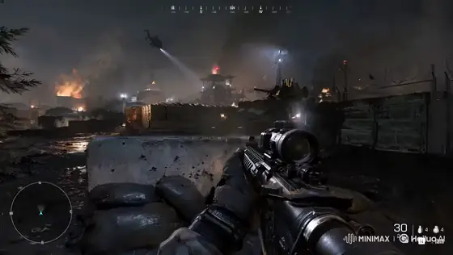
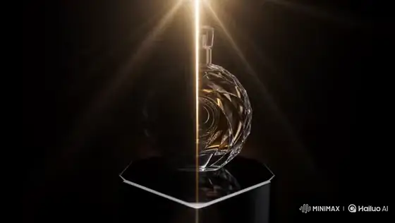
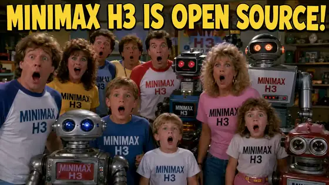
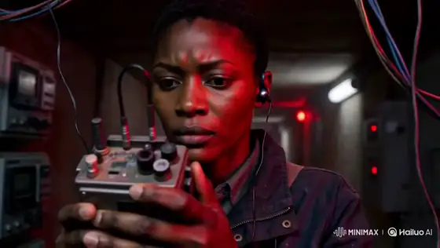
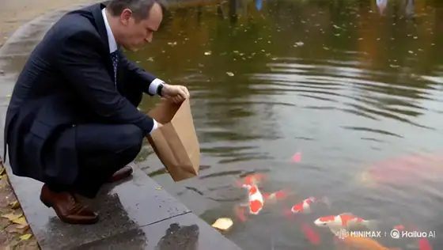

  

# Awesome MiniMax H3 Prompts

Curated MiniMax H3 video prompts with WebM examples and creator attribution,
by [BeatAPI](https://beatapi.io).

**[Browse the live prompt gallery](https://beatapi.io/minimax-h3-prompts)** ·
**[Use MiniMax H3 via API](https://beatapi.io/minimax-h3-api)** ·
**[中文说明](./README.zh-CN.md)** ·
**[Contribute a prompt](https://github.com/BeatAPI/awesome-minimax-h3-prompts/issues/new?template=prompt.yml)**

## Prompt gallery

<!-- GENERATED_VIDEO_GALLERY_START -->

**Browse by use case:** [Stories & Films](./prompts/use-cases/stories-films.md) · [Action & Fantasy](./prompts/use-cases/action-fantasy.md) · [Ads & Products](./prompts/use-cases/ads-products.md) · [Music & Performance](./prompts/use-cases/music-performance.md) · [Vlog & Social](./prompts/use-cases/vlog-social.md)

**[Browse all 506 prompts](./prompts/README.md)**

### 1. Modern warfare FPS gameplay

<strong>Prompt</strong> — Camera: First-person perspective at eye level with authentic handheld player movement, as if recorded directly from a modern AAA military shooter. The player carries a highly...

~~~~text
Camera: First-person perspective at eye level with authentic handheld player movement, as if recorded directly from a modern AAA military shooter. The player carries a highly detailed assault rifle with realistic animations, visible hands, tactical gloves, dynamic reload mechanics, and weapon sway.  **Opening Action:** The video immediately begins with the player already aiming down a roadway inside a modern military base. Multiple enemy soldiers are visible in the distance near sandbags, barricades, and military vehicles. The player carefully tracks one target, making small aim corrections while maintaining ADS (aim down sights). Fire several controlled bursts immediately at the visible enemies, producing realistic muzzle flashes, shell casings ejecting, smoke, recoil, hit reactions, and dust impacts around the targets. Continue firing in multiple short bursts while adjusting aim between enemies, simulating authentic FPS gameplay rather than scripted animation.  **Movement:** After the opening firefight, lower slightly from ADS and begin advancing cautiously along the road beside concrete barriers, Hesco walls, and parked military vehicles. Frequently check left and right corners, briefly stop to reacquire targets, then raise the weapon and fire additional controlled bursts whenever enemies appear ahead. Continue pushing forward with deliberate player-controlled movement, using cover naturally and maintaining believable tactical pacing.  **Environment:** Large modern military base with guard towers, armored vehicles, shipping containers, blast barriers, damaged buildings, smoke plumes, burning debris, scattered shell casings, dust clouds, and atmospheric battlefield haze. Cool natural daylight mixed with smoke and orange firelight creates a cinematic battlefield atmosphere.  **Camera Motion:** Authentic player-controlled movement with subtle head bob, weapon sway, natural mouse-look adjustments, small left-right corrections while aiming, realistic recoil, smooth tracking of moving targets, brief pauses before shooting, and fluid forward progression. Avoid cinematic camera moves—everything should feel like genuine live gameplay captured by a skilled player.  **Visual Quality:** Ultra-photorealistic, AAA game graphics with realistic PBR materials, detailed weapon models, physically accurate lighting, volumetric smoke, dynamic particle effects, crisp textures, realistic bullet impacts, muzzle flash illumination, motion blur only during rapid movement, and high-end military shooter presentation.  **Gameplay UI:** Display a realistic modern FPS HUD inspired by games like PUBG, Battlefield, or Call of Duty (without copying exact copyrighted assets). Include:  * Central dynamic crosshair or reticle * Ammo counter with magazine and reserve ammunition * Fire mode indicator * Compass at the top * Squad/team status panel * Mini-map in the upper corner * Health bar * Tactical equipment icons (grenades, medkit) * Hit markers when bullets connect * Directional damage indicators * Kill notification feed * Objective marker in the distance * Subtle interaction prompts and realistic HUD animations  The HUD should feel polished, modern, and fully integrated into the gameplay, enhancing the illusion of authentic recorded footage from a contemporary military FPS.
~~~~

**Source:** [@Just_sharon7](https://x.com/Just_sharon7/status/2083064417798025721) · 15s · 16:9 · gameplay

---

### 2. Luxury perfume commercial

<strong>Prompt</strong> — Scene 1 (0–3s) – Luxury Reveal A luxury perfume bottle slowly emerges from darkness, standing on a glossy black pedestal. Soft golden light beams gradually reveal the...

~~~~text
Scene 1 (0–3s) – Luxury Reveal
A luxury perfume bottle slowly emerges from darkness, standing on a glossy black pedestal. Soft golden light beams gradually reveal the crystal-clear glass, while subtle volumetric fog creates depth. Extreme macro shot, cinematic lighting, ultra-realistic reflections, premium luxury commercial aesthetic.

Scene 2 (3–6s) – Precision Details
Extreme close-up of the perfume bottle as rich golden fragrance liquid gently swirls inside. The camera performs a smooth cinematic orbit, capturing intricate glass textures, flawless craftsmanship, and sparkling highlights. Ultra-detailed, photorealistic, premium commercial quality.

Scene 3 (6–9s) – AI Transformation
The perfume bottle seamlessly dissolves into glowing golden particles before instantly reforming into a futuristic luxury edition, maintaining perfect proportions and visual consistency. Dynamic orbit camera, seamless transformation, cinematic lighting, premium visual effects.

Scene 4 (9–12s) – Environment Transition
Without a single cut, the background transforms from a luxurious black studio into a futuristic neon metropolis. The perfume bottle remains perfectly consistent while the camera performs a dramatic dolly-in. Hyper-realistic, cinematic, high-end advertising style.

Scene 5 (12–15s) – Hero Finale
Slow-motion hero shot of the luxury perfume bottle elegantly rotating as glowing golden particles float around it. Premium black background, flawless reflections, cinematic logo reveal, luxury commercial ending, 8K photorealistic, blockbuster advertising quality.
~~~~

**Source:** [@CaliraVal](https://x.com/CaliraVal/status/2083059583308751079) · 15s · 16:9 · product commercial

---

### 3. 1980s open-source family comedy

<strong>Prompt</strong> — Use the supplied image as the exact opening frame. Create a hilarious, high-budget 1980s live-action family comedy movie scene, photographed on a real soundstage with practical...

~~~~text
Use the supplied image as the exact opening frame. Create a hilarious, high-budget 1980s live-action family comedy movie scene, photographed on a real soundstage with practical robot costumes, animatronics, handmade props, vintage wardrobe, and authentic 35mm film color.

The entire group suddenly hears something above them. Everyone’s eyes dart upward at the same moment. The men, women, children, and robots dramatically tilt their heads back, point toward the ceiling, and erupt into chaotic celebration. They gasp, scream, laugh, jump, wave their arms, slap each other on the shoulders, and completely lose their minds with exaggerated 1980s comedy reactions. The children bounce excitedly. The adults stumble into one another. The robots flash their eyes, flap their mechanical arms, spin clumsily, and celebrate with funny practical animatronic movements.

One man shouts:

“OPEN SOURCE?!”

The entire crowd answers together:

“MINIMAX H3!”

They cheer wildly as one robot attempts a victory dance, loses its balance, and is caught by the shocked family at the final second.

Fast, energetic comic timing with believable ensemble choreography. Begin with a brief locked group shot, then a subtle handheld push-in as the chaos escalates. Keep every original person, robot, shirt design, and the large headline clearly recognizable. Preserve facial identity, wardrobe, composition, lighting, and 1980s production design.

Authentic optical softness, warm tungsten lighting, rich film grain, slight gate weave, practical effects, natural motion blur, expressive physical acting, polished studio-comedy sound mix, triumphant synthesizer sting, cheering, robot beeps, and comedic percussion.

No CGI, no digital-looking robots, no morphing, no extra people, no duplicated characters, no distorted faces, no rewritten text, no spelling changes, no modern clothing, no style shifts, and do not turn the scene into animation.
~~~~

**Source:** [@BrentLynch](https://x.com/BrentLynch/status/2083020024340693185) · 12s · 16:9 · comedy

---

### 4. Radio operator evacuation bridge

<strong>Prompt</strong> — FORMAT 15 seconds | 16:9 | photoreal live-action war thriller Fictional Sahelian city at blue-hour dawn. Urgent, human, suspenseful, non-graphic. REFERENCE CONTROL Image 1 =...

~~~~text
FORMAT
15 seconds | 16:9 | photoreal live-action war thriller
Fictional Sahelian city at blue-hour dawn.
Urgent, human, suspenseful, non-graphic.

REFERENCE CONTROL
Image 1 = locked AMINA identity and wardrobe.
Preserve face, close-cropped hair, deep-brown skin, navy field jacket, silver earpiece, canvas satchel, analogue radio, boots and determined expression.

Image 2 = locked environment.
Preserve concrete bridge, dry riverbed, dense low-rise city, rooftop antennae, dusty atmosphere, cool-blue shadows and restrained amber dawn.

No real countries, flags, organizations or landmarks.

STORY
Amina is the last radio operator keeping an evacuation bridge open. Communications fail during a distant attack. She must activate the backup relay and transmit clearance before automatic controls close the bridge.

00–02s — CHANNEL OFFLINE
Extreme close-up inside a dark concrete communications room.

Amina grips the analogue radio as red emergency lights pulse. Dust trembles, cables quiver, broken static fills the room.

Automated voice:
“Emergency channel offline.”

She looks up and immediately moves.

02–04s — BRIDGE CLOSING
Wide aerial-oblique rooftop view.

Civilians cross the bridge through windblown dust.

Checkpoint signal flickers green → red as shutdown begins.

A distant shockwave moves through city haze. No visible casualties.

04–06.5s — RUN
Low handheld tracking behind Amina running through a damaged service corridor.

Emergency lights flash, dust falls, cables briefly spark, boots hit wet concrete.

She pushes through a heavy metal door into blowing dust.

06.5–09s — FLASHBACK
Two minutes earlier.

Medium side-profile on rooftop.

Amina sees the unstable bridge signal, manually rotates the antenna and connects her radio to backup power.

Slow camera push. Wind moves her satchel strap as first amber sunlight reaches her jacket.

09–12.5s — TRANSMISSION
Rapid cross-cut montage:

frequency dial locks →
antenna aligns →
bridge cables vibrate →
red signal flashes →
Amina speaks into radio:

“Channel Seven, keep the bridge open.”

Overhead shot: civilians continue crossing.

Sharp hard cuts, brief black frames, natural motion blur.

12.5–15s — SIGNAL RESTORED
Sound suddenly drops.

Amina listens on the rooftop.

Clear radio tone.

Checkpoint signal changes red → steady green.

Evacuation continues.

Amina exhales and watches the bridge as dawn reaches the city.

Slow push toward her face.
Cut to black.

CAMERA
Large-format live-action realism.
Precise nonlinear cross-cutting.
Handheld tracking, aerial-oblique coverage, restrained push-ins and close details.
Natural motion blur, fine film grain, subtle gate weave.
No impossible camera movement.

ENVIRONMENT + PHYSICS
Cool-blue shadows against muted amber sunrise.
Deep blacks, dusty atmosphere, weathered concrete.

Wind realistically affects dust, clothing, cables and antenna equipment.
All movement and interactions remain physically believable.

AUDIO
Stereo radio static, electrical hum, wind, boots, antenna creaks, distant low artillery and helicopter rotors.

Restrained suspenseful sub-bass builds through the montage.

VISUAL
Photoreal cinematic war-thriller footage.
Immense scale contrasted with one determined operator.
Grounded, tense and human.

No subtitles, text, logos, watermarks, political messaging, flags or military insignia.

CONTINUITY
Same Amina identity, wardrobe, radio and satchel throughout.
Same bridge, city, atmosphere and dawn lighting.
Maintain geographic and temporal continuity across all shots.
~~~~

**Source:** [@Diplomeme](https://x.com/Diplomeme/status/2082770042630943156) · 15s · 16:9 · cinematic story

---

### 5. Giant koi park incident

<strong>Prompt</strong> — 15-second, 16:9 vertical, continuous single-take video that looks like authentic smartphone footage accidentally captured by a passerby in a city park. Overcast natural daylight,...

~~~~text
15-second, 16:9 vertical, continuous single-take video that looks like authentic smartphone footage accidentally captured by a passerby in a city park. Overcast natural daylight, subtle handheld shake, limited phone stabilization, occasional autofocus adjustment, and realistic smartphone compression. The absurd event is filmed with a completely serious, unscripted documentary feeling.  0–3s: [Handheld medium shot] A middle-aged man wearing a dark business suit and tie crouches beside the stone edge of a pond. With a completely serious expression, he slowly scatters pieces of bread from a paper bag to several ordinary koi. Small ripples spread across the water as the fish gather in front of him.  3–7s: [Camera instinctively moves closer] An abnormally huge orange-and-white koi suddenly surges out of the murky water, briefly lifting its upper body above the surface and biting down on the entire bread bag in the man’s left hand. He freezes for half a second, then grips the bag with both hands and leans backward. Startled, the person filming steps back. The image briefly loses focus before locking onto the man and the giant fish again.  7–11s: [Close handheld action shot] The giant koi pulls violently toward the deeper part of the pond. The wet paper bag stretches, the man’s arms tense, and his leather shoes slide repeatedly across the wet stone. His knee strikes the edge of the pond. He tries to brace himself with his right foot, but the sole loses traction and his center of gravity moves past the edge. Water, pieces of bread, and fallen leaves scatter from the force as the camera operator hurriedly moves sideways.  11–15s: [Impact and final hold] The paper bag suddenly tears. The man loses all support and pitches forward into the pond, creating one heavy, realistic splash. The camera quickly tilts downward while keeping the center of the pond visible. The man resurfaces with duckweed covering his head and his wet tie stuck across his face. The giant koi calmly swims past him with the remains of the bread bag still in its mouth. The camera holds on the man’s stunned expression while the koi casually swims away beside him.  Keep the man’s face, dark suit, tie, and paper bag visually consistent throughout. The koi must retain the same orange-and-white markings and enormous size. The pulling, sliding, loss of balance, and fall must show believable weight, inertia, traction, and water displacement. Natural park ambience and a realistic splash only. No dialogue, no subtitles, no music. Avoid cuts, character teleportation, changes in the fish’s size, extra limbs, and cartoonish acting.
~~~~

**Source:** [@underwoodxie96](https://x.com/underwoodxie96/status/2082747838782386563) · 15s · 16:9 · viral short

---

### 6. Greenhouse tea isekai anime

<strong>Prompt</strong> — 高品質アニメ映像。...

~~~~text
高品質アニメ映像。

作品トーンと世界観は、透明感のある夏のガラス温室から、紅茶の渦の内側に存在するオリジナルの小さな不思議の国へ連続する、上品で夢幻的な叙情ファンタジー。澄んだ白、水色、琥珀色、淡い金色を主役にし、怖さや混沌ではなく、好奇心、浮遊感、静かな高揚を描く。今回は1枚のソース参照画像image1のみを使用し、image1をキャラクター、衣装、2D手描き画風、配色、現実側のガラス温室背景の唯一の参照として扱う。

【同一人物固定】
image1と完全に同じ一人の少女を全編で維持する。小さく繊細な同じ顔立ち、大きな青緑色の宝石のような瞳、同じ目の形、多層の虹彩と白いキャッチライト、淡い頬、細いまつ毛、真珠のような白銀髪、柔らかな長いウェーブ、編み込みを含むまとめ髪、淡い金色のリボン、青い雫形の髪飾りを固定する。表情変化でも目、眉、まぶた、口、視線の順を守る。白い長袖のハイネックドレス、淡い水色の刺繍と縁取り、淡い金色の腰リボン、華奢で上品な体格、白・水色・淡い金色の人物固有配色を変えない。現実の温室と不思議の国に同時に複数の少女を存在させず、光学トランジションの前後で同じ一人の少女として連続させる。変えてよいのは表情、視線、呼吸、歩行、手の動き、髪と袖とスカート裾の自然な揺れだけ。別人化、顔の平均化、衣装変更、装飾欠落、分身、余分な人物、既存作品を想起させる有名キャラクターを出さない。
【2D hand-drawn／2D手描き画風固定】
image1の細く淡い青灰色と暖灰色の線、透明感のある二層以上の色影、柔らかなグラデーション、白・ミルキーブルー・澄んだ空色・琥珀色・淡い金色の明るい配色を全編で維持する。白銀髪の真珠質ハイライト、瞳の多層反射、肌の淡い発光感、ドレスの皺と刺繍、花、葉、ガラス、白い家具、床タイル、紅茶まで高密度の手描き筆致で描く。布は柔らかく、ガラスは透明で硬質、紅茶は澄んだ琥珀色、異世界の道と建築は半透明の白いガラス質として素材を描き分ける。太い輪郭にしない。簡略TVアニメにしない。平坦な単層セル影にしない。低密度背景にしない。滑らかなCG・3Dにしない。半写実にしない。実写にしない。くすんだ色や画風混合にしない。

【舞台と小物固定】
現実側はimage1と同じ明るいガラス温室。白い窓枠と屋根骨格、青空と白い雲、外の緑と白い花、白い丸テーブル、白い金属椅子、淡い青灰色の床タイルを維持する。開始時はimage1の少女の顔、目、髪、衣装、温室背景、白・水色・淡い金色の配色、明るさ、柔らかなコントラストを維持し、追加される小物はティーポットだけ。小物の所有者はimage1の少女一人だけ。透明なガラスのティーポット一つ、透明なティーカップ一つ、透明なソーサー一つだけを使う。開始状態ではティーカップはソーサー中央に置かれ、底に浅い琥珀色の紅茶が入っている。少女は右手でティーポットの取っ手を持ち、左手はソーサーの横へ軽く添える。ティーポット、カップ、ソーサーを増殖、交換、変形させない。不思議の国ではこれらを人物や巨大な小道具として複製しない。
少女の表情は、目→眉→まぶた→口→視線の順に変化させる。まず左右の目の中にある小さなキャッチライトがわずかに明るくなり、次に眉が少し上がり、その後まぶたが柔らかく開き、口元に小さな驚きと微笑みが生まれ、最後に視線が渦の中心へ下がる。反射線、窓枠、光点を顔中央へ重ねず、顔と両目を常に明瞭に保つ。

最初のカメラ高は白い丸テーブルと同じ低い位置。少女の斜め前から、手前にティーカップとソーサーを大きく、奥に少女の胸上と顔を明瞭に置く。背景消失軸は床タイルと右側の窓枠が温室奥へ斜めに伸びる方向へ揃える。この構図の目的は、少女、ポット先端、カップ中央の着水点を最初の一画で同時に読ませること。
少女が右手首だけをゆっくり傾けると、ティーポットの先端から一筋だけの琥珀色の紅茶がカップ中央へ落ちる。ポット先端、液体の筋、着水点を一画で読み取れるようにし、紅茶はテーブル外へこぼれない。この着水点を変化の起点とする。着水点から一つの時計回りの渦が生まれ、青空の反射と淡い金色の日差しを巻き込みながら、琥珀、青、白の三色の螺旋へ育つ。

カメラはテーブルと同じ低い位置からカップの斜め上へ滑らかに上がり、人物サイズを胸上の中景から背景の顔が読める近景へ保ったまま、紅茶面へ近づく。背景消失軸は温室奥から円形のカップ中央へ収束させる。この移動の目的は、現実の着水点を異世界への案内線へ変えること。

螺旋の半分がまだ琥珀色の紅茶、もう半分が細い光の道になっている形成中の中間状態を短く明瞭に見せる。続いて螺旋が画面全体を満たした瞬間、その同じ回転方向、曲率、色の並びを保ったまま、一本の光の道へ完成する。暗転、瞬間移動、破裂、液体の中を溺れる表現にせず、紅茶面から異世界の俯瞰へ連続する光学的な形状一致として接続する。

変化後の完成状態である不思議の国は、傾いた白いガラスの庭道、空中でゆっくり反転する白い花壇、輪のように連なる温室アーチ、上下が穏やかに入れ替わる空色の庭で構成する。文字盤、数字、看板、動物、人型住民は出さない。

カメラ高は少女の胸より少し低い位置へ移り、同じ少女の斜め前を後退しながら、胸から膝までの中景で追従する。背景消失軸は琥珀と青の光の道が円形アーチの奥へ伸びる方向へ揃える。この移動の目的は、紅茶の渦だった曲線が少女を導く冒険路へ変わったことを読ませること。

少女は光の道に沿って軽やかに三歩進み、第一歩で傾いた庭道へ乗り、第二歩で浮かぶ白い床片を渡り、第三歩で円形のガラスアーチをくぐる。各足裏を順に接地させ、髪、袖、スカート裾は歩みより少し遅れて同じ風向きへ揺れる。滑走、飛行、急回転に見せない。

少女がアーチをくぐると、周囲の白い花が外側から順に淡い水色へ染まり、頭上のガラス骨格がゆっくり四分の一回転して上下の庭をつなぐ。少女自身は直立を保ち、重力方向を急変させない。

カメラは胸より少し低い位置を保って少女の肩越しへ短く回り込み、人物サイズを胸上に寄せる。背景消失軸は前方の光の道が作る一つの円へ収束させる。この移動の目的は、少女の冒険の先に帰還路が生まれることを示すこと。光の道は再び一つの時計回りの螺旋となり、その円周が現実のティーカップの縁と同じ形、大きさ、角度へ整列する。

カメラは螺旋の中心を通り、琥珀色の紅茶面の極近景から現実の温室へ滑らかに引く。カメラ高はテーブルと同じ低い位置へ戻り、人物サイズを奥の胸上へ戻す。背景消失軸は円形のカップ中央から床タイルと窓枠が温室奥へ伸びる開始方向へ戻す。この移動の目的は、異世界の冒険を一杯の紅茶の中へ回収し、少女の感情へ報酬を返すこと。同じ少女が帰還した連続性を保つ。

終端では少女が右手のティーポットを垂直へ戻し、紅茶の筋をきれいに止め、ティーポットを胸より低い高さで保持する。左手はソーサー横に添えたまま。カップ内の最後の渦がゆっくり縮み、中心に青と淡い金の小さな反射一つだけを残して静止する。

カメラはテーブル高さの斜め前で、手前の静かな紅茶面、奥の少女の三分の四顔と穏やかな微笑みを同時に読ませる。紅茶面の反射が完全に止まり、少女の両目、ティーポット、カップ、渦の名残が一画で明瞭になった瞬間に切る。

液体を黒く濁らせない。渦を黒い穴、荒れた水面、別形状の物体へ変えない。顔を歪ませない。手指を増やさない。余分な人物や余分な食器を出さない。ストロボ、激しい明滅、強い水平フレア、白飛びなし。文字、字幕、ロゴ、透かしなし。BGMなし、音楽なし、環境音なし、フォーリーなし、音響生成なし。
~~~~

**Source:** [@haruuraeadss](https://x.com/haruuraeadss/status/2082798959014064531) · 15s · 16:9 · anime

---

### 7. Created using Minimax H3 on

<strong>Prompt</strong> — Use @[char ref] for the potter's identity, face, amber eyes, blue-black hair cut blunt at the jaw with the short copper-bound braid at her right temple, the fine gold kintsugi...

~~~~text
Use @[char ref] for the potter's identity, face, amber eyes, blue-black hair cut blunt at the jaw with the short copper-bound braid at her right temple, the fine gold kintsugi seams on her left cheek and chest, the white porcelain right forearm and hand joined by fine gold lacquer, the long open indigo wrap robe over cream wrapped linen, the wide brown leather belt hung with small steel tools, and her bare feet with grey clay dust dried across the shins. Preserve her proportions. Ignore the sheet's backdrop and repeated views. Invent no accessories; the only objects are the wheel, the clay and the water basin.

Cinematic 2D anime with clean linework, cel shading and painted surfaces. A dim workshop: plank walls, shelves of unfired pots receding into shadow, a water basin on the bench, a cool blue window behind her and one warm lamp hanging low at screen-left. Amber key against blue shadow. Wet clay holds a dull sheen; the porcelain forearm reads matte against skin; the gold seams catch the lamp and flare.

Format: 15 seconds, 9:16 vertical, 3 shots joined by hard cuts, real time, no slow motion, no dialogue.

Geography lock: she sits behind the wheel facing camera, the lamp always at screen-left, the window always behind her, the basin at screen-right on the bench. The camera stays on the near side of the wheel and never crosses behind her. The clay sits at the centre of the wheel head for the whole film.

Mechanics: the wheel turns continuously and never stops. Her skin hand works the outside of the form, the porcelain hand the inside. The clay obeys pressure: it rises where the hands narrow, thins as it climbs, and once the wall is too thin it cannot recover, so it leans and folds rather than springing back. One lump of clay throughout, never replaced.

Camera grammar: one move per shot, coupled to the clay. Push in as the form rises, hold still when she reacts, push again as she restarts. Keep the wheel head and her hands in frame together during work, and keep the whole face in frame during the reaction. Brake briefly on the collapse so it reads.

0-3s, shot 1: Close three-quarter from just above the wheel, looking down across her forearms to the clay. The grey column turns fast between her hands; the wall lifts and narrows as her palms close. Clay slicks the gold seams in the porcelain. The camera pushes in slowly.

3-5.5s: Continue the same shot. The wall climbs taller and thinner, ribbing into fine spiral ridges. A fleck of clay flicks off the rim and crosses the lamp beam. The tools at her belt sway with her breathing.

5.5-8s: Continue. The rim begins to waver, tips off centre, and the wall folds over on itself and settles into a low collapsed spiral. Her hands lift clear and hold above it, fingers open. Cut on the hands stopping.

8-11.5s, shot 2: Hard cut to a locked close-up of her face, lamp hard from the left, window light rimming her jaw. She looks down at the ruin and her jaw sets. The gold seam on her cheek flares in the lamp. Her shoulders drop, breath goes out, and the corner of her mouth lifts into a small closed-lip smile. The copper-bound braid swings once against her neck. Cut on the smile arriving.

11.5-15s, shot 3: Hard cut to a low angle just above the wheel head, her hands entering from above. The porcelain hand presses the collapsed spiral down into a rounded mound and holds it centred while her other hand drives the wheel edge and the wheel accelerates. Her thumb sinks and opens a shallow new bowl, and the clay runs true again. The camera pushes in slowly. End on the clay turning, no held pose, no further cut.

Sound: the wheel's steady electric hum throughout, the low rumble of turning clay, water trickling in the basin, the soft heavy fold of the collapse, one quiet breath out, the creak of the leather belt, and the wheel rising to a faster whir at the end. No music. No subtitles, captions, logos, title cards or overlays.
~~~~

**Source:** [@TheJumbledSoul](https://x.com/TheJumbledSoul/status/2101302250752852344) · 15s · 4:7 · music video

---

### 8. MiniMax H3 on

<strong>Prompt</strong> — 15s | 16:9 | One Continuous Take | Korean Dialogue Only | No BGM/Subtitles Ultra-photorealistic live-action supernatural martial-arts thriller. So-Yeon (same actress throughout):...

~~~~text
15s | 16:9 | One Continuous Take | Korean Dialogue Only | No BGM/Subtitles

Ultra-photorealistic live-action supernatural martial-arts thriller. So-Yeon (same actress throughout): 160cm, messy black hair covering eyes, black hoodie, gray sweatpants, Converse. Real human actors, real locations, practical VFX only.

Location: Rain-soaked Korean alley behind a night market. Food cart, scooters, crates, puddles, shutters, signs, cardboard boxes.

Combat Style: Unarmed only. Sanda + Muay Thai clinch + Silat. Fast, messy, close-quarters fighting. Multiple attackers, realistic collisions, no poses or theatrical choreography.

Fault-Line Physics: Strength remains physical and grounded. Heavy impacts create realistic cracks from exact contact points: impact → vibration → cracks → dust/water movement → debris settling. No glow, energy effects, shockwaves, teleportation, or magic visuals.

0–3s — Blocked Alley

So-Yeon walks carrying a small plastic bag. Seven thugs block the alley. A delivery rider tries to pass. The leader shoves the scooter aside:

"꺼져."

So-Yeon steps forward:

"그 사람 건드리지 마."

The leader grabs her shoulder.

3–7s — First Collision

She counters instantly: wrist control → knee → elbow → throw. He crashes into stacked crates. Her sneaker lands in a puddle; thin cracks spread through the pavement. Everyone freezes.

A thug yells:

"다 같이 가!"

All six rush her.

7–11s — Market Chaos

She ducks a punch that hits a metal shutter, redirects attackers into each other, throws one into a food cart, and sweeps another. The delivery rider pulls the elderly shop owner out of danger. Brief 0.2s micro slow-motion on a heavy impact as cracks spread through wet pavement before returning to real time.

11–15s — Human Moment

The last two attackers collide into a concrete wall, creating a deep crack. Silence.

The rider asks:

"누나... 괜찮아요?"

So-Yeon looks at her trembling hands. The elderly shop owner returns her dropped plastic bag:

"이거."

She accepts it with a small embarrassed bow. The damaged cart slowly rolls in the background.

CUT TO BLACK.

Camera: Reactive handheld documentary style, tight dialogue close-ups, sudden reframing during action, natural autofocus hunting, realistic motion blur, impact shake, authentic human reactions. No superhero poses, no exaggerated expressions, no CGI doubles. Focus equally on civilians, environment, and grounded physical combat.
~~~~

**Source:** [@itxabdullaa](https://x.com/itxabdullaa/status/2101269716568564094) · 15s · 16:9 · music video

---

### 9. This time: BLADE.

<strong>Prompt</strong> — Hyper-kinetic action-film title sequence opening on a mirror-polished titanium wall in complete darkness. A razor-thin energy cut suddenly slices through the surface, spraying...

~~~~text
Hyper-kinetic action-film title sequence opening on a mirror-polished titanium wall in complete darkness. A razor-thin energy cut suddenly slices through the surface, spraying white-hot sparks and molten droplets across the frame. A second cut appears from another angle, then dozens strike in rapid succession, carving deep geometric paths through the metal. The camera aggressively follows each slash as huge titanium sections separate and spin through the air. A powerful magnetic field violently pulls the fragments toward the center, where sharpened metal plates slide, rotate and lock together to construct "BLADE" with surgical precision. The completed title is thin, lethal and forged from scratched black steel, every edge glowing red-hot from friction. The camera sweeps inches above the letters before one final invisible slash cuts through the entire word and triggers a spectacular explosion of metal splinters and sparks. Aggressive, precise, dark, premium Hollywood action typography.
~~~~

**Source:** [@CharaspowerAI](https://x.com/CharaspowerAI/status/2101265127584469270) · 15s · 16:9 · music video

---

### 10. She found a cell phone that had been secretly filming her, and the camera was right behind her.

<strong>Prompt</strong> — For the target video, at 0.00 seconds into the target video, &lt;Picture 1&gt; (from [Shot 1]) is fully referenced. integrated_multimodal_description: [Shot 1] A 15-second, 16:9...

~~~~text
For the target video, at 0.00 seconds into the target video, <Picture 1> (from [Shot 1]) is fully referenced.

integrated_multimodal_description: [Shot 1] A 15-second, 16:9 cinematic realistic suspense short set entirely inside the same rainy neon stair alley from <Picture 1>. Preserve the exact same female lead throughout: same face, hairstyle, soaked wardrobe, body proportions, skin texture, and the same staircase geography with wet steps, narrow alley, railings, humid air, and neon mood. No scene change, no extra people, no black ending. The story is: a drenched woman slowly walks down the stairs, notices an iPhone still recording on one step, bends to pick it up, realizes the screen shows her own back filmed from behind, instinctively steps back half a step into the railing and whips her shoulder and head around, but the real staircase is empty. End on the suspended moment where she is half-turned, half-looking down, with the screen still lit. She stays in motion throughout: descending, stopping, noticing the phone, bending to pick it up, standing with the screen, stepping back, leaning to the railing, turning shoulder and head, then looking back to the phone. The phone must stay physically consistent in size and readability. [Shot 2] At 00:00-00:02.8, a low dynamic near shot hugs her legs, waist, and the wet railing as the camera slowly pushes in and follows her down about one and a half steps. The emphasis is on lower-body weight transfer, wet skin reflections, and action-based sensual tension. Her right hand keeps a subtle stabilizing relationship with the railing. She is soaked, moving carefully but not weakly. Her first emotional phase is calm, restrained, and oppressive self-protection: eyelids half-lowered, gaze angled beyond camera toward the lower stairs, brows held flat with only the outer ends slightly lowered, lips naturally parted, breath low and steady, nostrils moving lightly, no smile. Pink-violet neon washes the front-upper planes of the chest, collarbone, abdomen, and front thighs, while cyan-blue edge light wraps the waistline, outer arms, and leg contour. This is the first sensual close-up: legs, waist, wet skin, deep wet fabric contours, and real descending balance. [Shot 3] At 00:02.8-00:05.0, cut to a medium-close slightly high angle that lands on the step at her feet while keeping one stopped boot and the railing in the foreground. A lit iPhone lies near the edge of shallow step-water. The red recording dot must be immediately readable. She stops on the stair, not frozen but caught mid-motion. Her gaze narrows sharply toward the phone, pupils snap into focus, the brow center contracts into only the thinnest line, she takes one short nasal breath, her lips close lightly from their previously open state, and the jaw gathers in. This is the first layer of wrongness, not yet fear. She murmurs quietly, <d>[English] Whose phone is this...?</d> The line is tentative and low, with the ending gently falling away. Phone screen light adds a third small light source, lifting the forehead edge, nose bridge, lash line, and cupid’s bow with cool white. [Shot 4] At 00:05.0-00:07.8, a tight near shot from her right-front follows her bend as she picks up the phone. Stay close to the hand, collarbone, side waist, wet hair falling forward, and the exact moment the device leaves the stair. She remains connected to the railing with the right side of her body and hand relationship, even while reaching. Her eyes stay locked on the phone the whole time. Lashes cast a slight shadow downward. The lips tighten more, the throat moves with one very small swallow, breathing becomes noticeably shallower, and the face shifts into focused verification rather than panic. This is the second sensual close-up: hand, collarbone, side waist, wet hair, and the phone entering the center of the narrative. Rain hits the glass and forms tiny round splashes and sliding beads. When she pinches the phone edge and lifts it, droplets drag aside and one or two thin water threads stretch briefly and break. [Shot 5] At 00:07.8-00:10.5, a near shot layers the phone screen and half her face. First make the screen content legible, then carry focus into her face without losing the screen read. The phone display shows only one clear thing: her own back descending the staircase, filmed from a steady hidden angle one step higher behind her. No second face, no ghost, no supernatural clutter. She sees it and recognizes herself. Her fourth emotional phase is clear alert recognition: her eyes flick once across the screen and then hold, the lower lids lift slightly, the pupils widen just a little, the brow center tightens more clearly while still restrained, nostrils open and settle, any remaining softness in the mouth disappears, and the lower lip stalls for a beat as if a sentence is trapped in the throat. She whispers, <d>[English] Wait... that’s me.</d> The first half carries a tiny delay as recognition catches in her breath. The phone’s cold light now fills the lower half of her face and under-eye area, making the micro-expression readable without overpowering the neon mood. [Shot 6] At 00:10.5-00:12.8, an extreme close-up pushes from shoulder-neck, side face, lashes, and lip line into the eye. This is the third sensual close-up, centered on the dangerous moment before she turns. She keeps the phone close to her chest line, glances once more at the screen, and then prepares to look back. Her fifth emotional phase is being pressed by the implication that the filming angle was behind her: lashes tremble once, breathing tightens, the lip line draws in, cheek muscles firm slightly, and she says in a lower, faster, more pressured whisper, <d>[English] Who the hell is filming me?</d> It is not shouted, but forced low confirmation. One side of her face drops deeper into shadow while the other is caught by soft pink-violet neon on lashes, nose tip, lip peak, and jaw edge. [Shot 7] At 00:12.8-00:15.0, a medium-close shot with a slight retreat. Let the turning motion carry the cut. She shifts back by half a step, the wet sole dragging a very small water trace, shoulder and collarbone leading the head turn rather than the head teleporting first. Her back and right side find the railing. She turns sharply toward the upper stairs, but the real staircase is empty. She then drops her gaze back to the still-lit phone at chest level. Her final emotional phase is cold controlled aftershock: the eyes cut first upward, then back down, the forehead tightens lightly, the jaw stays tight, the mouth opens by half a breath and then slowly closes again, fear controlled but not gone. The screen remains lit and still recording. The staircase behind her stays empty, wet, neon-lit, and physically real. End with her half-turned, half-looking down at the glowing iPhone, rain still falling, neon still flickering, and suspense held inside the frame, without cutting to black.

overall_soundscape: Maintain a continuous rainy neon stairwell ambience: mid-strength rain, water ticking on railing and steps, shallow drainage flow, distant electric hum, soft neon buzz, and humid night reverb. Emphasize wet footfalls on the stairs, the subtle grip and slide of her hand on the railing, clothing friction, low controlled breath, and fine splashes from shallow step-water. Then bring forward rain striking the phone glass, tiny circular water impacts, the slight stop in her step, her low tentative line <d>[English] Whose phone is this...?</d>, fingers contacting the wet phone, water dragging across the screen, a faint lift-off suction from the wet stair, her shallow breath, fabric tension as she bends, one small swallow, and the surrounding rain and neon hum dimming slightly as she reads the screen. Finish with the tightening breath before the turn, the low pressured line <d>[English] Who the hell is filming me?</d>, one light metallic touch from the railing, the small backward step drag on wet stair, empty stair ambience, continuing rain, neon buzz, and the phone still recording in her hand. No scream, no extra voices, no subtitles.

non_diegetic_music: Keep score absent or nearly absent. If any non-diegetic layer is used, make it only a very thin low suspense drone under the rain and neon hum, rising slightly after she sees the screen and never overpowering the physical environment or dialogue.
~~~~

**Source:** [@ou_zhen599](https://x.com/ou_zhen599/status/2101258477813584121) · 15s · 16:9 · music video

---

### 11. 📷“Wake Up, Neon”

<strong>Prompt</strong> — For the target video, at 0.00 seconds into the target video, &lt;Picture 1&gt; (from [Shot 1]) is fully referenced. integrated_multimodal_description: [Shot 1] A 15-second, 16:9...

~~~~text
For the target video, at 0.00 seconds into the target video, <Picture 1> (from [Shot 1]) is fully referenced.

integrated_multimodal_description: [Shot 1] A 15-second, 16:9 cinematic cyber-thriller image-to-video sequence set entirely inside the same wet neon back alley from <Picture 1>: the left-front railing zone where A begins, the street centerline, the puddle reflection layer, and the opposite fog-filled exit in the background. Do not add extra people, do not place both women on the same staircase segment, and do not leave this alley. Subject A is the blue-haired woman from <Picture 1>, with the same face, body, black deep-V leather bodysuit, fishnets, over-knee boots, metallic choker, glowing beverage can, goggles, and jacket ring-light. Subject B must be the exact same face, hairstyle, body, and clothing silhouette as A, but with a refined dangerous harlequin-style makeup variation, not a different woman. The story is: A rules her own staircase entrance like a queen, fog grows at the opposite exit, a Queen of Hearts card flies out, A catches it one-handed and recognizes it as a provocation, then rises and looks up to see her identical mirror-woman emerging from the fog and forcing her to leave her throne. Lighting comes only from practical neon, staircase reflections, the fog backlight, and distant storefront light. Rain, wet hair, cloth folds, skin reflections, boot splashes, condensation droplets, and natural body inertia remain physically real. [Shot 2] At 00:00-00:03.5, begin with an extremely low ground-level push from puddles, discarded paper, and lane markings into A’s boots, fishnets, thighs, leather chest, and jaw, ending in a near frame from chest to lips. A sits on the center of the third step from the bottom of the staircase, leaning slightly forward as if guarding the entrance to her territory. This is the first sensual close-up, built from collarbone, throat line, deep-V leather highlights, and the nearly invisible rise and fall of her breathing. Her first emotional state is cool sovereign control: brows relaxed but not soft, eyelids half-lowered, gaze not fully locked on the distance yet, lips lightly closed, breathing almost silent, throat moving once faintly. The puddles reflect blue and magenta neon steadily, and the opposite street exit holds only a thin fog presence. [Shot 3] At 00:03.5-00:07.0, the camera eases slightly backward and rises just enough to include both the staircase foreground and the opposite exit. The fog there becomes denser, first rolling close to the ground and then pressing outward slowly, with neon cutting bright lines along its edges. A is still seated, but the second emotional stage begins. She does not widen her eyes dramatically. Instead her breathing stops for half a beat first, her lips loosen by a fraction, the lower lids lift slightly, and her gaze truly focuses toward the opposite exit for the first time. Her head tips subtly toward the source of the sound and fog. Then a Queen of Hearts card is carried out of the fog by damp wind, turning half a rotation and gliding naturally through the mid-ground mist toward A. Do not chase the card wildly. A’s right hand rises fast and clean and catches it one-handed at chest height slightly to her right, with real deceleration in the wrist and fingers. Her third emotional stage is confirmation of provocation: before the catch, her eyes narrow sharply and the brow center hardens slightly; after the catch, she drops her gaze to the card, the throat moves once, the jawline begins to tighten, and the original calm disappears. This is the second sensual close-up, built from the catching wrist, collarbone, leather highlights across the chest, eyelash shadows, and the lip line and jaw while glancing down at the card. The Queen of Hearts face must be clearly readable; the paper is damp-soft with slightly curled edges and realistic motion. [Shot 4] At 00:07.0-00:10.2, from A’s left-front, the camera makes a slight lateral push and subtle rise, keeping the staircase, street, and opposite exit on one axis. A places her left hand on the railing and rises slowly. Her right foot steps down first, then the left follows into a high-low standing stance. She never leaves the immediate front zone of her staircase. The card remains in her right hand. Her fourth emotional stage is calm transition into combat readiness: eyes narrower and more concentrated, nostrils opening slightly with breath, lips tightening, jaw sharpening, and her gaze lifting off the card and back to the opposite exit as if thinking, “You really dared to do this.” During the rise, the leather outfit stretches and rebounds naturally, hair shifts back and settles, and her chest shows only a very slight real inertia response. This is the third sensual close-up, built from waist and hip effort, fishnet leg tension, neck and jaw line, and the chest moving with controlled breath. [Shot 5] At 00:10.2-00:12.7, hold a longer relation shot. A stays on the left side or left-lower edge of the foreground while the opposite exit sits centered in the back. Focus transfers gradually from A to B. B walks out of the fog by two small steps and stops at the edge of the backlit mist. She is the same face, same hairstyle, same body, same clothing outline as A, but with refined dangerous harlequin-style makeup: darker eye area, sharper mouth corners, and a more poisonous finish. A’s fifth emotional stage is recognition freeze. She locks for one beat: pupils contract quickly, the lip line releases for half a second, the throat catches on one breath, and for the first time her breathing goes off rhythm. Then she does not retreat; she becomes more focused. B’s emotional state is intimate contempt: stable eyes, one mouth corner rising very slowly, as if appreciating that A has finally understood. The fog keeps rolling behind B but never hides her face, and her body parts it with real wraparound flow. [Shot 6] At 00:12.7-00:15.0, use one restrained reverse shot to B in a medium close frame, pushing in extremely slowly. B stands at the street-exit edge, chin lifted slightly, one-sided smile in place, gaze locked on A at a distance. Before the line, give one tiny false-soft look; on the key words, the gaze turns straighter and the mouth shape grows more precise and cutting. The only spoken line is <d>[English] You dropped your crown.</d> It must be low, intimate, cold, and humiliating rather than loud. “You” is pressed low, “dropped” carries a little more weight, and “your crown” falls away like a verdict. After the line, A in the far frame or foreground edge takes one more step down, committing to leave her throne and meet the challenge. Her final emotional state shifts from frozen recognition into hard resolve: eyes harden again, lips tighten again, jaw stabilizes, shoulders do not collapse. When the line lands, a nearby neon briefly flickers once, and both the fog edge behind B and the puddle reflections brighten for an instant. End on the moment just before A moves toward the opposite side. Do not cut to black.

overall_soundscape: Maintain a wet cyber alley ambience throughout: neon electrical hum, distant ventilation fans, moist air resonance, occasional water drips, and low street reverb. Emphasize puddle surface noise, faint leather movement, cloth friction, the subtle sound of A shifting on the step, and her almost inaudible breath. Then bring forward the slow spill of fog, the slight change in airflow at the opposite exit, the card fluttering and rotating, the light slap of paper into A’s fingers, a fine metallic tick from the railing, leather stretch and settle as she rises, fog movement as B parts it, soft heel contacts from B’s two steps, and B’s close cold line <d>[English] You dropped your crown.</d> Afterward restore the alley ambience with neon hiss, damp air, tiny puddle ripples, and fog drift. No extra voices, no subtitle cues, no music-video stingers.

non_diegetic_music: Keep score minimal or absent. If any non-diegetic layer is used, make it a very thin low-frequency suspense bed beneath the alley ambience, rising only slightly once B is revealed and never overpowering the voice, neon, or the physical space.
~~~~

**Source:** [@ou_zhen599](https://x.com/ou_zhen599/status/2101254179067236692) · 16s · 16:9 · music video

---

### 12. Created with MiniMax H3 on

<strong>Prompt</strong> — 15s | 16:9 | 4K HDR | 24fps | Photorealistic Fashion Film Use the uploaded girl as the exact character throughout. Maintain identical face, skin tone, hair, body proportions, and...

~~~~text
15s | 16:9 | 4K HDR | 24fps | Photorealistic Fashion Film

Use the uploaded girl as the exact character throughout. Maintain identical face, skin tone, hair, body proportions, and identity in every shot.

0–3s: Luxury apartment overlooking a glowing city skyline. She opens a vintage suitcase, looks at camera and says: "Three outfits… and absolutely no time to decide!"

3–6s: She places sunglasses over the lens. Seamless transition to Look 1: emerald satin blouse, cream trousers, heels. By the window. "Okay… this one means business."

6–9s: Finger snap transition to a rooftop party. Look 2: metallic mini dress, ankle boots, statement earrings. Wind in hair. "Now THIS is a little dangerous."

9–12s: She walks past the lens, creating a body-wipe transition to Look 3: midnight-blue evening gown, elegant rooftop dinner setting. "Or should I go full glam?"

12–15s: Wide rooftop shot. Holding sunglasses, shoulder bag, and clutch. Smiles and points at camera: "You decide. One, two, or three?"

Style: Ultra-realistic luxury fashion commercial, cinematic lighting, realistic fabrics, natural expressions, shallow depth of field, smooth camera movement, premium editorial quality.

Negative: No face changes, identity drift, duplicate character, extra people, distorted hands, bad anatomy, flicker, jump cuts, subtitles, logos, watermarks, or text overlays.
~~~~

**Source:** [@itxsarmadd](https://x.com/itxsarmadd/status/2101244508767666438) · 15s · 16:9 · product commercial

---

### 13. 📷“The Fallen Crown”

<strong>Prompt</strong> — For the target video, at 0.00 seconds into the target video, &lt;Picture 1&gt; (from [Shot 1]) is fully referenced. integrated_multimodal_description: [Shot 1] A 15-second, 16:9...

~~~~text
For the target video, at 0.00 seconds into the target video, <Picture 1> (from [Shot 1]) is fully referenced.

integrated_multimodal_description: [Shot 1] A 15-second, 16:9 cinematic realistic image-to-video sequence set entirely inside the same ancient temple porch and stone-column corridor shown in <Picture 1>. Preserve the exact same adult woman throughout: same face, hairstyle, makeup, garment cut, leather texture, body ratio, gait, and presence. The whole sequence stays in one continuous space only: the porch threshold, the narrow corridor between the right-side pillar and wall, and the same right-side wall mural zone. No exterior, no new hall, no extra people, no extra props, no subtitles, no watermark, and no black ending. The core story is that she is not entering the temple as a new visitor, but behaving like a brief awakened action-memory belonging to the wall mural itself. She is always moving or has just finished moving, never posing. [Shot 2] At 00:00-00:02.2, a low-angle near shot begins at boot heel, forward-driving legs, and knee line, then tilts up to collarbone, jaw, and part of the face. The camera stays close to the floor and glides backward as she crosses the threshold. When the right foot lands, thin floor dust is pressed outward by the boot sole and curls softly around the edge. Her gaze stays beyond the camera rather than into it, eyelids slightly lowered, pupils steady, lips naturally closed, and collarbone and upper chest rise and fall with restrained real breathing. Warm air from above and behind lifts the long hair gently, with slight delayed motion in the strands. Clothing follows the body line and rebounds subtly. This first sensual close-up is built entirely from gait, center-of-gravity transfer, collarbone breathing, jawline, and hair edge-light. [Shot 3] At 00:02.2-00:05.0, cut to a frontal medium close retreating shot, framing from chest to knee while she continues advancing on the central axis. During the advance she drifts half a step toward frame right and her left hand naturally grazes the relief carving on the right-side pillar without stopping to search. As her fingertips move across the stone, a small amount of fine stone powder slides down. One extremely thin, brittle ancient gold-leaf fragment peels away from the carving and sticks lightly between her index and middle fingers. Her eyes do not make a large turn at once. First she checks it with peripheral vision, the brow peak lifts by an almost invisible degree, the lip line softens slightly, and the breath becomes shallower. Lighting remains warm side-back gold on her edges and cool shadow on the pillar, with soft highlights on the leather surfaces. [Shot 4] At 00:05.0-00:07.4, cut to a near close-up from side waist to hand, the camera slightly low and behind her right side, following in a very small arc. She does not stop walking; instead the torso rotates subtly within the stride, hips and waist connected, as she lifts her left hand to inspect the gold leaf. Emphasize the side waist line, the slight pull and rebound of fabric caused by movement, and the tactile precision of her fingers rolling the fragment. Her gaze gathers inward from distance to fingertips, lashes pressing down, breath becoming very shallow at the nose tip, lips slightly parted without sound, and jawline gently tightening. Hair swings at the shoulder with small inertial delay. The gold leaf trembles in the edge light with weak realistic reflection rather than glitter. This is the second sensual close-up, built from waist, hand, cloth tension, breath, touch, and latent danger. [Shot 5] At 00:07.4-00:10.5, cut to a three-quarter side-front medium close shot. The camera moves in a tiny arc to her left-front and then stabilizes, keeping both her and the right-side wall relationship clear. She completes the last half step, moves close to the right wall, and presses the ultra-thin gold leaf into a nearly invisible crack in the wall. After pressing it in, she does not withdraw the hand immediately; the fingertips stay there for half a second. The crack begins to spread slowly along the buried line of the ancient wall image. Only a few tiny stone grains fall, and dust hangs briefly before settling. Her eyeballs hold, then perform one short refocus. Her brow center does not knot dramatically; both brow peaks draw slightly inward. The middle of the upper lip lifts faintly, the mouth opens by a low degree, and the breath catches once in the throat. She whispers, almost as breath itself, <d>[English] I never left.</d> The line should feel like recognition rather than exposition. Inside the crack there is only a weak gold dust-glow and subtle misalignment in the wall pattern, like memory inside stone being disturbed. No explosion, no beam, no collapse. [Shot 6] At 00:10.5-00:12.8, cut to a face close-up and push in slightly, focusing on the eyes, lips, cheekbone edge-light, and the small muscular changes around the mid-face. Her left hand remains on the wall. She does not retreat. Her eyes stay forward first, then flick for a fraction toward the interior of the wall as if hearing a response within it. The lips remain slightly parted, breath briefly suspended, lower lids slightly tight, and warm gold edge light catches the fine hair along the face. The emotion is a single struck instant of surprise held under extreme control, never a scream, never a wide-open panic. This is the third sensual close-up, centered on parted lips, paused gaze, hair rim light, and high-control micro-expression. [Shot 7] At 00:12.8-00:15.0, maintain the same axis and slowly withdraw from face close-up to medium and then medium-wide without rising, without changing angle, and without entering any new space. As the camera withdraws, it becomes gradually clear that her standing pose, raised arm angle, and head orientation precisely match the pose of an ancient painted goddess on the right wall. The mural does not suddenly appear; instead the old pigment layers, cracks, dust traces, and surviving outline in the wall are gradually revealed as something that was always there and is only now being seen. She does not perform an exaggerated reaction. She simply keeps one unfinished breath in the body. In the final beat, the painted goddess’s eyeball shifts by the smallest possible degree, the gold dust slowly settles back to the floor, and the sequence ends in an elegant uncanny suspended state without cutting to black.

overall_soundscape: Maintain a hollow ancient stone ambience throughout, with low temple air, soft boot pressure on dusted floor, faint grains sliding, fingertips rubbing stone, tiny wall-friction sounds, and restrained breathing. Emphasize boot contact, dust pushed outward by the step, hair moving in warm airflow, fingertip contact with the pillar carving, a fine trickle of stone powder, the fragile peel of the gold leaf, fabric pull-and-release at the waist and torso, the dry whisper of fingers rolling the thin gold leaf, the soft press of gold leaf into the crack, a delicate stone-grain release, faint wall-friction spread as the crack extends, dust pausing in the air, and her near-whispered line <d>[English] I never left.</d> Reduce the space further near the end to breath, tiny skin and cloth movement, microscopic wall resonance, settling dust grains, and the near-inaudible response of the mural’s living eye.

non_diegetic_music: Use little to no score. If any non-diegetic layer is present, keep it to an extremely thin low sustained tonal bed, almost imperceptible, supporting the suspended ancient-memory feeling without turning the sequence into overt fantasy or horror.
~~~~

**Source:** [@ou_zhen599](https://x.com/ou_zhen599/status/2101243238334205994) · 14s · 16:9 · horror

---

### 14. Made with MiniMax H3

<strong>Prompt</strong> — Photorealistic cinematic aerial video of a modern glass skyscraper assembling itself on a city construction site. Subject: a rectangular glass office tower growing from an empty...

~~~~text
Photorealistic cinematic aerial video of a modern glass skyscraper assembling itself on a city construction site.

Subject: a rectangular glass office tower growing from an empty lot, surrounded by three yellow tower cranes. Cyan holographic construction overlays with grid lines, vertical pillars, and orbiting energy rings.

Environment: dense low-rise East Asian city block with tiled roofs, green rooftops, trees lining the streets, buses and cars on the roads, taller buildings and a sports field in the distance.

Style: ultra-realistic aerial photography, golden-hour to sunset color grade, sharp glass reflections, warm interior lights versus cool cyan holograms.

Camera: one continuous high-angle drone shot. Starts looking down on the lot, then slowly pulls back and lifts as the building grows, ending on a hero three-quarter view of the completed tower against the sunset.

Lighting: late afternoon sun at the start; sky shifts to orange, coral, and pink clouds; finished tower glows with warm yellow office lights.

[0s] Empty rectangular construction pit in the city. Three yellow cranes stand around the site. A faint cyan holographic floor grid appears on the dirt.

[2s] Glowing cyan pillars rise from the grid and lock into a structural skeleton. Cranes stay in place.

[4s] Concrete core and first floor slabs materialize. Cyan rings begin orbiting the structure. Camera starts a slow pull-back and rise.

[7s] Mid-rise floors stack rapidly. Dark glass curtain walls wrap the lower levels. Interior lights start coming on. Sky turns warmer.

[10s] Tower is now a tall glass skyscraper. Cranes lift the last rooftop mechanical sections into place. Cyan hologram fades. Sunset sky is intense orange-pink.

[13s] Construction complete. Clean modern tower with lit interiors, one remaining crane at the base. Hold the final cinematic aerial frame.

Audio: distant city traffic, compressed construction rumble early, then a low cinematic swell as the building finishes. No dialogue. No on-screen text. No watermark.

Avoid: cuts, shaky camera, cartoon look, people close-up, logos, extra towers appearing out of nowhere, watermark, subtitles, UI overlay.

#FlovaAI #CPP
~~~~

**Source:** [@Zyrellix](https://x.com/Zyrellix/status/2101221316229558505) · 15s · 4:7 · music video

---

### 15. Minimax H3, open weights, generated locally. One lamp, one flower, rain on the glass.

<strong>Prompt</strong> — &quot;the petals open one ring at a time from the outside in&quot; Duration: 15s. Camera: locked, pot height. Rendered locally in ComfyUI, then Topaz to 4K. &quot;No other plant moves&quot; is the...

~~~~text
"the petals open one ring at a time from the outside in"

Duration: 15s. Camera: locked, pot height. Rendered locally in ComfyUI, then Topaz to 4K.

"No other plant moves" is the sentence that kept the greenhouse asleep. One thing opening is a story. Everything opening is a screensaver.
~~~~

**Source:** [@GlennHasABeard](https://x.com/GlennHasABeard/status/2101008623555997920) · 15s · 9:5 · cinematic story

---

### 16. 📷“A Cigarette Hanging from Her Lips”

<strong>Prompt</strong> — For the target video, at 0.00 seconds into the target video, &lt;Picture 1&gt; (from [Shot 1]) is fully referenced. integrated_multimodal_description: [Shot 1] A 15-second, 16:9...

~~~~text
For the target video, at 0.00 seconds into the target video, <Picture 1> (from [Shot 1]) is fully referenced.

integrated_multimodal_description: [Shot 1] A 15-second, 16:9 cinematic realistic image-to-video short set entirely inside the same ruined high-rise balcony window space from <Picture 1>. Preserve the exact same woman throughout: same face, short blonde hair, white cropped tank, light underwear, damp tired skin, old balcony railing, table, candle area, and defocused city night outside. No scene change, no extra people, no new major props, and no black ending. She stays in one small space only and never becomes a static pose. She is always moving gently through one emotional chain: leaning at the railing and smoking, leaving the railing, drifting two small steps, pausing at the table and old wall, tapping ash, turning back, walking slowly toward the window again, then stopping in side profile to take a deep drag and exhale. The emotional arc is lazy, tired, melancholic, and controlled, carried by small actions and breath. Lighting stays physically motivated: a cold white fluorescent tube from above-right as key, a candle at table height as low warm fill, and the distant city night outside as soft bokeh only. Smoke, ember, candle flame, stray hair, cloth folds, abdomen and rib breathing, and the chest’s slight natural inertia remain realistic and gravity-bound. [Shot 2] At 00:00-00:03, a medium close shot with a slow lateral glide from the left interior side. She leans lightly with the left hip against the railing, right hand holding the cigarette to her lips, taking a slow drag. Her posture is slightly crooked and loose, not posed. Her gaze passes through the out-of-focus city lights but does not settle on anything. The brow center gathers only slightly, upper lids sit low, lips are naturally parted around the cigarette, and the mouth corners stay almost level with the faintest downward fatigue. She says quietly, <d>[English] Long night.</d> in a low tired voice. The ember brightens briefly on the inhale, and the first white smoke stream rises along her face. Cold overhead light cuts clean damp highlights across shoulder, neck, collarbone, and upper chest. This is the first sensual close-up, built from collarbone, throat line, chest-edge breathing, damp skin sheen, and the soft crooked posture. [Shot 3] At 00:03-00:06, the camera lightly follows as she leaves the railing, framing from chest to half-body. She removes the cigarette from her lips, exhales a shorter stream of white smoke, and drifts lazily two steps along the window edge toward the right. The steps are light and aimless. Her left fingertips drag lazily along the window frame or old wall. In the first half-second after exhaling, the mouth corners drop briefly and recover; her gaze comes back from the distance for a moment and then slides away again; the jaw gathers softly. During the walk, the chest and ribcage take one deeper but still restrained breath. The ends of her short hair and small face-framing strands quiver faintly from light airflow and movement. The smoke leaves as a narrow band and then slowly loosens outward. Her second emotional stage appears here: the first tiny leak in the mask. [Shot 4] At 00:06-00:09, a local near close-up from a slightly lower angle, locked on her hand, abdomen, rib side, hip, and the table edge. She stops near the table and old wall, looks down at the cigarette now burning shorter, slowly rolls it once between her fingers, and taps ash gently into the ashtray. The other hand touches the table edge as if borrowing a little support. For the first time her gaze truly settles on her own hand. The lower lids tighten slightly, the lip line narrows from soft to thinner, and the throat makes one small swallowing motion. Breathing in the abdomen and ribs becomes more visible. The tank fabric across the chest shifts in small fold changes, and the chest shows only the slightest natural inertia between the walk and stop. The ash falls as fine dry particles. The candle flame flicks once under the air she has brought with her, and the warm light brushes the back of the hand and lower abdomen. This is the third emotional phase: pressing the feeling back into the body. [Shot 5] At 00:09-00:12, a medium close shot with a light return-follow as she turns back toward the window. She slowly drags herself away from the table again, as if only continuing to survive the time rather than deciding anything. The cigarette rises toward her lips but pauses just before them. Her shoulders sink more than before, her eyes begin to lose focus, not as emptiness but as someone too tired to keep pretending. One corner of the mouth almost tries to form a tiny self-mocking smile and fails, leaving only exhaustion. Her steps are slower, the center of gravity lower and more diffuse, as if the whole body is gently settling downward. This is the fourth emotional phase: the strength to keep the mask up is running out. [Shot 6] At 00:12-00:15, a side-face close shot with an extremely slow push in, no lateral move. She stops half a step from the window, looks outward in profile, takes a deep drag, holds it for half a beat, and exhales for a long time. Her eyes stay fixed far away, no longer avoiding and no longer asking for an answer. As she exhales, the mouth corner drops by just a little; she does not cry and does not collapse, she simply accepts the feeling. The chest and collarbone settle downward slowly, and the breath finally releases completely. White smoke leaves her lips in a steady stream, dense at first, then thinning; it travels outward toward the window, then is caught by the edge airflow and slowly curls upward. Part of it catches the cold key light and becomes a semi-transparent layered volume. The camera ends on her side face, the long exhale, the jawline, and the blurred city night beyond. This is the fifth emotional phase: helplessness landing softly and staying there. Do not cut to black.

overall_soundscape: Keep the environment intimate and minimal: distant city hum through the open window, faint old-building air tone, soft room resonance, and the tiny instability of the fluorescent light. Emphasize the small inhale through the cigarette, ember brightening, her low line <d>[English] Long night.</d>, the first smoke stream, light cloth movement as she leans on the railing, the shorter exhale, soft foot movement on the floor, fingertips brushing frame or wall, one deeper breath through ribs and chest, the faint tremble of short hair under air movement, paper-and-ash texture of the cigarette, ash tapping into the tray, one slight hand contact on the table edge, the candle flame’s brief response, and the long final exhale. No dramatic music, no extra props, no extra voices.

non_diegetic_music: Use no score or only an almost inaudible low ambient tonal bed, barely present beneath the room tone and distant city sound. It should not feel sentimental or manipulative. The emotional weight should come from breathing, cigarette, smoke, fluorescent hum, candle flicker, and her small body movements.
~~~~

**Source:** [@ou_zhen599](https://x.com/ou_zhen599/status/2100970215219884431) · 15s · 16:9 · action

---

### 17. Minimax H3, open weights, generated locally. One balloon. The string is the last thing you see.

<strong>Prompt</strong> — &quot;the dot leaves the top of the frame and the tail of the string follows it out&quot; Duration: 15s. Camera: locked, looking up. Rendered locally in ComfyUI, then Topaz to 4K. The...

~~~~text
"the dot leaves the top of the frame and the tail of the string follows it out"

Duration: 15s. Camera: locked, looking up. Rendered locally in ComfyUI, then Topaz to 4K.

The string is the continuity test. A thin line attached to a shrinking object for fifteen seconds.
~~~~

**Source:** [@GlennHasABeard](https://x.com/GlennHasABeard/status/2100950273434726711) · 15s · 9:5 · cinematic story

---

### 18. Knock one over.

<strong>Prompt</strong> — Analog practical title sequence shot on real film, photorealistic, warm tungsten light, shallow depth of field, a polished dark walnut floor. [0-3s] Extreme close-up, low to the...

~~~~text
Analog practical title sequence shot on real film, photorealistic, warm tungsten light, shallow depth of field, a polished dark walnut floor.

[0-3s] Extreme close-up, low to the floor: a single black domino with white pips stands at the start of a long curving line of dominoes. A fingertip taps it. It tips over.

[3-9s] The camera tracks low alongside the chain reaction as it races forward, hundreds of black dominoes falling one after another in a fast rippling wave with crisp clicking sounds. The line curves and splits into several branching paths.

[9-13s] The camera cranes smoothly up and back to a high overhead view as the final branches fall. The fallen dominoes have been laid out so that, seen from above, the lines of toppled black dominoes spell the single word FALL in large clean block capital letters across the floor.

[13-15s] Hold perfectly still on the overhead view. The word FALL is sharp, legible and correctly spelled, made only of fallen dominoes. The last domino settles. Silence.

Only the four letters F, A, L, L. No other text, no logos, no people except the single fingertip at the start.
~~~~

**Source:** [@HBCoop_](https://x.com/HBCoop_/status/2100948748079886660) · 15s · 16:9 · title sequence

---

### 19. Use the reference image as the exact first frame. 16:9, locked-off camera, one

<strong>Prompt</strong> — Use the reference image as the exact first frame. 16:9, locked-off camera, one continuous take. Preserve Rem’s face, short blue hair, black-and-white maid outfit, and original...

~~~~text
Use the reference image as the exact first frame. 16:9, locked-off camera, one continuous take. Preserve Rem’s face, short blue hair, black-and-white maid outfit, and original anime art style consistently throughout. Keep the desktop layout and Japanese menu bar unchanged.

0–2s: Rem stands on the right, happily swaying gently from side to side while lifting the edges of her skirt slightly with both hands. As she turns, the hem accidentally catches the blue-purple desktop background. The background reacts like a soft fabric curtain, sending a horizontal ripple across the screen. The two folders and one screenshot icon on the left wobble, slide downward, fall to the bottom edge of the screen, and make a small playful bounce on impact.

2–3s: Rem immediately freezes. Her eyes widen and she quickly covers her mouth with both hands, staring in surprise at the fallen icons.

3–6s: She hurriedly leans toward the left and reaches out with both hands. She scoops up all three icons together and quickly pushes them back toward their original positions on the left. The icons behave like thin, lightweight magnetic tiles, snapping back onto the desktop surface. Two of them end up slightly crooked. Rem has no time to straighten them and quickly pulls her hands back.

6–8s: Rem returns to her original position on the right, folds her hands neatly in front of her, and tries to put on an innocent, nothing-happened smile. Her eyes secretly glance toward the two crooked icons on the left. The tips of her hair, hair ribbon, and skirt hem move gently in a light breeze. The desktop background settles completely, while the two icons remain slightly tilted for a subtle comedic ending.

The background music begins with a light, cute Japanese-style piano melody. When the icons fall, add a short descending slide sound and light impact sounds, then shift into a playful pizzicato rhythm.

Keep all movement fluid and expressions lively. Only the three desktop icons on the left may physically interact with Rem or the background. The top menu bar and bottom Dock must remain completely fixed. Preserve the original icon designs, filenames, and text exactly. No new characters. No camera movement, zoom, cuts, or transitions.
~~~~

**Source:** [@Mayz1169](https://x.com/Mayz1169/status/2100932191316557922) · 8s · 16:9 · anime

---

### 20. 📷“Sandstorm Recognition”

<strong>Prompt</strong> — For the target video, at 0.00 seconds into the target video, &lt;Picture 1&gt; (from [Shot 1]) is fully referenced. integrated_multimodal_description: [Shot 1] A 15-second, 16:9...

~~~~text
For the target video, at 0.00 seconds into the target video, <Picture 1> (from [Shot 1]) is fully referenced.

integrated_multimodal_description: [Shot 1] A 15-second, 16:9 cinematic desert suspense image-to-video sequence set entirely in the same exterior space from <Picture 1>: the outer supply point of an abandoned desert military base with crates, backpacks, oil drum, distant abandoned military vehicle, and the same motorcycle in background depth. Preserve the exact same three adult ex-military women throughout, with the same faces, outfits, body proportions, and wind direction. Strong crosswind blows continuously from screen right-rear toward screen left-front, carrying fine sand low across the ground and pulling hair, straps, cloth edges, and dust the same way. The story is that they appear to be idling, but are actually testing whether the sealed outpost still recognizes them. Emotional group progression: relaxed disguise, slight alertness, probing confirmation, restrained disturbance, veteran recognition. [Shot 2] At 00:00-00:03, start on motion, never a frozen tableau. A low ground-hugging camera pushes through boots, skimming sand, backpack, and crate edges. A is foreground-right already rising from a one-knee hand-on-pack posture; one gloved hand presses into the ground while the other pulls a strap, making collarbone, shoulder line, chest breathing, and abdominal effort visible at once. B sits in the left mid-ground on the edge of a military crate, just finishing the second bite of an apple; her hand drops from her mouth as she turns her face slightly into the wind, pretending casualness while listening. The apple clearly shows two bites removed. C enters from the right-rear carrying an oil drum, her boot stepping into sand as the drum swings with real weight. The first sensual close-up belongs to A, built from collarbone, shoulder line, chest breathing, the glove braced on the ground, and abdominal effort inside a real rise. Wind keeps pulling hair, straps slap against bags, and tank edges and pant legs wrinkle and rebound naturally. In the far right-rear background, the motorcycle moves slowly laterally, wheels turning and suspension bobbing slightly, trailing a thin dust wake immediately blown diagonally away. [Shot 3] At 00:03-00:05, the camera makes a low short lateral move between A and B, gliding from A’s shoulder side to B’s side face and hand. B lightly wipes the trace of juice sheen at the edge of her mouth with her thumb and says in a low controlled voice, <d>[English] You hear that?</d> It is probing, not dramatic. Immediately after, she casually throws the already twice-bitten apple down off-frame left into the sand and never handles or sees any apple again. The second sensual close-up belongs to B, built from lip line, wiping gesture, jawline, knuckles, and wind-brushed hair across her cheekbone. A does not answer; she uses the moment to pull herself fully upright by the pack strap and turn toward the crate. C continues one more step toward the drum placement. The motorcycle is still moving slowly in the background and never steals the frame. [Shot 4] At 00:05-00:09, shift to a near shot with a gentle axis-follow on C’s action while keeping A able to enter frame. A drops into a half-crouch at the crate, right hand pressing the lid edge, left hand bracing on her knee, eyes locked downward onto the lock, brow lowered, lips thinning into concentration. C arrives about one meter behind and to A’s right and slowly lowers the oil drum with clear arm, shoulder-back, and core effort; the drum descends with real deceleration and weight, touches down with a short dull metallic hit, and the drum wall gives a tiny rebound. B, now empty-handed, has moved in half a step toward the left-rear of the crate. The third sensual close-up belongs to C, built from arm, shoulder-back, and waist tension while lowering the drum, with the wind pressing cloth against the body. When the drum lands, a fine ring of surface dust shakes off the barrel, the crate latch twitches once for the first time, a seam of sand at the crate corner shivers open, and the wind curls two small sand eddies around boots and barrel. By now the motorcycle has shifted farther toward the mid-background and slightly reduced speed, as if the distant rider also eased off the throttle to listen. [Shot 5] At 00:09-00:12, cut to a near shot on A from front-left at roughly thirty degrees and push in extremely slowly. A presses her palm more fully onto the crate lid, putting force through the heel of the hand; throat and jawline tighten further, and her eyes move from suspicion into confirmation. B leans in half a degree from the left-rear of the crate with empty hands, holding her breath for half a beat, brows lifting only slightly as she senses something is wrong but not yet complete. C straightens, then shifts half a step back into a side-ready stance, eyes fixed on the crate, ready to intervene. Inside the crate there is a very faint old-style electronic pulse, and the latch vibrates in a fine repeated tremor. One headlight on a distant abandoned military vehicle flashes weakly a single time. A’s outer eye corners become steadier, lower lids lock, and one corner of the mouth shows the smallest preparatory rise. The motorcycle continues creeping forward by about half a bike length in the background, its thin dust trace stretched and thinned by the wind. [Shot 6] At 00:12-00:15, hold a chest-up near shot of A, camera slightly below eye level, with one last very short slow push. A remains half-crouched and leaning toward the seam of the crate. Looking at the lid gap, one corner of her mouth rises by only the slightest amount, like recognizing an old coded signal; the eyes show veteran confirmation, never surprise. She says quietly, <d>[English] It’s awake.</d> The line is low, short, and unforced, as if spoken both to the other two and to the crate itself. Immediately after, the crate latch clicks open one notch. The lid does not open fully; it separates only into a narrow seam. A stable cold white light leaks out through the slit, brushing A’s jawline, collarbone edge, mouth corner, and the underside of the nose without overexposure or neon science-fiction intensity. Fine gray dust at the seam lifts under a tiny internal airflow and is instantly carried slantwise by the outer wind. B and C simultaneously drop their gaze toward the glowing seam, and all three bodies subtly collect inward toward it without any exaggerated recoil or jump. End on the moment where all three are looking down into the narrow lit slit, without showing what is inside. No need to emphasize the motorcycle body now, but keep a faint distant engine residue and the lingering low dust tail being pulled away by the wind so the world remains alive.

overall_soundscape: Continuous desert wind bed throughout, never dropping out. Keep boot-on-sand friction, strap slap against packs, cloth buffeted by wind, and distant dry infrastructure ambience. Emphasize fine sand skimming the ground, A’s gloved hand pushing off, pack strap tension, B’s second apple bite finishing, C’s drum swing, and the far motorcycle engine buried under the wind. Bring forward B’s thumb wiping juice from her lip, her low line <d>[English] You hear that?</d>, the apple being tossed into off-frame sand, A rising by the strap, C stepping closer, and the motorcycle still rolling softly in the background. Stress the weighted lowering of the oil drum, the short dull metal contact, dust shaken from the barrel, the first tiny latch twitch, sand eddies around boots and drum, and the mid-background motorcycle easing its engine down slightly as it moves. Then bring forward the faint old electronic pulse from inside the crate, repeated fine latch tremor, one weak headlight blink from the distant dead vehicle, a gust of sand hitting the crate corner and splitting away, A’s low line <d>[English] It’s awake.</d>, the crisp latch click, the seam opening one notch, and the faint internal airflow lifting dust. Keep the distant motorcycle engine residue present but low.

non_diegetic_music: No dominant score. If any non-diegetic layer is used, keep it to an almost inaudible low suspense tone under the wind, never rising above the physical environment or dialogue.
~~~~

**Source:** [@ou_zhen599](https://x.com/ou_zhen599/status/2100924133907530176) · 15s · 16:9 · music video

---

### 21. Which one handled the scene best?

<strong>Prompt</strong> — A street chef in a crowded Asian night market at night tosses noodles in a flaming wok. Handheld camera slowly pushes in from the crowd toward the stall. The wok flares with a...

~~~~text
A street chef in a crowded Asian night market at night tosses noodles in a flaming wok. Handheld camera slowly pushes in from the crowd toward the stall. The wok flares with a burst of orange fire and sparks; steam rolls up into the string lights, oil glistens, the chef flips the noodles high and catches them, then looks up at the camera and grins. Warm lantern light, neon signs blurred in the background, shallow depth of field, cinematic, photoreal. Natural sound of sizzling, the crowd, and the flame. No music, no on-screen text.

Explore at 🔗
~~~~

**Source:** [@enhance_ai](https://x.com/enhance_ai/status/2100922427538825625) · 17s · 16:9 · cinematic story

---

### 22. 📷“Rebirth Within the Wall”

<strong>Prompt</strong> — For the target video, at 0.00 seconds into the target video, &lt;Picture 1&gt; (from [Shot 1]) is fully referenced. integrated_multimodal_description: [Shot 1] A 15-second, 16:9...

~~~~text
For the target video, at 0.00 seconds into the target video, <Picture 1> (from [Shot 1]) is fully referenced.

integrated_multimodal_description: [Shot 1] A 15-second, 16:9 cinematic realistic adventure-thriller image-to-video sequence set entirely inside the same rainforest ancient-temple canyon exterior from <Picture 1>: broken stone pillars, wet stone path, distant waterfall, and ruined temple remains all belong to one continuous outdoor space. Preserve the exact same Lara-like adult female explorer throughout: same face, outfit, gear, wet hair, leather wear, mud, sweat, skin imperfections, and body proportions. No extra people, no visible monster body, no scene jump, no black ending. She remains in continuous motion; every beat is tied to walking, brushing stone, crossing slick ground, tightening gear, climbing one wet step, pausing inside motion, and snapping into combat readiness. [Shot 2] At 00:00-00:03, the camera glides from the edge of a broken stone pillar in the left foreground in a half-low near-medium tracking shot. She is already moving from frame left toward the right-front along the wet stone path. Her right hand presses a shoulder strap or rope at her waist while her left hand brushes damp hair from her face or grazes the stone for balance. Her boots cross shallow puddles, making low ripples and thin sheets of water sliding off the stone edges. Her first emotional layer is restrained familiarity: gaze sweeps the distant ruin, then returns to the next foothold; eyelids slightly lowered; lip line tight; breath steady but deeper than normal; the space between the brows carries contained recognition. Hair lifts from the neck in the humid side-wind, then settles back against wet skin. Warm twilight backlight from the right-rear through cloud and waterfall mist gives a narrow gold rim on cheek edge, collarbone, nose bridge, and wet hair strands, while pillar shadows remain dense and mist catches fine particles. [Shot 3] At 00:03-00:05, cut into a side-near shot, staying tight beside her as she passes the ancient pillar and vines. She never stops walking. The shot emphasizes wet hair skimming the neck, the subtle rise and fall of the collarbone with breath, leather strap friction, and her fingers brushing old rope or stone edge while moving forward. The sensuality comes entirely from motion, proximity, breath, and controlled contact with the environment. Her expression shifts only slightly: the eye corners soften by a fraction, and the mouth loosens almost imperceptibly as if the smell of the old place has reached her, but she never smiles. Moisture on skin and fabric catches realistic highlights. Waterfall mist forms a thin floating layer in backlight, and nearby leaves tremble lightly from her passing contact. [Shot 4] At 00:05-00:08, shift into a half-body follow with a gentle push as she reaches a right-middle-ground cliff edge where the view opens toward the broken temple and waterfall. Her front foot steps onto a higher wet stone while the rear foot stays lower, creating a suspended forward-driving pause rather than a full stop. The low camera rises slightly with her body, giving a restrained hero-return feeling. She tightens the old rope at her waist and lifts her eyes toward the distant ruined temple and waterfall. In a low, light, steady voice she says, <d>[Chinese] 我又回来了。</d> The line is not shouted and not sentimental; it sounds like she is speaking to an old adversary. Her expression layers clearly: before the line, the gaze holds a fraction longer and the jaw gathers inward; during the line, one corner of the mouth softens almost invisibly and returns to neutral, the pupils stay focused, and a trace of warmth passes through the eyes; immediately after speaking she returns to experienced alertness. Dusk slices from behind and the right-rear, placing a soft gold edge on shoulder line, hair, collarbone, and tank edge, while waterfall mist provides a faint cool lift in the facial shadows. [Shot 5] At 00:08-00:11, she does not linger. She advances two more steps and climbs onto a slightly higher wet stone platform. The low near shot grows into a medium-close follow. This is the second functional sensual close-up: her abdomen tightens, one arm gathers the rope, the boot plants with authority, and the belt, waistband, tank hem, and abdominal muscles all show real load changes during the step and stabilization. Her chest and upper torso carry only brief restrained natural inertia and settle. Her expression withdraws from return-softness back into route-reading focus: brow peaks tighten slightly, gaze begins mapping the deeper path ahead, and the lips part for one deeper breath. Hard physics stay visible: the boot compresses thin mud and water film on the stone, flicking tiny droplets outward; rough stone and moss leave a dark wet trace under the sole; cloth folds, strap rebound, and hair-end delay obey real inertia. [Shot 6] At 00:11-00:13, just as she raises her eyes to confirm the next route, the first shrill monster cry tears through the canyon from far deeper ahead. The creature never appears. The environment reacts before she does: the mist behind the waterfall is cut by a strange low-frequency turbulence, nearby hanging vines and leaves answer with a delayed fine tremor, tiny dust and droplets shake loose from stone cracks, and shallow water in the distance develops fast tight ripples. The camera does not whip or panic; it only hesitates by a fraction to let the sound and environmental response enter first. Her expression is precise and small: the eyes tighten first, pupils contract sharply, a little more sclera shows, the mouth line flattens instantly, and the whole face shifts from softened return to pre-combat freeze. [Shot 7] At 00:13-00:15, the second cry arrives closer, sharper, and with more spatial pressure. She reacts at once: a hard stop, a half-turn, one short backward step into the cover of the right-rear stone pillar, right hand moving instinctively toward weapon or rope, left knee bending to lower her center of gravity, shoulders and back tightening while the movement stays clean and efficient. The camera follows her with one short controlled reaction move and settles on a two-thirds side-back guarded pose, keeping both her and the space clear. Her expression is not panic but hunter-readiness: brow center lightly locked, gaze cutting hard toward the off-screen sound source, nostrils slightly open, lips parted just enough to pull breath or begin a low judgment, never exaggerated. Hair performs one brief delayed swing from the sudden stop; jacket and straps whip once and settle; chest and upper torso carry a short real braking response. Tiny stones are scuffed aside by the stop, thin standing water is sliced into a shallow fan-shaped splash, suspended mist grains shift under both her movement and the roar vibration, and small dust flecks fall from the pillar edge. End on her prepared-to-engage posture, without black, while the waterfall continues roaring, the second cry leaves pressure in the air, and leaves and mist hold their residual tremor.

overall_soundscape: Keep the full environment diegetic and continuous: waterfall thunder in the distance, rain-soaked canyon air, intermittent dripping from stone, soft gear friction, wet boot movement on stone, faint residual fire crackle from far ruins, and off-screen pressure from something alive deeper in the gorge. Emphasize close footfalls through shallow water film, fabric and strap movement, damp hair brushing skin, breath held low and controlled, soft ripples spreading from each step, leather friction, fingertips against old rope or stone, nearby leaf tremor, thin airy waterfall mist, the low line <d>[Chinese] 我又回来了。</d>, the step-up contact on wet stone, tiny water flicks, cloth settling, strap rebound, one deeper breath as her focus sharpens again, then the first distant cry with mist disturbance, delayed vine tremor, shaken droplets, and high-frequency ripples in shallow water. Finish with the second cry closer and sharper, her abrupt stop, one backward step into cover, gear whip and settle, shallow splash at the boot edge, small grit displacement, pillar dust falling, and the waterfall remaining underneath the whole moment.

non_diegetic_music: Keep music extremely restrained. At most use a thin low-frequency cinematic tension bed under the natural canyon ambience, almost imperceptible during the return line, then tightening slightly after the first off-screen cry. It must never overpower the waterfall, breath, gear movement, or the monster calls.
~~~~

**Source:** [@ou_zhen599](https://x.com/ou_zhen599/status/2100893619217416352) · 16s · 16:9 · music video

---

### 23. 📷“That One Second Deep Within the Ruins”

<strong>Prompt</strong> — For the target video, at 0.00 seconds into the target video, &lt;Picture 1&gt; (from [Shot 1]) is fully referenced. integrated_multimodal_description: [Shot 1] A 15-second, 16:9,...

~~~~text
For the target video, at 0.00 seconds into the target video, <Picture 1> (from [Shot 1]) is fully referenced.

integrated_multimodal_description: [Shot 1] A 15-second, 16:9, cinematic realistic adventure-thriller image-to-video sequence based on <Picture 1>, staying entirely inside the same ancient temple courtyard. Keep the same young female explorer throughout: identical face, hair, outfit, body proportions, skin texture, age impression, and identity. Preserve one continuous courtyard system only: left-foreground colonnade edge, middle rubble path, and the slightly raised broken platform in the right-middle-ground. No new scene, no monsters, no traps, no supernatural spectacle, no extra people, no subtitles, no watermark, and no cut to black. The camera stays handheld at shoulder level but smooth, with only slight human breathing weight. She remains in motion on one fixed path: starting at the left-foreground colonnade shadow edge, angled forty-five degrees toward the right-front, walking diagonally forward along the rubble path for two to three steps, and ending at the raised broken platform edge in the right-middle-ground. The camera remains front-right to side-front throughout. Her left hand brushes the pillar, then the broken wall, and finally settles onto the broken stone rail. Emotion progresses in layers: post-adventure restraint -> slight softening -> relaxed approach -> quietly struck by beauty -> private satisfaction. [Shot 2] At 00:00-00:03.2, a near-medium handheld side-front follow starts above chest level and retreats slowly while keeping her dominant in frame. She walks out from the colonnade shadow edge in the left foreground, stepping with real heel-to-toe weight transfer. Her breathing is still slightly fast but settling. Her first emotional layer is focused without tension: brows gathered by the smallest amount, eyelids slightly lowered, pupils first on the path ahead and then drawn past camera toward a brighter area deeper in the courtyard, lips naturally closed but softly unsealed, jaw relaxed. Her right hand lifts and gently tucks loose hair behind her ear in a natural gesture. During that motion, her gaze makes the first small shift, not surprise but a brief hold caused by the light ahead. Forehead wisps move back with the hand and breeze, then fall with a delayed return. She speaks the first half of the line quietly, low and close, with a trace of post-walk breath: <d>[English] I always tell myself I'm just passing through...</d> Warm twilight backlight gives a narrow gold rim on hair edge, collarbone, nose bridge, and wet strands, while pillar shadows remain deep and mist catches fine particles. [Shot 3] At 00:03.2-00:05.8, move into the first sensual close-up, a near shot of shoulder, neck, collarbone, and upper torso. The camera makes a slight lateral glide from her right shoulder toward the collarbone, preserving realistic skin texture and warm golden side-back light. Her right hand drops from her hair and naturally adjusts the leather strap and front of the tank top in a small practical motion. Her expression enters the second phase, softening because the place is drawing her in: the brows fully release, the inner eye corners lift very slightly, the gaze focuses farther away, the eyelashes flutter once faintly, the mouth does not smile but loses some hardness, and breathing slows by half a beat. The collarbone and chest rise more evenly now. Her left fingertips slide along the rough stone pillar edge and pause microscopically on the texture. Fine airborne dust drifts through the backlight. The middle portion of the line falls here, quieter and more inward: <d>[English] ...then a place like this makes me slow down...</d> [Shot 4] At 00:05.8-00:09.0, return to a medium side-front follow as she continues along the rubble path toward the right-front for two steps. She still dominates the frame while courtyard depth and distant light open behind her. Her left hand glides from the pillar to the broken wall edge, her fingertips still reading the stone. Her expression enters the third phase, approaching and confirming: the eyes visibly brighten, the gaze rests longer, the outer eye corners open a little, the first trace of a smile appears at the mouth but never fully becomes one; her chin lifts slightly, as if she finally allows herself one more look; the shoulders fully release and the shoulder blades settle lower. She finishes the line here: <d>[English] ...and look one more time.</d> After the line, do not seal the lips immediately; leave a trace of open breath and resonance. Her gait, hair, tank hem, and strap all lag and rebound naturally. A few small stones at the path edge are nudged by her boot and roll a short distance before stopping. [Shot 5] At 00:09.0-00:12.2, second sensual close-up on side face and shoulder-neck in a gentle push-in. She steps her right foot onto the slightly raised broken platform in the right-middle-ground. On contact, her weight settles downward with a real grounded sink through the body, and the torso makes a tiny stabilization correction. A breeze from the right-rear lifts the loose hair at her forehead and the tail of the braid, pushing them left-back before they slowly settle against the shoulder again. Her right hand unconsciously presses once at the top edge of the tank and then smooths the shoulder strap, while her left hand reaches the broken stone rail for support. Her expression enters the fourth phase, lightly struck by beauty: the brows and eyes fully ease, the eyelids lift slightly, the pupils lock into the brightest depth of the courtyard, and the bridge of the nose and cupid's bow catch soft warm rim light; at last the mouth forms a tiny private smile, not performative, more like she has been quietly soothed by the moment. She breathes the short line softly here: <d>[English] Beautiful.</d> Let it come out on one breath, light and unforced. After the word, keep half a beat of breath and held gaze. [Shot 6] At 00:12.2-00:15.0, transition into a half-body intimate near shot. The camera makes a very small arc to settle just front-left of her. She does not freeze. First she half-turns slightly toward camera as if sharing the discovery with a companion nearby, but she never truly performs to the audience; then her gaze slowly returns to the courtyard depth. Her final expression is the fifth phase, private satisfaction and soft aftertaste: the eyes are gentler than before, the lower eyelids relaxed, a trace of smile remains at the mouth corners, the lips softly close and then loosen again with breath, the jawline softens, and the neck muscles release. Her left hand remains on the broken stone rail, the right arm hangs naturally, and the strap and tank respond subtly to breathing and wind. Dust continues to move in the warm backlight, and distant trees and stone surfaces shift by the smallest amount in the breeze. End on a living pause, with her still present in the moment, and do not cut to black.

overall_soundscape: Maintain a continuous ancient courtyard atmosphere with no score-led dominance: soft wind through stone and foliage, distant courtyard air, faint grit movement underfoot, light cloth friction, leather strap creak, and quiet environmental space. Emphasize real footsteps on stone, light breathing settling from previous movement, loose hair brushing skin, fingertips on rough stone, a small strap adjustment, subtle cloth drag, drifting dust in warm air, soft footfalls, tiny pebbles nudged by her boot, moving fabric edges, the step onto the broken platform, the slight body sink, wind moving loose hair and braid tail, and one soft hand contact on stone. Keep all spoken lines close, low, and natural, with no loud effects and no supernatural sound design.

non_diegetic_music: Use either no score or only an extremely light, almost transparent warm ambient bed beneath the environment. It should support the intimate reflective mood without becoming sentimental, epic, or promotional. No percussive trailer pulse, no dramatic swell, and no magical sting.
~~~~

**Source:** [@ou_zhen599](https://x.com/ou_zhen599/status/2100859449716162956) · 15s · 16:9 · music video

---

### 24. Lara returns to familiar grounds, and it’s not just her memories that are truly reawakened.

<strong>Prompt</strong> — For the target video, at 0.00 seconds into the target video, &lt;Picture 1&gt; (from [Shot 1]) is fully referenced. integrated_multimodal_description: [Shot 1] A 15-second, 16:9,...

~~~~text
For the target video, at 0.00 seconds into the target video, <Picture 1> (from [Shot 1]) is fully referenced.

integrated_multimodal_description: [Shot 1] A 15-second, 16:9, cinematic realistic adventure-thriller image-to-video sequence set entirely inside the same rainforest ancient-temple canyon exterior shown in <Picture 1>: broken stone pillars, wet stone path, distant waterfall, and ruined temple remains all belong to one connected outdoor space. Preserve the exact same Lara-like adult female explorer throughout: same face, outfit, gear, wet hair, leather wear, mud, sweat, skin imperfections, and body proportions. No extra people, no visible monster body, no scene change, no black ending. She remains in continuous motion; every beat is tied to walking, brushing stone, crossing slick ground, tightening gear, climbing one wet step, pausing inside motion, and snapping into combat readiness. [Shot 2] At 00:00-00:03, the camera glides out from the edge of a broken stone pillar in the left foreground in a half-low near-medium tracking shot. She is already moving, traveling from frame left toward the right-front along the wet stone path. Her right hand presses a shoulder strap or rope at her waist while her left hand brushes damp hair from her face or grazes the stone for balance. Her boots cross shallow puddles, creating low circular ripples and thin sheets of water sliding off the stone edges. Her first emotional layer is restrained familiarity: gaze sweeps the distant ruin, then returns to the next foothold; eyelids are slightly lowered; lip line tight; breath steady but deeper than normal; the space between the brows carries contained recognition. Hair lifts from the neck in the humid canyon side-wind, then settles back against wet skin. Jacket hem, tank edge, and pant fabric lag behind her stride and rebound naturally. Warm twilight backlight from the right-rear through cloud and waterfall mist gives only a narrow gold rim on cheek edge, collarbone, nose bridge, and wet hair strands, while pillar shadows remain dense and the mist catches fine highlighted particles. [Shot 3] At 00:03-00:05, without changing direction, cut seamlessly into a functional sensual side-near shot, staying tight beside her as she passes the ancient pillar and vines. She never stops walking. The shot emphasizes wet hair skimming the side of her neck, the subtle rise and fall of her collarbone with breath, leather strap friction, and her fingers brushing old rope or stone edge while continuing forward. The sensuality comes entirely from motion, proximity, breath, and controlled contact with the environment. Her expression changes only slightly: the eye corners soften by a fraction, and the mouth loosens almost imperceptibly as if the smell of the old place has reached her, but she never smiles. Moisture on skin and fabric catches realistic fine highlights. Hair stays grouped in damp strands with small loose fibers moved by wind and spray. Waterfall mist forms a thin floating layer in the backlight, and nearby leaves tremble lightly from her passing contact. [Shot 4] At 00:05-00:08, shift into a half-body follow with a gentle push as she reaches a right-middle-ground cliff edge where the view opens toward the broken temple and waterfall. Her front foot steps onto a higher wet stone while the rear foot remains on the lower level, creating a suspended forward-driving pause rather than a full stop. The low camera rises slightly with her body, giving a restrained hero-return feeling. She tightens the old rope at her waist and lifts her eyes toward the distant ruined temple and the waterfall. In a low, light, steady voice she says, <d>[Chinese] 我又回来了。</d> The line is not shouted and not sentimental; it sounds like she is speaking to an old adversary. Her expression must layer clearly: before the line, the gaze holds a fraction longer and the jaw gathers inward; during the line, one corner of the mouth softens almost invisibly and then returns to neutral, the pupils stay focused, and a trace of warmth passes through the eyes; immediately after speaking she returns to experienced alertness. Dusk slices from behind and the right-rear, placing a soft gold edge on shoulder line, hair, collarbone, and tank edge, while waterfall mist provides a faint cool lift in the facial shadows. [Shot 5] At 00:08-00:11, she does not linger. She advances two more steps and climbs onto a slightly higher wet stone platform. The low near shot grows into a medium-close follow. This is the second functional sensual close-up: her abdomen tightens, one arm gathers the rope, the boot plants with authority, and the belt, waistband, tank hem, and abdominal muscles all show real load changes during the step and stabilization. Her chest and upper torso carry only brief, restrained natural inertia and settle. Her expression withdraws from return-softness back into route-reading focus: brow peaks tighten slightly, gaze begins mapping the deeper path ahead, and the lips part for one deeper breath. Hard physics stay visible: the boot compresses thin mud and water film on the stone, flicking tiny droplets outward; rough stone and moss leave a dark wet trace under the sole; cloth folds, strap rebound, and hair-end delay obey real inertia. [Shot 6] At 00:11-00:13, just as she raises her eyes to confirm the next route, the first shrill monster cry tears through the canyon from far deeper ahead. The creature never appears. The environment reacts before she does: the mist behind the waterfall is cut by a strange low-frequency turbulence, nearby hanging vines and leaves answer with a delayed fine tremor, tiny dust and droplets shake loose from stone cracks, and shallow water in the distance develops fast tight ripples. The camera does not whip or panic; it only hesitates by a fraction to let the sound and environmental response enter first. Her expression is precise and small: the eyes tighten first, pupils contract sharply, a little more sclera shows, the mouth line flattens instantly, and the whole face shifts from softened return to pre-combat freeze. [Shot 7] At 00:13-00:15, the second cry arrives closer, sharper, and with more spatial pressure. She reacts at once: a hard stop, a half-turn, one short backward step into the cover of the right-rear stone pillar, right hand moving instinctively toward weapon or rope, left knee bending to lower her center of gravity, shoulders and back tightening while the movement stays clean and efficient. The camera follows her with one short controlled reaction move and settles on a two-thirds side-back guarded pose, keeping both her and the space clear. Her expression is not panic but hunter-readiness: brow center lightly locked, gaze cutting hard toward the off-screen sound source, nostrils slightly open, lips parted just enough to pull breath or begin a low judgment, never exaggerated. Hair performs one brief delayed swing from the sudden stop; jacket and straps whip once and settle; chest and upper torso carry a short real braking response. Hard physics and fluid details match the action: tiny stones are scuffed aside by the stop, the thin standing water is sliced into a shallow fan-shaped splash, suspended mist grains shift under both her movement and the roar vibration, and small dust flecks fall from the pillar edge. End on her prepared-to-engage posture, without black, while the waterfall continues roaring, the second cry leaves pressure in the air, and leaves and mist hold their residual tremor.

overall_soundscape: Keep the full environment diegetic and continuous: waterfall thunder in the distance, rain-soaked canyon air, intermittent dripping from stone, soft gear friction, wet boot movement on stone, faint residual fire crackle from far ruins, and off-screen pressure from something alive deeper in the gorge. Emphasize close footfalls through shallow water film, fabric and strap movement, damp hair brushing skin, breath held low and controlled, and soft ripples spreading from each step. Bring forward leather friction, fingertips against old rope or stone, nearby leaf tremor, thin airy waterfall mist, the low line <d>[Chinese] 我又回来了。</d>, the step-up contact on wet stone, tiny water flicks, cloth settling, strap rebound, one deeper breath as her focus sharpens again, then the first distant cry with mist disturbance, delayed vine tremor, shaken droplets, and high-frequency ripples in shallow water. Finish with the second cry closer and sharper, her abrupt stop, one backward step into cover, gear whip and settle, shallow splash at the boot edge, small grit displacement, pillar dust falling, and the waterfall remaining underneath the whole moment.

non_diegetic_music: Keep music extremely restrained. At most use a thin low-frequency cinematic tension bed under the natural canyon ambience, almost imperceptible during the return line, then tightening slightly after the first off-screen cry. It must never overpower the waterfall, breath, gear movement, or the monster calls.
~~~~

**Source:** [@ou_zhen599](https://x.com/ou_zhen599/status/2100849010278039850) · 15s · 16:9 · music video

---

### 25. Man reference <image 0> Woman reference <image 1> Use the two supplied character

<strong>Prompt</strong> — Man reference &lt;image 0&gt; Woman reference &lt;image 1&gt; Use the two supplied character references to preserve the exact identity and appearance of the red-haired woman and dark-haired...

~~~~text
Man reference <image 0>
Woman reference <image 1>
Use the two supplied character references to preserve the exact identity and appearance of the red-haired woman and dark-haired man. EXACTLY TWO PEOPLE are present in this scene: ONE woman and ONE man. NEVER duplicate either character.

Late at night inside an old, slightly worn roadside American diner during heavy rain. The woman is already sitting alone on ONE SIDE of a booth, beside a rain-covered window, holding a ceramic cup of coffee. The man arrives and sits DIRECTLY ACROSS THE TABLE FROM HER on the OPPOSITE bench. He NEVER sits beside her. Once seated, both characters remain on their respective opposite sides of the table for the entire scene. Maintain this exact spatial relationship through every camera cut.

The visual treatment is moody, imperfect, atmospheric live-action feature-film photography, not pristine digital video. Slightly underexposed faces, deep soft shadows, low-key practical lighting, warm dim tungsten diner lamps mixed with cold blue-gray rainy window light, subdued colors, restrained saturation, gentle highlight bloom and halation around practical lights, subtle organic 35mm-style grain, slight lens softness, natural skin texture, atmospheric haze, imperfect shadow detail, soft optical depth of field and natural motion blur. Rain streaks distort distant neon and headlights outside into soft colored bokeh. Avoid clean clinical lighting, beauty lighting, glossy commercial imagery, HDR, razor-sharp edges, perfect digital clarity, plastic skin and polished AI aesthetics. It should look photographed through a real cinema lens in a dark location, with texture and imperfection.

[00:00–00:02] Moody medium-wide shot from behind the man's shoulder as he approaches the booth. The woman is visible ALONE on the opposite side of the table, looking down sadly at her coffee. He slides into the empty bench directly across from her. CUT immediately once he is seated.

[00:02–00:04] Tight close-up of the woman from the man's seated perspective. His shoulder may appear ONLY as a soft out-of-focus foreground edge. Do not show another man anywhere in frame. She raises her eyes toward him, disappointed, and quietly says: “You're late.”

[00:04–00:06] Reverse tight close-up of the man from the woman's seated perspective. Her red hair may appear ONLY as a soft blurred foreground edge. He says quietly: “I'm sorry... but I had a good reason.”

[00:06–00:08] CUT to a close tabletop insert. His hand places a small OPEN engagement-ring box beside her coffee. A beautiful engagement ring is clearly visible inside. Warm practical light catches the ring naturally. Only his hand enters the shot.

[00:08–00:10] CUT directly to an extreme close-up of the woman's face. She freezes in disbelief. Her eyes widen and begin filling with tears; her lips part, then slowly form a stunned, emotional smile. Cold rainy-window bokeh glows softly behind her. She looks across the table toward him. End on her face.

CRITICAL CONTINUITY: Exactly ONE woman and ONE man. Never clone, duplicate or create another version of either character. The woman remains on her original side of the booth. The man sits ONLY on the opposite side. He NEVER sits beside her. An over-the-shoulder foreground shoulder is part of the SAME person whose viewpoint the camera represents and must NEVER become another visible character.

NO MUSIC. Only quiet rain, subdued diner ambience and dialogue.
~~~~

**Source:** [@EndFolding79421](https://x.com/EndFolding79421/status/2100797634650734840) · 10s · 43:24 · product commercial

---

### 26. A Different Place

<strong>Prompt</strong> — A cinematic journey through a completely unknown fantasy world. A vast open meadow stretches toward distant mountains, with a handful of strange, beautiful homes scattered...

~~~~text
A cinematic journey through a completely unknown fantasy world. A vast open meadow stretches toward distant mountains, with a handful of strange, beautiful homes scattered naturally across the landscape. The architecture is unlike anything on Earth, organic and imaginative rather than conventional. Colorful kites drift high in the wind. Strange flying creatures move slowly across the sky while unusual animals wander through the grass. Small unconventional flying vehicles travel between distant settlements. People live naturally within this world, walking along paths and going about their daily lives. The camera slowly travels forward through the landscape, revealing more and more details. Everything feels like part of one coherent, functioning ecosystem. Beautiful, mysterious, cinematic, immersive, grounded fantasy, natural lighting, realistic movement.
~~~~

**Source:** [@ItsCosmicAnts](https://x.com/ItsCosmicAnts/status/2100707808333226253) · 15s · 16:9 · cinematic travel

---

### 27. This cost $0.2516.

<strong>Prompt</strong> — Hyper realistic blockbuster cinematic 15 second action sequence in one true unbroken continuous shot, with no cuts, no morphing, and no scene transitions. A rally car races along...

~~~~text
Hyper realistic blockbuster cinematic 15 second action sequence in one true unbroken continuous shot, with no cuts, no morphing, and no scene transitions. A rally car races along a narrow alpine cliff road in bright cold daylight, escaping a falling avalanche and trying to reach a tunnel before the route is buried. The camera begins high above in a wide aerial view revealing snow peaks, sheer drops, and the winding road, then physically dives toward the car into a close tracking chase. It glides beside the doors, drops low near the spinning tires as snow sprays, rises overhead to reveal the avalanche rushing behind, then arcs outward into a high circling drone like view before descending again into a front facing backward tracking move. The shot remains seamless throughout as the car drifts around icy switchbacks, clips loose snow, and bursts toward the tunnel just ahead of the collapsing slope.
~~~~

**Source:** [@umesh_ai](https://x.com/umesh_ai/status/2100629018299244875) · 14s · 4:3 · action

---

### 28. 📷“Shadow of the Snow-Cracked Coffin”

<strong>Prompt</strong> — For the target video, at 0.00 seconds into the target video, &lt;Picture 1&gt; (from [Shot 1]) is fully referenced. integrated_multimodal_description: [Shot 1] A 15-second cinematic...

~~~~text
For the target video, at 0.00 seconds into the target video, <Picture 1> (from [Shot 1]) is fully referenced.

integrated_multimodal_description: [Shot 1] A 15-second cinematic realistic adventure-thriller image-to-video sequence locked to the same exterior snow-peak ruin space shown in <Picture 1>: the same ice field, wet black rock, broken ice-water opening, and nearby storm-beaten cliff surface. Preserve the exact same adult female explorer throughout: same face, wet hair, wardrobe, backpack, pistol, body proportions, wet skin texture, and overall silhouette. Only one clear subject exists: her. No extra protagonists, no visible pursuer face, no spatial mismatch, no black frame. The state chain is strict: from 00:00 to 00:03.6 she is still on the bridge deck moving forward; at 00:03.6 the bridge breaks and she falls and catches the side rope; from 00:03.6 to 00:12.0 she remains suspended in open air beside the cliff with no stable foothold, never back on the bridge and never already on the cliff edge; only from 00:12.0 to 00:15.0 does she finally catch the broken lip and climb up for the first and only time. The camera stays low, intimate, lightly handheld with breathing vibration, always driven by her eyes, body, gun, the ice surface, the crack, and the opening. [Shot 2] At 00:00-00:01.8, begin on the bridge deck in a low intimate near shot. Start on her hand crushing the thick rope, glide across wet collarbone, slight chest breathing, damp strands stuck to the neck, then lift into her forward-leaning shoulder-and-back effort. She is still on the bridge deck, moving carefully forward. Her right hand presses the rope, her left steadies it, her left foot tests forward, knees slightly bent, abdomen tight to stabilize the bridge. This first sensual close-up comes only from survival action: collarbone, shoulder-neck line, wet hair, chest breathing, and back tension. Her first emotional layer is focused bridge control with panic suppressed: brows lightly drawn together, eyes fixed on the next foothold, lids tense, nostrils opened by restrained breath, lips slightly parted, jaw locked. She says quietly, <d>[English] Easy... keep moving.</d> Filtered jungle daylight shapes wet hair edges, collarbone, and shoulder line; straps cling and crease under reach and rope pressure. [Shot 3] At 00:01.8-00:03.6, she is still on the bridge deck in a frontal retreating medium shot, moving along the bridge axis toward camera. She accelerates by two quick steps. The planks start loosening under her and the bridge suddenly sags. She does not stop; she instantly drops her center of gravity and keeps moving. Her second emotional layer is tightening alertness: brows contract more, gaze narrows sharply, eyes flick between planks below and the broken lip ahead, nostrils open wider, lips flatten, jaw hardens. Tiny splinters and droplets fall through plank gaps, rope fibers begin fraying, and the bridge shivers with elastic vibration. [Shot 4] At 00:03.6-00:05.4, the bridge breaks. Begin on a tight structural view of planks and rope, then follow the fall briefly. The planks snap apart, the main rope fibers burst one after another, and the bridge section folds and drops. She falls with it and instinctively grabs a side rope with both hands; the rope catches her violently in midair. Make it unmistakable that from this moment she is hanging outside the cliff in open air with both feet off the ground and no bridge support beneath her. Her third emotional layer is uncontrolled terror forced into survival: pupils contract hard, eyes open wide but not caricature-wide, brow center drives down, nostrils strain, teeth clamp, throat loses a breath on the sudden stop. She says, <d>[English] No— hold... hold it!</d> The first half breaks on the arrest; the second is forced stabilization. Hard physics must read: rope fibers snap with different thicknesses and recoil, broken planks and wet wood dust tumble downward, palms scrape the rope and shed fibers, shoulders, arms, and lats take the violent stop, hair lifts with fall inertia then drops back heavy against face and neck, straps yank tight and rebound. [Shot 5] At 00:05.4-00:07.9, she remains hanging in open air beside the cliff. The camera looks slightly downward along the rope from near her shoulder and forearm, but the frame must always retain her hands, rope, and part of her arm or torso. Below is a narrow gorge river hundreds of meters down, white rapids punching through dark green rock walls, the falling wood immediately swallowed by the current, spray breaking into fine droplets, and cold mist lifting upward. She lets her eyes drop once toward the void, then immediately drags her head and gaze back toward the broken cliff lip. Her fourth emotional layer is fear seen for a flash and then forcibly contained: eyelids tremble, the eyeballs drop for one instant, lips shake slightly, the inhale catches, then focus re-forms. She says, <d>[English] Don't look down... come on.</d> The first half is lower like a self-command; the second is shorter and harder. Wind rises from below and lightly shakes damp strands near her temples, trouser hems, the tank hem, and straps. [Shot 6] At 00:07.9-00:12.0, she is still hanging in midair with no successful support on the cliff yet. Use a lateral medium close shot at side level, moving with her and the rope as they swing. She turns her body into a pendulum using abdomen, shoulders, knees, and hips to drive herself toward the broken lip. On the first swing she only brushes the broken wood with her fingertips, then immediately swings back out into open air again, still fully hanging on the rope with no stable support anywhere on her body. She instantly changes grip, tightens her core, bends her knees, rolls a shoulder, and loads a second swing. This is the second sensual close-up, fully embedded inside suspended self-rescue: tightened waist and abdomen, wet back under strain, stretched strap, forearm veins, palm friction on rope, and fast chest breathing. Her fifth emotional layer is pain and refusal to give up: after the first failure the brow drops lower, eye corners tighten, nostrils pulse, lips press and release, one mouth corner twitches with pain; before the second effort her gaze locks hard on the broken lip again, sharpening from scattered pain back into focused aggression, and the jaw locks again. She says, <d>[English] One more... come on, move.</d> The rope forms a real loaded arc and rebounds, palms show small blood streaks and wet abrasion, the broken wood sheds more fragments where she strikes it, clothes gather and stretch under swing loads then rebound, and hair whips first then settles against the neck and shoulder. Emphasize throughout that she remains suspended in midair after the first failed attempt. [Shot 7] At 00:12.0-00:15.0, this is the first and only moment she truly leaves the hanging state. Let the camera push in slightly with her upward drive. On the final swing she reaches the highest point, slams a forearm over the broken edge, and only now her knee successfully hooks the remaining wood for the first time. Her left hand claws the edge, the abdomen contracts violently, and she drags her full body up against the cliff, rolls half her torso back over the lip, and finally collapses onto the edge, breathing hard. Make it absolutely clear that this is the first genuine contact with the upper edge in the entire video. Her sixth emotional layer is shock after survival and near-collapse: the brows have not fully relaxed, the eyes first pin to the ground and edge, then begin to lose focus half a beat later; nostrils keep flaring fast; the lip line trembles from oxygen debt and pain; the mouth corner twitches faintly; the jaw unlocks little by little. No new dialogue. In the last half-second, let warm wet backlight from the jungle canopy catch her cheek, collarbone, and neck contour again, while cold bounce from below still lives on the underside of the jaw and inner arms. A few more broken boards drop away behind her to prove the space is still unstable. End without cutting to black, holding on her collapsed position at the broken lip, chest heaving, wet hair hanging down, and the blurred white gorge water still surging behind.

overall_soundscape: Continuous environmental bed: humid jungle air, distant insects softened by height, rope strain, bridge wood creaks, and the deep constant roar of the gorge river below. Emphasize close breath, hand pressure on wet rope, boots on damp planks, faint cloth drag, and her low line <d>[English] Easy... keep moving.</d> Build through plank groans, knot friction, splinters and droplets falling, rope fibers fraying, the bridge rupture, body catch on the side rope, palm scrape against coarse fiber, wind from the gorge, whitewater impact below, pendulum swings, rope tension rise and release, wood edge contact on the failed reach, fragments dropping away, clothes and straps shifting under strain, the final impact of forearm and knee on the edge, fingernails scraping wood, rope rebound, more debris falling, and harsh recovery breathing. No bombastic score, no trailer hits, no extra voices.

non_diegetic_music: Keep music minimal and subordinate to the physical environment. If any score is used, make it a restrained low-frequency tension bed that thickens during the hanging section and eases slightly into a shocked, breathless aftermath once she collapses onto the edge. No heroic swell, no horror blast, no melodramatic climax.
~~~~

**Source:** [@ou_zhen599](https://x.com/ou_zhen599/status/2100592186572357881) · 15s · 16:9 · music video

---

### 29. Minimax H3, open weights, generated locally. A whole autumn on one leaf. It doesn't fall.

<strong>Prompt</strong> — &quot;the green drains from the edges inward, yellow spreading, then orange creeping in from the veins, then deep red taking the whole leaf, then brown starting at the tip&quot; Duration:...

~~~~text
"the green drains from the edges inward, yellow spreading, then orange creeping in from the veins, then deep red taking the whole leaf, then brown starting at the tip"

Duration: 15s. Camera: locked macro. Rendered locally in ComfyUI, then Topaz to 4K.

Colors in order, each with where it starts. That's a timeline. "Turns autumn colors" is a mood.
~~~~

**Source:** [@GlennHasABeard](https://x.com/GlennHasABeard/status/2100583903945732325) · 15s · 9:5 · cinematic story

---

### 30. Minimax H3, open weights, generated locally. One sugar cube, one cup of tea, fifteen seconds.

<strong>Prompt</strong> — &quot;the cube's corners soften and round, the cube shrinking evenly and slumping into a mound&quot; Duration: 15s. Camera: locked macro. Rendered locally in ComfyUI, then Topaz to 4K....

~~~~text
"the cube's corners soften and round, the cube shrinking evenly and slumping into a mound"

Duration: 15s. Camera: locked macro. Rendered locally in ComfyUI, then Topaz to 4K.

"Dissolves" is a verb. Corners, then a mound, then nothing is a sequence of shapes. Same rule as the ice cube last week. It keeps working.
~~~~

**Source:** [@GlennHasABeard](https://x.com/GlennHasABeard/status/2100555772539093393) · 15s · 9:5 · cinematic story

---

<!-- GENERATED_VIDEO_GALLERY_END -->

## More from BeatAPI

- [depth-video-studio](https://github.com/BeatAPI/depth-video-studio) — turn any video into depth, pose, and 478-point face motion-control inputs, 100% in-browser
- [deepseek-harness-visual-handbook](https://github.com/BeatAPI/deepseek-harness-visual-handbook) — a 103-page source-locked visual guide to DeepSeek Harness
- [codex-deepseek-worker](https://github.com/BeatAPI/codex-deepseek-worker) — run DeepSeek V4 Flash/Pro as native Codex workers
- [awesome-readme-studio](https://github.com/BeatAPI/awesome-readme-studio) — an Agent Skill for beautiful, truthful READMEs
- [awesome-seedance-2-5-prompts](https://github.com/BeatAPI/awesome-seedance-2-5-prompts) — the Seedance 2.5 edition of this prompt catalog

Official BeatAPI API integrations: [beatapi-examples](https://github.com/BeatAPI/beatapi-examples) · [beatapi-cli](https://github.com/BeatAPI/beatapi-cli) · [beatapi-skill](https://github.com/BeatAPI/beatapi-skill) · [beatapi-codex-plugin](https://github.com/BeatAPI/beatapi-codex-plugin)

---

## Contributing

Use the [prompt submission form](https://github.com/BeatAPI/awesome-minimax-h3-prompts/issues/new?template=prompt.yml)
or read [CONTRIBUTING.md](./CONTRIBUTING.md) for source, rights, and acceptance
requirements.

## License

BeatAPI-authored documentation is licensed under [CC BY 4.0](./LICENSE.md), and
validation code is licensed under the MIT terms in the same file. Third-party
prompts, media, names, and source posts retain their original rights.