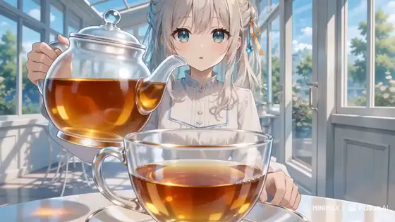

# MiniMax H3 anime prompts

[Back to the full gallery](../../README.md) · [Catalog index](../README.md)

## 1. Greenhouse tea isekai anime

<strong>Prompt</strong> — 高品質アニメ映像。...

~~~~text
高品質アニメ映像。

作品トーンと世界観は、透明感のある夏のガラス温室から、紅茶の渦の内側に存在するオリジナルの小さな不思議の国へ連続する、上品で夢幻的な叙情ファンタジー。澄んだ白、水色、琥珀色、淡い金色を主役にし、怖さや混沌ではなく、好奇心、浮遊感、静かな高揚を描く。今回は1枚のソース参照画像image1のみを使用し、image1をキャラクター、衣装、2D手描き画風、配色、現実側のガラス温室背景の唯一の参照として扱う。

【同一人物固定】
image1と完全に同じ一人の少女を全編で維持する。小さく繊細な同じ顔立ち、大きな青緑色の宝石のような瞳、同じ目の形、多層の虹彩と白いキャッチライト、淡い頬、細いまつ毛、真珠のような白銀髪、柔らかな長いウェーブ、編み込みを含むまとめ髪、淡い金色のリボン、青い雫形の髪飾りを固定する。表情変化でも目、眉、まぶた、口、視線の順を守る。白い長袖のハイネックドレス、淡い水色の刺繍と縁取り、淡い金色の腰リボン、華奢で上品な体格、白・水色・淡い金色の人物固有配色を変えない。現実の温室と不思議の国に同時に複数の少女を存在させず、光学トランジションの前後で同じ一人の少女として連続させる。変えてよいのは表情、視線、呼吸、歩行、手の動き、髪と袖とスカート裾の自然な揺れだけ。別人化、顔の平均化、衣装変更、装飾欠落、分身、余分な人物、既存作品を想起させる有名キャラクターを出さない。
【2D hand-drawn／2D手描き画風固定】
image1の細く淡い青灰色と暖灰色の線、透明感のある二層以上の色影、柔らかなグラデーション、白・ミルキーブルー・澄んだ空色・琥珀色・淡い金色の明るい配色を全編で維持する。白銀髪の真珠質ハイライト、瞳の多層反射、肌の淡い発光感、ドレスの皺と刺繍、花、葉、ガラス、白い家具、床タイル、紅茶まで高密度の手描き筆致で描く。布は柔らかく、ガラスは透明で硬質、紅茶は澄んだ琥珀色、異世界の道と建築は半透明の白いガラス質として素材を描き分ける。太い輪郭にしない。簡略TVアニメにしない。平坦な単層セル影にしない。低密度背景にしない。滑らかなCG・3Dにしない。半写実にしない。実写にしない。くすんだ色や画風混合にしない。

【舞台と小物固定】
現実側はimage1と同じ明るいガラス温室。白い窓枠と屋根骨格、青空と白い雲、外の緑と白い花、白い丸テーブル、白い金属椅子、淡い青灰色の床タイルを維持する。開始時はimage1の少女の顔、目、髪、衣装、温室背景、白・水色・淡い金色の配色、明るさ、柔らかなコントラストを維持し、追加される小物はティーポットだけ。小物の所有者はimage1の少女一人だけ。透明なガラスのティーポット一つ、透明なティーカップ一つ、透明なソーサー一つだけを使う。開始状態ではティーカップはソーサー中央に置かれ、底に浅い琥珀色の紅茶が入っている。少女は右手でティーポットの取っ手を持ち、左手はソーサーの横へ軽く添える。ティーポット、カップ、ソーサーを増殖、交換、変形させない。不思議の国ではこれらを人物や巨大な小道具として複製しない。
少女の表情は、目→眉→まぶた→口→視線の順に変化させる。まず左右の目の中にある小さなキャッチライトがわずかに明るくなり、次に眉が少し上がり、その後まぶたが柔らかく開き、口元に小さな驚きと微笑みが生まれ、最後に視線が渦の中心へ下がる。反射線、窓枠、光点を顔中央へ重ねず、顔と両目を常に明瞭に保つ。

最初のカメラ高は白い丸テーブルと同じ低い位置。少女の斜め前から、手前にティーカップとソーサーを大きく、奥に少女の胸上と顔を明瞭に置く。背景消失軸は床タイルと右側の窓枠が温室奥へ斜めに伸びる方向へ揃える。この構図の目的は、少女、ポット先端、カップ中央の着水点を最初の一画で同時に読ませること。
少女が右手首だけをゆっくり傾けると、ティーポットの先端から一筋だけの琥珀色の紅茶がカップ中央へ落ちる。ポット先端、液体の筋、着水点を一画で読み取れるようにし、紅茶はテーブル外へこぼれない。この着水点を変化の起点とする。着水点から一つの時計回りの渦が生まれ、青空の反射と淡い金色の日差しを巻き込みながら、琥珀、青、白の三色の螺旋へ育つ。

カメラはテーブルと同じ低い位置からカップの斜め上へ滑らかに上がり、人物サイズを胸上の中景から背景の顔が読める近景へ保ったまま、紅茶面へ近づく。背景消失軸は温室奥から円形のカップ中央へ収束させる。この移動の目的は、現実の着水点を異世界への案内線へ変えること。

螺旋の半分がまだ琥珀色の紅茶、もう半分が細い光の道になっている形成中の中間状態を短く明瞭に見せる。続いて螺旋が画面全体を満たした瞬間、その同じ回転方向、曲率、色の並びを保ったまま、一本の光の道へ完成する。暗転、瞬間移動、破裂、液体の中を溺れる表現にせず、紅茶面から異世界の俯瞰へ連続する光学的な形状一致として接続する。

変化後の完成状態である不思議の国は、傾いた白いガラスの庭道、空中でゆっくり反転する白い花壇、輪のように連なる温室アーチ、上下が穏やかに入れ替わる空色の庭で構成する。文字盤、数字、看板、動物、人型住民は出さない。

カメラ高は少女の胸より少し低い位置へ移り、同じ少女の斜め前を後退しながら、胸から膝までの中景で追従する。背景消失軸は琥珀と青の光の道が円形アーチの奥へ伸びる方向へ揃える。この移動の目的は、紅茶の渦だった曲線が少女を導く冒険路へ変わったことを読ませること。

少女は光の道に沿って軽やかに三歩進み、第一歩で傾いた庭道へ乗り、第二歩で浮かぶ白い床片を渡り、第三歩で円形のガラスアーチをくぐる。各足裏を順に接地させ、髪、袖、スカート裾は歩みより少し遅れて同じ風向きへ揺れる。滑走、飛行、急回転に見せない。

少女がアーチをくぐると、周囲の白い花が外側から順に淡い水色へ染まり、頭上のガラス骨格がゆっくり四分の一回転して上下の庭をつなぐ。少女自身は直立を保ち、重力方向を急変させない。

カメラは胸より少し低い位置を保って少女の肩越しへ短く回り込み、人物サイズを胸上に寄せる。背景消失軸は前方の光の道が作る一つの円へ収束させる。この移動の目的は、少女の冒険の先に帰還路が生まれることを示すこと。光の道は再び一つの時計回りの螺旋となり、その円周が現実のティーカップの縁と同じ形、大きさ、角度へ整列する。

カメラは螺旋の中心を通り、琥珀色の紅茶面の極近景から現実の温室へ滑らかに引く。カメラ高はテーブルと同じ低い位置へ戻り、人物サイズを奥の胸上へ戻す。背景消失軸は円形のカップ中央から床タイルと窓枠が温室奥へ伸びる開始方向へ戻す。この移動の目的は、異世界の冒険を一杯の紅茶の中へ回収し、少女の感情へ報酬を返すこと。同じ少女が帰還した連続性を保つ。

終端では少女が右手のティーポットを垂直へ戻し、紅茶の筋をきれいに止め、ティーポットを胸より低い高さで保持する。左手はソーサー横に添えたまま。カップ内の最後の渦がゆっくり縮み、中心に青と淡い金の小さな反射一つだけを残して静止する。

カメラはテーブル高さの斜め前で、手前の静かな紅茶面、奥の少女の三分の四顔と穏やかな微笑みを同時に読ませる。紅茶面の反射が完全に止まり、少女の両目、ティーポット、カップ、渦の名残が一画で明瞭になった瞬間に切る。

液体を黒く濁らせない。渦を黒い穴、荒れた水面、別形状の物体へ変えない。顔を歪ませない。手指を増やさない。余分な人物や余分な食器を出さない。ストロボ、激しい明滅、強い水平フレア、白飛びなし。文字、字幕、ロゴ、透かしなし。BGMなし、音楽なし、環境音なし、フォーリーなし、音響生成なし。
~~~~

**Source:** [@haruuraeadss](https://x.com/haruuraeadss/status/2082798959014064531) · 15s · 16:9 · anime

---

## 2. Jazz-Noir Anime Title Sequence

<strong>Prompt</strong> — @Arcane_Aii Using the attached reference image for the character and the attached audio track for timing, generate a jazz-noir anime title sequence in a stylized pop-art style....

~~~~text
@Arcane_Aii Using the attached reference image for the character and the attached audio track for timing, generate a jazz-noir anime title sequence in a stylized pop-art style. Every cut must land exactly on a beat of the audio — treat the track as the edit timeline.

VISUAL STYLE — apply throughout:
Render characters as flat, high-contrast black silhouettes against solid single-color backgrounds (saturated red, mustard yellow, deep blue). No naturalistic shading — each shot commits to one or two dominant colors only, like a screen-printed poster.

Compose shots like comic-book panels and pulp-magazine covers: bold panel divisions splitting the frame, hard geometric shapes, dramatic off-center cropping, extreme close-ups intercut with full-body poses.

Use freeze-frames as a core device: the character hits a dynamic pose (drawing a weapon, mid-stride, lighting a cigarette, turning toward camera) and the frame HOLDS completely still for one full beat before cutting. Do not smooth or interpolate through these holds — they must be dead stops.

Title typography in mid-century Saul Bass style: stark geometric letterforms, bold sans-serif, text that slides in as flat colored bars or snaps into frame on the beat.

Overlay the entire sequence with heavy analog film grain, slight gate weave, and worn-print color texture — it should look like a scratched 35mm print of a 1960s jazz album cover, not clean digital animation.

MOTION AND EDITING:
Alternate between two modes — (1) fast kinetic bursts of motion (whip pans across silhouettes, rapid cut sequences, a silhouette sprinting across a solid color field) and (2) hard freeze-frame holds. The contrast between the two IS the rhythm. Cuts are hard cuts only: no dissolves, no fades, no morphing between shots. Each new shot snaps in on the downbeat with a fresh background color.

End on the character in silhouette, frozen mid-pose against a solid red field, with the title card snapping in beside them on the final hit of the track.
~~~~

**Source:** [@AIWarper](https://x.com/AIWarper/status/2083045838377652641) · 15s · 16:9 · anime

---

## 3. Pixar-style mouse adventure 3D animation

<strong>Prompt</strong> — { &quot;clip_id&quot;: &quot;animated_adventure&quot;, &quot;genre&quot;: &quot;3D Animation / Pixar Style&quot;, &quot;total_duration&quot;: &quot;15s&quot;, &quot;aspect_ratio&quot;: &quot;16:9&quot;, &quot;style_keywords&quot;: &quot;Pixar-style 3D animation, vibrant...

~~~~text
{       "clip_id": "animated_adventure",       "genre": "3D Animation / Pixar Style",       "total_duration": "15s",       "aspect_ratio": "16:9",       "style_keywords": "Pixar-style 3D animation, vibrant colors, expressive characters, cinematic lighting, whimsical, high detail textures",       "shots": [         {           "shot_num": 1,           "duration": "4s",           "prompt": "Wide shot of a tiny adventurous mouse wearing a leather aviator cap standing on the edge of a giant mushroom in an enchanted forest, giant flowers towering overhead, Pixar-style 3D animation, vibrant colors, soft cinematic lighting",           "camera": "low angle push in",           "transition": "hard cut"         },         {           "shot_num": 2,           "duration": "4s",           "prompt": "Medium shot of the mouse launching into the air on a dandelion seed parachute, floating through sunbeams, pollen particles sparkling around, joyful expression, 3D animated film style, warm golden light",           "camera": "tracking shot from below",           "transition": "match cut on motion"         },         {           "shot_num": 3,           "duration": "4s",           "prompt": "Dynamic action shot of the mouse swooping through a hollow log, fireflies lighting the way, exaggerated squash-and-stretch animation, motion blur on background, Pixar-style adventure sequence",           "camera": "POV following through tunnel",           "transition": "whip pan"         },         {           "shot_num": 4,           "duration": "3s",           "prompt": "Wide shot of the mouse landing triumphantly on a lily pad in a moonlit pond, ripples spreading outward, bioluminescent plants glowing, 3D animation, magical atmosphere, satisfied smile",           "camera": "crane shot rising up",           "transition": "end"         }       ]     },
~~~~

**Source:** [@sebatheepan](https://x.com/sebatheepan/status/2082873433478582726) · 15s · 16:9 · anime

---

## 4. Giant Kitchen Spider Comedy Short

<strong>Prompt</strong> — 3D Pixar-style animated comedy short film, ultra-premium feature film quality, highly expressive facial animation, cinematic storytelling, cozy modern kitchen, warm golden...

~~~~text
3D Pixar-style animated comedy short film, ultra-premium feature film quality, highly expressive facial animation, cinematic storytelling, cozy modern kitchen, warm golden lighting, realistic global illumination, shallow depth of field, ultra-detailed textures, realistic hair simulation, emotional acting, cinematic camera movement, smooth multi-shot sequence, fast-paced visual comedy, no text, no subtitles, no watermark.

A bright, cozy modern kitchen during the afternoon. Warm sunlight streams through the windows. A young woman with long messy dark hair, oversized expressive brown eyes, freckles, wearing an oversized black T-shirt and house slippers, walks into the kitchen carrying a mug.

She suddenly freezes.

On the white marble kitchen island sits an enormous cartoon-style spider about the size of a football. It has fuzzy black legs, oversized expressive eyes, and an intimidating stare.

Shot 1: Wide cinematic shot. The woman and giant spider lock eyes from opposite sides of the kitchen island. Everything becomes still.

Shot 2: Extreme close-up of the woman's face. Her pupils shrink. Sweat forms on her forehead. Her breathing becomes rapid. Tiny facial micro-expressions show pure panic.

Shot 3: Extreme close-up of the spider. It slowly raises its front legs, narrows its eyes, and curls its fangs into a confident grin as if challenging her.

Shot 4: Medium shot. The woman slowly reaches toward a nearby frying pan without taking her eyes off the spider. Her hand trembles violently.

Shot 5: Close-up of her gripping the frying pan with both hands. Her knuckles turn white from fear.

Shot 6: Wide shot. She nervously points the frying pan toward the spider like a shield while cautiously stepping backward.

The spider suddenly takes one slow step forward.

The woman gasps.

Another step.

She screams.

Shot 7: Low-angle shot from behind the spider, making it appear huge while the frightened woman backs away across the kitchen.

The spider tilts its head and smirks mischievously.

The woman gathers all her courage, raises the frying pan high above her head, and charges toward the spider with a terrified battle cry.

Just before she swings—

The spider suddenly spreads its legs, launches into the air, and leaps directly toward the camera.

The woman instantly drops into a crouch, covers her head with both hands, and screams in terror.

Freeze on the spider flying through the air toward the viewer.

End of first 15 seconds.

Ultra-detailed Pixar-quality animation, expressive facial acting, dynamic cinematic camera work, alternating wide shots and extreme close-ups every 1–2 seconds, emotional comedy timing, smooth character animation, premium lighting, blockbuster animated short-film quality, perfect character consistency, viral social-media storytelling.

This ending creates a strong cliffhanger for the extension, where an unexpected hero can arrive and flip the situation into comedy.
~~~~

**Source:** [@Ciri_ai](https://x.com/Ciri_ai/status/2082840410268057697) · 15s · 92:39 · anime

---

## 5. Hand-Drawn Ginger Pork Cooking Anime

<strong>Prompt</strong> — 手描きの日本の2Dアニメ、温かみのあるセルシェーディング、居心地のいい町の定食屋の厨房。15秒、ゆっくり見せる6カット、各約2.5秒。寄りのクローズアップ中心で、食欲をそそる濃厚な演出：脂、照り、湯気、たっぷりの量。 1 まな板を真上から：包丁が厚切りの豚ロースを切る、白い脂の霜降り。 2...

~~~~text
手描きの日本の2Dアニメ、温かみのあるセルシェーディング、居心地のいい町の定食屋の厨房。15秒、ゆっくり見せる6カット、各約2.5秒。寄りのクローズアップ中心で、食欲をそそる濃厚な演出：脂、照り、湯気、たっぷりの量。
1 まな板を真上から：包丁が厚切りの豚ロースを切る、白い脂の霜降り。
2 斜め45度：熱々の鉄のフライパンに肉を並べ入れる、油が弾け、縁が反り返る。
3 マクロ：脂が溶け出し、深い焼き色の焦げ目が広がる。
4 寄り：濃い生姜醤油ダレを回し入れる、ぐつぐつと煮立って濃厚な照りのタレになり、肉に絡みつく。
5 横から：フライパンを揺すり、すべての肉に鏡のような照りがまとわり、湯気が立ち上る。
6 ラスト：湯気の立つ白ご飯の丼に生姜焼きを山盛りにのせ、タレが米粒の間へ垂れていく。
料理と手元のみ。顔なし、食べるシーンなし、文字なし、BGMなし、ナレーションなし。実写風なし、3Dなし。
~~~~

**Source:** [@ozuozuai99](https://x.com/ozuozuai99/status/2082828444484960451) · 15s · 16:9 · anime

---

## 6. Watercolor anime fetish montage rapid cuts

<strong>Prompt</strong> — style: visual: &quot;日本の水彩画風フルカラーアニメ&quot; editing: &quot;0.5秒おきの高速カット割り&quot; animation: &quot;作画枚数多め、滑らかな24fps&quot; tone: &quot;官能的だが直接的にはせず、温度・湿度・心拍を映像化する&quot; project: id: &quot;fetish_montage_v3_with_broll&quot; format:...

~~~~text
style:
  visual: "日本の水彩画風フルカラーアニメ"
  editing: "0.5秒おきの高速カット割り"
  animation: "作画枚数多め、滑らかな24fps"
  tone: "官能的だが直接的にはせず、温度・湿度・心拍を映像化する"

project:
  id: "fetish_montage_v3_with_broll"
  format: "vertical_9x16"
  fps: 24
  shot_duration: "0.5s"
  total_shots: 28
  total_duration: "14s"
  ratio: "fetish 22 : b-roll 6（約3.5:1）"

broll_philosophy:
  role: "呼吸・象徴・感情の外部化"
  placement: "フェチ的なカットが連続した直後、または感情の転換点"
  rule: "直接的な性的表現は避け、心拍・温度・湿度・緊張を伝える"

broll_categories:
  nature_micro:
    - "雨粒が窓を一筋伝う"
    - "蝋燭の炎が揺れる。息で消えそうな瞬間"
    - "氷が割れる音と共に、ひびが走る"
    - "花弁が一枚、テーブルへ落ちる"
    - "蜘蛛の巣の水滴が揺れる"
    - "煙草の灰が静かに落ちる"
    - "湯気が立ち上り、消える"
    - "夜の街灯の周りを虫が一匹飛ぶ"

  object_symbol:
    - "壁時計の秒針のアップ。止まりそうに見える"
    - "コーヒーの黒い表面に天井が映る"
    - "床に脱ぎ捨てられた靴。片方だけ"
    - "誰もいないベッドの皺"
    - "鳴り続ける電話。誰も出ない"
    - "灰皿の吸い殻が二本。片方には口紅"
    - "ドアの隙間から漏れる光"
    - "鏡に映る空の椅子"

  texture_landscape:
    - "夜の濡れた路面。ヘッドライトが滲む"
    - "ネオンサインのフリッカー"
    - "シーシャの炭が赤く脈打つ"
    - "金属表面に映る歪んだ顔"
    - "革張りソファに沈む手の跡"
    - "湯船の水面が揺れる"

  body_abstract:
    - "心臓の鼓動に合わせ、布団が微かに上下する"
    - "人物の影だけが壁を伝う"
    - "ガラス越しの人物の輪郭。ピントがずれる"
    - "水滴の中に顔が映り込む"

sequence:
  - id: 01
    type: "fetish"
    action: "髪を持ち上げ、うなじを晒す"
    scale: "macro"

  - id: 02
    type: "fetish"
    action: "下唇を噛み、ゆっくり離す"
    scale: "extreme_macro"

  - id: 03
    type: "b-roll"
    category: "object_symbol"
    action: "壁時計の秒針が、カチッと一秒進む"
    intent: "時間の伸縮を意識させる"

  - id: 04
    type: "fetish"
    action: "袖口のボタンを外し、袖を一度まくる"
    scale: "macro"

  - id: 05
    type: "fetish"
    action: "襟がわずかにずれ、鎖骨に影が落ちる"
    scale: "macro"

  - id: 06
    type: "fetish"
    action: "グラスの縁を指先でなぞる。結露が一滴落ちる"
    scale: "extreme_macro"

  - id: 07
    type: "b-roll"
    category: "nature_micro"
    action: "蝋燭の炎が、一度だけ大きく揺れる"
    intent: "呼吸の比喩。緊張のピーク"

  - id: 08
    type: "fetish"
    action: "イヤリングを外す。直後に髪が肩へ落ちる"
    scale: "macro"

  - id: 09
    type: "fetish"
    action: "ヒールから足が抜ける"
    scale: "macro"

  - id: 10
    type: "fetish"
    action: "喉が小さく動く。嚥下"
    scale: "extreme_macro"

  - id: 11
    type: "b-roll"
    category: "texture_landscape"
    action: "シーシャの炭が、脈打つように赤く光る"
    intent: "心拍の外部化"

  - id: 12
    type: "fetish"
    action: "口元から煙をゆっくり吐く"
    scale: "macro_side"

  - id: 13
    type: "fetish"
    action: "薄手の布越しに、肩甲骨が静かに動く"
    scale: "macro_back"

  - id: 14
    type: "fetish"
    action: "ペンのキャップを歯で咥え、ゆっくり引き抜く"
    scale: "extreme_macro"

  - id: 15
    type: "b-roll"
    category: "body_abstract"
    action: "布団が呼吸に合わせて微かに上下する"
    intent: "緊張の小休止。まだ続くという予告"
~~~~

**Source:** [@yachimat_manga](https://x.com/yachimat_manga/status/2082799648528335119) · 15s · 9:16 · anime

---

## 7. ASMR multi-cut overseas snack unboxing anime

<strong>Prompt</strong> — 日本のフルカラーアニメ映画風、シネマティックな高品質映像。BGMなし、セリフなし、字幕なし、文字なし、環境音のみ。 # 映像スタイル 添付イラストのキャラクター本人感を最優先。 過度な写実化・厚塗り・複雑な陰影は禁止。 キャラクターの顔立ち、髪型、体型、衣装、アクセは変えない。 # 制約 全カットで画角とアングルを変えて単調にしない。...

~~~~text
日本のフルカラーアニメ映画風、シネマティックな高品質映像。BGMなし、セリフなし、字幕なし、文字なし、環境音のみ。

# 映像スタイル
添付イラストのキャラクター本人感を最優先。
過度な写実化・厚塗り・複雑な陰影は禁止。
キャラクターの顔立ち、髪型、体型、衣装、アクセは変えない。

# 制約
全カットで画角とアングルを変えて単調にしない。
文字・ロゴは入れない。自然な生活感のある仕草にする。各カットは完全な固定カメラ（カメラワーク・カメラ移動なし）。フェードやモーフィングは禁止し、明確なハードカットで瞬時に切り替える。所作は極めてゆっくり、静かに、最小限に。「キャラクターの顔」と「手元の細かい作業」は絶対に同じカットに入れない。

# 登場人物
## 女性
添付イラストの成人女性。

# 情景
夜のリビングのローテーブル。ランプの光の輪の中に段ボールや包みが待っている。

# シーン
女性が海外のお菓子詰め合わせを開封する。テープ、緩衝材、包み紙。開ける音の快感を最大限に立てながら、中身が見えるまでの期待感で引っ張る。開封の工程と仕草を交互に見せる。
この1本だけの見せ場として、「カラフルな包み紙がテーブルに広がっていく俯瞰」を後半のカットに必ず入れる。

cut1:
超クローズアップ。ランプの光の輪の中、箱のテープにカッターの刃が当たる。
環境音：刃を出すカチカチという音だけ。

cut2:
超クローズアップ、真上俯瞰。テープがすーっと切れていく。
環境音：テープの切れる音。

cut3:
クローズアップ、正面。瞳がきらきらして、蓋に手をかける。
環境音：夜の静けさ。

cut4:
クローズアップ、箱の内側視点。蓋が開き、覗き込む顔が現れる。
環境音：段ボールの軋み。

cut5:
超クローズアップ、手元。緩衝材のプチプチを一枚めくる。指がひとつだけぷちんと潰す。
環境音：プチプチの音を主役に。

cut6:
クローズアップ、横顔。息を止めて中を見つめる。
環境音：静けさ。

cut7:
超クローズアップ。薄紙を一枚ずつぺりぺりと剥がしていく。
環境音：薄紙の繊細な音。

cut8:
超クローズアップ。海外のお菓子詰め合わせの一部がちらりと見える。まだ全体は見せない。
環境音：包装の最後の音。

cut9:
ミディアム、真後ろ。ランプの光の輪の中で開封を続ける後ろ姿。
環境音：包みの音、夜の静けさ。

cut10:
クローズアップ、俯瞰。海外のお菓子詰め合わせが姿を現す。指先でそっと持ち上げる。
環境音：包装が落ちる音。

cut11:
クローズアップ、横顔。海外のお菓子詰め合わせをランプの光にかざしてうっとり見つめる。
環境音：静けさ。

cut12:
超クローズアップ、手元。付属品や説明書をぱらりとめくって確認する。
環境音：紙のめくれる音。

cut13:
クローズアップ、斜め上。海外のお菓子詰め合わせを部屋の定位置にそっと置き、角度を整える。
環境音：置く小さな音。

cut14:
超クローズアップ。空箱をばりばりと畳む。開封の儀の後片付け。
環境音：段ボールの音。

cut15:
ワイド、テーブル全景。開け終わった包みと戦利品が光の輪に残る。
環境音：夜の静けさ。

cut16:
ワイド。一番かわいい缶を棚に飾る。ランプの光の中、満足の空気が満ちる。
環境音：静寂へフェード。
~~~~

**Source:** [@aiehon_aya](https://x.com/aiehon_aya/status/2082768164413428159) · 15s · 16:9 · anime

---

## 8. Dark-Fantasy Tavern Fight

<strong>Prompt</strong> — Style: Hyper-realistic dark fantasy tavern cinematic, grounded physical combat, realistic body momentum, medieval atmosphere, gritty lighting, practical effects, handheld...

~~~~text
Style: Hyper-realistic dark fantasy tavern cinematic, grounded physical combat, realistic body momentum, medieval atmosphere, gritty lighting, practical effects, handheld cinematic camera, physically accurate movement, ultra-detailed textures, realistic collisions and environmental interaction.

Duration: 15 seconds

Aspect Ratio: 16:9

IMPORTANT:

Keep the SAME characters fully consistent with the reference: 📷Image1

— Nyssa: athletic woman, dark curly hair tied back, bronze leather armor, cloth wraps, sword on hip

— Grok: massive muscular green orc, scarred skin, fur armor, heavy axes, large physical weight

Combat MUST obey realistic physics:

— no floating

— no anime flips

— realistic inertia and recovery

— believable weight transfer

— realistic impacts and exhaustion

— grounded footwork

— environment reacts physically to impacts

[00:00-00:02]

Wide cinematic shot inside a crowded medieval tavern filled with drunk mercenaries, candles, smoke, spilled ale, and loud cheering. Nyssa walks through the tavern cautiously while patrons stare. Grok sits at a massive wooden table drinking heavily. Deep bass-heavy tavern music and crowd ambience.

[00:02-00:04]

Close-up tension sequence:

— Nyssa locks eyes with Grok

— Grok slowly stands, towering over everyone

— benches scrape across the floor

— mugs shake from his weight

— crowd forms a fighting circle cheering loudly

Handheld camera movement feels realistic and grounded.

[00:04-00:07]

The fight erupts violently. Grok swings a heavy punch with believable momentum. Nyssa narrowly dodges while stumbling realistically into a wooden table. Wood cracks and splinters physically on impact. She counters with fast grounded strikes to Grok’s ribs and legs. Crowd roars and throws coins and mugs into the air.

[00:07-00:10]

Combat intensifies through the tavern:

— Grok grabs Nyssa and throws her across a table

— table explodes realistically beneath her weight

— Nyssa rolls across the floor recovering naturally

— Grok charges heavily, smashing furniture

— patrons jump away realistically

No exaggerated movement, only physically believable combat.

[00:10-00:12]

Nyssa uses speed and positioning intelligently. She dodges another heavy attack causing Grok to crash into a support beam. Dust and debris fall from the ceiling. She climbs briefly onto the bar counter and leaps down with controlled realistic momentum, locking Grok’s arm and using leverage to throw him off balance.

[00:12-00:15]

Final cinematic climax. Nyssa tackles Grok to the ground hard onto broken wooden debris. The floor shakes from the impact. She pins him down on top of him while holding a blade near his throat. Grok struggles realistically beneath her massive weight difference and exhaustion. Tavern crowd erupts cheering wildly, slamming mugs against tables. Camera slowly pushes inward on Nyssa breathing heavily while sweat, dirt, and candlelight flicker across both fighters.

Audio:

Heavy cinematic tavern battle soundtrack with deep drums, loud cheering crowds, breaking wood, metal impacts, realistic body hits, roaring fire ambience, mugs crashing, heavy footsteps, and gritty medieval atmosphere.

Negative prompts:

No floating, no anime combat, no superhero physics, no unrealistic flips, no weightless motion, no blurry characters, no low detail, no cartoon style, no slow reactions, no clipping through objects.
~~~~

**Source:** [@craftian_keskin](https://x.com/craftian_keskin/status/2082658222247137433) · 15s · 16:9 · anime

---

## 9. Photoreal Character Turnaround Sheet

<strong>Prompt</strong> — ※実写ver。アニメキャラの場合はリプ参照（↓） ────────────────── 【スタイル指定】 - 添付画像のデザイン（衣装・髪型・体格・配色）を完全に維持したまま、実在の人物が衣装を着用して撮影したようなフォトリアルな実写に変換する - 生地・肌・髪・金属などの質感は写真として自然なリアリティで再現する -...

~~~~text
※実写ver。アニメキャラの場合はリプ参照（↓）
──────────────────
【スタイル指定】
- 添付画像のデザイン（衣装・髪型・体格・配色）を完全に維持したまま、実在の人物が衣装を着用して撮影したようなフォトリアルな実写に変換する
- 生地・肌・髪・金属などの質感は写真として自然なリアリティで再現する
- デザインそのものの変更（衣装や小物の追加・削除）はしない
- スタジオ写真撮影のような自然光・均一な照明にする

【共通ルール】
- SHOT区切りのみで進行する（秒数指定なし）
- 各SHOTの最後は静止カットで終える。滑らかな変形ではなく静止→カットで切り替える
- 各SHOTの画面には、そのSHOTで指定された要素だけを映す。それ以外の角度・別バージョンの絵を混ぜない
- 背景は無地の単色スタジオ背景（白またはライトグレー）に統一する
- 字幕・テキスト・ロゴ・透かしは表示しない

SHOT 1：正面の立ち姿と、その顔の実写クローズアップを並べて表示する。

SHOT 2：横向き（右）の立ち姿と、その横顔の実写クローズアップを並べて表示する。

SHOT 3：横向き（左）の立ち姿と、その横顔の実写クローズアップを並べて表示する。

SHOT 4：後ろ向きの立ち姿と、その後頭部の実写クローズアップを並べて表示する。

SHOT 5：正面の立ち姿と、表情差分6パターン（普通・笑顔・怒り・驚き・悲しみ・ウインク）の実写クローズアップを並べて表示する。

SHOT 6：正面の立ち姿と、身に着けているもの（衣装・小物・アクセサリー）の素材ディテール実写マクロ接写を並べて表示する。

SHOT 7：正面の立ち姿・横向き（右）の立ち姿・後ろ向きの立ち姿と、正面の顔の実写クローズアップをまとめて1枚に並べる
──────────────────
~~~~

**Source:** [@aiehon_aya](https://x.com/aiehon_aya/status/2082501605803597837) · 7s · 16:9 · anime

---
