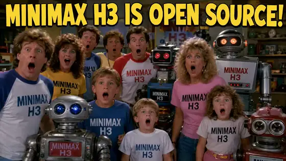

# MiniMax H3 comedy prompts

[Back to the full gallery](../../README.md) · [Catalog index](../README.md)

## 1. 1980s open-source family comedy

<strong>Prompt</strong> — Use the supplied image as the exact opening frame. Create a hilarious, high-budget 1980s live-action family comedy movie scene, photographed on a real soundstage with practical...

~~~~text
Use the supplied image as the exact opening frame. Create a hilarious, high-budget 1980s live-action family comedy movie scene, photographed on a real soundstage with practical robot costumes, animatronics, handmade props, vintage wardrobe, and authentic 35mm film color.

The entire group suddenly hears something above them. Everyone’s eyes dart upward at the same moment. The men, women, children, and robots dramatically tilt their heads back, point toward the ceiling, and erupt into chaotic celebration. They gasp, scream, laugh, jump, wave their arms, slap each other on the shoulders, and completely lose their minds with exaggerated 1980s comedy reactions. The children bounce excitedly. The adults stumble into one another. The robots flash their eyes, flap their mechanical arms, spin clumsily, and celebrate with funny practical animatronic movements.

One man shouts:

“OPEN SOURCE?!”

The entire crowd answers together:

“MINIMAX H3!”

They cheer wildly as one robot attempts a victory dance, loses its balance, and is caught by the shocked family at the final second.

Fast, energetic comic timing with believable ensemble choreography. Begin with a brief locked group shot, then a subtle handheld push-in as the chaos escalates. Keep every original person, robot, shirt design, and the large headline clearly recognizable. Preserve facial identity, wardrobe, composition, lighting, and 1980s production design.

Authentic optical softness, warm tungsten lighting, rich film grain, slight gate weave, practical effects, natural motion blur, expressive physical acting, polished studio-comedy sound mix, triumphant synthesizer sting, cheering, robot beeps, and comedic percussion.

No CGI, no digital-looking robots, no morphing, no extra people, no duplicated characters, no distorted faces, no rewritten text, no spelling changes, no modern clothing, no style shifts, and do not turn the scene into animation.
~~~~

**Source:** [@BrentLynch](https://x.com/BrentLynch/status/2083020024340693185) · 12s · 16:9 · comedy

---

## 2. Porto Francesinha Comedy Recipe

<strong>Prompt</strong> — Style: &lt;image_1&gt; (don't reproduce the image, use it only as aesthetic reference) Edit: Comedy, fast paced, mixing close ups, medium shots and wide shots from uncanny and tilted...

~~~~text
Style: <image_1> (don't reproduce the image, use it only as aesthetic reference)

Edit: Comedy, fast paced, mixing close ups, medium shots and wide shots from uncanny and tilted angles. Super-imposed texts with doodles identify ingredients as they appear and add comic remarks.

Scene: In Porto, Portugal a crazy chef explains how to do a Francesinha in Portuguese from Portugal with Porto accent.
~~~~

**Source:** [@imagineFERA](https://x.com/imagineFERA/status/2083172752790282615) · 15s · 92:39 · comedy

---

## 3. The World's Unluckiest Superhero

<strong>Prompt</strong> — A documentary about a superhero who has extremely bad luck and ends up saving people by accident through the destruction caused by his own misfortune. Dialogue in English. Scene...

~~~~text
A documentary about a superhero who has extremely bad luck and ends up saving people by accident through the destruction caused by his own misfortune. Dialogue in English. Scene direction with unique composition. Every cut, every camera angle, and every movement is of exceptionally high quality; the composition is guided by an experienced film director. The comedy is genuinely interesting, and throughout the 15 seconds everything unfolds in a perfectly crafted way, with a comedic payoff that can make anyone laugh.
~~~~

**Source:** [@NACHOS2D_](https://x.com/NACHOS2D_/status/2082853567543615837) · 30s · 16:9 · comedy

---

## 4. Condor Heroes characters teach English word dream

<strong>Prompt</strong> — 神雕侠侣主角趣味讲单词 dream 教程

~~~~text
神雕侠侣主角趣味讲单词 dream 教程
~~~~

**Source:** [@nicekate8888](https://x.com/nicekate8888/status/2082762739697815758) · 15s · 16:9 · comedy

---
