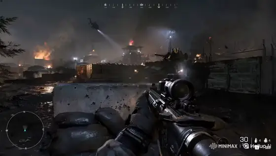
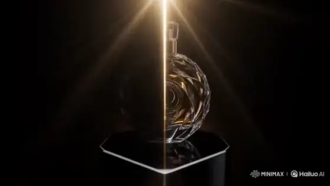
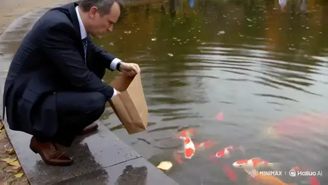

# MiniMax H3 prompts — page 1

[Back to the full gallery](../../README.md) · [Catalog index](../README.md)

## 1. Modern warfare FPS gameplay

<strong>Prompt</strong> — Camera: First-person perspective at eye level with authentic handheld player movement, as if recorded directly from a modern AAA military shooter. The player carries a highly...

~~~~text
Camera: First-person perspective at eye level with authentic handheld player movement, as if recorded directly from a modern AAA military shooter. The player carries a highly detailed assault rifle with realistic animations, visible hands, tactical gloves, dynamic reload mechanics, and weapon sway.  **Opening Action:** The video immediately begins with the player already aiming down a roadway inside a modern military base. Multiple enemy soldiers are visible in the distance near sandbags, barricades, and military vehicles. The player carefully tracks one target, making small aim corrections while maintaining ADS (aim down sights). Fire several controlled bursts immediately at the visible enemies, producing realistic muzzle flashes, shell casings ejecting, smoke, recoil, hit reactions, and dust impacts around the targets. Continue firing in multiple short bursts while adjusting aim between enemies, simulating authentic FPS gameplay rather than scripted animation.  **Movement:** After the opening firefight, lower slightly from ADS and begin advancing cautiously along the road beside concrete barriers, Hesco walls, and parked military vehicles. Frequently check left and right corners, briefly stop to reacquire targets, then raise the weapon and fire additional controlled bursts whenever enemies appear ahead. Continue pushing forward with deliberate player-controlled movement, using cover naturally and maintaining believable tactical pacing.  **Environment:** Large modern military base with guard towers, armored vehicles, shipping containers, blast barriers, damaged buildings, smoke plumes, burning debris, scattered shell casings, dust clouds, and atmospheric battlefield haze. Cool natural daylight mixed with smoke and orange firelight creates a cinematic battlefield atmosphere.  **Camera Motion:** Authentic player-controlled movement with subtle head bob, weapon sway, natural mouse-look adjustments, small left-right corrections while aiming, realistic recoil, smooth tracking of moving targets, brief pauses before shooting, and fluid forward progression. Avoid cinematic camera moves—everything should feel like genuine live gameplay captured by a skilled player.  **Visual Quality:** Ultra-photorealistic, AAA game graphics with realistic PBR materials, detailed weapon models, physically accurate lighting, volumetric smoke, dynamic particle effects, crisp textures, realistic bullet impacts, muzzle flash illumination, motion blur only during rapid movement, and high-end military shooter presentation.  **Gameplay UI:** Display a realistic modern FPS HUD inspired by games like PUBG, Battlefield, or Call of Duty (without copying exact copyrighted assets). Include:  * Central dynamic crosshair or reticle * Ammo counter with magazine and reserve ammunition * Fire mode indicator * Compass at the top * Squad/team status panel * Mini-map in the upper corner * Health bar * Tactical equipment icons (grenades, medkit) * Hit markers when bullets connect * Directional damage indicators * Kill notification feed * Objective marker in the distance * Subtle interaction prompts and realistic HUD animations  The HUD should feel polished, modern, and fully integrated into the gameplay, enhancing the illusion of authentic recorded footage from a contemporary military FPS.
~~~~

**Source:** [@Just_sharon7](https://x.com/Just_sharon7/status/2083064417798025721) · 15s · 16:9 · gameplay

---

## 2. Luxury perfume commercial

<strong>Prompt</strong> — Scene 1 (0–3s) – Luxury Reveal A luxury perfume bottle slowly emerges from darkness, standing on a glossy black pedestal. Soft golden light beams gradually reveal the...

~~~~text
Scene 1 (0–3s) – Luxury Reveal
A luxury perfume bottle slowly emerges from darkness, standing on a glossy black pedestal. Soft golden light beams gradually reveal the crystal-clear glass, while subtle volumetric fog creates depth. Extreme macro shot, cinematic lighting, ultra-realistic reflections, premium luxury commercial aesthetic.

Scene 2 (3–6s) – Precision Details
Extreme close-up of the perfume bottle as rich golden fragrance liquid gently swirls inside. The camera performs a smooth cinematic orbit, capturing intricate glass textures, flawless craftsmanship, and sparkling highlights. Ultra-detailed, photorealistic, premium commercial quality.

Scene 3 (6–9s) – AI Transformation
The perfume bottle seamlessly dissolves into glowing golden particles before instantly reforming into a futuristic luxury edition, maintaining perfect proportions and visual consistency. Dynamic orbit camera, seamless transformation, cinematic lighting, premium visual effects.

Scene 4 (9–12s) – Environment Transition
Without a single cut, the background transforms from a luxurious black studio into a futuristic neon metropolis. The perfume bottle remains perfectly consistent while the camera performs a dramatic dolly-in. Hyper-realistic, cinematic, high-end advertising style.

Scene 5 (12–15s) – Hero Finale
Slow-motion hero shot of the luxury perfume bottle elegantly rotating as glowing golden particles float around it. Premium black background, flawless reflections, cinematic logo reveal, luxury commercial ending, 8K photorealistic, blockbuster advertising quality.
~~~~

**Source:** [@CaliraVal](https://x.com/CaliraVal/status/2083059583308751079) · 15s · 16:9 · product commercial

---

## 3. 1980s open-source family comedy

<strong>Prompt</strong> — Use the supplied image as the exact opening frame. Create a hilarious, high-budget 1980s live-action family comedy movie scene, photographed on a real soundstage with practical...

~~~~text
Use the supplied image as the exact opening frame. Create a hilarious, high-budget 1980s live-action family comedy movie scene, photographed on a real soundstage with practical robot costumes, animatronics, handmade props, vintage wardrobe, and authentic 35mm film color.

The entire group suddenly hears something above them. Everyone’s eyes dart upward at the same moment. The men, women, children, and robots dramatically tilt their heads back, point toward the ceiling, and erupt into chaotic celebration. They gasp, scream, laugh, jump, wave their arms, slap each other on the shoulders, and completely lose their minds with exaggerated 1980s comedy reactions. The children bounce excitedly. The adults stumble into one another. The robots flash their eyes, flap their mechanical arms, spin clumsily, and celebrate with funny practical animatronic movements.

One man shouts:

“OPEN SOURCE?!”

The entire crowd answers together:

“MINIMAX H3!”

They cheer wildly as one robot attempts a victory dance, loses its balance, and is caught by the shocked family at the final second.

Fast, energetic comic timing with believable ensemble choreography. Begin with a brief locked group shot, then a subtle handheld push-in as the chaos escalates. Keep every original person, robot, shirt design, and the large headline clearly recognizable. Preserve facial identity, wardrobe, composition, lighting, and 1980s production design.

Authentic optical softness, warm tungsten lighting, rich film grain, slight gate weave, practical effects, natural motion blur, expressive physical acting, polished studio-comedy sound mix, triumphant synthesizer sting, cheering, robot beeps, and comedic percussion.

No CGI, no digital-looking robots, no morphing, no extra people, no duplicated characters, no distorted faces, no rewritten text, no spelling changes, no modern clothing, no style shifts, and do not turn the scene into animation.
~~~~

**Source:** [@BrentLynch](https://x.com/BrentLynch/status/2083020024340693185) · 12s · 16:9 · comedy

---

## 4. Radio operator evacuation bridge

<strong>Prompt</strong> — FORMAT 15 seconds | 16:9 | photoreal live-action war thriller Fictional Sahelian city at blue-hour dawn. Urgent, human, suspenseful, non-graphic. REFERENCE CONTROL Image 1 =...

~~~~text
FORMAT
15 seconds | 16:9 | photoreal live-action war thriller
Fictional Sahelian city at blue-hour dawn.
Urgent, human, suspenseful, non-graphic.

REFERENCE CONTROL
Image 1 = locked AMINA identity and wardrobe.
Preserve face, close-cropped hair, deep-brown skin, navy field jacket, silver earpiece, canvas satchel, analogue radio, boots and determined expression.

Image 2 = locked environment.
Preserve concrete bridge, dry riverbed, dense low-rise city, rooftop antennae, dusty atmosphere, cool-blue shadows and restrained amber dawn.

No real countries, flags, organizations or landmarks.

STORY
Amina is the last radio operator keeping an evacuation bridge open. Communications fail during a distant attack. She must activate the backup relay and transmit clearance before automatic controls close the bridge.

00–02s — CHANNEL OFFLINE
Extreme close-up inside a dark concrete communications room.

Amina grips the analogue radio as red emergency lights pulse. Dust trembles, cables quiver, broken static fills the room.

Automated voice:
“Emergency channel offline.”

She looks up and immediately moves.

02–04s — BRIDGE CLOSING
Wide aerial-oblique rooftop view.

Civilians cross the bridge through windblown dust.

Checkpoint signal flickers green → red as shutdown begins.

A distant shockwave moves through city haze. No visible casualties.

04–06.5s — RUN
Low handheld tracking behind Amina running through a damaged service corridor.

Emergency lights flash, dust falls, cables briefly spark, boots hit wet concrete.

She pushes through a heavy metal door into blowing dust.

06.5–09s — FLASHBACK
Two minutes earlier.

Medium side-profile on rooftop.

Amina sees the unstable bridge signal, manually rotates the antenna and connects her radio to backup power.

Slow camera push. Wind moves her satchel strap as first amber sunlight reaches her jacket.

09–12.5s — TRANSMISSION
Rapid cross-cut montage:

frequency dial locks →
antenna aligns →
bridge cables vibrate →
red signal flashes →
Amina speaks into radio:

“Channel Seven, keep the bridge open.”

Overhead shot: civilians continue crossing.

Sharp hard cuts, brief black frames, natural motion blur.

12.5–15s — SIGNAL RESTORED
Sound suddenly drops.

Amina listens on the rooftop.

Clear radio tone.

Checkpoint signal changes red → steady green.

Evacuation continues.

Amina exhales and watches the bridge as dawn reaches the city.

Slow push toward her face.
Cut to black.

CAMERA
Large-format live-action realism.
Precise nonlinear cross-cutting.
Handheld tracking, aerial-oblique coverage, restrained push-ins and close details.
Natural motion blur, fine film grain, subtle gate weave.
No impossible camera movement.

ENVIRONMENT + PHYSICS
Cool-blue shadows against muted amber sunrise.
Deep blacks, dusty atmosphere, weathered concrete.

Wind realistically affects dust, clothing, cables and antenna equipment.
All movement and interactions remain physically believable.

AUDIO
Stereo radio static, electrical hum, wind, boots, antenna creaks, distant low artillery and helicopter rotors.

Restrained suspenseful sub-bass builds through the montage.

VISUAL
Photoreal cinematic war-thriller footage.
Immense scale contrasted with one determined operator.
Grounded, tense and human.

No subtitles, text, logos, watermarks, political messaging, flags or military insignia.

CONTINUITY
Same Amina identity, wardrobe, radio and satchel throughout.
Same bridge, city, atmosphere and dawn lighting.
Maintain geographic and temporal continuity across all shots.
~~~~

**Source:** [@Diplomeme](https://x.com/Diplomeme/status/2082770042630943156) · 15s · 16:9 · cinematic story

---

## 5. Giant koi park incident

<strong>Prompt</strong> — 15-second, 16:9 vertical, continuous single-take video that looks like authentic smartphone footage accidentally captured by a passerby in a city park. Overcast natural daylight,...

~~~~text
15-second, 16:9 vertical, continuous single-take video that looks like authentic smartphone footage accidentally captured by a passerby in a city park. Overcast natural daylight, subtle handheld shake, limited phone stabilization, occasional autofocus adjustment, and realistic smartphone compression. The absurd event is filmed with a completely serious, unscripted documentary feeling.  0–3s: [Handheld medium shot] A middle-aged man wearing a dark business suit and tie crouches beside the stone edge of a pond. With a completely serious expression, he slowly scatters pieces of bread from a paper bag to several ordinary koi. Small ripples spread across the water as the fish gather in front of him.  3–7s: [Camera instinctively moves closer] An abnormally huge orange-and-white koi suddenly surges out of the murky water, briefly lifting its upper body above the surface and biting down on the entire bread bag in the man’s left hand. He freezes for half a second, then grips the bag with both hands and leans backward. Startled, the person filming steps back. The image briefly loses focus before locking onto the man and the giant fish again.  7–11s: [Close handheld action shot] The giant koi pulls violently toward the deeper part of the pond. The wet paper bag stretches, the man’s arms tense, and his leather shoes slide repeatedly across the wet stone. His knee strikes the edge of the pond. He tries to brace himself with his right foot, but the sole loses traction and his center of gravity moves past the edge. Water, pieces of bread, and fallen leaves scatter from the force as the camera operator hurriedly moves sideways.  11–15s: [Impact and final hold] The paper bag suddenly tears. The man loses all support and pitches forward into the pond, creating one heavy, realistic splash. The camera quickly tilts downward while keeping the center of the pond visible. The man resurfaces with duckweed covering his head and his wet tie stuck across his face. The giant koi calmly swims past him with the remains of the bread bag still in its mouth. The camera holds on the man’s stunned expression while the koi casually swims away beside him.  Keep the man’s face, dark suit, tie, and paper bag visually consistent throughout. The koi must retain the same orange-and-white markings and enormous size. The pulling, sliding, loss of balance, and fall must show believable weight, inertia, traction, and water displacement. Natural park ambience and a realistic splash only. No dialogue, no subtitles, no music. Avoid cuts, character teleportation, changes in the fish’s size, extra limbs, and cartoonish acting.
~~~~

**Source:** [@underwoodxie96](https://x.com/underwoodxie96/status/2082747838782386563) · 15s · 16:9 · viral short

---

## 6. Greenhouse tea isekai anime

<strong>Prompt</strong> — 高品質アニメ映像。...

~~~~text
高品質アニメ映像。

作品トーンと世界観は、透明感のある夏のガラス温室から、紅茶の渦の内側に存在するオリジナルの小さな不思議の国へ連続する、上品で夢幻的な叙情ファンタジー。澄んだ白、水色、琥珀色、淡い金色を主役にし、怖さや混沌ではなく、好奇心、浮遊感、静かな高揚を描く。今回は1枚のソース参照画像image1のみを使用し、image1をキャラクター、衣装、2D手描き画風、配色、現実側のガラス温室背景の唯一の参照として扱う。

【同一人物固定】
image1と完全に同じ一人の少女を全編で維持する。小さく繊細な同じ顔立ち、大きな青緑色の宝石のような瞳、同じ目の形、多層の虹彩と白いキャッチライト、淡い頬、細いまつ毛、真珠のような白銀髪、柔らかな長いウェーブ、編み込みを含むまとめ髪、淡い金色のリボン、青い雫形の髪飾りを固定する。表情変化でも目、眉、まぶた、口、視線の順を守る。白い長袖のハイネックドレス、淡い水色の刺繍と縁取り、淡い金色の腰リボン、華奢で上品な体格、白・水色・淡い金色の人物固有配色を変えない。現実の温室と不思議の国に同時に複数の少女を存在させず、光学トランジションの前後で同じ一人の少女として連続させる。変えてよいのは表情、視線、呼吸、歩行、手の動き、髪と袖とスカート裾の自然な揺れだけ。別人化、顔の平均化、衣装変更、装飾欠落、分身、余分な人物、既存作品を想起させる有名キャラクターを出さない。
【2D hand-drawn／2D手描き画風固定】
image1の細く淡い青灰色と暖灰色の線、透明感のある二層以上の色影、柔らかなグラデーション、白・ミルキーブルー・澄んだ空色・琥珀色・淡い金色の明るい配色を全編で維持する。白銀髪の真珠質ハイライト、瞳の多層反射、肌の淡い発光感、ドレスの皺と刺繍、花、葉、ガラス、白い家具、床タイル、紅茶まで高密度の手描き筆致で描く。布は柔らかく、ガラスは透明で硬質、紅茶は澄んだ琥珀色、異世界の道と建築は半透明の白いガラス質として素材を描き分ける。太い輪郭にしない。簡略TVアニメにしない。平坦な単層セル影にしない。低密度背景にしない。滑らかなCG・3Dにしない。半写実にしない。実写にしない。くすんだ色や画風混合にしない。

【舞台と小物固定】
現実側はimage1と同じ明るいガラス温室。白い窓枠と屋根骨格、青空と白い雲、外の緑と白い花、白い丸テーブル、白い金属椅子、淡い青灰色の床タイルを維持する。開始時はimage1の少女の顔、目、髪、衣装、温室背景、白・水色・淡い金色の配色、明るさ、柔らかなコントラストを維持し、追加される小物はティーポットだけ。小物の所有者はimage1の少女一人だけ。透明なガラスのティーポット一つ、透明なティーカップ一つ、透明なソーサー一つだけを使う。開始状態ではティーカップはソーサー中央に置かれ、底に浅い琥珀色の紅茶が入っている。少女は右手でティーポットの取っ手を持ち、左手はソーサーの横へ軽く添える。ティーポット、カップ、ソーサーを増殖、交換、変形させない。不思議の国ではこれらを人物や巨大な小道具として複製しない。
少女の表情は、目→眉→まぶた→口→視線の順に変化させる。まず左右の目の中にある小さなキャッチライトがわずかに明るくなり、次に眉が少し上がり、その後まぶたが柔らかく開き、口元に小さな驚きと微笑みが生まれ、最後に視線が渦の中心へ下がる。反射線、窓枠、光点を顔中央へ重ねず、顔と両目を常に明瞭に保つ。

最初のカメラ高は白い丸テーブルと同じ低い位置。少女の斜め前から、手前にティーカップとソーサーを大きく、奥に少女の胸上と顔を明瞭に置く。背景消失軸は床タイルと右側の窓枠が温室奥へ斜めに伸びる方向へ揃える。この構図の目的は、少女、ポット先端、カップ中央の着水点を最初の一画で同時に読ませること。
少女が右手首だけをゆっくり傾けると、ティーポットの先端から一筋だけの琥珀色の紅茶がカップ中央へ落ちる。ポット先端、液体の筋、着水点を一画で読み取れるようにし、紅茶はテーブル外へこぼれない。この着水点を変化の起点とする。着水点から一つの時計回りの渦が生まれ、青空の反射と淡い金色の日差しを巻き込みながら、琥珀、青、白の三色の螺旋へ育つ。

カメラはテーブルと同じ低い位置からカップの斜め上へ滑らかに上がり、人物サイズを胸上の中景から背景の顔が読める近景へ保ったまま、紅茶面へ近づく。背景消失軸は温室奥から円形のカップ中央へ収束させる。この移動の目的は、現実の着水点を異世界への案内線へ変えること。

螺旋の半分がまだ琥珀色の紅茶、もう半分が細い光の道になっている形成中の中間状態を短く明瞭に見せる。続いて螺旋が画面全体を満たした瞬間、その同じ回転方向、曲率、色の並びを保ったまま、一本の光の道へ完成する。暗転、瞬間移動、破裂、液体の中を溺れる表現にせず、紅茶面から異世界の俯瞰へ連続する光学的な形状一致として接続する。

変化後の完成状態である不思議の国は、傾いた白いガラスの庭道、空中でゆっくり反転する白い花壇、輪のように連なる温室アーチ、上下が穏やかに入れ替わる空色の庭で構成する。文字盤、数字、看板、動物、人型住民は出さない。

カメラ高は少女の胸より少し低い位置へ移り、同じ少女の斜め前を後退しながら、胸から膝までの中景で追従する。背景消失軸は琥珀と青の光の道が円形アーチの奥へ伸びる方向へ揃える。この移動の目的は、紅茶の渦だった曲線が少女を導く冒険路へ変わったことを読ませること。

少女は光の道に沿って軽やかに三歩進み、第一歩で傾いた庭道へ乗り、第二歩で浮かぶ白い床片を渡り、第三歩で円形のガラスアーチをくぐる。各足裏を順に接地させ、髪、袖、スカート裾は歩みより少し遅れて同じ風向きへ揺れる。滑走、飛行、急回転に見せない。

少女がアーチをくぐると、周囲の白い花が外側から順に淡い水色へ染まり、頭上のガラス骨格がゆっくり四分の一回転して上下の庭をつなぐ。少女自身は直立を保ち、重力方向を急変させない。

カメラは胸より少し低い位置を保って少女の肩越しへ短く回り込み、人物サイズを胸上に寄せる。背景消失軸は前方の光の道が作る一つの円へ収束させる。この移動の目的は、少女の冒険の先に帰還路が生まれることを示すこと。光の道は再び一つの時計回りの螺旋となり、その円周が現実のティーカップの縁と同じ形、大きさ、角度へ整列する。

カメラは螺旋の中心を通り、琥珀色の紅茶面の極近景から現実の温室へ滑らかに引く。カメラ高はテーブルと同じ低い位置へ戻り、人物サイズを奥の胸上へ戻す。背景消失軸は円形のカップ中央から床タイルと窓枠が温室奥へ伸びる開始方向へ戻す。この移動の目的は、異世界の冒険を一杯の紅茶の中へ回収し、少女の感情へ報酬を返すこと。同じ少女が帰還した連続性を保つ。

終端では少女が右手のティーポットを垂直へ戻し、紅茶の筋をきれいに止め、ティーポットを胸より低い高さで保持する。左手はソーサー横に添えたまま。カップ内の最後の渦がゆっくり縮み、中心に青と淡い金の小さな反射一つだけを残して静止する。

カメラはテーブル高さの斜め前で、手前の静かな紅茶面、奥の少女の三分の四顔と穏やかな微笑みを同時に読ませる。紅茶面の反射が完全に止まり、少女の両目、ティーポット、カップ、渦の名残が一画で明瞭になった瞬間に切る。

液体を黒く濁らせない。渦を黒い穴、荒れた水面、別形状の物体へ変えない。顔を歪ませない。手指を増やさない。余分な人物や余分な食器を出さない。ストロボ、激しい明滅、強い水平フレア、白飛びなし。文字、字幕、ロゴ、透かしなし。BGMなし、音楽なし、環境音なし、フォーリーなし、音響生成なし。
~~~~

**Source:** [@haruuraeadss](https://x.com/haruuraeadss/status/2082798959014064531) · 15s · 16:9 · anime

---

## 7. Surreal Blue Studio Dance with a Horse

<strong>Prompt</strong> — Use @ Image1 as the man reference. Use @ Image2 as the woman reference. Use @ Image3 as the horse reference. Create a surreal 15-second fashion-film sequence inside a minimalist...

~~~~text
Use @ Image1 as the man reference.
Use @ Image2 as the woman reference.
Use @ Image3 as the horse reference.

Create a surreal 15-second fashion-film sequence inside a minimalist monochrome blue studio.  The woman performs an elegant contemporary dance.  The man casually walks into frame wearing a completely serious expression.  Without explanation, he immediately joins the choreography.  His movements are awkward, strangely confident, almost ritualistic.  The woman never acknowledges him.  The horse behaves as though both dancers are part of its routine.  It wanders through the studio.  Runs behind them.  Appears from impossible places.  Stops.  Looks directly into the camera.  Leaves.  Returns again.  Sometimes all three performers accidentally synchronize for one beat before drifting apart again.  The choreography becomes increasingly absurd but remains perfectly cinematic.  Every movement is intentional.  Every frame feels designed.  Throughout the sequence, premium kinetic typography appears as part of the composition, not subtitles, but editorial motion graphics inspired by high-end After Effects title design.  Animated words flash for only a few frames:  THE GARDENER.  THE DRIVER.  THE HORSE.  THE WOMAN.  KNIFE.  MOVE.  FASTER.  AGAIN.  THE EXIT. These words slam into frame, wrap around the dancers, disappear behind bodies, stretch with motion blur, rotate in 3D, fragment into pieces, reveal through masks, pulse with the bass, smear across cuts, become oversized, tiny, vertical, upside down, and constantly transform using premium motion-design techniques.  Add abstract editorial graphics: animated arrows, circles, blueprint lines, tape labels, interface markers, halftone textures, scribbles, grain, tracking graphics, geometric overlays, chromatic aberration, liquid masks, flash frames, split screens, typography trails, speed ramps and graphic wipes.  Music evolves into strange electronic art-pop.  Analog synths.  Mechanical breathing.  Heavy bass.  Everything is synchronized to the rhythm.  Final close-up.  The woman whispers:  "Again."  The man quietly smiles for the first time.  The horse suddenly sprints directly toward the camera.  The word  AGAIN.  fills the screen before an instant cut to black.
~~~~

**Source:** [@egeberkina](https://x.com/egeberkina/status/2083301476206588086) · 15s · 16:9 · fashion

---

## 8. Nighttime Motorcycle Chase Synced to Music

<strong>Prompt</strong> — Use @ image1 as the opening frame and exact visual reference. Preserve the rider’s face, short curly hair, round glasses, black leather jacket, gloves, motorcycle, and realistic...

~~~~text
Use @ image1 as the opening frame and exact visual reference. Preserve the rider’s face, short curly hair, round glasses, black leather jacket, gloves, motorcycle, and realistic nighttime city environment throughout.

Use @ audio1 as the soundtrack. Synchronize the motorcycle’s acceleration, camera movement, passing lights, and edits precisely to the music’s rhythm and rising intensity. No dialogue or additional music.

0–3s: Begin in the frontal composition of @ image1. A stabilized tracking camera moves backward directly ahead of the motorcycle as the rider speeds through traffic. Her expression is alert and focused; wind moves her curls and jacket naturally.

3–6s: On a strong musical beat, shift smoothly into a low front three-quarter tracking angle beside the front wheel. The motorcycle leans gently around a moving car without changing direction abruptly. Streetlights streak across the wet pavement.

6–10s: Transition into a fast side-tracking shot. The rider accelerates through a narrow opening between two lanes while maintaining believable balance, speed, and forward momentum. Background traffic and illuminated buildings create controlled motion blur.

10–13s: The camera arcs from her side toward the rear as she clears the traffic. Red emergency lights begin flashing across the surrounding buildings and reflect naturally in her glasses and leather jacket.

13–15s: A fire truck crosses the intersection behind her as she races into an open stretch of road. Finish with the camera pulling wider and rising slightly, revealing the motorcycle speeding deeper into the city on the final musical accent.

Cinematic live-action realism, physically accurate motorcycle movement, energetic but readable action, natural motion blur, shallow depth of field, cool blue-black city palette with warm streetlights and red emergency-light accents. Maintain one continuous direction of travel. No collisions, teleporting, sudden direction reversals, distorted hands, changing wardrobe, altered motorcycle design, facial drift, extra limbs, text, logos, or slow motion.
~~~~

**Source:** [@HBCoop_](https://x.com/HBCoop_/status/2083282581450375367) · 15s · 16:9 · cinematic story

---

## 9. Y2K K-Pop Candy Typography Music Video

<strong>Prompt</strong> — Soft cute Y2K crush K-pop girl group rap MV. High fashion performance film mixed with inflated 3D candy typography graphic system. Three female idols wearing pink, blue and purple...

~~~~text
Soft cute Y2K crush K-pop girl group rap MV. High fashion performance film mixed with inflated 3D candy typography graphic system. Three female idols wearing pink, blue and purple luxury Y2K stage outfits. Cute 3D chibi doll face, big dewy eyes, porcelain skin, soft blush cheeks, chibi idol proportions. Reference typography: only the inflated 3D rubber bubble font language, pink/lavender/ice-blue chrome plastic material, not the whole layout. Visual style: soft pastel crush energy, Y2K game UI, candy glossy finish, milky translucent plastic × K-pop aggressive feminine rap energy. Texture: 35mm film grain + soft glow bloom + iridescent holographic foil + jelly plastic specular + Y2K scanline + candy dot halftone + VHS frame vibration + plastic toy surface reflection + glitter confetti rain. Editing: Fast rhythm editing. Only hard cuts. No fade. No smooth transitions. Every cut follows: bass hit, snare, rap vocal impact.

Character Performance Three female performers from reference image 1. Keep: same 3D chibi doll faces, big sparkling eyes, pastel Y2K idol makeup, pink/blue/purple fashion styling, soft cute cold expression. Each member has a signature prop: A holds a chunky rhinestone microphone, B has a plush bear shoulder bag, C wears oversized heart-shaped sunglasses pushed up on head. They are not posing. They are performing rap. Actions: aggressive eye contact, head nodding, shoulder movement, leaning toward camera, hand pushing toward lens, confident cute facial expression, sharp body movement, wink on snare hit, tongue-out on bass drop, hair flip on beat. Lip sync: perfect rap mouth synchronization. The performance should feel like a real K-pop rap unit MV with Y2K crush energy.

Typography Animation Typography is a visual weapon. Not subtitles. Not static graphics. Use: giant English words inflated 3D rubber bubble font, jelly plastic material, pink lavender ice-blue chrome, soft puffy candy letters, compressed bold balloon fonts, stretched vertical puffy letters, handwritten graffiti titles, 3D extruded candy text, glitch displacement, print error effect, Y2K game UI pixel corruption. Text appears only when the beat hits. Characters can cover the text. Text can cover parts of clothing. Never cover eyes or main facial expression. Tiny Y2K stickers burst on beat: heart, star, smiley, sparkle, chain link, bow, four-leaf clover, mini bear.

Shot 1 — Member A · Extreme Close-up「RUN NOW」 Character A face close-up, framed inside a pink heart-shaped iris wipe transition (in only, hard cut out). She looks directly into camera. Cute cold doll expression, big dewy eyes, soft blush, frosted pink lip gloss, rhinestone tear sticker under one eye. Starts rap. Chunky rhinestone microphone enters frame from below, she grips it tightly. Camera slowly pushes closer. Tiny pink heart stickers float up from bottom edge like bubbles. Huge inflated bubble letters crash into frame from left and right. Typography: "RUN NOW" — Pink jelly rubber 3D font, glossy candy surface, soft inner glow. Letters stretch vertically like puffy balloons. The word vibrates and squishes with bass, casts soft pink shadow on her cheek. Rap: "Run now, I don't chase." Confetti burst on final syllable. Hard cut.

Shot 2 — Member B · Rap Performance「BREAK LIMIT」 Member B medium close-up, slight low angle, camera orbits 15° around her during the take. Lavender fur jacket, Y2K layered top, plush bear bag bouncing on her hip, chunky pearl choker, star-shaped earrings. She performs aggressively. Shoulders hit the rhythm. Hair flips hard on the second snare, blue hair ties catch the light. Hair moves naturally. Background: pastel gradient pink-to-lavender with faint Y2K perspective grid lines floating. Behind her appears huge handwritten text. Typography: "BREAK LIMIT" — Ice-blue bubble graffiti brush writing, soft inflated stroke, candy-coated, letters appear one by one with bounce easing. Animation: letters tear apart, reassemble, rotate 360° on snare, shake with bass. Chain link graphic swings across frame, sparkle stickers pop on every beat. Rap: "Break limits, break rules." Hard cut.

Shot 3 — Member C · Hand Attack Shot「NO APOLOGY」 Member C moves close to camera. Top-down camera angle, she leans over the lens. Hand reaches toward lens. Nails are long pink acrylic with 3D star and heart charms. Focus: rings with mini plush bear charm, heart-cut gemstone, baby-pink leather texture, knit ribbed sleeve, plushy toy surface. Foreground vertical text: "NO APOLOGY" — Stretched vertical pink bubble letters, jelly puffy material, letters pierce through the back of her hand visually. Hand covers part of the typography. Fingers spread wide on the bass hit. Camera: handheld vibration. Film grain strong. Candy halftone dots bloom in shadow. Tiny "XOXO" sticker tag pulses in corner. Rap: "No apology, no regret." Hard cut.

Shot 4 — Fashion Magazine Impact Cut「UNSTOPPABLE」 Member A close-up. Her face appears inside a broken Y2K trading card / idol photo card frame, with barcode at bottom, "SYS.07-A" serial tag, holographic foil border torn on left side. Not a full layout. Only one graphic element. Typography: "UNSTOPPABLE" — Huge lavender handwritten bubble text, inflated 3D rubber, glossy plastic finish, letters explode outward from center of her forehead, push edges of the card frame. Animation: text suddenly expands from behind her. Card frame rips in half vertically, holographic confetti pours from the tear, revealing pastel gradient background underneath. A second smaller photo card of her winks in from the right, slightly rotated. Rap: "Can't stop my wave." Hard cut.

Shot 5 — Glitch Double Image「STATIC」 Member B close-up, slight Dutch angle (5° tilt). Create: duplicate frame, pastel RGB separation (pink/blue/lavender channels), xerox shadow, motion trail, VHS tracking line at bottom edge. Main face stays sharp. She holds a sparkly heart-shaped lollipop up beside her cheek, the lollipop leaves a trail of echo frames. Background text: "STATIC" — Y2K pixel font, candy pink chrome, letters flicker like broken game sprite, jump between frames, sometimes inverted color, sometimes missing entirely. Like corrupted music video signal + cute game glitch. A tiny "ERROR 404" sticker blinks in upper corner. Rap: "Static noise, I get louder." Hard cut.

Shot 6 — Pink Blue Purple Battle「PINK OUT」 Member A and C alternate close-ups, rhythm: A-A-C-A-C-C, two frames each. Fast switching. Visual split: each member sits in a vertical color block (A=pink, C=lavender, alternating). Center text: "PINK OUT" — Pastel pink-to-purple gradient bubble 3D, letters appear one word at a time, syncing to each cut. Words appear one by one. Each word: stretch vertically on entry, compress horizontally on hold, invert color on snare, explode into heart stickers and star confetti on exit. Tiny "1.2.3.GO!" counter graphic ticks in corner. Rap: "Lights out, pink out." Hard cut.

Shot 7 — Group Rap Performance「UNBREAKABLE」 Three members together.
~~~~

**Source:** [@LeoCreaIA](https://x.com/LeoCreaIA/status/2083240416166748313) · 15s · 16:9 · gameplay

---

## 10. Yellow Sunglasses in a Black Studio

<strong>Prompt</strong> — [Upload reference ] + Use la ragazza in reference as a strict identity reference for the model and her yellow sunglasses. Preserve face, hair, and the exact frame shape and colour...

~~~~text
[Upload reference ] + Use la ragazza in reference  as a strict identity reference for the model and her yellow sunglasses.

Preserve face, hair, and the exact frame shape and colour throughout.

15 seconds, 16:9. Premium fashion commercial, photoreal live action.

Infinite black void, polished black floor. She is the only lit element: hard key from

one side, second hard light from the other, deep shadow between, strong speculars on

the yellow frame and lenses.

She walks slowly toward the camera in a black high-neck top and long black coat, chin

level, eyes on the lens. Camera tracks backward at her pace, holding her size in frame.

All type is heavy condensed uppercase sans-serif in vivid yellow, rendered as physical

objects in 3D perspective with real thickness, catching the same light as she does and

casting faint shadows on the floor.

[0-4s] LOOK rises out of the floor ahead of her in deep perspective, grows as she

approaches, and sweeps past on both sides out of frame.

[4-7s] SEE enters from the right at high speed, streaks behind her with heavy motion

blur, exits left.

[7-10s] FOCUS appears large and fully out of focus, resolves into razor sharpness over

half a second, holds, breaks apart.

[10-12s] Four thin yellow lines draw a rectangle around her and FRAME assembles along

its lower edge.

Throughout, passing type reflects across the glossy lenses as it moves near her.

[12-15s] She stops. All type collapses inward and vanishes into black. The camera

continues into a tight close-up on her face and the yellow sunglasses. She holds

completely still, eyes on the lens. On the black beneath her the title composes in the

same yellow type: "SHIOBA LENS", and below it, smaller: "MADE TO BE SEEN". Hold.

All text clean, legible, correctly spelled English capitals, each word once only. No

garbled or duplicated letters, misspellings, subtitles, watermarks, or other text or

logos.

Audio: low sustained bass,

Composition: model centered, all type within the central third of the frame
~~~~

**Source:** [@shikoba_86](https://x.com/shikoba_86/status/2083225662316265763) · 15s · 16:9 · product commercial

---

## 11. Theme Park Memory Montage

<strong>Prompt</strong> — Nostalgic montage of different clips. Graphic motion layouts of friends having fun in a theme park.

~~~~text
Nostalgic montage of different clips. Graphic motion layouts of friends having fun in a theme park.
~~~~

**Source:** [@magnific](https://x.com/magnific/status/2083217899540586917) · 5s · 16:9 · cinematic story

---

## 12. Cyber Warrior vs. Primordial Fighter

<strong>Prompt</strong> — Create a 15-second cinematic showdown between the most technologically advanced human and the most primordial warrior. The technological fighter wears adaptive nano-armor,...

~~~~text
Create a 15-second cinematic showdown between the most technologically advanced human and the most primordial warrior.

The technological fighter wears adaptive nano-armor, holographic interfaces, energy weapons, and glowing cybernetic implants.

The primordial fighter is massive and feral, covered in ritual markings, bone armor, and animal hides, wielding a brutal stone weapon.

Set the battle in a ruined landscape where a futuristic megacity merges with an ancient volcanic wilderness.

00:00 — The fighters face each other as futuristic machinery hums and distant primal drums begin.

00:02 — The technological fighter activates the nano-armor and says in a cold synthetic voice: “Evolution ends with me.”

00:04 — The primordial warrior roars and replies in a deep, savage voice: “You have forgotten what strength is.”

00:06 — They charge toward each other at full speed.

00:08 — Their weapons collide, releasing a massive shockwave of blue plasma, fire, sparks, debris, lightning, and shattered holographic fragments.

00:10 — The technological fighter launches drones and energy blades while the primordial warrior smashes the ground, creating volcanic cracks and a towering blast of stone and flame.

00:12 — Both fighters unleash their final attacks simultaneously as the camera circles them in dramatic slow motion.

00:14 — A blinding explosion consumes the battlefield.

00:15 — The smoke begins to clear, revealing only a mysterious silhouette without showing who won.

Use dynamic tracking shots, dramatic low angles, rapid orbiting camera movement, extreme close-ups, speed ramps, controlled handheld energy, and slow motion during key impacts.

Cinematic 4K, 16:9, ultra-realistic VFX, physically accurate destruction, volumetric smoke, plasma energy, fire, sparks, debris, lightning, synchronized impact sounds, futuristic weapon audio, primal roars, distinct English voices, and a cinematic orchestral score mixed with electronic pulses and tribal percussion.
~~~~

**Source:** [@alex_bagnuoli89](https://x.com/alex_bagnuoli89/status/2083207597025354071) · 15s · 16:9 · action

---

## 13. Strawberry Drink Transformation Commercial

<strong>Prompt</strong> — { &quot;shots&quot;: [ { &quot;shot_id&quot;: &quot;1&quot;, &quot;start_time&quot;: &quot;00:00&quot;, &quot;end_time&quot;: &quot;00:02&quot;, &quot;camera_angle&quot;: &quot;Close-up&quot;, &quot;subject&quot;: &quot;Strawberry&quot;, &quot;action&quot;: &quot;A single, dull strawberry transforms...

~~~~text
{   "shots": [     {       "shot_id": "1",       "start_time": "00:00",       "end_time": "00:02",       "camera_angle": "Close-up",       "subject": "Strawberry",       "action": "A single, dull strawberry transforms into a vibrant, ripe strawberry, floating against a pink background.",       "visual_details": "Initial strawberry is muted, then becomes intensely red with visible seeds; pink background; subtle glow effect.",       "audio_cues": "Light, subtle, almost magical sound effect."     },     {       "shot_id": "2",       "start_time": "00:02",       "end_time": "00:05",       "camera_angle": "Medium shot",       "subject": "Strawberry and beverage can",       "action": "The vibrant strawberry transforms into a white and pink beverage can with 'STRAWBERRY CREAM' text. Liquid pours into the can from above, and strawberries/water droplets float around it.",       "visual_details": "Can is sleek, covered in condensation; red liquid splashing into the can; numerous floating strawberries (whole and sliced) and water droplets; pink background.",       "audio_cues": "Sound of liquid pouring, bubbling, and light splashes; upbeat, commercial-style music."     },     {       "shot_id": "3",       "start_time": "00:06",       "end_time": "00:10",       "camera_angle": "Close-up",       "subject": "Top of the beverage can",       "action": "Focus on the top of the can as the liquid continues to pour and splash, with droplets and strawberries in motion.",       "visual_details": "Intricate details of the can's opening and condensation; dynamic splashes of liquid; close-up of floating strawberry pieces.",       "audio_cues": "Enhanced sounds of liquid splashing and bubbling; continued music."     },   ] }
~~~~

**Source:** [@GumVue](https://x.com/GumVue/status/2083189719827878083) · 7s · 16:9 · product commercial

---

## 14. Macaw Scream in Extreme Slow Motion

<strong>Prompt</strong> — /gen prompt: Cinematic wildlife documentary, vertical framing, subject centered, National Geographic award-winning cinematography, anamorphic lens, rich natural color, natural...

~~~~text
/gen prompt: Cinematic wildlife documentary, vertical framing, subject centered, National Geographic award-winning cinematography, anamorphic lens, rich natural color, natural sunlight, natural motion blur. States: the scream never stops, the camera always rises, every touched object reacts. Characters: a blue-and-gold macaw, cobalt wings, golden chest, green crown, white face patch, black beak; a young man, short dark curly hair, olive t-shirt. Israeli white stone apartment building, living room. 0-2s macro: silence, the macaw inhales, chest swelling, throat feathers rising, the man mid-sip. 2-5s the beak opens, the world slams into extreme slow motion: a ripple of distorted air expands from the beak, rings race across his coffee, the mug shattering into countable shards, coffee hanging in ropes, his cheeks rippling back. 5-9s time snaps back; the wave blows the shutters open, the camera rides it out, straight up the facade. 9-14s rising floor by floor: laundry lines whipping, a dog howling in one window; crawl on pigeons detonating off a ledge, feathers suspended, the ripple passing them; snap back. 14-17s the roof: solar heaters trembling, tank water rippling, car alarms flashing far below; bold 3D text "105 DB" slams centered mid-frame. 17-20s hard cut to the room: the macaw fluffs, tilts its head, one tiny chirp; the man frozen with the mug handle. Audio: silence, a heartbeat on the inhale; a sub-bass shockwave, one raw macaw screech Doppler shifting as the camera climbs, glass shatter, dogs and alarms join, biggest boom on the text, ringing silence, a tiny chirp. Photorealistic, no deformation, every feather barb visible, crisp letter edges, smooth fluid motion, 8k, extreme details. , resolution:720p, duration:20s, aspect_ratio:9:16
~~~~

**Source:** [@yuvalav](https://x.com/yuvalav/status/2083143771508592938) · 15s · 92:39 · cinematic story

---

## 15. Bamboo Forest Wuxia Mystery

<strong>Prompt</strong> — A 16:9 cinematic wuxia mystery set in a bamboo forest at night. Use a low-saturation palette of cold blue, ink green, charcoal, and gray. Thin mist fills the forest and fine snow...

~~~~text
A 16:9 cinematic wuxia mystery set in a bamboo forest at night. Use a low-saturation palette of cold blue, ink green, charcoal, and gray. Thin mist fills the forest and fine snow drifts through the air. The mood is austere, lethal, and controlled, with the tension of a martial-arts sect investigating a case and exchanging secret intelligence.

Deep in the forest, dense vertical bamboo fills the background while cold white mist-light glows in the distance. Soft, out-of-focus leaves partially obscure the foreground, creating the sense of watching from within the grove. A cool, soft front-side key lights the actors’ faces; backlight keeps the foreground dark and the distance luminous. Use shallow depth of field so leaves, snow, and bamboo dissolve into soft bokeh.
Prioritize facial close-ups and measured shot/reverse-shot coverage. Keep the rhythm restrained but tense. Photoreal period-drama production value, cinematic lighting, and no modern elements. No subtitles, on-screen text, watermarks, modern clothing or architecture, animation styling, over-smoothed skin, bright daylight, or comic performance.
~~~~

**Source:** [@AIwithAliya](https://x.com/AIwithAliya/status/2083132770650571041) · 15s · 16:9 · product commercial

---

## 16. Emerald Bio-Serum Product Film

<strong>Prompt</strong> — Cinematic luxury skincare product commercial, vertical 9:16, 15 seconds. A translucent emerald green glass dropper bottle of INVENTIKO Bio-Serum 38% Renderfeel 20,000, labeled...

~~~~text
Cinematic luxury skincare product commercial, vertical 9:16, 15 seconds. A translucent emerald green glass dropper bottle of INVENTIKO Bio-Serum 38% Renderfeel 20,000, labeled "SERUM SKINCARE - SKIN REPAIR SKIN LIFTING", sits on a sleek black and white pedestal against a dark teal gradient background with soft volumetric lighting and dramatic light rays. Smooth camera orbit and subtle zoom around the bottle, water droplets on glass, elegant reflections. Close-up macro shots of the bottle surface and text. Then a black dropper is slowly pulled out, filled with golden-yellow serum, and a perfect viscous drop forms and hangs at the tip in extreme slow-motion close-up against soft green bokeh. Quick transition to a soft-focus close-up of a young East Asian woman's glowing cheek and eye as a single golden serum droplet falls onto her skin, creating a delicate shimmering highlight. Final shot: the green bottle with dropper resting beside it on a white terrazzo surface against a green tiled wall with soft window light stripes. Ultra-realistic, high-end beauty advertising style, soft cinematic lighting, shallow depth of field, 4K quality, smooth camera movements.
~~~~

**Source:** [@noorlewisx](https://x.com/noorlewisx/status/2083081579262591469) · 15s · 9:16 · product commercial

---

## 17. Black-and-Gold Perfume Commercial

<strong>Prompt</strong> — Create a 15-second ultra-premium luxury perfume commercial in cinematic 16:9. A crystal perfume bottle with a sleek black-and-gold design stands on a glossy reflective surface...

~~~~text
Create a 15-second ultra-premium luxury perfume commercial in cinematic 16:9.

A crystal perfume bottle with a sleek black-and-gold design stands on a glossy reflective surface inside a dark luxury studio. The commercial opens with an extreme macro shot of the engraved cap, followed by slow cinematic rotations revealing every elegant detail. Dramatic golden light sweeps across the glass while soft volumetric light and subtle mist create a premium atmosphere.

Elegant water splashes, floating crystal shards, and shimmering golden particles move naturally around the bottle in ultra slow motion without covering the label. Every reflection is physically accurate with realistic caustics, premium glass refractions, and highly detailed liquid simulation.

The camera transitions through smooth macro close-ups, low-angle hero shots, orbiting movements, and dramatic push-ins using luxury advertising cinematography. Rich black marble, gold accents, and soft smoke enhance the high-end aesthetic.

End with the bottle perfectly centered on a glossy pedestal as the lighting intensifies for a premium hero reveal. Display a fictional luxury brand logo "NOIR ÉLITE" with the tagline "Crafted to Leave a Mark."

Photorealistic, Hollywood luxury TV commercial, ultra-detailed, flawless glass rendering, realistic water physics, cinematic color grading, HDR, ray-traced reflections, depth of field, premium product advertising, 8K quality.
~~~~

**Source:** [@kingofdairyque](https://x.com/kingofdairyque/status/2083079304632520833) · 15s · 16:9 · product commercial

---

## 18. Morning Lip Oil UGC Testimonial

<strong>Prompt</strong> — Use the uploaded reference image as the exact character reference. Preserve her facial identity, hairstyle, eye color, skin tone, body proportions, and facial consistency...

~~~~text
Use the uploaded reference image as the exact character reference. Preserve her facial identity, hairstyle, eye color, skin tone, body proportions, and facial consistency throughout every shot.

Create a 15-second ultra-realistic UGC-style beauty advertisement featuring a realistic young woman speaking directly to the smartphone camera in a bright, modern bedroom vanity area with warm morning sunlight, soft neutral décor, and an elegant illuminated mirror.

She smiles naturally while holding a premium luxury lip oil with a clear glass bottle and gold cap. In a friendly, conversational tone, she shares why it has become her favorite everyday beauty essential. She opens the product, applies the lip oil with the applicator in front of the mirror, then gently presses her lips together and smiles confidently, showing the glossy natural finish.

Capture authentic handheld selfie shots, over-the-shoulder mirror angles, and cinematic close-ups highlighting the crystal-clear bottle, gold cap, soft reflections, applicator, glossy texture, and luxurious packaging. End with her holding the lip oil beside her face while smiling naturally into the camera.

Authentic UGC creator content, realistic facial expressions, natural hand gestures, healthy glowing skin, minimal makeup, luxury beauty aesthetic, smartphone-shot realism, subtle depth of field, premium color grading, vertical 9:16, 4K HDR, no text, subtitles, logos, or watermarks.
~~~~

**Source:** [@SimplyAnnisa](https://x.com/SimplyAnnisa/status/2083075282186256521) · 15s · 16:9 · product commercial

---

## 19. Hip-Hop Character Lip-Sync Performance

<strong>Prompt</strong> — hip hop music video, make the character from @Video1 dance to the beat from music @Audio1 and he lip syncs in sync with @Audio1

~~~~text
hip hop music video, make the character from @Video1 dance to the beat from music @Audio1 and he lip syncs in sync with @Audio1
~~~~

**Source:** [@bennash](https://x.com/bennash/status/2083065653104107776) · 108s · 16:9 · music video

---

## 20. Sagrada Família FPV flight

<strong>Prompt</strong> — Create a cinematic realistic high-speed drone video over Barcelona, Spain at golden hour, using the reference image as the exact location and flight-path guide. The drone starts...

~~~~text
Create a cinematic realistic high-speed drone video over Barcelona, Spain at golden hour, using the reference image as the exact location and flight-path guide. The drone starts very low above the Barcelona cityscape, almost skimming above the foreground rooftops and streets, facing La Sagrada Família. It accelerates quickly forward over the urban landscape, following the drawn path from the foreground toward the cathedral while maintaining a very low altitude. The drone then performs a dramatic climbing curve as La Sagrada Família fills the frame, executes a close cinematic orbit around the cathedral’s iconic spires, and after the orbit, pulls back while gaining altitude before tilting and opening toward the Barcelona skyline, Mediterranean Sea, Eixample grid, surrounding historic rooftops, golden-hour reflections, distant coastline, and glowing Barcelona atmosphere.

The red drawn line must not appear in the video; it is only a hidden flight-path reference. Add powerful emotional cinematic music: deep cello melody, dramatic percussion rhythm, orchestral strings, subtle choir texture, epic rising percussion, and a grand heroic crescendo as the drone completes its orbit around La Sagrada Família and reaches the final panoramic reveal. No text, no subtitles, no logos, no graphic overlays.@Image1
~~~~

**Source:** [@Diplomeme](https://x.com/Diplomeme/status/2083056488122380671) · 15s · 77:92 · cinematic travel

---

## 21. NOVA X smartphone TVC

<strong>Prompt</strong> — Create a 15-second premium cinematic branding TVC for a futuristic smartphone brand called NOVA X. 0–5 seconds: Extreme close-up of a sleek futuristic smartphone resting on a...

~~~~text
Create a 15-second premium cinematic branding TVC for a futuristic smartphone brand called NOVA X.

0–5 seconds: Extreme close-up of a sleek futuristic smartphone resting on a glossy black surface. Dramatic studio lighting sweeps across the device, revealing its ultra-thin design and premium metallic edges. Cinematic camera push-in, macro product details, realistic reflections.

5–10 seconds: The phone activates with a stunning futuristic interface. A young professional picks it up, and the environment transforms into a vibrant digital world with floating holographic visuals, smooth UI animations, and seamless interaction. Dynamic camera movement, premium commercial aesthetic.

10–15 seconds: Hero product shot of the smartphone standing vertically against a minimalist futuristic background. The NOVA X logo appears elegantly with the tagline: “NOVA X — The Future in Your Hands.” Cinematic lighting, high-end TV commercial quality, photorealistic, ultra-detailed, smooth motion, polished advertising style, 4K.
~~~~

**Source:** [@UrMeer289](https://x.com/UrMeer289/status/2083048872566575568) · 15s · 16:9 · product commercial

---

## 22. Post-workout gym vlog

<strong>Prompt</strong> — CAMERA: DV 16mm tape camcorder POV. CHASE films herself, occasionally propping the camera on a wall or gym bag. Natural handheld shake, imperfect framing, delayed focus, clumsy...

~~~~text
CAMERA: DV 16mm tape camcorder POV. CHASE films herself, occasionally propping the camera on a wall or gym bag. Natural handheld shake, imperfect framing, delayed focus, clumsy zooms, face occasionally cut off. Camcorder never visible.
LOOK: Soft blurry tape aesthetic, faint tape noise, bloomed gym lights, flickering auto-exposure, muted contrast, realistic skin.
STYLE: Calm post-workout gym vlog. Relaxed, reflective, slightly tired but happy. Slow pacing, natural laughs.
CHARACTER: CHASE, Korean idol (20s). Long black hair loosely tied, light post-workout glow, slim athletic build. Modest long-sleeve athletic top, loose joggers/leggings, socks or shoes off, towel around neck, no jewelry.
SETTING: Quiet evening gym. Stretching mat, mirror wall, gym bag, protein shake, soft lighting, mostly empty.
15s | 6 Cuts
Propped medium: sits on mat, exhales. "Okay, cool-down time."
Handheld stretch: hamstring stretch, laughs. "Yeah, that was a lot today."
Macro: picks up protein shake, condensation visible. Ambient sound only.
Medium: drinks shake, smiles. "Okay, that's actually really good."
Close: overhead stretch, rates workout. "I'd give today like an eight out of ten."
Selfie: grabs bag and shake, waves. "Alright, I'm heading out—see you guys."
~~~~

**Source:** [@doctorwasif](https://x.com/doctorwasif/status/2083048782581858681) · 15s · 16:9 · vlog

---

## 23. Korean Idol VHS Beauty Vlog

<strong>Prompt</strong> — DV 16mm camcorder vlog with soft VHS tape quality, handheld POV by CHASE and mirror-mounted vanity shots. CHASE, a Korean idol in her 20s with long black hair and dewy skin,...

~~~~text
DV 16mm camcorder vlog with soft VHS tape quality, handheld POV by CHASE and mirror-mounted vanity shots. CHASE, a Korean idol in her 20s with long black hair and dewy skin, casually picks up the fictional Lumina Velvet Lip Tint (frosted pink tube, gold cap) at a mall beauty store, saying, "Okay, everyone's talking about this shade." She heads home, opens and swatches the lipstick, applies it smoothly in warm vanity lighting, admires the glossy finish, smiles at the mirror, then looks into the camera for a glowing close-up reveal and says, "Okay wow... Lumina Velvet Lip Tint, you've got a new fan."
~~~~

**Source:** [@saniaspeaks_](https://x.com/saniaspeaks_/status/2083043197937209852) · 15s · 16:9 · cinematic story

---

## 24. SparkRush Ultra Fizz beach soft-drink commercial

<strong>Prompt</strong> — （16:9 / 15秒 / 8カット / 日本語セリフ版） @ ImageA＝採用済みイメージボード。 （以降、イメージボードと記述） イメージボードは 登場人物2人の雰囲気、水着、ビーチ環境、商品ボトルデザイン、色、爽快感、映像トーンの参考資料 としてのみ使用する。 重要：イメージボードのレイアウトや構成そのものは絶対に映像内へ描写しない。...

~~~~text
（16:9 / 15秒 / 8カット / 日本語セリフ版）
@ ImageA＝採用済みイメージボード。
（以降、イメージボードと記述）
イメージボードは 登場人物2人の雰囲気、水着、ビーチ環境、商品ボトルデザイン、色、爽快感、映像トーンの参考資料 としてのみ使用する。
重要：イメージボードのレイアウトや構成そのものは絶対に映像内へ描写しない。
イメージボード、8分割グリッド、コマ割り、番号、説明文、見出し、商品一覧、配色見本、ムードボード、ポスター、静止画コラージュ、絵コンテ風表示を作らない。
完成物は1本の実写CM映像として出力し、画面内に文字・数字・ロゴ説明・CUT番号・パネル分割を表示しない。

15秒、16:9、実写シネマティックCM、全8カット。
真夏の明るい昼のビーチ。白い砂浜、透明感のある青い海、強い日差し、爽やかな風。
登場人物は20代前半の成人男女2人。健康的でおしゃれ、自然な笑顔、友達同士の軽快で爽やかな空気感。
商品は架空の超炭酸ペットボトル飲料 SPARKRUSH ULTRA FIZZ。
透明ペットボトル、青いキャップ、濃いブルー主体のラベル、斜めライン、粒粒の炭酸バブル表現、勢いのある刺激的なデザイン。
水やミネラルウォーターではなく、強い超炭酸飲料に見せること。
ラベルはエネルギッシュでおしゃれ、炭酸の刺激が伝わるグラフィック。
実在ブランドのロゴや意匠は使わない。
全カットで人物の顔、水着、商品ロゴ、ボトル形状、ラベル配色を統一する。
字幕、テロップ、追加文字、別ロゴは入れない。

CUT1 0:00-0:02

ワイドショット。真夏のビーチ。男女2人が浅瀬を走りながら海へ入っていく。水しぶきがきらめく。爽快で青春感のある始まり。
男「うわー、最高！」

CUT2 0:02-0:04

2人がビーチボールで遊ぶ。明るく笑いながら投げ合う。空と海が鮮やかで、夏らしい開放感。
女「ほら、ナイスキャッチ！」

CUT3 0:04-0:06

女性の上半身寄り。女性が SPARKRUSH ULTRA FIZZ のボトルをカメラに向けて掲げ、爽やかに笑う。ボトルの青いラインと粒粒の炭酸デザインがしっかり見える。
女「これ、超炭酸だよ！」

CUT4 0:06-0:08

商品寄り。手でキャップをひねって開けた瞬間、プシュッという強い炭酸音。ボトル口から細かな泡と冷たいミストが弾ける。超炭酸の刺激を強く見せる。
SE：炭酸の鋭い開栓音

CUT5 0:08-0:10

男性がボトルを飲む寄りショット。冷えたボトルの水滴、喉を通る爽快感、飲んだ瞬間の刺激的で気持ちいい表情。
男「うおっ、キリッとくる！」

CUT6 0:10-0:12

2人のツーショット。笑い合いながらボトルを持つ。自然な距離感、眩しい日差し、夏が弾けるような空気感。
女「すっきり爽快！」
男「夏って感じ！」

CUT7 0:12-0:14

海辺の商品イメージカット。手前または岩場近くに SPARKRUSH ULTRA FIZZ のボトル。背景の海ではイルカの群れが数頭ジャンプしている。爽やかで開放的な奇跡のような演出。海しぶきと太陽光がきらめく。
NA「超炭酸で、リフレッシュ！」

CUT8 0:14-0:15

エンドカット。海を背にして並ぶ2人、または海辺に座る2人の後ろ姿。画面の手前または横に商品ボトルを大きく配置。最後は商品が主役。
2人「スパークラッシュ！」

映像トーン：高級感のある夏の飲料CM、爽快、青春、開放感、清潔感、ファッション広告のような洗練。
カメラ：ワイド、ミディアム、商品寄り、人物寄りをテンポよく切り替える。
音：波音、軽快なサマーポップ、ビーチボールの軽い音、炭酸の開栓音、泡が弾ける音。
口パクは日本語セリフに自然に合わせる。

強い禁止事項
イメージボードのムードボード自体を再現しない
8分割パネル、コマ割り、静止画コラージュにしない
番号、見出し、解説文、配色パレット、商品比較図を表示しない
ポスター、絵コンテ、広告ボード、資料画像のようにしない
1枚絵の資料ではなく、自然な連続CM映像として出力する
~~~~

**Source:** [@mi7_crypto](https://x.com/mi7_crypto/status/2083042578883383681) · 15s · 108:145 · product commercial

---

## 25. Desert Buggy Combat Chase

<strong>Prompt</strong> — Create a 15-second, 16:9 photoreal cinematic action sequence with native stereo audio. Treat the five images as coordinated multimodal references for identity, vehicle design,...

~~~~text
Create a 15-second, 16:9 photoreal cinematic action sequence with native stereo audio. Treat the five images as coordinated multimodal references for identity, vehicle design, environment, performance, action, cinematography, and sound.

Use Image 1 as the strict facial-identity reference for the female racer. Preserve her exact face, dark tied-back hair, amber goggles, dusty skin, black tactical suit, shoulder armor, gloves, and focused expression.

Use Image 2 as the strict reference for her full costume, body proportions, armored black dune buggy, tire scale, exposed suspension, cyan headlights, roll cage, desert lighting, and industrial-outpost background.

Use Image 3 as the action reference for the pursuing drones, vehicle speed, dust trails, fire, debris, chase intensity, and camera proximity.

Use Image 4 as the location reference for Outpost 07, including its rusted towers, pipelines, bridges, rocky terrain, distant mountains, warm sunset atmosphere, and industrial scale.

Use Image 5 as the cockpit and performance reference. Preserve the same steering wheel, open roll cage, goggles, gloves, facial identity, driving posture, and vehicle interior.

Sequence
[0–2.5 seconds]

Open on Image 4 with an extreme-wide aerial establishing shot of Outpost 07 at sunset. The industrial complex fills the right side of frame while an empty desert route curves through the rocky foreground.

The camera dives rapidly toward the road as a small black dune buggy bursts from beneath an elevated pipeline, throwing a long dust plume behind it.

Keep the vehicle moving consistently from left to right toward the outpost. No direction reversal.

Audio begins with dry desert wind, distant industrial machinery, a low cinematic pulse, and the buggy engine approaching rapidly.

[2.5–5 seconds]

Cut at peak engine sound to Image 5.

Tight frontal cockpit shot mounted just ahead of the driver. The vehicle shakes naturally over rough ground. Her hands hold the steering wheel firmly while she makes small, physically accurate corrections.

Her amber goggles remain on top of her head. Loose strands of hair and fabric straps react to wind and vibration. Her eyes briefly check the left mirror, then return immediately to the road.

A red warning light reflects across her face as a targeting alarm begins.

Do not make her turn the steering wheel excessively. Her body, wheel movement, and vehicle direction must remain mechanically connected.

[5–8 seconds]

Cut to a low front three-quarter tracking shot based on Image 3.

Three pursuit drones descend behind the buggy in a triangular formation. Their rotors, stabilizers, and body movement respond realistically to speed and turbulence.

The lead drone fires into the sand beside the buggy. The impact creates a narrow eruption of dirt, sparks, and fragmented rock rather than an oversized fireball.

The racer steers sharply around the impact. The buggy’s front wheels turn first, the suspension compresses, the body leans, and the rear tires slide outward before regaining traction.

The camera tracks beside the vehicle without spinning or overtaking it.

[8–11 seconds]
Continue the same drift into a rear three-quarter shot.

The buggy races toward a narrowing passage between a rock wall and the outer structures of Outpost 07. The racer pulls a mechanical handbrake lever for one brief moment, rotating the vehicle through the opening.

One drone follows too closely and clips a rusted overhead pipe. Its wing breaks, sending the drone tumbling into the sand behind her.

Show the collision in the background while keeping the buggy dominant and moving forward. No slow motion.

Audio: tire scrape, suspension impact, metal tearing, drone rotors failing, engine rev rising.

[11–13 seconds]

Cut to a wheel-level macro shot.

The right rear tire bites into loose sand. Stones fire backward while the suspension rebounds. The camera rises naturally along the buggy’s side and reveals the two remaining drones closing in.

The racer presses a guarded switch beside the steering wheel.

A compact rear-mounted electromagnetic pulse discharges as a restrained blue-white distortion wave, briefly disrupting the drones’ lights and stabilizers.

No magical energy, lightning storm, or giant explosion.

[13–15 seconds]
Cut to a low frontal hero shot as the buggy clears the outpost gate at full speed.

The two disabled drones fall into the dust behind it while the vehicle launches from a shallow ridge. Keep the jump low, heavy, and physically believable.

During the brief airborne moment, cut to Image 1 for a tight close-up of the racer. Preserve her exact identity as warm firelight and cool dashboard light cross her face. Her expression remains controlled and determined.

The buggy lands hard beyond the gate. The suspension compresses, the engine roars, and the vehicle continues directly into the desert.

End with a sharp cut to black on the landing impact.

Visual Direction
Premium live-action science-fiction action trailer with realistic CGI integration, warm orange sunset light, restrained steel-blue technology accents, dusty atmosphere, hard surface detail, cinematic contrast, subtle film grain, realistic motion blur, and 24 FPS movement.

Use wide shots to establish scale, cockpit close-ups for tension, low tracking shots for speed, and mechanical macro shots for physical detail.

Keep the editing fast but readable. Every shot must begin from the physical state established by the previous shot.

Audio Direction
Native stereo sound with:
Aggressive combustion engine
Tire friction over sand and rock
Suspension rattles and chassis vibration
Drone rotors and targeting alarms
Sand impacts, metal collisions, and falling debris
Low percussion and rising electronic tension
One heavy bass impact on the final landing

Keep music underneath the vehicle and environmental sounds. No dialogue or voice-over.

Restrictions
No subtitles, titles, logos, watermarks, additional racers, pedestrians, creatures, motorcycles, futuristic city skyline, nighttime transition, costume changes, facial changes, vehicle redesign, additional wheels, floating vehicle parts, distorted hands, incorrect steering, reversed wheel rotation, teleportation, random explosions, oversized fireballs, weightless motion, impossible jumps, camera spins, circular camera moves, rapid zooms, fluid morphs, soft dissolves, or changes in travel direction.
~~~~

**Source:** [@beginnersblog1](https://x.com/beginnersblog1/status/2083039412506743096) · 21s · 637:270 · horror

---
