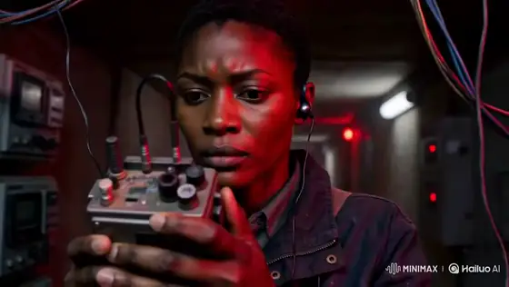

# MiniMax H3 Stories & Films prompts

[Back to all 300 prompts](../../README.md)

## 1. Radio operator evacuation bridge

<strong>Prompt</strong> — FORMAT 15 seconds | 16:9 | photoreal live-action war thriller Fictional Sahelian city at blue-hour dawn. Urgent, human, suspenseful, non-graphic. REFERENCE CONTROL Image 1 =...

~~~~text
FORMAT
15 seconds | 16:9 | photoreal live-action war thriller
Fictional Sahelian city at blue-hour dawn.
Urgent, human, suspenseful, non-graphic.

REFERENCE CONTROL
Image 1 = locked AMINA identity and wardrobe.
Preserve face, close-cropped hair, deep-brown skin, navy field jacket, silver earpiece, canvas satchel, analogue radio, boots and determined expression.

Image 2 = locked environment.
Preserve concrete bridge, dry riverbed, dense low-rise city, rooftop antennae, dusty atmosphere, cool-blue shadows and restrained amber dawn.

No real countries, flags, organizations or landmarks.

STORY
Amina is the last radio operator keeping an evacuation bridge open. Communications fail during a distant attack. She must activate the backup relay and transmit clearance before automatic controls close the bridge.

00–02s — CHANNEL OFFLINE
Extreme close-up inside a dark concrete communications room.

Amina grips the analogue radio as red emergency lights pulse. Dust trembles, cables quiver, broken static fills the room.

Automated voice:
“Emergency channel offline.”

She looks up and immediately moves.

02–04s — BRIDGE CLOSING
Wide aerial-oblique rooftop view.

Civilians cross the bridge through windblown dust.

Checkpoint signal flickers green → red as shutdown begins.

A distant shockwave moves through city haze. No visible casualties.

04–06.5s — RUN
Low handheld tracking behind Amina running through a damaged service corridor.

Emergency lights flash, dust falls, cables briefly spark, boots hit wet concrete.

She pushes through a heavy metal door into blowing dust.

06.5–09s — FLASHBACK
Two minutes earlier.

Medium side-profile on rooftop.

Amina sees the unstable bridge signal, manually rotates the antenna and connects her radio to backup power.

Slow camera push. Wind moves her satchel strap as first amber sunlight reaches her jacket.

09–12.5s — TRANSMISSION
Rapid cross-cut montage:

frequency dial locks →
antenna aligns →
bridge cables vibrate →
red signal flashes →
Amina speaks into radio:

“Channel Seven, keep the bridge open.”

Overhead shot: civilians continue crossing.

Sharp hard cuts, brief black frames, natural motion blur.

12.5–15s — SIGNAL RESTORED
Sound suddenly drops.

Amina listens on the rooftop.

Clear radio tone.

Checkpoint signal changes red → steady green.

Evacuation continues.

Amina exhales and watches the bridge as dawn reaches the city.

Slow push toward her face.
Cut to black.

CAMERA
Large-format live-action realism.
Precise nonlinear cross-cutting.
Handheld tracking, aerial-oblique coverage, restrained push-ins and close details.
Natural motion blur, fine film grain, subtle gate weave.
No impossible camera movement.

ENVIRONMENT + PHYSICS
Cool-blue shadows against muted amber sunrise.
Deep blacks, dusty atmosphere, weathered concrete.

Wind realistically affects dust, clothing, cables and antenna equipment.
All movement and interactions remain physically believable.

AUDIO
Stereo radio static, electrical hum, wind, boots, antenna creaks, distant low artillery and helicopter rotors.

Restrained suspenseful sub-bass builds through the montage.

VISUAL
Photoreal cinematic war-thriller footage.
Immense scale contrasted with one determined operator.
Grounded, tense and human.

No subtitles, text, logos, watermarks, political messaging, flags or military insignia.

CONTINUITY
Same Amina identity, wardrobe, radio and satchel throughout.
Same bridge, city, atmosphere and dawn lighting.
Maintain geographic and temporal continuity across all shots.
~~~~

**Source:** [@Diplomeme](https://x.com/Diplomeme/status/2082770042630943156) · 15s · 16:9 · cinematic story

---

## 2. Greenhouse tea isekai anime

<strong>Prompt</strong> — 高品質アニメ映像。...

~~~~text
高品質アニメ映像。

作品トーンと世界観は、透明感のある夏のガラス温室から、紅茶の渦の内側に存在するオリジナルの小さな不思議の国へ連続する、上品で夢幻的な叙情ファンタジー。澄んだ白、水色、琥珀色、淡い金色を主役にし、怖さや混沌ではなく、好奇心、浮遊感、静かな高揚を描く。今回は1枚のソース参照画像image1のみを使用し、image1をキャラクター、衣装、2D手描き画風、配色、現実側のガラス温室背景の唯一の参照として扱う。

【同一人物固定】
image1と完全に同じ一人の少女を全編で維持する。小さく繊細な同じ顔立ち、大きな青緑色の宝石のような瞳、同じ目の形、多層の虹彩と白いキャッチライト、淡い頬、細いまつ毛、真珠のような白銀髪、柔らかな長いウェーブ、編み込みを含むまとめ髪、淡い金色のリボン、青い雫形の髪飾りを固定する。表情変化でも目、眉、まぶた、口、視線の順を守る。白い長袖のハイネックドレス、淡い水色の刺繍と縁取り、淡い金色の腰リボン、華奢で上品な体格、白・水色・淡い金色の人物固有配色を変えない。現実の温室と不思議の国に同時に複数の少女を存在させず、光学トランジションの前後で同じ一人の少女として連続させる。変えてよいのは表情、視線、呼吸、歩行、手の動き、髪と袖とスカート裾の自然な揺れだけ。別人化、顔の平均化、衣装変更、装飾欠落、分身、余分な人物、既存作品を想起させる有名キャラクターを出さない。
【2D hand-drawn／2D手描き画風固定】
image1の細く淡い青灰色と暖灰色の線、透明感のある二層以上の色影、柔らかなグラデーション、白・ミルキーブルー・澄んだ空色・琥珀色・淡い金色の明るい配色を全編で維持する。白銀髪の真珠質ハイライト、瞳の多層反射、肌の淡い発光感、ドレスの皺と刺繍、花、葉、ガラス、白い家具、床タイル、紅茶まで高密度の手描き筆致で描く。布は柔らかく、ガラスは透明で硬質、紅茶は澄んだ琥珀色、異世界の道と建築は半透明の白いガラス質として素材を描き分ける。太い輪郭にしない。簡略TVアニメにしない。平坦な単層セル影にしない。低密度背景にしない。滑らかなCG・3Dにしない。半写実にしない。実写にしない。くすんだ色や画風混合にしない。

【舞台と小物固定】
現実側はimage1と同じ明るいガラス温室。白い窓枠と屋根骨格、青空と白い雲、外の緑と白い花、白い丸テーブル、白い金属椅子、淡い青灰色の床タイルを維持する。開始時はimage1の少女の顔、目、髪、衣装、温室背景、白・水色・淡い金色の配色、明るさ、柔らかなコントラストを維持し、追加される小物はティーポットだけ。小物の所有者はimage1の少女一人だけ。透明なガラスのティーポット一つ、透明なティーカップ一つ、透明なソーサー一つだけを使う。開始状態ではティーカップはソーサー中央に置かれ、底に浅い琥珀色の紅茶が入っている。少女は右手でティーポットの取っ手を持ち、左手はソーサーの横へ軽く添える。ティーポット、カップ、ソーサーを増殖、交換、変形させない。不思議の国ではこれらを人物や巨大な小道具として複製しない。
少女の表情は、目→眉→まぶた→口→視線の順に変化させる。まず左右の目の中にある小さなキャッチライトがわずかに明るくなり、次に眉が少し上がり、その後まぶたが柔らかく開き、口元に小さな驚きと微笑みが生まれ、最後に視線が渦の中心へ下がる。反射線、窓枠、光点を顔中央へ重ねず、顔と両目を常に明瞭に保つ。

最初のカメラ高は白い丸テーブルと同じ低い位置。少女の斜め前から、手前にティーカップとソーサーを大きく、奥に少女の胸上と顔を明瞭に置く。背景消失軸は床タイルと右側の窓枠が温室奥へ斜めに伸びる方向へ揃える。この構図の目的は、少女、ポット先端、カップ中央の着水点を最初の一画で同時に読ませること。
少女が右手首だけをゆっくり傾けると、ティーポットの先端から一筋だけの琥珀色の紅茶がカップ中央へ落ちる。ポット先端、液体の筋、着水点を一画で読み取れるようにし、紅茶はテーブル外へこぼれない。この着水点を変化の起点とする。着水点から一つの時計回りの渦が生まれ、青空の反射と淡い金色の日差しを巻き込みながら、琥珀、青、白の三色の螺旋へ育つ。

カメラはテーブルと同じ低い位置からカップの斜め上へ滑らかに上がり、人物サイズを胸上の中景から背景の顔が読める近景へ保ったまま、紅茶面へ近づく。背景消失軸は温室奥から円形のカップ中央へ収束させる。この移動の目的は、現実の着水点を異世界への案内線へ変えること。

螺旋の半分がまだ琥珀色の紅茶、もう半分が細い光の道になっている形成中の中間状態を短く明瞭に見せる。続いて螺旋が画面全体を満たした瞬間、その同じ回転方向、曲率、色の並びを保ったまま、一本の光の道へ完成する。暗転、瞬間移動、破裂、液体の中を溺れる表現にせず、紅茶面から異世界の俯瞰へ連続する光学的な形状一致として接続する。

変化後の完成状態である不思議の国は、傾いた白いガラスの庭道、空中でゆっくり反転する白い花壇、輪のように連なる温室アーチ、上下が穏やかに入れ替わる空色の庭で構成する。文字盤、数字、看板、動物、人型住民は出さない。

カメラ高は少女の胸より少し低い位置へ移り、同じ少女の斜め前を後退しながら、胸から膝までの中景で追従する。背景消失軸は琥珀と青の光の道が円形アーチの奥へ伸びる方向へ揃える。この移動の目的は、紅茶の渦だった曲線が少女を導く冒険路へ変わったことを読ませること。

少女は光の道に沿って軽やかに三歩進み、第一歩で傾いた庭道へ乗り、第二歩で浮かぶ白い床片を渡り、第三歩で円形のガラスアーチをくぐる。各足裏を順に接地させ、髪、袖、スカート裾は歩みより少し遅れて同じ風向きへ揺れる。滑走、飛行、急回転に見せない。

少女がアーチをくぐると、周囲の白い花が外側から順に淡い水色へ染まり、頭上のガラス骨格がゆっくり四分の一回転して上下の庭をつなぐ。少女自身は直立を保ち、重力方向を急変させない。

カメラは胸より少し低い位置を保って少女の肩越しへ短く回り込み、人物サイズを胸上に寄せる。背景消失軸は前方の光の道が作る一つの円へ収束させる。この移動の目的は、少女の冒険の先に帰還路が生まれることを示すこと。光の道は再び一つの時計回りの螺旋となり、その円周が現実のティーカップの縁と同じ形、大きさ、角度へ整列する。

カメラは螺旋の中心を通り、琥珀色の紅茶面の極近景から現実の温室へ滑らかに引く。カメラ高はテーブルと同じ低い位置へ戻り、人物サイズを奥の胸上へ戻す。背景消失軸は円形のカップ中央から床タイルと窓枠が温室奥へ伸びる開始方向へ戻す。この移動の目的は、異世界の冒険を一杯の紅茶の中へ回収し、少女の感情へ報酬を返すこと。同じ少女が帰還した連続性を保つ。

終端では少女が右手のティーポットを垂直へ戻し、紅茶の筋をきれいに止め、ティーポットを胸より低い高さで保持する。左手はソーサー横に添えたまま。カップ内の最後の渦がゆっくり縮み、中心に青と淡い金の小さな反射一つだけを残して静止する。

カメラはテーブル高さの斜め前で、手前の静かな紅茶面、奥の少女の三分の四顔と穏やかな微笑みを同時に読ませる。紅茶面の反射が完全に止まり、少女の両目、ティーポット、カップ、渦の名残が一画で明瞭になった瞬間に切る。

液体を黒く濁らせない。渦を黒い穴、荒れた水面、別形状の物体へ変えない。顔を歪ませない。手指を増やさない。余分な人物や余分な食器を出さない。ストロボ、激しい明滅、強い水平フレア、白飛びなし。文字、字幕、ロゴ、透かしなし。BGMなし、音楽なし、環境音なし、フォーリーなし、音響生成なし。
~~~~

**Source:** [@haruuraeadss](https://x.com/haruuraeadss/status/2082798959014064531) · 15s · 16:9 · anime

---

## 3. Human Cakes MiniMax h3 local

<strong>Prompt</strong> — Shaky handheld smartphone footage, pure first-person view, bright clear Manhattan street under shiny midday sun.The camera jerks, sways and shakes heavily like a real phone held...

~~~~text
Shaky handheld smartphone footage, pure first-person view, bright clear Manhattan street under shiny midday sun.The camera jerks, sways and shakes heavily like a real phone held by someone walking backward in panic. Sharp sunlight, hard shadows, clean blue sky above brick buildings and dry asphalt. Strong natural motion blur and smartphone digital noise.
Continuous 20-second sequence (new subject + vehicle every 5 seconds):
[0s–5s] Operator walks backward from a white man in a black agent suit and sunglasses. The operator’s hand silently points urgently behind the man. The man turns his head, eyes widening in shock as he sees a bright red sports car drifting sideways at high speed toward him. The car slides in at an angle with screeching tires and physically slams into his body first — the impact throws him hard against the hood. Only after the physical hit does his body dissipate into a chaotic spray of tiny randomized fragments — almost pure thick cream mixed with very small irregular cake crumbs, no large pieces. The intricate cream explosion splatters in all directions, coating the red hood, windshield and street in messy streaks and droplets. The suit is ripped off by the force and either sticks to the car or drops to the ground. Cream heavily sprays across the lens.
[5s–10s] Camera keeps shaking and moving back. A Black woman in a business blazer. Operator silently points hard behind her. She turns, face reacting with sudden fear as a dark blue SUV drifts sharply toward her. The SUV locks brakes mid-drift and physically smashes into her body first. Immediately after the impact her body dissipates into an intricate burst of tiny randomized particles — mostly thick chocolate cream with only minuscule dark cake crumbs. The fine cream spray coats the blue SUV surface and asphalt in dense, chaotic patterns. The blazer and skirt are torn away, parts sticking to the vehicle mixed with cream, the rest dropping naturally. Chocolate cream heavily splatters the lens.
[10s–15s] Operator still walking backward, phone shaking. An Asian man in a hoodie. Operator silently points behind him. The man turns and freezes in panic seeing a white delivery van sliding into a wide drift. The van physically crashes into his body first. Right after the hit he dissipates into a highly randomized spray of tiny fragments — almost entirely cream with very small scattered sponge and fruit particles. The intricate cream explosion covers the van and pavement in messy droplets and streaks. The hoodie and jeans are stripped off, some cloth remaining on the van mixed with cream, the rest falling with natural physics. Cream hits the lens hard.
[15s–20s] Camera continues with heavy smartphone shake. A Latina woman in a trench coat. Operator silently points urgently behind her. She spins around, eyes wide in terror as a black pickup truck performs a long cinematic drift straight at her. The truck physically hits her body first. Only then does her body dissipate into a fine, chaotic spray of tiny randomized particles — mostly thick caramel cream with only minute golden crumbs. The intricate cream blast coats the truck hood, grille and ground in dense, irregular patterns. The trench coat is ripped off, sections sticking to the truck with cream, the rest falling realistically. Cream and tiny fragments cascade over the vehicle and street, heavily streaking the lens.
Throughout: constant heavy smartphone-style camera shake and jitter, natural motion blur, dense cream sprays and tiny randomized particles hitting the lens, realistic cloth physics, cinematic vehicle drifts, clear physical body impact first followed by dissipation into almost pure cream with only very small irregular cake crumbs (never large pieces or whole shapes), photorealistic, bright clear daylight, raw live smartphone footage look. No text, no logos, no stabilisation.
~~~~

**Source:** [@sadlemonjuice](https://x.com/sadlemonjuice/status/2087131708223046088) · 15s · 43:24 · cinematic story

---

## 4. 動画プロンプトはリプ欄に

<strong>Prompt</strong> — タイトル：ENDLESS STEP / 終わらない階段 尺：15秒 ジャンル：現代アート / Op Art / Surrealism 画面：16:9 カラー：白黒モノクロ中心 BGM：なし コンセプト：「進み続けているのに、どこにも辿り着いていない」...

~~~~text
タイトル：ENDLESS STEP / 終わらない階段 尺：15秒 ジャンル：現代アート / Op Art / Surrealism 画面：16:9 カラー：白黒モノクロ中心 BGM：なし コンセプト：「進み続けているのに、どこにも辿り着いていない」 演出方針：前半は空間の異常、中盤は物理法則の崩壊、後半は人間と空間そのものの境界を崩す。ネオン・派手なグリッチ・大量の粒子は禁止。幾何学、錯視、建築、人体の融合だけで見せる。 CUT1｜0.0–1.8秒 Visuals｜何も存在しない真っ白な巨大空間。中央に一本だけ細長い黒い階段が奥へ伸びている。黒いミニマルな衣装の主人公が背中を向け、ゆっくり階段を上る。階段の表面だけが細い白黒ストライプになっている。最初は完全に静かな世界。 Camera｜24mm / F4。床ギリギリのローアングル。主人公を中央固定した完全シンメトリー構図。ゆっくり前方へドリーイン。 Motion｜主人公の歩行のみ。1歩につき約0.7秒。最後の0.5秒から階段表面のストライプがごく僅かに波打つ。 Lighting｜巨大な白いソフトボックスで空間全体を均一照明。人物と階段の下だけにシャープな黒い影。 VFX｜非常に弱い水平波状ディストーション。まだ異常だと断定できない程度。 SFX｜乾いた靴音「コツ、コツ」。極低音のルームトーン。 Emotion｜静寂。整いすぎていることへの違和感。 Transition｜足が次の段へ触れた瞬間にCUT2。 CUT2｜1.8–3.3秒 Visuals｜足元の極端なクローズアップ。靴底が階段へ触れるたび、白黒ストライプが水面のように沈み込み、波紋となって階段全体へ広がる。階段自体は固体なのに、模様だけが液体のように反応する。 Camera｜70mm / F2.8。階段より少し低い位置から足を追うローアングルトラッキング。 Motion｜足が接触 → 模様が沈む → 円状波紋が広がる → 次の一歩。足の動きはリアル、模様だけ非現実。 Lighting｜白背景を飛ばし気味にし、靴とストライプの黒を強調。 VFX｜Optical ripple、局所的なストライプ変形、軽いレンズ屈折。 SFX｜足音の直後に低い「ブゥン」という短い共鳴音。 Emotion｜世界が人物の存在に反応し始める。 Transition｜波紋が画面いっぱいへ広がりCUT3。 CUT3｜3.3–5.0秒 Visuals｜主人公の横顔ミディアム。背後の真っ白な壁に、横方向へ伸びる黒い階段がいつの間にか存在している。その階段を、もう一人の人物が壁面に対して垂直に歩いている。さらに天井には逆さになった人物が歩く。主人公本人はまだ気づいていない。 Camera｜50mm / F2.8。主人公の横顔にフォーカス。約0.7秒後、背景の異常な階段へラックフォーカス。 Motion｜主人公、壁の人物、天井の人物は全員まったく同じ歩行周期。ただし方向だけ異なる。 Lighting｜全人物へ同じ方向から光が当たっている。重力方向と影の方向が一致しない。 VFX｜Impossible perspective、非ユークリッド建築、重力不一致。 SFX｜正面の足音に、左・上方向から別の足音が薄く加わる。 Emotion｜「何かがおかしい」が明確になる瞬間。 Transition｜主人公が次の一段へ足を置く瞬間、低音と同時にCUT4。 CUT4｜5.0–6.7秒 Visuals｜足が一段に着地した瞬間、巨大空間全体が突然90°回転する。床が右側の壁へ変わり、天井だった面が床になる。しかし主人公は何事もなかったかのように同じ階段を上り続ける。階段の白黒ストライプが一気に巨大な同心円へ変形。 Camera｜18mm / F5.6。主人公正面寄りの超広角。空間回転と完全同期してカメラも90°ロール。その後、主人公だけ水平に見える角度で固定。 Motion｜空間：高速90°回転。主人公：速度一定。同心円：主人公から外側へ膨張。 Lighting｜回転開始時に0.1秒だけ光量低下。回転後は光源方向だけ元の位置を維持し、不自然な影を作る。 VFX｜90° spatial rotation、同心円ディストーション、短いモーションブラー、パース破綻。 SFX｜重い「ゴォン」＋低周波スイープ。 Emotion｜重力のルールが完全に壊れる。 Transition｜同心円の中心へカメラが吸い込まれCUT5。 CUT5｜6.7–8.5秒 Visuals｜超広角全景。上下左右、斜め、天井、壁へ無数の階段が伸びる巨大な不可能建築。人物は複数存在するが大量には増やさず、5〜7人程度。それぞれ異なる重力方向で歩いている。階段同士は交差しているように見えるが、実際には接続していない。中央の主人公だけが正常方向にいる。 Camera｜14mm / F5.6。空間中央を中心に高速オービット約100°。少しだけロールを加える。 Motion｜階段は静止。人物は一定速度で歩行。背景のストライプのみ逆方向へゆっくり移動。 Lighting｜完全モノクロ。白背景、黒い階段。影だけが異なる方向へ伸び、現実感を壊す。 VFX｜Non-Euclidean architecture、forced perspective、figure-ground ambiguity。 SFX｜異なる方向から足音が重なり、リズムが少しずつズレる。 Emotion｜空間そのものが巨大な錯視装置になった感覚。 Transition｜オービット中、主人公の顔がフレーム中央へ入りCUT6。 CUT6｜8.5–10.2秒 Visuals｜主人公の正面クローズアップ。主人公が初めて立ち止まる。顔の右側が模様になるのではなく、頬の表面そのものがゆっくり内側へ折れ始める。皮膚が建築物の壁のように変形し、顔の内部へ何百メートルも続く小さな白黒階段が現れる。片目、鼻、口の位置は正常なまま。顔の内部だけが巨大空間になっている。 Camera｜85mm / F2。顔正面。0.8秒かけてゆっくりドリーイン。最後の0.4秒で顔内部の階段へ急速接近。 Motion｜主人公は完全静止。まばたき一回。顔表面が紙を内側へ折るように段階的に陥没。内部階段の小さな人物だけが歩き続ける。 Lighting｜顔中央に柔らかい正面光。顔内部の空間はCUT1と同じ白い美術館照明。 VFX｜Face-to-architecture morph、recursive geometry、skin folding、深度拡張。顔への単純な模様貼り付けは禁止。 SFX｜周囲の足音が突然消える。顔が開く瞬間に紙を折るような乾いた音＋低い吸引音。 Emotion｜人体と建築の境界が崩れる。 Transition｜カメラが顔内部の階段へ完全に突入してCUT7。 CUT7｜10.2–12.5秒 Visuals｜顔内部の階段を歩く小さな主人公を追う。カメラが180°回転すると、これまで階段だと思っていた巨大な構造が、実は横向きになった人間の顔の輪郭だったと判明する。鼻梁が階段、唇の輪郭が通路、眼窩が巨大な円形空間になっている。さらにもう一度角度が変わると、再びただの階段に見える。「顔」と「建築」が視点によって交互に切り替わる。 Camera｜18mm / F4。人物後方から高速プッシュイン → 180°カメラロール → 一瞬静止 → ゆっくりドリーアウト。 Motion｜小さな主人公は歩行継続。巨大構造は動かさず、カメラ角度だけで顔と階段の認識が反転する。 Lighting｜均一な白黒照明。輪郭にだけ薄いサイドライトを入れ、顔として認識できるギリギリまで強調。 VFX｜Figure-ground reversal、anamorphic perspective、face/architecture ambiguity。モーフではなく「見る角度で意味が変わる」錯視を優先。 SFX｜短い逆再生音。顔として見えた瞬間だけ人間の呼吸音が一度入る。 Emotion｜「見えているものが何なのか分からない」状態。 Transition｜階段の最上部にある巨大な黒い円へ主人公が近づきCUT8。 CUT8｜12.5–15.0秒 Visuals｜主人公が階段の頂上へ到達。正面には巨大な完全な黒い円。その向こうは見えない。主人公が黒い円へ足を踏み入れる。瞬間、カメラが真上へ高速ドリーアウト。巨大な階段構造全体が一度ねじれ、メビウスの輪のようにつながっていることが判明。さらに引くと、先ほどの黒い円は実はCUT1で主人公が最初に踏み出した「階段の一段目」の黒い面だったことが分かる。構図がCUT1と完全一致。主人公が再び最初の一歩を踏み出す。 Camera｜35mmから開始。黒い円への短いプッシュイン → 真上視点へ急上昇 → 14mm相当の超ワイド → CUT1と同じ24mmローアングル構図へシームレス変形。 Motion｜階段全体がゆっくり180°ねじれてメビウス構造になる。主人公は止まらず歩き続ける。最後の0.5秒はCUT1と完全同一の動き。 Lighting｜最後まで完全モノクロ。白と黒のみ。ループ直前に一瞬だけ白黒を反転し、すぐ元へ戻す。 VFX｜Möbius topology transformation、recursive space、black-white inversion、seamless loop。 SFX｜黒い円へ入る直前に音が完全停止。CUT1の構図へ戻った瞬間、最初と同じ「コツ」という一歩目の足音。 Emotion｜「15秒間進んでいたのに、実は最初の一歩から抜け出せていなかった」。 END｜暗転なし。文字なし。ロゴなし。CUT1へ完全に戻るシームレスループ。 最重要生成ルール｜  1. 主役は常に同一人物。同じ黒い衣装・髪型・体格を固定。 2. 世界は白・黒のみ。サイバーパンク、未来都市、ネオンは禁止。 3. 階段の形状と白黒ストライプを全CUTで共通モチーフとして維持。 4. CUT6は「顔に模様を貼る」のではなく「顔内部が巨大建築空間になる」。 5. CUT7は単純な顔モーフではなく、視点によって顔と階段の認識が反転する錯視。 6. CUT8は必ずCUT1へ物理的につながるメビウス構造にする。 7. グリッチは使わない。AIらしい溶け・崩れ・余計な手足・余計な人物生成を避ける。 8. オプ・アートらしい幾何学的精度、直線、反復、同心円、白黒コントラストを優先する。
~~~~

**Source:** [@su_nagomi](https://x.com/su_nagomi/status/2086943242713813383) · 15s · 7:4 · cinematic story

---

## 5. Audioリファレンスでエラーが出る場合は、表示上15秒でも小数点以下でわずかに超えていることがあるので、実際の尺をチェックしてみてください！

<strong>Prompt</strong> — プロンプトです。Neon仕様になってるのでGPTなどで参照キャラクターに調整して使ってみてください😆 ------------------------------------------------------- @[face ref] をNEONの顔、ピンクのボブヘア、黒い丸眼鏡の厳密な参照として使用します。 @[body ref]...

~~~~text
プロンプトです。Neon仕様になってるのでGPTなどで参照キャラクターに調整して使ってみてください😆
-------------------------------------------------------
@[face ref] をNEONの顔、ピンクのボブヘア、黒い丸眼鏡の厳密な参照として使用します。
@[body ref] をNEONの体格、黒と赤のサイバーパンク衣装、装備、ブーツの厳密な参照として使用します。
@[audio ref] は映像のリズム、カットの強弱、主要な音楽アクセントの参照として使用します。

15秒のハイエンドなサイバーパンク・キャラクター紹介映像。
主役はNEONただ一人。
クールで知的、危険な雰囲気。動作は自信に満ち、抑制されている。

構成：

0–3秒：IDENTITY REVEAL
暗いネオン照明の空間。
ブーツ、赤いジャケットのディテール、眼鏡越しの目元を短いバーストカットで見せる。
最後に顔のクローズアップ。
カットを@[audio ref] の最初の強いアクセントに合わせる。

3–6秒：NEON ALLEY
雨に濡れた未来都市の路地。
NEONがゆっくりカメラ方向へ歩く。
ローアングル、横方向のトラッキング、濡れた路面に映る赤いネオン。
人物の動きよりもカメラワークを強調。

6–9秒：TECH UNDERGROUND
赤い警告灯が点滅する地下施設。
肩越しのショット、手袋と装備のクローズアップ、短いオービットショット。
NEONは静かに周囲を観察する。

9–12秒：MEGACITY ROOFTOP
巨大な未来都市を見下ろす夜の屋上。
風でピンクの髪とジャケットがわずかに揺れる。
ワイドショットからローアングルのヒーローフレームへ切り替える。

12–15秒：FINAL HERO REVEAL
赤とマゼンタの逆光。
カメラがNEONの周囲を短く回り込み、正面のミディアムクローズアップで止まる。
NEONが眼鏡越しにカメラを見る。
最後の音楽アクセントで力強い静止ヒーローフレーム。

編集：
合計12〜15ショット。
主要カットを@[audio ref] の強拍に合わせる。
環境変更は音楽フレーズの変化に合わせる。
細かい半拍すべてにカットを入れず、強いアクセントを優先する。

一貫性：
同じ顔、同じ髪型、同じ眼鏡、同じ体格、同じ衣装を全編で維持。
衣装の黒・赤・ゴールドの配色と装備位置を維持。
キャラクターは常に一人だけ。

禁止：
複数のNEON、分身、衣装変更、髪型変更、眼鏡の消失、
顔や身体のモーフィング、過剰なアクション、文字、ロゴ、字幕、UI、
キャラクターシート風レイアウト、分割画面、白背景。
~~~~

**Source:** [@Nokosu_kansoku](https://x.com/Nokosu_kansoku/status/2086700416654594554) · 15s · 7:4 · cinematic travel

---

## 6. It came out pretty good

<strong>Prompt</strong> — cinematic 15-second ultra-realistic sequence inside a luxurious modern boardroom during daytime. Soft natural light enters through large glass windows. Four powerful...

~~~~text
cinematic 15-second ultra-realistic sequence inside a luxurious modern boardroom during daytime. Soft natural light enters through large glass windows. Four powerful industrialists in expensive tailored suits sit around a long polished dark wooden table. The atmosphere is tense and high-stakes.

The senior industrialist at the head of the table leans forward slightly and says firmly:
“This acquisition will change the entire market. Either we move now, or someone else will.”

Another industrialist across the table adjusts his cufflinks and replies calmly:
“Moving now is risky. The numbers still don’t support a full takeover.”A third industrialist places both hands on the table and speaks with intensity:
“Risk is the price of control.

The investors are already waiting for our decision.”The camera slowly pushes in as the most powerful industrialist leans back, looks at everyone, and delivers the final line with quiet authority:
“Then we take it. No more delays.”

Cinematic lighting, sharp details on suits and the wooden table, subtle tension in their faces, realistic skin textures, high-end corporate atmosphere, shallow depth of field, filmic look.
~~~~

**Source:** [@adithatipalli](https://x.com/adithatipalli/status/2086698076325253323) · 15s · 16:9 · cinematic story

---

## 7. Cinematic Travel Study 474111

<strong>Prompt</strong> — &lt;image 1&gt;: starting frame integrated_multimodal_description: cinematic acting-audition performance. One woman, Chris, remains the only visible person throughout the entire video....

~~~~text
<image 1>: starting frame

integrated_multimodal_description:

cinematic acting-audition performance. One woman, Chris, remains the only visible person throughout the entire video. Maintain the same face, hair, clothing, age, and identity for the full shot.

[0-4s] Medium close-up framing from the chest up. Chris stands tall facing directly toward the camera, holding a script page naturally in one hand. The camera remains steady and close enough to preserve clear facial detail. Her expression is composed and quietly confident. She looks directly into the camera and introduces herself in her normal speaking voice.

(S1, Chris): <d>[English] My name is Chris, and I am reading for the part of Lady Ash.</d>

[4-6s] After finishing the introduction, Chris naturally lowers her eyes from the camera to the script page in her hand. Her confident audition demeanor begins to disappear. Her shoulders relax slightly, her expression softens, and she takes a small breath as she emotionally enters the character.

[6-18s] Keep the camera in a close medium-close-up emphasizing her face and eyes. Chris reads from the page in a soft, sorrowful, extremely sad voice, as though Lady Ash is desperately pleading with someone she loves. Her performance is restrained and believable rather than theatrical. Her voice becomes increasingly fragile as the line continues.

(S1, Chris): <d>[English] Please, Peter... please don't let this be our last night together. Don't go back to her. You know this is where you belong... with me... forever...</d>

During the emotional reading, moisture gradually gathers in her eyes. Near the end of the line, a single tear forms naturally and slowly travels down one cheek. She does not wipe it away. Her eyes remain lowered toward the script.

[18-20s] On the word “forever,” Chris lets the final word linger softly. She becomes completely still, remaining emotionally devastated and looking down at the page. Hold on her tear-streaked face for a brief silent beat. The image then slowly fades completely to black.

overall_soundscape:

Clean indoor room tone appropriate for a quiet acting audition. Chris's voice is intimate, clear, and close. Very subtle sound of the script page moving in her hand. No other voices, no audience reaction, no distracting environmental sounds.

non_diegetic_music:

None. No music.
~~~~

**Source:** [@EndFolding79421](https://x.com/EndFolding79421/status/2086607000507474111) · 20s · 43:24 · cinematic travel

---

## 8. Cinematic Story Study 170082

<strong>Prompt</strong> — integrated_multimodal_description Shot 1 A realistic suburban kitchen at night. A man casually walks to the refrigerator and opens the door. The camera starts just behind his...

~~~~text
integrated_multimodal_description

Shot 1 A realistic suburban kitchen at night. A man casually walks to the refrigerator and opens the door. The camera starts just behind his shoulder and slowly pushes closer as bright refrigerator light illuminates his confused face.
Inside the refrigerator is an incredibly detailed miniature highway network integrated naturally between the food. Several lanes of tiny moving cars weave between milk cartons, jars, leftovers, vegetables, and drink bottles. Tiny headlights and brake lights glow realistically.
The camera moves closer into the refrigerator interior as if entering this tiny world.

A miniature traffic jam forms beside a tipped container leaking orange juice across one lane like a flooded roadway. Tiny construction vehicles arrive. Small workers in reflective clothing place cones and redirect traffic around the spill.

A tiny tow truck pulls a stalled car away. Another vehicle honks impatiently. Cars merge aggressively around a yogurt container.

The man slowly reaches one hand toward the highway. Several tiny cars immediately slam on their brakes. A miniature police officer begins angrily waving at his enormous finger to move away.

The man freezes, completely baffled.

The camera finishes extremely close to the refrigerator highway as traffic starts moving again around his stationary finger.

overall_soundscape

Quiet kitchen ambience, refrigerator hum, refrigerator door opening, tiny engines, miniature car horns, distant tiny sirens, construction equipment, subtle liquid splashing from the orange juice spill.

non_diegetic_music

None.
~~~~

**Source:** [@LikeToasters](https://x.com/LikeToasters/status/2086603936736170082) · 10s · 23:31 · cinematic story

---

## 9. Cinematic Story Study 241802

<strong>Prompt</strong> — Use @[char ref] as the strict character reference and @[audio ref] as the timing, rhythm and editing reference. Keep the character’s exact identity, proportions, hairstyle,...

~~~~text
Use @[char ref] as the strict character reference and @[audio ref] as the timing, rhythm and editing reference.

Keep the character’s exact identity, proportions, hairstyle, outfit, colors and overall style consistent throughout.

Create a 15-second cinematic burst-cut video showcasing the character across 5 different environments that naturally fit their design, vibe and world.

AUDIO SYNC
Synchronize the entire edit to @[audio ref]. Cuts, camera accents, transitions and environment changes should land precisely on strong beats, half-beats and musical accents. Let audio1 control the pacing and intensity of the montage.

STRUCTURE
- 5 environments total
- 3 seconds per environment
- 6 burst-cut shots per environment
- 30 shots total

Each environment must be clearly different in atmosphere, lighting, scale and visual language.

Show each environment through rapid cinematic angles: wide establishing shots, aerials, low angles, side views, tracking shots, close environmental details, medium shots and hero frames.

Every cut must reveal a new angle, distance, composition or spatial relationship. Avoid repeated framing. Mix static shots, push-ins, pull-backs, tracking, orbit and crane-like movement.

Keep character movement subtle and natural. The focus is environmental variety, cinematic framing and tight synchronization with audio1.

Hard constraints:
- exactly 5 environments
- exactly 6 shots per environment
- exactly 30 shots total
- environment changes must follow audio1’s musical phrasing
- cuts and motion accents synchronized to audio1
- no outfit changes
- no character duplication
- no morphing
- no text or UI
- no blurry unreadable frames
- maintain strict character consistency
~~~~

**Source:** [@aimikoda](https://x.com/aimikoda/status/2086553240448241802) · 15s · 8:9 · cinematic story

---

## 10. The last thing you see in your first and last

<strong>Prompt</strong> — amateur handheld pov footage of a tourist in their plush and comfortable room of a space cruise, carpeted floor and comfy bed, large window shows a view of Gargantua blackhole,...

~~~~text
amateur handheld pov footage of a tourist in their plush and comfortable room of a space cruise, carpeted floor and comfy bed, large window shows a view of Gargantua blackhole, you can see their reflection in the window, they turn off the light half way through so we can see outside better and say: "Wow look at that!", then they show back the room
~~~~

**Source:** [@ivanfioravanti](https://x.com/ivanfioravanti/status/2086553101029290296) · 10s · 16:9 · cinematic travel

---

## 11. The Downhill Slingshot 🏎️💨

<strong>Prompt</strong> — Cinematic Anime Video Scene Generate a 15-second horizontal 16:9 original high-speed hover-bike racing anime video from the provided first frame. CRITICAL ENTITY LOCK: There must...

~~~~text
Cinematic Anime Video Scene

Generate a 15-second horizontal 16:9 original high-speed hover-bike racing anime video from the provided first frame.

CRITICAL ENTITY LOCK:
There must be exactly 2 racers and 2 bikes in the entire video: RENJI on VALKYRIE-01 (cyan/black drift bike) and ELENA on AERO-X (crimson/white draft bike).
Do not add extra racers, drone support vehicles, spectators, or traffic.
Maintain total visual consistency for both bikes, helmet visors, suit patterns, repulsor spark colors, and bike liveries throughout the sequence.

Entity identity:
VALKYRIE-01: Matte-black and cyan angular hover-bike, exposed repulsor pads, lateral drift brakes, blue plasma exhaust trails, ridden by Renji (cyan trim suit).
AERO-X: Pearl-white and neon-crimson aerodynamic hover-bike, enclosed canopy, crimson energy draft aura, white-hot central booster, ridden by Elena (crimson/gold visor suit).

Video style:
High-budget modern sports anime, sakuga-level velocity animation, crisp line art, vibrant neon lighting contrast, high-speed camera tracking, hyper-realistic friction and energy particle effects. Set on a wet downhill mountain pass at dawn.

Camera and pacing:
Continuous forward velocity, zero slow-motion interruptions:
0.0s - 3.0s: High-speed rear-tracking shot diving into the first downhill hairpin curve; instant drift initiation.
3.0s - 7.5s: Tight side-parallel tracking shot as bikes navigate rock debris and trade positions through S-curves.
7.5s - 11.5s: Close camera lock on the draft-slingshot maneuver; high-energy particle displacement as booster ignition occurs.
11.5s - 15.0s: Low-angle front-facing camera lock on the final sprint to the finish line bridge, ending on a hyper-speed photo-finish freeze.

Action timing:
0.0s - 1.5s:
Sequence begins at speed. VALKYRIE-01 leads downhill; AERO-X locks onto its rear bumper. Anti-gravity repulsors spray road water and blue sparks into the frame.

1.5s - 4.0s:
First sharp hairpin. VALKYRIE-01 deploys lateral drift airbrakes with a burst of blue thruster fire, sliding sideways at 300 km/h. AERO-X stays glued inside its slipstream aura.

4.0s - 7.0s:
Mountain debris hazard. VALKYRIE-01 hops over a boulder using a repulsor burst. AERO-X ducks under it, scraping the neon magenta guardrail in a cloud of friction sparks.

7.0s - 10.0s:
S-Curve exchange. Bikes lean side-by-side; their repulsor fields collide, creating a bright electrical shockwave. ELENA pulls the overdrive lever; AERO-X's rear fins extend.

10.0s - 13.0s:
Slingshot maneuver. AERO-X bursts out of VALKYRIE-01's draft, igniting its central white plasma booster. Both bikes roar down the final straightaway side-by-side.

13.0s - 15.0s:
Final sprint toward the finish light gate. Water sprays violently behind them. Both nose cones cross the finish line simultaneously in a flash of light. Final freeze frame.

Motion quality:
Fluid 2D animation, extreme speed-line integration, stable bike geometry, flawless vehicle reflection rendering, zero limb or body clipping, high-frame-rate kinetic realism.

Environment:
Wet mountain pass asphalt, sheer cliff walls, neon cyan and magenta guardrail lights, early dawn sky with pink/purple clouds, water spray, floating spark particles.

Final output:
15 seconds, horizontal 16:9, original high-budget sports racing anime, exactly 2 racers, relentless kinetic pacing, dynamic cinematography, no subtitles, no watermarks, no logos.
~~~~

**Source:** [@yourPlugAI](https://x.com/yourPlugAI/status/2086528067019698388) · 15s · 16:9 · anime

---

## 12. Player stats UI

<strong>Prompt</strong> — @higgsfield @aimikoda video Prompt @[ref img] is the sole visual authority for ZENITH, his face, body, hairstyle, black tactical bodysuit, cyan circuit details, exposed cybernetic...

~~~~text
@higgsfield @aimikoda video Prompt

@[ref img] is the sole visual authority for ZENITH, his face, body, hairstyle, black tactical bodysuit, cyan circuit details, exposed cybernetic arm, and the complete operative-dossier interface including typography, numbers, icons, colors, panels, lighting, layout, and 9:16 vertical composition.

Animate this exact screen without redesigning it. Preserve every existing label, stat value, diagnostic value, icon, panel boundary, and final UI position.

[GOAL]
Create a polished 15-second futuristic cyber-operative character dossier opening. The feeling is elite black-ops intelligence software coming online and identifying an extremely dangerous enhanced operative.

Use one continuous locked straight-on full-screen composition. No camera movement, cuts, reframing, cropping, zooming, rotation, or perspective distortion.

[SEQUENCE]

0–2.2 seconds:
Begin from near-black charcoal with only extremely faint cyan interface traces visible.

A thin horizontal biometric scanner travels downward through the screen, gradually revealing ZENITH’s silhouette and the outer dossier frame.

Fine digital particles, tiny grid points, circuit traces, and subtle cyan data noise activate progressively.

ZENITH remains almost motionless in shadow.

His cybernetic arm gives one extremely subtle mechanical initialization twitch as internal joints power on.

2.2–5.5 seconds:
The OPERATIVE DOSSIER header, FILE ID: ZN-7X-00, ZENITH nameplate, CYBERNETIC OPERATIVE subtitle, PROFILE panel, portrait frame, biometric panel, and THREAT LEVEL panel resolve through precise line-draw and scanning animations.

Reveal the existing profile information exactly:
ROLE: Black Ops / Infiltration
HEIGHT: 6’2” / 188 cm
BUILD: Lean / Athletic
AFFILIATION: Unknown

The THREAT LEVEL display resolves into:
EXTREME
CLASS: OMEGA

ZENITH emerges completely from darkness into the exact referenced standing pose.

He takes one controlled breath, subtly raises his chest and shoulders, then settles.

His stern gaze sharpens toward the viewer.

Maintain his exact angular face, slick black hairstyle, lean proportions, black fitted suit, cyan circuitry, and single exposed cybernetic arm.

Thin cyan suit lines illuminate progressively from the upper torso toward the legs and cybernetic arm.

5.5–10.8 seconds:
Animate the OPERATIVE METRICS panel sequentially.

Each bar fills smoothly left-to-right and lands precisely on the existing final value:

STRENGTH — 84
AGILITY — 96
REFLEX — 98
ENDURANCE — 88
STEALTH — 97
COMBAT IQ — 93
CYBER SYNC — 94
TACTICAL EFFICIENCY — 91

Each completed value receives one restrained cyan confirmation pulse. Do not alter the final numbers.

Simultaneously, the biometric body scan draws vertically through the miniature human silhouette.

Small waveform and graph elements activate with subtle believable data movement.

The CYBERNETIC ARM DIAGNOSTICS section powers online from shoulder to fingertips.

Callout lines trace toward the mechanical joints while the existing diagnostic values resolve exactly:

MOTOR UNITS — 100%
STRENGTH OUTPUT — 132%
RESPONSE TIME — 0.008s
SENSOR SUITE — ONLINE
GRIP FORCE — 2,400 N
SYSTEM INTEGRITY — 100% / OPTIMAL

The circular SYSTEM INTEGRITY indicator completes one clean clockwise sweep and locks at 100%.

ZENITH’s mechanical fingers make one tiny natural calibration movement before returning to the exact referenced resting position.

10.8–13.3 seconds:
The SPECIALIZATIONS and EQUIPMENT LOADOUT sections activate from left to right.

Existing specialization icons receive brief controlled cyan illumination:
STEALTH INFILTRATION
CQC EXPERT
CYBERNETIC ENHANCEMENT
INTEL GATHERING

Existing equipment cards resolve cleanly:
SHADOW BLADE
EMP SHARD
SMOKE DISPERSER
DATA SPIKE

Do not physically place these weapons or tools into ZENITH’s hands. They remain UI inventory graphics only.

A subtle electronic current travels through the cyan circuitry across ZENITH’s suit and into the cybernetic arm.
~~~~

**Source:** [@adithatipalli](https://x.com/adithatipalli/status/2086477914699170293) · 15s · 9:16 · cinematic travel

---

## 13. 很多人做 AI 影片的提示词，写的是“高级、电影感、震撼”

<strong>Prompt</strong> — writing 就是解决这个问题的：把你的灵感拆成画面、动作、声音、参考素材，再按官方固定格式输出。 基础模式会产出三个具体字段： - integrated_multimodal_description - overall_soundscape - non_diegetic_music Ref2VA 模式是六段式重写，对应...

~~~~text
writing 就是解决这个问题的：把你的灵感拆成画面、动作、声音、参考素材，再按官方固定格式输出。

基础模式会产出三个具体字段：
- integrated_multimodal_description
- overall_soundscape
- non_diegetic_music

Ref2VA 模式是六段式重写，对应 T2VA、I2VA、FL2VA、L2VA、Ref2VA 五种生成模式。

许愿式提示词该退场了。
~~~~

**Source:** [@iluciddreaming](https://x.com/iluciddreaming/status/2086473853136707794) · 40s · 16:9 · cinematic story

---

## 14. Ice Cave Exploration 🏔

<strong>Prompt</strong> — EXPEDITION: Two glaciologists enter a newly formed ice cave to document its internal structure before seasonal melting changes it. EXPLORERS: Two researchers, both wearing...

~~~~text
EXPEDITION:
Two glaciologists enter a newly formed ice cave to document its internal structure before seasonal melting changes it.
EXPLORERS: Two researchers, both wearing crampons, helmets and headlamps, carrying compact measurement equipment.
SHOOT WINDOW: 7:05 AM – 7:20 AM Early morning outside. Overcast sky. Cold blue daylight enters through the cave entrance.
LOCATION: Glacial valley, massive blue ice formation, narrow cave entrance, translucent walls, frozen water flowing beneath the surface.
RECORDING STYLE: First-person expedition footage mixed with a second camera operator. Headlamps create moving pools of light across the ice. Natural breathing and footsteps remain prominent.
15-SECOND EXPLORATION:
00:00–00:03 → Researchers squeeze through the narrow entrance.
00:03–00:06 → Camera reveals deep blue translucent ice walls surrounding them.
00:06–00:09 → One researcher notices water suddenly moving beneath a transparent ice floor.
00:09–00:12 → Both carefully step backward and examine the changing surface.
00:12–00:15 → They mark the location and begin retreating toward daylight.
AUDIO: Boots scraping ice, dripping water, distant cracking, breathing, muffled voices.
REALISM DIRECTIVE: Ice must behave like real compressed glacier ice, not glass. Light scatters through the walls naturally. No fantasy formations, supernatural elements or impossible cave geometry.
~~~~

**Source:** [@Strength04_X](https://x.com/Strength04_X/status/2086471165581902327) · 15s · 7:4 · cinematic story

---

## 15. Xiamen Lacquer Thread Sculpture Craft Film

<strong>Prompt</strong> — 我的参考图片也是用AI生成的，生成3张不同状态的图片，然后将下面提示词发给H3： 【参考图规则】 @图片1 是最终漆线雕作品的唯一权威参考。 必须严格保持图片1中的作品造型、主体比例、漆面颜色、金色漆线纹样、纹样走向、器型和整体气质。 不得随意增加龙、凤、佛像、文字或不存在的装饰。 @图片2 是包装盒、包装纸、品牌标识以及产品标签的唯一权威参考。...

~~~~text
我的参考图片也是用AI生成的，生成3张不同状态的图片，然后将下面提示词发给H3：
【参考图规则】
@图片1 是最终漆线雕作品的唯一权威参考。 必须严格保持图片1中的作品造型、主体比例、漆面颜色、金色漆线纹样、纹样走向、器型和整体气质。 不得随意增加龙、凤、佛像、文字或不存在的装饰。
 @图片2 是包装盒、包装纸、品牌标识以及产品标签的唯一权威参考。 所有包装结构、颜色和标识均按照图片2执行。
@图片3 是厦门传统漆线雕工作室的环境与工匠服装参考。 保持真实闽南手工作坊质感，不做古装影视化处理，不制造虚假的“古代作坊”。

【目标】  制作一支15秒、9:16竖版的厦门漆线雕非遗工艺短片。  主题：  “一根线，走完三百年的手艺。”  影片完整呈现：  备料 → 舂打漆线土 → 搓线 → 盘线成纹 → 安金 → 贴金 → 清理完成 → 包装 → 上架  快速剪辑， 字幕驱动， 即使完全静音观看也能理解整个制作过程。  视觉采用真实高端人文纪录广告摄影：  35毫米胶片电影质感， 细腻颗粒， 浅景深， 大量微距， 自然手持， 运动非常克制， 不做旅游宣传片， 不做华丽国潮特效， 不做博物馆宣传片。  重点永远是：  手， 线， 漆， 金箔， 纹样， 时间。

【金色就是时间】  整支影片必须存在一条不可逆的视觉变化：  画面中的“金色”从无到有，并越来越多。  影片开始：  只有黑、 深褐、 砖灰、 暗红， 几乎看不到金色。  漆线开始盘绕以后， 画面出现第一点暖金。  贴金以后， 金色迅速扩大。  作品完成时， 精细金色纹样覆盖主体。  最后上架时， 整个作品被温暖自然光照亮。  每一个镜头都必须比前一个镜头拥有更多的金色。  这个变化不能倒退。  金色就是这支影片的时间。

【固定字幕牌】  整个影片始终只有一个字幕牌。  位置：  画面下方三分之一， 水平居中， 所有镜头完全相同的位置。  造型：  非常克制的小型圆角矩形， 深朱砂红底， 暖米白文字。  两行文字：  第一行： 较细字体， 显示“工序”。  第二行： 粗体， 显示一句极短的动作描述。  字幕牌：  不移动， 不放大， 不缩小， 不淡入淡出， 不跳动。  只在指定剪辑点瞬间更换文字。  字体必须清楚、正确。

【镜头序列】
 0—1.7秒  主镜头。  深夜般昏暗的传统工作台。  一盏暖色工作灯只照亮双手。  桌面上可以看到：  陈年砖粉质感的细粉、 深色大漆材料、 正在被反复捶打揉合的深褐色漆线土。  工匠双手将材料反复捶、压、揉， 逐渐形成柔软、富有韧性的泥团。  周围环境全部沉入黑暗。  没有金色。  字幕：  “第一道” “捶土成线”
1.7—3.3秒  极端微距。  一小块漆线土放在传统搓线板之间。  工匠双手稳定向前推动搓板。  原本粗厚的泥条逐渐被搓成长而均匀的细线。  摄影机贴得非常近。  能够清楚看到：  漆线轻微湿润的表面， 细小纹理， 手指压力， 线条被不断拉细。  背景完全虚化。  字幕保持：  “第一道” “捶土成线”
 3.3—5.0秒  主镜头。  朱红漆面的器物坯体第一次出现。  工匠用极细工具， 将刚刚搓好的柔软漆线轻轻落在器物表面。  第一根漆线贴上去。  只有一根。  然后第二根。  线条开始形成第一个小小的卷云纹。  画面第一次出现非常微弱的暖色高光。  字幕：  “第二道” “一线起纹”
 5.0—6.8秒  微距插入镜头。  镜头几乎贴着器物表面横向观察。  工匠用竹制细工具推动漆线：  盘， 绕， 结， 堆。  几根不足毫米级视觉尺度的柔软漆线， 逐渐形成具有明显高度差的浮凸纹样。  线条之间非常紧密。  卷云、缠枝、如意形态逐渐出现。  重点展示：  线并不是画上去的，  而是真正一根一根盘出来的。  字幕保持：  “第二道” “一线起纹”
6.8—8.6秒  主镜头。  器物已经完成大部分漆线纹样。  摄影机非常缓慢地向前推近。  工匠旋转器物。  光线擦过密集漆线表面。  能够看到：  高低起伏， 盘绕结构， 层层叠叠的线性浮雕。  这时依然没有真正的金箔。  只有漆线自身的暖棕色。  字幕：  “第三道” “盘线成雕”
8.6—10.2秒  全片最重要的声音与视觉高潮。  极端微距。  一张极薄金箔悬在空气里轻微颤动。  几乎没有重量。  工匠屏住动作， 用传统工具将金箔缓缓落向已经完成的漆线纹样。  金箔接触表面的瞬间，  贴住。  镜头保持。  不要快速切走。  细小金箔自然贴合漆线的高低起伏， 金色第一次大面积出现。  字幕：  “第四道” “一片金落下”
10.2—11.7秒  微距。  柔软毛刷轻轻扫过作品表面。  多余金箔碎屑被一点点扫开。  随着刷毛经过，  清晰、 锐利、 细密的金色漆线纹样从杂乱金箔中显现。  这是第二个视觉高潮。  镜头必须清楚表现：  杂乱金箔  变成  精确金色纹样。  字幕：  “第五道” “金纹醒来”
11.7—12.8秒  主镜头。  完成后的作品放在深色木质工作台上。  工匠用双手缓慢旋转检查。  没有任何戏剧表演。  只检查：  纹样， 漆面， 金箔， 边缘， 细节。  自然光已经明显进入工作室。  金色纹样被晨光照亮。  字幕：  “第六道” “最后一眼”
12.8—13.8秒  插入镜头。  作品被轻轻放入定制包装盒。  暖米色软布包裹器物。  盒盖缓慢合上。  手将包装盒推向画面前方。  纸张、 布料、 木盒均保持真实触感。  不要奢侈品浮夸包装。  字幕：  “第七道” “入盒”
13.8—15秒  最终镜头。  切到极简现代非遗精品店。  温暖自然晨光。  深色木制陈列架。  一只手将完成的漆线雕作品从画面侧面轻轻放到展示台中央。  手退出画面。  作品保持完全静止。  金色漆线在自然光中形成极精细的浮雕反光。  背景虚化。  最后0.6秒不再运动。  字幕：  “第八道” “上架”  画面中央仅允许出现一句极小的中文：  “厦门漆线雕”  下面更小：  “一线成雕”  最终画面必须像高端工艺品牌的静态产品摄影。  绝对不要继续运动。

【色彩】  整支影片限制在以下颜色：  陈年砖粉灰， 生漆深褐， 木质黑褐， 朱砂红， 暖米白， 金箔金。  影片前半段：  黑褐色占主导。  中段：  朱红逐渐出现。  后半段：  金色逐渐占据视觉中心。  禁止：  青蓝科技色， 霓虹， 紫色， 赛博朋克， 高饱和国潮配色。  金色必须来自真实金箔和真实光线。  不能使用发光特效制造金色。

【摄影】  全片使用真实人文纪录摄影语言。  大量：  100毫米微距镜头， 近距离手部特写， 极浅景深， 35毫米胶片颗粒。  摄影机运动非常少。  允许：  轻微呼吸感手持， 一次非常缓慢的轴向推进， 极细微的跟随动作。  禁止：  无人机， 环绕运镜， 快速推拉， 旋转镜头， 甩镜， 变焦冲击， 慢动作， 速度渐变， 镜头炫技。  镜头永远尊重手艺本身。

【声音】  全片没有任何音乐。  没有旁白。  没有人物对白。  没有广告配音。  只使用现场真实声音。
 0—3.3秒：  凌晨安静工作室。  远处非常轻的环境底噪。  漆线土落在木板上的闷响。  手掌揉压材料的湿润摩擦声。  搓板来回运动产生细密摩擦声。   3.3—8.6秒：  整体声音进一步降低。  细工具轻碰器物表面的声音。  手指移动。  漆线被放下时极轻微的黏连声音。  器物缓慢旋转时木架产生细小摩擦声。   8.6—10.2秒：  这是整支影片最重要的声音时刻。  其他环境声音全部压低。  只留下：  金箔极薄的纸张颤动声， 轻微呼吸， 工具触碰金箔的细小声音。  金箔落到漆线表面的瞬间，  接近安静。  让观众感觉自己离这张金箔只有几厘米。   10.2—12.8秒：  软毛刷扫过金箔。  细碎金箔摩擦。  器物在木架上轻轻旋转。   12.8—15秒：  包装纸折叠。  布料摩擦。  盒盖轻轻合上。  随后进入店铺：  作品底座接触木质展台，  “嗒”。  最后接近完全安静。  只保留非常微弱的室内环境声。

【核心视觉原则】  不要把它拍成：  “传统文化宣传片”。  要把它拍成：  “世界顶级手工艺品牌新品诞生纪录”。  传统来自材料和工艺，  高级感来自摄影、节奏和克制。

【禁止项】  不得出现任何与产品无关的文字。  不得出现旅游宣传标语。  不得出现：  “匠心传承” “非遗之美” “千年文化” “东方美学” 等泛化宣传口号。  不得出现不存在的历史年代。  不得出现虚假的皇宫或寺庙场景。  不得增加和尚、古装人物、舞狮、灯笼等所谓中国元素。  不得把漆线雕表现成木雕、石雕或刀刻。  重点必须明确表现：  搓线， 放线， 盘线， 绕线， 堆线， 贴金。  不得用三维特效让纹样自动生长。  不得让漆线自行移动。  所有纹样必须由人的手完成。  不得使用魔法粒子。  不得让金箔发光。  不得使用人工光晕。  不得使用慢动作。  不得加入速度渐变。  不得加入转场音效。  不得使用呼啸声。  不得出现手机界面。  不得出现电商界面。  不得出现价格。  不得出现二维码。  不得出现网站。  不得出现社交媒体账号。  不得出现水印。  不得增加第十个镜头。  最终画面完全静止。
~~~~

**Source:** [@derek_wall90176](https://x.com/derek_wall90176/status/2086464559439855938) · 15s · 16:9 · cinematic story

---

## 16. Anime Film Study 135392

<strong>Prompt</strong> — Use @[char ref] as the sole character reference. Preserve the exact identity, face, body proportions, hairstyle, outfit, colors, materials and overall silhouette of the character...

~~~~text
Use @[char ref] as the sole character reference. Preserve the exact identity, face, body proportions, hairstyle, outfit, colors, materials and overall silhouette of the character throughout the entire video. Do not redesign, simplify or replace any defining visual features.

Create a cinematic character introduction focused on presence, silhouette, attitude and controlled motion.

0–4s
Begin with a close shot of a defining lower-body or detail element such as boots, shoes, feet, hands, clothing hem or an important accessory. The character enters frame or settles into position. The camera slowly tracks upward while hair, clothing and secondary elements move naturally in the wind or environment.

4–8s
Reveal more of the body with a medium or medium-wide shot from the back, side or three-quarter angle. The character stands in a calm, composed way inside the environment. The camera makes a smooth orbit, arc or lateral move to gradually reveal the character’s face and silhouette.

8–12s
Move into a tight cinematic portrait or upper-body shot. The character performs one subtle signature action that fits their personality, such as lifting the chin, turning the head, adjusting clothing, brushing hair aside, opening a hand, looking toward camera, or shifting posture. Keep the motion minimal and intentional. The expression should match the character’s vibe.

12–15s
End with a strong full-body hero shot that clearly presents the entire design and silhouette. Use a low-angle, eye-level or slightly dramatic framing depending on the character’s personality. The character settles into a natural final pose and holds it confidently for a clean final reveal.

VISUAL DIRECTION
Premium cinematic presentation. Match the visual medium and rendering style of @[char ref]. Emphasize clean silhouette, elegant staging, subtle secondary motion, believable hair and cloth movement, strong composition, atmospheric depth and polished lighting. The scene should feel like a high-end anime, game or film character introduction.

CAMERA
Use a clear progression from detail reveal to partial reveal to face reveal to full-body hero reveal. Camera movement should be smooth, controlled and intentional. Avoid chaotic motion.

ENVIRONMENT
Place the character in a fitting environment that supports their identity and mood. The background should enhance the character without distracting from them.
~~~~

**Source:** [@aimikoda](https://x.com/aimikoda/status/2086412223061135392) · 15s · 241:256 · anime

---

## 17. H3 local. I like vague

<strong>Prompt</strong> — a village of tiny people living on cow poop. The camera then dramatically zooms out to show where they are and the cow nearby in the field. https://t.co/NvsP2U4Ruv

~~~~text
a village of tiny people living on cow poop. The camera then dramatically zooms out to show where they are and the cow nearby in the field. https://t.co/NvsP2U4Ruv
~~~~

**Source:** [@LikeToasters](https://x.com/LikeToasters/status/2086224302316105742) · 10s · 19:33 · cinematic story

---

## 18. Anime Film Study 575169

<strong>Prompt</strong> — @[ref img] is the sole visual authority for Kaze, the football, the complete player-stats interface, typography, numbers, icons, colors, lighting, layout, and vertical...

~~~~text
@[ref img] is the sole visual authority for Kaze, the football, the complete player-stats interface, typography, numbers, icons, colors, lighting, layout, and vertical composition. Animate this exact screen without redesigning it. Preserve all existing labels and final stat values.
[Goal]
Create a polished 15-second anime sports-game player stats screen opening. Use one continuous, locked, straight-on full-screen composition with no camera movement, cuts, cropping, or perspective distortion.

[Sequence]
0–2.2 seconds: Begin from near-black teal. A faint horizontal scanner passes downward, revealing Kaze’s silhouette and the outer edges of the interface. Fine particles and dim mint circuitry flicker awake.
2.2–5.5 seconds: The header, KAZE nameplate, role badge, level panel, and overall panel resolve through clean line-draw animations. Kaze emerges fully from shadow, takes a controlled breath, subtly shifts her shoulders and raised arm into the referenced pose, then fixes an intense gaze toward the viewer. Her hair, ribbons, and loose clothing react naturally to a growing current of wind. The football begins a slow, stable rotation beside her hand.

5.5–10.8 seconds: The large overall score counts rapidly upward and lands precisely on 92. The level settles on 46. Each attribute bar fills smoothly from left to right in sequence—Speed 93, Power 91, Control 88, Stamina 90, Agility 94, Technique 89—each landing with a restrained mint pulse. The radar chart draws outward from its center and locks into the exact final polygon. Skill cards activate from top to bottom; their icons flare briefly while the ACTIVE and ULTIMATE states illuminate.
10.8–13.3 seconds: The player ID strip and bottom navigation fade and slide into their exact final positions. The wind energy around Kaze accelerates clockwise, wrapping around the rotating ball and sweeping behind her body with layered luminous trails. Kaze tightens her hand, leans slightly into the current, and gives one natural blink; preserve her identity, anatomy, costume, and right-side placement.

13.3–15 seconds: The energy arc reaches a bright controlled crest, then settles into a living idle pulse. Hold the fully assembled screen matching @[ref img] exactly. Kaze continues subtle breathing; hair and ribbons drift, the football rotates slowly, particles shimmer, and all stats remain stable and readable.

Use crisp premium game-UI motion, clean 2D anime character animation, subtle depth between Kaze and the interface, and stable legible typography. Keep every panel, icon, label, number, and geometric boundary fixed once revealed. Do not introduce new text, extra characters, additional objects, logos, captions, or UI elements.

Audio: low electronic boot hum, delicate scanning ticks, short confirmation tones as values lock, rising airy wind around the ball, soft cloth movement, and one refined completion chime. No dialogue and no music.
~~~~

**Source:** [@aimikoda](https://x.com/aimikoda/status/2086122377633575169) · 15s · 9:16 · anime

---

## 19. MiniMax H3在配音情绪上把握很好，点赞！

<strong>Prompt</strong> — 15秒古装电影写实剧情，花海庭园氛围，镜头丝滑自然推进，情绪反转强烈，人物表演细腻真实，有明显的“悠闲惬意 -&gt; 突闻噩耗 -&gt; 身体先崩 -&gt;...

~~~~text
15秒古装电影写实剧情，花海庭园氛围，镜头丝滑自然推进，情绪反转强烈，人物表演细腻真实，有明显的“悠闲惬意 -> 突闻噩耗 -> 身体先崩 -> 情绪失控前的不可置信”递进。女人一开始站在花丛中悠闲赏景，手中轻轻摇着团扇，神情放松，眼神柔和，肩膀、手腕和呼吸都是松弛的，衣袖、发饰和流苏在微风里轻轻晃动，整个人毫无防备。画外突然传来带着慌乱和哭腔的女声：“夫人！老爷被斩首了！”

0-3秒：镜头穿过前景花丛丝滑推近到女人半身，女人悠闲地轻轻扇着团扇，神情安静惬意，嘴角甚至有一丝若有若无的闲适笑意，正在轻松看风景。

3-6秒：画外音猛地刺入：“夫人！老爷被斩首了！”女人的扇风动作瞬间断掉，手腕僵在半空，眼神猛地定住，呼吸像被一下掐断，头极轻地偏过去一点，像不敢相信自己听到了什么，脸上的放松感瞬间消失。

6-10秒：她猛地往后退一步，肩膀本能一缩，后背绷紧，脚下发软，差点站不稳跌倒，另一只手下意识抬起想抓住什么稳住自己却落空。与此同时，拿扇子的手因惊吓脱力，团扇从指间滑落，掉进脚边花丛里。她眼睛失神般睁大，嘴唇微张，想说话却几乎发不出声，只能失神低语：“你……说什么？”

10-15秒：镜头迅速压近到脸和上半身。她勉强站住，但整个人像魂被抽空，胸口呼吸乱掉，眼眶迅速泛红，泪意猛地涌上来。她不是立刻大哭，而是先陷入更狠的不可置信崩塌状态，表情从空白到震惊再到痛得不敢承认，嘴唇发抖，眼神溃散，像下一秒就要彻底撑不住。

音效与配乐：前半段是柔和古风环境音与轻微风声、衣袖与花叶摩擦声；噩耗传来的一瞬间配乐骤停半拍，再压入低沉悲音和压迫弦乐；团扇掉进花丛要有清晰轻响；整体情绪要像中国古装电影中的突变悲剧时刻。

负面限制：不要夸张嚎哭，不要立刻瘫倒，不要卡通化表演，不要慢动作，不要过多甩头动作，不要让团扇乱飞太远，不要字幕。
~~~~

**Source:** [@ou_zhen599](https://x.com/ou_zhen599/status/2086121943615541389) · 27s · 16:9 · cinematic story

---

## 20. Red-and-Black Papercut Game Opening

<strong>Prompt</strong> — 提示词灵感来源于 douyin 的【小彻的AI乱造】（国内的朋友可以关注下，真的把minimax 玩出花了） 游戏宣传...

~~~~text
提示词灵感来源于 douyin 的【小彻的AI乱造】（国内的朋友可以关注下，真的把minimax 玩出花了）

游戏宣传 PV，整体为纯二维中式剪纸版画动画与黑色电影平面合成。【美术风格】红黑视觉风格：深墨黑、朱砂红、暗猩红、骨白和少量旧金色构成高反差画面，人物使用硬边剪影、木刻纹理与套印错位效果，阴影只有一至两层。城市被高度平面化，只保留中式牌楼、红柱、木窗格、灯笼、屋檐、电线、潮湿石板路和高楼剪影，以粗糙木刻线条、剪纸层次、飞白墨痕与大面积负空间构成。融合旧式通缉海报、犯罪漫画封面、皮影戏、印章、雨线、纸屑和水墨笔触。画面像一张张被撕开、压印、重新拼贴的红黑犯罪海报，空间允许不合理地折叠、拉长、平移和错位。转场依靠人物剪影、短刀刀痕、纸张撕裂、红色印章、墨迹擦除和黑白反相完成。红色只用于灯笼、反派服饰、酒液、危险信号、印章与关键情绪爆点。
【角色】女主为参考图中的黑发年轻女性，穿黑色长衣与长靴，手持一把短刀。保留她冷冽、克制、强势的气质；人物造型简洁平面，主要由黑色身体剪影、骨白色面部与刀刃高光、暗红色轮廓线组成。反派为提供参考图中的女性：黑色长发盘起，佩戴红色耳坠，身穿深红色华贵长袍，长袍有繁复的金色龙纹刺绣。她气质端庄、从容、优雅而危险，始终带着淡淡的审视感与掌控感；人物以深红剪纸轮廓、旧金色木刻纹样和黑色阴影表现，不要写实肖像，不要改变其红袍与金色刺绣的核心识别特征。
【分镜】0–3 秒纯黑背景中落下斜向朱砂红雨线，女主的黑色长靴与短刀刀尖出现，只有人物下半身，没有完整街景。脚步落下时，骨白色木刻裂纹、红色印章残影和不规则纸片从地面向外弹开。短刀刀尖划过画面，留下一道骨白色的刀痕，切开黑暗。
3–6 秒镜头沿短刀向上移动，女主身体由黑色剪影、骨白面部和暗红衣摆分层揭示。她从一张黑色通缉海报上的剪影瞬间翻转为木刻版画人物，再恢复为红黑剪纸动画形象。背景城市不是立体场景，而是由中式屋檐、窗棂、灯笼、电线和高楼轮廓逐层压印拼合。
6–9 秒女主继续向前行走，人物保持侧面平移，背景像展开的长卷画一样向反方向滑动。巨大的暗红色印章圆形从她身后压下，黑色屋檐和骨白雨线穿过人物，将画面切成多个不规则纸片区域。女主冰冷的眼睛短暂出现在独立的横向木刻特写框中。
9–12 秒一只骨白色纸剪蝴蝶掠过女主眼前，蝴蝶轮廓放大成为覆盖画面的红黑纸屑。女主握住短刀，刀刃横向扫过，但不进入写实战斗；刀光直接转化为白色书法笔锋、破碎的红色月亮和飞散的印刷颗粒。反派以红袍女性的皮影剪影出现：金色龙纹像木刻图案沿衣袖和披肩亮起，她站在红月中央，面容只显露一双冷静的眼睛与微微上扬的嘴角。
12–15 秒进入快速红黑版画蒙太奇：女主侧脸、握刀手部、短刀轮廓、反派红袍上的金色龙纹、反派耳坠、红色满月、灯笼和雨夜屋檐不断重叠。人物动作以关键姿态、剪纸抽拉和海报定格表现，不制作连续写实打斗。每次鼓点触发黑白反相、单帧朱砂红闪和纸张撕裂。最后女主站在纯黑城市剪影中央，短刀垂在身侧；反派的红袍剪影在她身后如幕布般展开，猩红月亮收缩成一滴酒液，酒液扩散为原创游戏标题，出现英文文案：“BLADE IN THE RAIN”。
【严格限制】全片保持二维剪纸、木刻版画、皮影与红黑犯罪海报美术不要抽象科技 MG，不要写实光影，不要立体 3D 城市，不要电影级真实透视，不要复杂连续打斗，不要大面积霓虹灯，不要赛博朋克写实街景。人物、建筑、房间和道具全部平面化、剪影化、纸张化、图形化，所有镜头都像一张动态的红黑犯罪版画海报。
~~~~

**Source:** [@TanLuAI](https://x.com/TanLuAI/status/2086053955315064990) · 15s · 7:4 · animation

---

## 21. 5秒，4:3，顶级东方仙侠3A游戏CG，电影级高端宣传片，严格参考图1的月下仙城场景与美术气质：巨大明月、云海天宫、环形仙城、悬浮仙山、瀑布、白玉仙桥、金顶楼阁、冷

<strong>Prompt</strong> — 5秒，4:3，顶级东方仙侠3A游戏CG，电影级高端宣传片，严格参考图1的月下仙城场景与美术气质：巨大明月、云海天宫、环形仙城、悬浮仙山、瀑布、白玉仙桥、金顶楼阁、冷蓝月光。整体画面必须唯美、恢弘、神圣、危险、酷炫，像大厂正式游戏开场CG，不像普通AI视频。...

~~~~text
5秒，4:3，顶级东方仙侠3A游戏CG，电影级高端宣传片，严格参考图1的月下仙城场景与美术气质：巨大明月、云海天宫、环形仙城、悬浮仙山、瀑布、白玉仙桥、金顶楼阁、冷蓝月光。整体画面必须唯美、恢弘、神圣、危险、酷炫，像大厂正式游戏开场CG，不像普通AI视频。

双主角设定：男剑仙，黑色长发，白蓝战袍，冰蓝雷光长剑，英俊冷峻，强大沉稳；女剑仙，黑色长发，白青仙裙，月白灵剑与月华法术，清冷绝美，高贵飘逸。反派为黑金重甲魔修，手持黑色巨剑，周身暗红黑色魔气，压迫感极强。人物脸和服装全程稳定统一，保持高级游戏角色建模质感。

开场镜头从巨大明月前高速穿越云海与浮空仙山，俯冲进入宏伟仙城，来到白玉高台，男女主背对镜头立于高台边缘，衣袍长发飞扬，英雄感极强。远处天空突然裂开暗红色空间裂缝，魔修高速坠落，轰然落地，引发碎石、冲击波和魔气爆发。

男剑仙瞬间拔剑冲出，与魔修在仙桥中央高速对撞，剑刃碰撞爆发蓝红双色能量冲击、空间波纹、火星与剑气。近战动作凌厉、清晰、有重量感，包含高速斩击、格挡、反击、短暂慢动作碰撞特写，镜头低机位跟拍与高速环绕，极具电影感。

随后女剑仙御剑升空，展开巨大蓝白仙阵，发动“万剑齐发”，数百柄发光飞剑如流星暴雨般射向魔修，夜空被剑光点亮。魔修爆发黑红魔气，凝聚巨大的魔龙反击，空中连续爆炸。男剑仙御剑穿梭爆炸火光与云海，一剑斩裂魔龙，空战场面华丽震撼。

最后魔修释放百米高的黑红魔神法相，遮蔽天空。男女主并肩悬空，男剑仙开启覆盖半个天空的金蓝剑阵，女剑仙召唤巨大的白蓝月华莲华法相，二人联手凝聚数百米长的金蓝神剑，与魔神巨剑正面碰撞。碰撞瞬间进入超级慢动作，蓝色雷电、金色符文、白色月华、红色魔焰与空间裂痕同时凝固，随后爆发毁天灭地的大爆炸，形成巨大的环形云洞与能量冲击波。

结尾爆炸光芒散去，巨大明月重现，男女主并肩立于悬空巨剑之上俯瞰整座仙城，周围灵剑环绕，远处天宫亮起金蓝光柱，镜头缓慢拉远，形成极强的高级游戏主视觉结尾，并预留后期添加Logo空间。

镜头要求：超广角航拍、俯冲推进、低机位英雄视角、高速跟拍、环绕镜头、御剑追踪、短暂升格慢动作、终极碰撞震动、史诗级拉远收尾。镜头必须流畅稳定，不乱晃，不跳轴。

视觉要求：特效炫丽但高级干净，不能廉价光污染。强调冰蓝雷电剑气、金色仙纹、月华粒子、飞剑阵、空间裂缝、黑红魔焰、魔龙、巨大法相、神剑、冲击波、体积云、瀑布水雾、发光碎片。人物主体始终清晰，画面精致通透，PBR材质，真实布料与长发动效，电影级光影与空间层次。

音效：原生立体声。包含高空风声、远处钟鸣、低沉鼓点、剑刃碰撞、破风声、雷电炸裂、万剑掠空、魔龙低吼、终极爆炸低频冲击。无对白，无字幕，无水印，无乱码。
~~~~

**Source:** [@Stellakjbk](https://x.com/Stellakjbk/status/2086021869040263455) · 15s · 1280:711 · cinematic story

---

## 22. The CEO thought he could handle anything... until he met

<strong>Prompt</strong> — 😊🌹👇...

~~~~text
😊🌹👇

1960年代，香港邵氏復古電影風格：戴黑粗框眼鏡、頭髮微捲及肩的霸總生氣地按住女秘書(粉紅色廉價套裝、明顯腮紅、淡藍色眼影)的肩膀，質問女秘書道"昨晚，妳到底去了哪裡？"。女秘書開始眼眶泛淚，推開霸總的雙手，然後轉身拭淚哭泣著說"總裁這是我私人的事情，不用你管!"。總裁快步接近女秘書，然後將女秘書的身體按壓在復古的竹製躺椅上，總裁認真地對女秘書說"對不起，我錯了。"然後總裁開始親吻女秘書的臉頰。女秘書一邊假裝喘氣，一邊從總裁的背後拿高了手機喀擦一聲拍照。下一個畫面是香港街道的路人，手中拿著報紙(上面有總裁親吻流淚女秘書的自拍照 新聞標題寫著"OFFICE SCANDAL")。下一個畫面是圍著時尚花頭巾的女秘書(改穿米色連身風衣、黑色高跟鞋)自信地"哼"一聲，從書報攤拿了一份有相同頭版照片的報紙，然後得意地看著鏡頭比了個"shh"的手勢。畫面fade into black.

#AIDrama #AIFillm #AIMovie #AIVideo #microdrama #CEO #霸道總裁
~~~~

**Source:** [@drjoetw](https://x.com/drjoetw/status/2086020747336761388) · 15s · 16:9 · cinematic story

---

## 23. Documentary Study 162229

<strong>Prompt</strong> — Main Subject : Young Korean woman, early 20s, oversized flannel over a tank top, cargo shorts, hair in a practical braid, focused cheerful energy. Location: Quiet forest campsite...

~~~~text
Main Subject : Young Korean woman, early 20s, oversized flannel over a tank top, cargo shorts, hair in a practical braid, focused cheerful energy.
Location: Quiet forest campsite near a mountain stream, late afternoon. A half-set-up tent, camping gear scattered on a mat, tall pine trees, dappled sunlight. No other campers nearby.
Visual Style:
Ultra-realistic documentary realism, adventurous candid feeling, warm natural forest light.
Camera Style:
Early 2000s DV camcorder, handheld with natural outdoor shake, autofocus hunting in dappled light, soft grain, faded tones. No stabilization.
Timeline (15 sec, each slot = 2 compressed beats):
00:00–00:03 → She hammers a tent stake into the ground, then checks the tension of the rope.
00:03–00:06 → She struggles with a stubborn pole, then says to camera "이거 왜 이렇게 안 들어가" ("Why won't this go in").
00:06–00:09 → She finally gets it to click into place, laughing in relief.
00:09–00:12 → She steps back to admire the standing tent, hands on her hips.
00:12–00:15 → She looks at camera saying "다 됐다, 오늘 여기서 자자!" ("Done, let's sleep here tonight!"), smiling as it fades.
Audio:
Wind through trees, distant stream flowing, birds, fabric rustling. Her dialogue as noted above. No music.
Goal: An adventurous, cheerful camping setup moment grounded, warm, authentic.
~~~~

**Source:** [@Strength04_X](https://x.com/Strength04_X/status/2085973447562162229) · 15s · 16:9 · cinematic story

---

## 24. Bond-style spy-thriller op-art anime title sequence

<strong>Prompt</strong> — Using Image as the character reference and the attached modern retro-western electro track for timing, create a 60s Bond-style spy-thriller op-art anime title sequence. Every cut...

~~~~text
Using Image as the character reference and the attached modern retro-western electro track for timing, create a 60s Bond-style spy-thriller op-art anime title sequence. Every cut must land exactly on the beat. Start with slow, sparse shots and progressively accelerate into rapid-fire montage as the drum pulse intensifies.

STYLE: Flat, high-contrast pure black/white silhouette against psychedelic 1960s op-art backgrounds: concentric circles, starbursts, spirals, stripes, chevrons and kaleidoscopic patterns. Rotate through hot pink/orange, electric teal/violet, and acid yellow/magenta palettes. No realistic shading.

Use classic Bond-title compositions: walking/spinning silhouettes, gun-barrel-style irises, mirrored/kaleidoscopic duplicates, and extreme close-ups of eyes, hands and weapons. Backgrounds may swirl and morph, but all shot transitions are hard cuts only.

Use frequent half-to-one-beat freeze-frames on dramatic poses, with the character and pattern completely frozen before snapping to the next beat and palette. Alternate kinetic movement with sudden dead-stop freezes.

Add bold 1960s Bond-style geometric italic typography, spinning/tiling/zooming in sync with the music. Apply subtle analog film grain and warm, saturated vintage print grading.

ENDING: On the final hit, freeze the character in full black silhouette at center of a fully bloomed hot-pink-and-gold radiating starburst, while the title card spins/zooms into frame beside them.
~~~~

**Source:** [@doctorwasif](https://x.com/doctorwasif/status/2085947083463295024) · 15s · 16:9 · anime

---

## 25. Model on Generative AI is getting really good .. I

<strong>Prompt</strong> — &quot;Create a star trek scene on the bridge with the original captain Kirk, add ref image of Joe to the bridge with captain Kirk giving Joe and order to &quot;Engage&quot; and Joe respond &quot;Okie...

~~~~text
"Create a star trek scene on the bridge with the original captain Kirk, add ref image of Joe to the bridge with captain Kirk giving Joe and order to "Engage" and Joe respond "Okie Dokie"

#aiart #hollywood #film #Advertising
~~~~

**Source:** [@SolutionsJoeG](https://x.com/SolutionsJoeG/status/2085929499653238799) · 15s · 16:9 · cinematic story

---

## 26. 添付のキャラクター参照（ 📷Image1 ）とオーディオトラックをタ

<strong>Prompt</strong> — 添付のキャラクター参照（ 📷Image1...

~~~~text
添付のキャラクター参照（ 📷Image1 ）とオーディオトラックをタイミングガイドとして使用してください。オーディオにある「音声」に完全に会うようにキャラクターの口とアクションを入れてリップシンクしてダイナミックなカメラアングルでラップを披露してください。カメラはマルチカットでキャラの部位をクローズアップしてください。全て超ハイスピードで激しく行ってください。

モード2：Omni Reference
プロンプト：添付のキャラクター参照（ 📷Image1 ）とオーディオトラックをタイミングガイドとして使用してください。オーディオにある「音声」に完全に会うようにキャラクターの口とアクションを入れてリップシンクしてダイナミックなカメラアングルでラップを披露してください。カメラはマルチカットで超ローアングル・超ハイアングルを小刻みに切り替えたUS東海岸のラップビデオのようなスタイルに仕上げる。全て超ハイスピードで激しく行ってください。
~~~~

**Source:** [@KEETY2591756](https://x.com/KEETY2591756/status/2085918684879765882) · 30s · 7:4 · cinematic story

---

## 27. Can reason? -- I wanted to see if reasoning could

<strong>Prompt</strong> — A single continuous fixed wide shot in a plain, brightly lit test room, filmed like an unedited behavioral experiment. At the start, a red cube is on a table, a drawer is closed,...

~~~~text
A single continuous fixed wide shot in a plain, brightly lit test room, filmed like an unedited behavioral experiment. At the start, a red cube is on a table, a drawer is closed, a lamp is off, a chair sits precisely inside a taped floor outline, a hat hangs on a wall hook beside a bare mannequin, and a door is open. One person quickly performs six clearly separated actions in this exact order: places the red cube on a shelf, opens the drawer, turns on the lamp, moves the chair away from its taped outline, takes the hat from the hook and puts it on the mannequin, then closes the door. An off-screen instructor clearly says, "Undo only the last three actions." The person pauses briefly, understands the instruction, and carries it out exactly. No cuts, no time jumps, no extra actions, no additional dialogue, realistic synchronized room sounds.
~~~~

**Source:** [@cocktailpeanut](https://x.com/cocktailpeanut/status/2085893756688167396) · 14s · 26:15 · cinematic story

---

## 28. Fantasy Film Study 614835

<strong>Prompt</strong> — The necromancer walks along, raising skeletons with magic; they smoothly rise to their feet—a grim scene, bathed in a dark green glow.

~~~~text
The necromancer walks along, raising skeletons with magic; they smoothly rise to their feet—a grim scene, bathed in a dark green glow.
~~~~

**Source:** [@UnrealRafael](https://x.com/UnrealRafael/status/2085884187626614835) · 5s · 9:5 · cinematic story

---

## 29. Documentary Study 757074

<strong>Prompt</strong> — Main Subject: Young Korean woman, early 20s, loose linen shirt over shorts, hair tied back with a cloth, dirt-smudged fingers, gentle focused expression. Location: Small backyard...

~~~~text
Main Subject:
Young Korean woman, early 20s, loose linen shirt over shorts, hair tied back with a cloth, dirt-smudged fingers, gentle focused expression.
Location:
Small backyard herb garden beside the house, late morning. Wooden planter boxes, scattered gardening tools, soft natural sunlight, a low fence. No modern structures.
Visual Style:
Ultra-realistic documentary realism, candid hands-on feeling, bright natural daylight.
Camera Style:
Early 2000s DV camcorder, handheld close framing, autofocus adjusting between her hands and the plants, warm faded tones, soft grain. No stabilization.
Timeline (15 sec, each slot = 2 compressed beats):
00:00–00:03 → She kneels by the planter box, then snips a few basil leaves carefully.
00:03–00:06 → She smells the leaves, then says to camera "향 진짜 좋다" ("The smell is really nice"), smiling.
00:06–00:09 → She moves to another box, then pulls a small weed from the soil.
00:09–00:12 → She wipes her hands on her shirt, then gathers the herbs into a small basket.
00:12–00:15 → She looks at camera saying "오늘 저녁에 쓸 거야" ("I'll use these for dinner tonight"), standing up as it fades.
Audio:
Leaves rustling, soil shifting, faint birds, distant wind. Her dialogue as noted above. No music.
Goal: A small, grounded gardening moment warm, patient, authentic.
~~~~

**Source:** [@Strength04_X](https://x.com/Strength04_X/status/2085786048521757074) · 15s · 16:9 · cinematic story

---

## 30. 这是Omni生成的视频，TtoV，你觉得如何？（没有用过Kling3.0，MiniMax H3，不知道对比如何）

<strong>Prompt</strong> — A dreamy 10-second cinematic surreal video, 16:9 aspect ratio. A tiny graceful cloud humanoid figure with a soft fluffy body made entirely of translucent white mist and glowing...

~~~~text
A dreamy 10-second cinematic surreal video, 16:9 aspect ratio.

A tiny graceful cloud humanoid figure with a soft fluffy body made entirely of translucent white mist and glowing vapor. Her silhouette constantly changes slightly like a living cloud, with soft edges and delicate atmospheric particles floating around.

She is sitting on a small swing made from two golden sunlight rays connected by thin cloud strands. The swing slowly floats above a vast ocean of clouds.

She gently reaches out and touches small floating cloud bubbles, shaping them into tiny animals and releasing them into the sky.

Environment: endless bright blue sky, massive white clouds below, distant mountains above the cloud layer, sunlight breaking through atmospheric mist.

Lighting: golden sunrise, volumetric rays, soft glowing highlights.

Camera: slow aerial orbital movement, cinematic drone macro perspective, shallow depth of field.

Style: photorealistic surreal fantasy, ultra detailed atmospheric effects, 4K.

Mood: peaceful, heavenly, dreamlike.
~~~~

**Source:** [@XiaoKooeye](https://x.com/XiaoKooeye/status/2085747183446630895) · 10s · 16:9 · cinematic travel

---

## 31. Inspired by The Odyssey

<strong>Prompt</strong> — An ancient Greek warrior resembling Odysseus stands alone inside a colossal cave, illuminated only by shafts of golden light piercing through cracks in the ceiling. Behind him, an...

~~~~text
An ancient Greek warrior resembling Odysseus stands alone inside a colossal cave, illuminated only by shafts of golden light piercing through cracks in the ceiling. Behind him, an enormous Cyclops slowly emerges from the darkness, its single eye glowing like molten fire. Dust falls from the ceiling with every thunderous footstep. The warrior tightens his grip on a weathered bronze spear without looking back. The camera slowly circles before rapidly pulling away to reveal the overwhelming scale of the giant. Hyper-realistic Greek mythology, cinematic IMAX lighting, volumetric fog, dramatic shadows, epic scale, photorealistic, breathtaking.

Epic ancient Greek mythology, grounded realism, sweeping IMAX cinematography, practical-looking costumes and armor, dramatic natural lighting, weathered bronze, marble architecture, vast Mediterranean landscapes, cinematic atmosphere, emotional scale, ultra-detailed, award-winning historical fantasy.
~~~~

**Source:** [@apiframe](https://x.com/apiframe/status/2085720283336622590) · 25s · 16:9 · cinematic travel

---

## 32. Midjourney v8.2 + Suno

<strong>Prompt</strong> — Create a fast-paced surreal editorial sequence synchronized tightly to the reference audio @[audio1]. No static poses, no pauses, no idle moments. https://t.co/lwV19qbt8t

~~~~text
Create a fast-paced surreal editorial sequence synchronized tightly to the reference audio @[audio1].  No static poses, no pauses, no idle moments. https://t.co/lwV19qbt8t
~~~~

**Source:** [@aimikoda](https://x.com/aimikoda/status/2085691802233835622) · 15s · 16:9 · cinematic story

---

## 33. Cinematic Story Study 249079

<strong>Prompt</strong> — Subject: Person from Image1. Face and hairstyle must match Image1 completely; do not transform into a different person. Outfit: same casual everyday streetwear as Part 1. Ignore...

~~~~text
Subject: Person from Image1. Face and hairstyle must match Image1 completely; do not transform into a different person. Outfit: same casual everyday streetwear as Part 1. Ignore the outfit, background, pose, and bottom text from Image. Even if image quality is rough, facial features must remain clearly defined. 16:9 horizontal. Entire video has an old iPhone low-quality everyday-video look. Constant heavy noise and compression artifacts throughout.
Setting: Same convenience store or arcade corner immediately after leaving the purikura booth. Sticker printer beside the booth, capsule toy machines, snack shelves, and bright fluorescent store lighting mixed with colorful purikura lights. Booth curtain still visible in the background. Any visible signs, packaging, and screen text remain completely illegible.
Timeline:
0–3s: Holds up the phone with the newly attached sticker, smiling proudly. Notices a tiny bonus sticker still attached to the backing sheet and laughs softly. "Wait... there's another one?"
3–6s: Peels off the tiny sticker and sticks it onto a reusable drink bottle or wallet. While pressing it down, a nearby capsule toy machine suddenly dispenses a capsule by itself with a loud clunk, making them jump in surprise.
6–9s: Picks up the unexpected capsule, shakes it curiously, opens it, and finds a tiny cute keychain inside. Holds it next to the purikura sticker, laughing. "No way... perfect timing!"
9–12s: Hooks the keychain onto their bag or phone strap, admires both the sticker and keychain together, then catches their reflection in the booth window and gives themselves an amused grin.
12–15s: Looks directly at the camera, holds up the phone and the new keychain together, gives a playful wink and thumbs-up while saying, "Best random stop ever." Freeze on the final frame.
Camera: Loose 1–1.5s cuts. Old iPhone, vertical, standard 1x lens (no distortion, standard field of view), handheld with slight natural shake while walking and reacting, steadier during close-up sticker and capsule moments. Slight autofocus hunting during close-ups. Mixed fluorescent and colorful booth lighting creates inconsistent white balance with a subtle magenta/pink cast. Natural exposure fluctuations throughout.
Sound: No BGM. Ambient convenience store and arcade background noise (faint chatter, vending machines, capsule toy machine sounds, footsteps), sticker peeling sound, plastic capsule opening, small keychain clink, natural laughter, close slightly muffled voice, subtle booth echo, phone handling sounds.
Style: Unedited low-quality phone video look. No color grading, no film look, no cinematic look, no beauty filter, no CG texture. No fisheye/ultra-wide (0.5x)/action-cam look, no barrel distortion, no vignette, no black lens-round at frame edges—flat standard field of view, frame filled edge to edge. Real skin texture maintained (pores, flyaway hairs, natural oil sheen). No cut consolidation, no scene skipping. No on-screen text (all store signs, product labels, booth screens, capsule contents, and sticker graphics/text remain illegible).
~~~~

**Source:** [@itxabdullaa](https://x.com/itxabdullaa/status/2085656146363249079) · 15s · 16:9 · cinematic story

---

## 34. 对于图片的风格参考的 复现效果也不错

<strong>Prompt</strong> — 【核心创意】 12 秒，16:9 横屏视频。手工纸艺立体拼贴与奇幻故事书风格的二维动画。画面由多层纸片、裁切边缘、纸张纤维、柔和层叠阴影和轻微定格动画质感构成，色彩鲜明，具有微缩舞台空间感。...

~~~~text
【核心创意】

12 秒，16:9 横屏视频。手工纸艺立体拼贴与奇幻故事书风格的二维动画。画面由多层纸片、裁切边缘、纸张纤维、柔和层叠阴影和轻微定格动画质感构成，色彩鲜明，具有微缩舞台空间感。

故事发生在一片绿色山谷战场。左侧是英雄阵营：一名棕色长发的女弓箭手，穿黑色轻甲；一名白色长胡须的老法师，穿深蓝长袍，手持燃烧法杖；一名穿银灰色盔甲的年轻骑士，手持长剑和盾牌；远处有一匹白色独角兽和一面带白色独角兽图案的蓝色旗帜。右侧是敌方阵营：骷髅士兵、绿色哥布林和一名骑乘棕红色飞龙的黑甲骑士，旁边竖立一面黑色骷髅旗帜。远处山脉、松树林和一座冒着黑烟的黑色尖塔城堡。

【画面过程说明】

0–2 秒｜大全景：
镜头从山谷战场大全景缓慢向前 Push In。蓝色独角兽旗帜和黑色骷髅旗帜在风中摆动，城堡上方的黑烟缓慢升起，草地和火焰轻微运动。英雄阵营与敌方阵营隔着战场对峙。

2–4 秒｜中景切换：
镜头切到左侧女弓箭手。她迅速拉满弓弦，瞄准右侧骷髅士兵并射出一支箭。箭矢沿清晰轨迹飞过战场，骷髅士兵举盾挡住箭矢，产生少量纸片火花，不出现受伤或死亡。

4–6 秒｜仰拍跟随：
镜头快速 Tilt Up 跟随棕红色飞龙。飞龙扇动翅膀俯冲，向英雄阵营喷出一股短暂的橙色火焰。老法师举起燃烧法杖，形成一面半透明金色魔法护盾。火焰撞上护盾后向两侧散开，不发生爆炸。

6–9 秒｜低机位中景：
年轻骑士举起长剑向前冲锋，与一名骷髅战士发生一次清晰的剑盾碰撞。绿色哥布林从侧面冲来，骑士侧身闪避。镜头进行短距离 Tracking Shot，跟随骑士向右移动，动作快速但保持人物比例、盔甲和武器稳定。

9–11 秒｜动作高潮：
镜头切到战场中央。骑士与骷髅战士再次交锋，女弓箭手继续射箭，老法师维持金色护盾，飞龙在上方喷出短暂火焰，哥布林举盾冲向前方。加入少量尘土、火星和纸片碎屑，表现激烈战斗，但不出现血腥画面。

11–12 秒｜大全景定格：
镜头快速 Pull Out，重新展示完整山谷战场。飞龙在空中盘旋，弓箭手保持射击姿势，法师举杖维持护盾，骑士与骷髅战士停留在交锋姿态，双方仍未分出胜负。火焰、烟雾和旗帜继续运动，最后定格在战斗高潮画面。

声音：风吹旗帜声、弓弦拉动声、箭矢破空声、飞龙翅膀声、火焰喷射声、魔法护盾低沉嗡鸣、剑盾碰撞声、哥布林脚步声和紧张的奇幻战斗配乐。无对白、无旁白。

不想要：写实摄影、普通3D游戏CG、塑料材质、角色换装、脸部变化、人物数量明显增加、武器消失、箭矢倒飞、火焰爆炸、血腥画面、断肢、角色死亡、骷髅或哥布林变形、字幕、Logo、乱码文字、镜头剧烈抖动、黑屏转场。

必须保持：全片为手工纸艺立体拼贴与二维定格动画风格；女弓箭手、老法师、年轻骑士、飞龙骑士、骷髅士兵和绿色哥布林的外观全程一致；英雄阵营位于左侧，敌方阵营位于右侧；结尾双方仍在交战，不出现明确胜负。
~~~~

**Source:** [@xianshi666123](https://x.com/xianshi666123/status/2085649264185913721) · 15s · 40:23 · cinematic story

---

## 35. Ultra cinematic macro shot: A calm mountain lake at dawn

<strong>Prompt</strong> — Ultra cinematic macro shot: A calm mountain lake at dawn reflects the first golden rays of sunlight. Tiny ripples spread across the mirror-like surface as morning mist drifts...

~~~~text
Ultra cinematic macro shot: A calm mountain lake at dawn reflects the first golden rays of sunlight. Tiny ripples spread across the mirror-like surface as morning mist drifts gracefully above the water. Billions of sparkling droplets slowly rise into the air, suspended as if gravity has stopped. They spiral together with incredible fluid realism, naturally sculpting the word "MORNING" entirely from crystal-clear water. The liquid letters shimmer with golden reflections before gently collapsing into a spectacular explosion of droplets illuminated by the sunrise. Hollywood title sequence, ultra-realistic fluid simulation, volumetric lighting, IMAX quality.
~~~~

**Source:** [@CharaspowerAI](https://x.com/CharaspowerAI/status/2085622021812039920) · 15s · 16:9 · cinematic travel

---

## 36. Anime Film Study 935100

<strong>Prompt</strong> — Use the attached character reference (Image1) and audio track as the timing guide. Create a spaghetti-western pulp anime title sequence where every cut lands precisely on the...

~~~~text
Use the attached character reference (Image1) and audio track as the timing guide. Create a spaghetti-western pulp anime title sequence where every cut lands precisely on the beat.
Style the character as a flat black silhouette against solid desert-inspired colors (burnt orange, ochre, rust, adobe tan), using bold pop-art compositions, vintage bounty-poster framing, split panels, extreme close-ups, and wide horizon shots. Alternate fast action bursts with full-beat freeze frames (draw, stride, turn, match strike, etc.), using hard cuts only.
Add worn woodblock/stencil title typography that slams into frame on the beat. Finish with the character frozen in silhouette on a burnt-orange background as the title stamps in on the final hit.
Apply heavy 35mm film grain, scratches, dust, gate weave, cigarette burns, and sun-faded print wear throughout for an authentic 1960s spaghetti-western look.
~~~~

**Source:** [@doctorwasif](https://x.com/doctorwasif/status/2085599659326935100) · 15s · 16:9 · anime

---

## 37. 動画プロンプトはリプ欄に

<strong>Prompt</strong> — KAWAII HORRORミュージックビデオを完成させる。これは映像とキネティック・タイポグラフィを一括生成する実験である。歌詞テロップは後処理に回さず、生成動画の中へ直接描画する。Picture 1はぬいぐるみのフルフレーム映像の主画像として使う。Picture 2は、デザインされたテロップの形とモーション言語だけを参考にする。Picture...

~~~~text
KAWAII HORRORミュージックビデオを完成させる。これは映像とキネティック・タイポグラフィを一括生成する実験である。歌詞テロップは後処理に回さず、生成動画の中へ直接描画する。Picture 1はぬいぐるみのフルフレーム映像の主画像として使う。Picture 2は、デザインされたテロップの形とモーション言語だけを参考にする。Picture 2そのもの、絵コンテのグリッド、グリーンバック、CUTラベル、時間表示、サイドパネル、サイドバー、黒いレール、固定されたテキスト枠は映像内に表示しない。  ぬいぐるみのキャラクター、顔の特徴、縫い目、リボン、ボタン、ドクロチャーム、CRT画面、ピンク・ラベンダー・シアンの色、各キャラクターの位置関係を正確に保つ。ぬいぐるみには、呼吸、瞬き、小さな首の傾き、耳の動き、リボンの揺れ、手の動き、目の中のハートの発光、カットごとの小さなポーズ変化を必ず付ける。顔は最後まで認識可能にする。カメラは、ゆっくりしたプッシュイン、短い横移動、小さな弧の移動、引きの動き、ハードなグラフィックカットを使う。ランダムな手ブレ、顔の変形、溶解、ゴア、新キャラクター、物体のランダムな置き換えは禁止。  アップロードした音源だけをマスター音源として使う。新しい音楽を生成しない。歌い直さない。自動字幕のタイミングを使わない。以下の歌詞タイムラインをハードロックする。歌詞を早く出さない。後半の歌詞イベントを前半へ詰め込まない。字幕が前倒しされて最後の0.360秒が空白になることも禁止する。  テロップは普通の字幕ではなく、大きなデザイン文字によるモーショングラフィックにする。手描きで少し不規則な文字形、文字ごとに異なる大きさ、ベースラインのずれ、意図的な傾き、太い白文字、不規則な黒い抜き形、ホットピンクの縁、シアンとマゼンタのRGB残像、尖った終端、斜めの軌跡、インク片、ピクセル片を使う。各フレーズは、カットごとに違う侵入、移動、読みやすい保持、退場を持たせる。指定した場合は、文字単位または2〜3文字の小グループ単位で時間差をつける。メインの白文字は保持中に完全に読める状態にし、綴りを変えない。  【文字の完全固定】使用できる歌詞は次の8フレーズだけ。順番も固定する。"Sweet Error"、"愛して"、"こわれた分だけ"、"可愛くして"、"Sweet Error"、"消さないで"、"私はここだよ"、"ここだよ"。漢字の"壊れた"は絶対に使わず、必ず"こわれた"と表示する。翻訳、言い換え、追加、削除、結合、順番変更、重複、文字の入れ替え、文字化け、別の文字の発明は禁止。Shot 4だけは指定した2行表示を許可する。  [Shot 1] 00.000〜01.520秒。Picture 1のぬいぐるみ全体を見せ、中央のラベンダーのぬいぐるみへ小さな振幅でゆっくりプッシュインする。中央のぬいぐるみが呼吸し、1回瞬きをし、リボンを少し揺らす。左のピンクのぬいぐるみは首を少し傾け、青いぬいぐるみは片手を少し動かし、右上の白いぬいぐるみの目のハートが小さく光る。CRT画面は弱くちらつく。歌詞、文字の一部、残像、文字の侵入も一切表示しない。  [Shot 2] 00:01.520秒でハードカット。右側の固定パネルではなく、画面左上の空いた空間に"Sweet Error"だけを表示する。モーションパターンA＋F＋Dを使う。単語グループごとに別々の画面外から侵入させ、最初の単語は右上から、次の単語は右下から入れる。2つの単語を反対方向へ約12度ずつ回転させ、不規則な斜めのベースラインへスナップさせる。4フレームのシアン・マゼンタ分離と曲線状のカラートレイルを付ける。文字列全体を1回だけ小さく弾ませ、完全に読める状態で保持する。03.050秒で残像だけを水平に引き裂き、03.260秒までに文字と残像をすべて消す。  [Shot 3] 00:03.260秒でハードカット。少し寄った新しいポーズにする。ピンクのぬいぐるみが文字の方向へ首を傾け、青いぬいぐるみが片手を上げ、中央のぬいぐるみが瞬きをする。画面中央右に"愛して"だけを表示する。モーションパターンC＋Fを使う。文字を1文字ずつ下から出し、それぞれ少し異なる曲線軌道で上昇させる。隣り合う文字を時計回り・反時計回りで交互に約16度回転させ、2フレームずつ時間差をつける。フレーズ全体を4分の1円弧に沿って移動させ、上方向へ1回オーバーシュートし、回転を戻して整列させる。シアンの細い軌跡を付ける。04.600秒から斜めに退場させ、04.840秒までに完全に消す。  [Shot 4] 00:04.840秒でハードカット。新しい集合ポーズにし、カメラをゆっくり右へ横移動させる。中央のぬいぐるみが顎を上げ、ピンクのリボンが1回揺れ、青いぬいぐるみが少し顔を向け、右上の白いぬいぐるみが瞬きをする。画面右下の空いた空間に、1つのデザインブロックとして2行を表示する。1行目は"こわれた分だけ"、2行目は"可愛くして"。モーションパターンA＋J＋Hを使う。1行目は右上から斜めに落とし、文字ごとにマイナス14度・プラス14度を交互に付ける。2行目は右下から上昇させ、反対方向の傾きを使う。文字を一度に全部出さず、2〜3文字ずつ時間差を付ける。05.250秒で2行を3フレームだけ衝突・圧縮させ、その後ばねのように跳ね戻して2行の最終配置にする。05.400〜07.300秒は2行とも完全に読みやすく保持する。07.300秒で黒い抜き形を磁気粒子へ分解し、前の位置の薄い残像を左へにじませ、シアンとマゼンタの残りを散らす。08.000秒までに両方の行を完全に消す。"壊れた"は表示しない。  [Shot 5] 00:08.000秒で強いパステル・グリッチブリッジを作り、新しい読みやすいぬいぐるみポーズへ切り替える。中央の目のハートが1回発光し、ピンクのぬいぐるみが耳を動かし、青いぬいぐるみが少し顔を向ける。画面左下の空間に2回目の"Sweet Error"だけを表示する。モーションパターンB＋D＋Iを使う。1フレームの白・シアン衝撃フラッシュで文字をテレポートさせ、文字列全体を時計回りに18度回転させながら横方向へ伸ばす。文字を3つのRGBコピーに分離し、3方向へ短く飛ばし、白いメイン文字を鋭く再構成する。短いCRTスキャンラインの裂け目を1回だけ入れる。08.350〜09.200秒は完全に読める状態で保持する。09.200秒で残像を反時計回りに回転させ、左下の画面外へ排出し、09.580秒までにすべて消す。08.000秒より前に始めない。  [Shot 6] 00:09.580秒で安定した新しいポーズへハードカット。中央のぬいぐるみが口を少し開くが、顔を変形させない。青いぬいぐるみが瞬きをし、全体がカメラへ少し傾く。カメラは小さくゆっくり引く。画面右上の空間に"消さないで"だけを表示する。モーションパターンC＋Fを使う。文字を左から右へ速い斜めの波として移動させ、各文字を3フレームずつ遅らせて出す。時計回り10度・反時計回り10度を交互に付け、1回だけ行き過ぎてから小さく上下に跳ねて止める。シアンとマゼンタの軌跡は顔の上ではなく文字のベースラインに沿わせる。10.050〜10.850秒は読みやすく保持する。10.850秒から左から右への斜めスライスで消し、11.160秒までに完全に消す。  [Shot 7] 00:11.160秒で中央のラベンダーのぬいぐるみの周囲をカメラが小さく滑らかな弧を描く。ぬいぐるみを左から右へ順番に瞬きさせ、中央のぬいぐるみが少し前へ傾き、目のハートを1回明るくする。固定サイドレールではなく、画面中央左の空間に"私はここだよ"だけを表示する。モーションパターンG＋Hを使う。まず各文字を細いシアンのワイヤーフレーム線で描き、2フレーム後に白いデザイン文字として塗り込む。隣り合う文字の大きさとベースラインを少し変え、約8度の穏やかな揺れ回転を付ける。前の線の残像を薄く残し、単語の間でハートを1回だけ脈動させ、最後にフレーズ全体を固定する。12.700秒から文字をずれた輪郭片へゆるめ、左上へ漂わせる。13.020秒までに文字と残像をすべて消す。  [Shot 8] 00:13.020秒で独立した最後の歌詞イベントを作る。中央のラベンダーのぬいぐるみがカメラへ少し傾き、目を合わせる。ピンクのぬいぐるみがリボンを1回動かし、青いぬいぐるみが片手を上げる。画面右下の空間に"ここだよ"だけを表示し、文字全体を画面内へ収める。モーションパターンK＋Eを使う。文字を1文字ずつ3フレーム間隔で出し、各文字を内側へ12度回転させて、少し異なるベースラインへスナップさせる。歌声のアクセントでフレーズ全体を約12パーセント拡大し、背後に2フレームだけシアン・白のフルフィールドフラッシュを入れ、最後の文字を1回だけ跳ねさせる。14.350秒まで完全に読みやすく保持する。14.350秒から文字を曲線状のカラートレイルに乗せて右下へ退場させ、14.640秒までにすべて消す。"私はここだよ"と結合しない。  [Shot 9] 14.640〜15.000秒は、きれいなぬいぐるみ全体だけを表示する。歌詞、文字の一部、残像、パネル、黒いレール、フェードアウトは一切使わない。中央のポーズを安定させ、目の中のハートを小さく光らせ、CRTを1回だけ控えめにちらつかせて終了する。  禁止事項: 普通の字幕バー、中央のカラオケ字幕、固定右側パネル、サイドバー、黒いレール、グリーンバック、絵コンテのコラージュ、CUTラベル、時間表示、文字の変形、文字化け、漢字への置き換え、余計な単語、歌詞の重複、歌詞の重なり、動かないぬいぐるみ、制御不能な手ブレ、顔の変形、追加BGM、フェードトランジション。  overall_soundscape: アップロードしたマスター音源をそのまま使う。新しい台詞、歌声、BGM、環境音、効果音は追加しない。ぬいぐるみの動きとテロップの衝撃を音源に合わせる。ただし、歌詞の開始・終了は上記の固定タイムラインを最優先する。  non_diegetic_music: アップロードしたマスター曲だけを使う。追加の音楽は使わない。
~~~~

**Source:** [@su_nagomi](https://x.com/su_nagomi/status/2085594060384010351) · 15s · 7:4 · horror

---

## 38. cinematic sci-fi suspense video. A realistic spaceship crew in full futuristic

<strong>Prompt</strong> — cinematic sci-fi suspense video. A realistic spaceship crew in full futuristic uniforms follows a mysterious distress signal and boards a dark, abandoned spacecraft drifting in...

~~~~text
cinematic sci-fi suspense video. A realistic spaceship crew in full futuristic uniforms follows a mysterious distress signal and boards a dark, abandoned spacecraft drifting in space. Flashlights cut through darkness as they move cautiously through narrow metallic corridors. Warning lights flicker, metal creaks, and their boots echo on the floor. One crew member says, "Signal's coming from deeper inside." They enter a large chamber filled with hundreds of empty cryogenic pods, all open and abandoned. Another crew member says nervously, "Where did everyone go?" They approach a final closed door at the far end. The captain slowly opens it, and instead of another ship compartment, it reveals a completely normal present-day elementary school classroom in bright daylight. Children sit at desks, backpacks on the floor, colorful posters on the walls, and a teacher at the front turns to the crew and scolds them: "You're late again. Take your seats." The astronauts stand frozen in confusion at the doorway. Realistic tone, smooth camera movement, strong suspense buildup, with the final reveal clear, sudden, and absurd. Include realistic audio: radio static, low ship hum, footsteps, pod machinery ambience, door hiss, then ordinary classroom sounds and the teacher's voice.
~~~~

**Source:** [@cocktailpeanut](https://x.com/cocktailpeanut/status/2085498501384024495) · 14s · 26:15 · cinematic story

---

## 39. Generated a french bulldog with MiniMax H3

<strong>Prompt</strong> — A casual handheld smartphone video filmed by the dog's owner in an ordinary suburban backyard. A cute, stocky French bulldog excitedly runs through a small homemade agility...

~~~~text
A casual handheld smartphone video filmed by the dog's owner in an ordinary suburban backyard. A cute, stocky French bulldog excitedly runs through a small homemade agility course, awkwardly weaving between plastic poles, hopping over two low hurdles, scrambling through a short fabric tunnel, and finally bumping a little bell with its nose.
~~~~

**Source:** [@cocktailpeanut](https://x.com/cocktailpeanut/status/2085448660612182507) · 14s · 26:15 · cinematic story

---

## 40. 7- GROK IMAGINE 1.5

<strong>Prompt</strong> — Tarih öncesi çağlarda geçen bir konser sahnesi. Sahnede mağara adamları var, tarih öncesi insanlar, anlaşılmaz bir dilde şarkı söylüyorlar. Etrafta dinozorlar da dolaşıyor....

~~~~text
Tarih öncesi çağlarda geçen bir konser sahnesi. Sahnede mağara adamları var, tarih öncesi insanlar, anlaşılmaz bir dilde şarkı söylüyorlar. Etrafta dinozorlar da dolaşıyor. Konseri izleyen kalabalık bir topluluk var. Çekim multi-shot olacak, doğal ve belgesel havasında bir kamera hissi olmalı. Görsel stil ultra gerçekçi olmalı.
~~~~

**Source:** [@ozansihay](https://x.com/ozansihay/status/2085420070952649179) · 110s · 16:9 · cinematic story

---

## 41. Horror Film Study 836142

<strong>Prompt</strong> — 👹👇 古裝浪漫鬼片，香港1970年代復古懷舊風格。...

~~~~text
👹👇

古裝浪漫鬼片，香港1970年代復古懷舊風格。

深夜黑暗的郊區森林中的一口古井，一個穿白色浴袍、頭髮蓬亂、臉色蒼白的英俊男鬼慢慢地從井裡飄出來。這時，一個躲避蒙面忍者們的追逐、全身沾著泥土的粉紅和服甜美女孩跑向井邊朝男鬼大喊"公子救命!有人在追我!"。然後她一把推開男鬼，想要投井了斷。女孩正伸出雙手推的瞬間(慢動作)，男鬼看到女孩無助又疲憊的臉孔在月夜下顯得特別美麗動人，男鬼的心跳加速，結果男鬼的臉孔瞬間恢復紅潤的膚色，他整理了一下頭髮(將亂髮往後綁緊固定，耍帥姿態)，然後從古井邊飛向追來的幾名持刀蒙面忍者。男鬼突然面露凶光、張開血盆大口就將受到驚嚇想轉身逃跑的蒙面忍者們一個個吞入肚子。當男鬼得意地轉頭看向古井，卻發現女孩飄在半空中，和服微微敞開，雙手握著一把閃耀著淡藍色火光的長劍朝男鬼用力一揮，淡藍色的劍氣立刻如同一道道繩索將男鬼緊緊纏住。女孩冷笑了一聲說"哈，破!"，男鬼立刻被纏繞的劍氣擠壓，身體開始崩裂，男鬼發出痛苦的慘叫聲然後就化為白色粉末消失了。

#AIDrama #AIHorror #AIFilm #AIMovie #AIVideo #AIShorts #Microdrama
~~~~

**Source:** [@drjoetw](https://x.com/drjoetw/status/2085407344234836142) · 15s · 16:9 · horror

---

## 42. Documentary Study 281571

<strong>Prompt</strong> — Main Subject: Young Korean woman, early 20s, natural everyday appearance, oversized soft t-shirt over shorts, hair in a loose bun, minimal makeup, realistic skin texture, calm...

~~~~text
Main Subject:
Young Korean woman, early 20s, natural everyday appearance, oversized soft t-shirt over shorts, hair in a loose bun, minimal makeup, realistic skin texture, calm content personality.
Location:
Small bedroom with a pile of clean laundry on the bed, mid-morning. Soft light through curtains, a wicker basket nearby, potted plant on the windowsill. No modern clutter.
Visual Style:
Ultra-realistic documentary realism, unscripted domestic feeling, soft natural morning light.
Camera Style:
Early 2000s consumer DV camcorder aesthetic, handheld shake, autofocus hunting between her and the fabric, faded soft contrast, mild sensor noise. No stabilization.
Timeline (15 sec, each slot = 2 compressed beats):
00:00–00:03 → She picks up a shirt, then folds it neatly into a small square.
00:03–00:06 → She glances at camera saying "이거 진짜 지루한 일이야" ("This is such a boring task"), laughing softly.
00:06–00:09 → She stacks the folded clothes, then reaches for a pair of socks.
00:09–00:12 → She struggles to match the socks, then finally finds the pair, smiling.
00:12–00:15 → She looks at camera saying "거의 다 했다" ("Almost done"), placing the last item in the basket as it fades.
Audio:
Fabric rustling, faint birds, distant street sounds, soft breathing. Her dialogue as noted above. No music.
Goal: A quiet, ordinary household moment grounded, warm, believable.
~~~~

**Source:** [@Strength04_X](https://x.com/Strength04_X/status/2085344414466281571) · 15s · 16:9 · cinematic story

---

## 43. Documentary Study 603469

<strong>Prompt</strong> — Main Subject: Young Korean woman, early 20s, oversized cardigan over pajamas, hair down and slightly messy, sleepy relaxed expression. Location: Small kitchen counter, early...

~~~~text
Main Subject:
Young Korean woman, early 20s, oversized cardigan over pajamas, hair down and slightly messy, sleepy relaxed expression.
Location:
Small kitchen counter, early morning. Sliced bread, a jar of jam, a butter knife, soft morning light through a window. No modern clutter.
Visual Style:
Ultra-realistic documentary realism, quiet intimate feeling, soft warm morning light.
Camera Style:
Early 2000s DV camcorder, handheld close framing, autofocus slow adjusting to morning light, warm faded tones, soft grain. No stabilization.
Timeline (15 sec, each slot = 2 compressed beats):
00:00–00:03 → She spreads jam onto a slice of bread, then places another slice on top.
00:03–00:06 → She cuts it diagonally, then says to camera "아침엔 이게 제일 편해" ("This is easiest in the morning").
00:06–00:09 → She takes a bite, then chews slowly, looking out the window.
00:09–00:12 → She wipes a crumb from her lip, then smiles at the taste.
00:12–00:15 → She looks at camera saying "맛있다, 진짜" ("It's really good"), taking another bite as it fades.
Audio:
Knife scraping softly, faint chewing, distant birds, quiet kitchen ambience. Her dialogue as noted above. No music.
Goal: A quiet, cozy breakfast moment calm, warm, deeply relatable.
~~~~

**Source:** [@Strength04_X](https://x.com/Strength04_X/status/2085335642515603469) · 15s · 16:9 · cinematic story

---

## 44. Local AI

<strong>Prompt</strong> — Photorealistic cinematic 1990s American diner — red vinyl booths, neon signs, chrome details, checkerboard floor, soft window light mixed with warm practicals, subtle handheld...

~~~~text
Photorealistic cinematic 1990s American diner — red vinyl booths, neon signs, chrome details, checkerboard floor, soft window light mixed with warm practicals, subtle handheld texture, heavy film grain. Modern realism with precise temporal control.

Use the provided reference image as the exact character lock for the bald bearded man in black sunglasses and dark hoodie. Maintain identical facial structure, beard, head shape, skin texture and clothing at all times.

0-3s: [Medium Wide] The bald man rises from a red vinyl booth, turns, and collides hard into a waitress carrying a full breakfast tray (eggs, bacon, toast, coffee pot). Sudden, physical impact.

3-8s: [Dynamic Orbit into Super Slow-Motion] The collision detonates. Tray, plates, eggs, bacon and coffee pot explode upward; coffee erupts into long liquid ribbons and suspended droplets. Camera orbits the impact as time locks completely at the peak of the spill. Every face freezes in shock. Only the bald man still moves — one beat of a clear "I messed up" expression, then he calmly plucks two bacon strips and a fried egg out of the floating debris.

8-12s: [Tracking Shot] Still inside the frozen diner, he walks toward the exit taking deliberate bites of bacon, then egg. Patrons, waitress and flying food stay perfectly suspended mid-air.

12-15s: [Medium Shot into Medium Close-Up] His hand touches the door — time snaps back to full speed and everything crashes down at once: plates, eggs, tray and coffee slam to the floor in loud chaos as the patrons jolt into real-time shock. He pauses, glances back over his shoulder, raises his eyebrows and gives a small "it is what it is" shrug with a quiet half-smile, still holding the food.

Photorealistic, ultra-detailed fluid and object physics, correct volume and surface tension on liquids, motion blur only on moving elements, stable character identity, cinematic lighting, heavy natural film grain, no artifacts, movie-level temporal coherence.
~~~~

**Source:** [@NsitnovSitnov](https://x.com/NsitnovSitnov/status/2085329351915000274) · 15s · 16:9 · cinematic story

---

## 45. ピクサー風の広告などを作る時に活用できそうな感触です😃

<strong>Prompt</strong> — integrated_multimodal_description: [Shot 1] 2D hand-drawn animation in a psychedelic Japanese illustration style: heavy colored-pencil and crayon grain visible on every surface,...

~~~~text
integrated_multimodal_description: [Shot 1] 2D hand-drawn animation in a psychedelic Japanese illustration style: heavy colored-pencil and crayon grain visible on every surface, thin uneven black ink outlines that wobble slightly, flat matte fills with no gradients, and a limited palette of cream off-white, muted rust-brown, deep forest green and pale peach. One single continuous unbroken take from start to finish, no cuts and no transitions. A frontal close-up at eye level frames a teenage girl drawn in this style: loose rust-brown wavy hair falling just past her shoulders, very large eyes whose irises are drawn as tight concentric pencil rings, a plain white round collar with a deep forest-green scarf knotted at her throat, cream-white skin with a faint peach shading on her cheeks. She is centered against a flat cream off-white background with no scenery, motionless and expressionless, looking straight into the lens without blinking. The camera pushes in with small amplitude at slow speed toward her face. The concentric rings inside her irises begin to rotate clockwise, slowly widening until each iris resolves into a spiral. At 00:04.000, still within the same continuous take, individual strands of her hair detach from her head and flow sideways like poured ink, stretching into long smooth curling ribbons that sweep across the frame while her face stays still. As the hair unspools, the cream background inverts to saturated fluorescent magenta and the black outlines invert to pale cyan, the colored-pencil grain remaining visible through the inverted colors. At 00:08.000, her facial contours dissolve: the hair ribbons, the green scarf and the peach cheek shading stretch and fold into one another until the entire frame is a slow marbled swirl of rust-brown, forest green and cream, still rendered with the same hand-drawn pencil texture. The swirl rotates clockwise at slow speed and fills the whole frame. At 00:12.000, the marbled swirl contracts inward toward the center, tightening steadily until it becomes a single small round black pupil ringed by a thin gold circle, resting on the flat cream off-white background that matches the opening frame so the video loops seamlessly. No human characters other than this single girl. No text, no captions, no subtitles, no lyrics, no logos and no watermark anywhere in the frame at any time.
overall_soundscape: A dry pencil-on-paper scratching runs quietly underneath the whole shot. As the hair unspools, a soft paper rustle spreads outward and drifts across the stereo field. When the frame dissolves, a low liquid whoosh rises and slowly rotates from left to right. The shot ends with one short inward suction sound as everything contracts to a point.
non_diegetic_music: A slow detuned analog synthesizer drone at roughly 70 BPM that bends gradually in pitch. A muted electric-piano figure repeats every two bars over a tape-delayed hi-hat keeping a half-time pulse. The drone swells across the final three seconds and cuts off abruptly on the last beat.
~~~~

**Source:** [@tanabe_fragm](https://x.com/tanabe_fragm/status/2085323195301917120) · 15s · 16:9 · animation

---

## 46. MiniMax H3

<strong>Prompt</strong> — [Core Creative Concept] 12 seconds, 16:9 landscape format, European church stained-glass animation style. Jesus blesses five loaves and two fish, and the food is distributed to...

~~~~text
[Core Creative Concept]

12 seconds, 16:9 landscape format, European church stained-glass animation style. Jesus blesses five loaves and two fish, and the food is distributed to the waiting crowd. All figures and scenery are composed of stained-glass segments, black lead lines, and transmitted sunlight; the visual style is flat, symmetrical, bright, and solemn. No dialogue.

Jesus has long dark brown hair and a short beard; he wears a white robe and a blue-and-red shawl, with a simple golden circular halo behind his head. His appearance remains consistent throughout the film.

[Visual Sequence Description]

0–3 seconds | Medium Shot:
On a stained-glass hillside, Jesus sits in front of the crowd. A basket clearly holds five round loaves and two fish; the quantity of food must be accurate.

3–6 seconds | Close-up on Hands:
Standard cut. Jesus holds up the loaves with both hands and bows his head in blessing. Golden sunlight passes through the stained glass, creating soft light patterns around the loaves and fish.

6–9 seconds | High-Angle Shot:
The loaves and fish extend outward in stained-glass patterns, gradually filling multiple baskets. The increase in quantity is depicted through the replication and expansion of glass patterns; no explosions, magical particles, or realistic food morphing are used.

9–12 seconds | Extreme Wide Shot:
Baskets filled with food are passed among the crowd; people raise the food high, and the golden sunlight at the top of the frame brightens. The camera pulls back, and all elements resolve into the image of a complete church stained-glass window.

Audio: Gentle wind, sounds of baskets moving, ambient crowd noise from a distance, pipe organ and choral harmonies; no lyrics, no dialogue.

Avoid: Realistic live-action, generic 3D glass effects, flying food, chaotic crowds, modern objects, changes in Jesus's appearance, incorrect initial food count, garbled text, subtitles, logos, or shattering glass.

Must Maintain: The texture of stained glass, black lead lines, and transmitted light; a clear depiction of five loaves and two fish at the start; multiple baskets filled with food at the end; an overall theme of sharing, care, and abundance.
~~~~

**Source:** [@xianshi666123](https://x.com/xianshi666123/status/2085308481981268047) · 15s · 489:272 · animation

---

## 47. MiniMax H3

<strong>Prompt</strong> — 【核心创意】 15 秒，16:9 横屏，东方传统漆画与螺钿镶嵌动画风格。混沌世界如一枚封闭的黑色巨卵，盘古从沉睡中苏醒，挥动巨斧劈开混沌，清气升为天空，浊气沉为大地。 画面以黑漆、朱漆、暗金和螺钿蓝绿色为主，具有深邃漆面光泽、金箔裂纹、手工髹漆层次和贝壳镶嵌反光。人物与场景像一幅会动的古代漆画，保持平面装饰性，同时具有厚重空间层次。无对白。...

~~~~text
【核心创意】

15 秒，16:9 横屏，东方传统漆画与螺钿镶嵌动画风格。混沌世界如一枚封闭的黑色巨卵，盘古从沉睡中苏醒，挥动巨斧劈开混沌，清气升为天空，浊气沉为大地。

画面以黑漆、朱漆、暗金和螺钿蓝绿色为主，具有深邃漆面光泽、金箔裂纹、手工髹漆层次和贝壳镶嵌反光。人物与场景像一幅会动的古代漆画，保持平面装饰性，同时具有厚重空间层次。无对白。

盘古是一名体型巨大的上古神人，浓密黑色长发与胡须，赤裸上身，肌肉强壮，腰间围深红色兽皮短裙，双腕缠有粗麻护腕，双手握一柄黑木长柄、暗金斧刃的开天巨斧。全片保持造型一致。

【画面过程说明】

0–3 秒｜极大全景：
黑色漆面般的混沌空间中，一枚巨大的椭圆形混沌之卵悬浮在中央。卵壳表面布满暗金裂纹和蓝绿色螺钿星点，黑红色云气在周围缓慢旋转。镜头穿过云气，向混沌之卵推进。

3–6 秒｜中近景：
普通切镜。混沌之卵内部，盘古缓缓睁开双眼，金色微光照亮他的脸和肩膀。他伸手握住身旁的开天巨斧，双脚踏稳，身体由蜷缩状态缓慢站起。卵壳因他的动作发出低沉震动。

6–9 秒｜低机位中景：
盘古双手举起巨斧，斧刃划过黑暗，表面的金箔纹路依次亮起。他扭转腰身蓄力，黑色长发向后扬起。镜头从盘古左侧 truck right + pan left，强调巨人和斧头的力量。

9–12 秒｜动作大全景：
盘古将巨斧向前劈下。暗金色斧刃沿明确轨迹击中混沌之卵，卵壳从中央裂开。金色光芒从裂缝中喷涌而出，但不产生现代爆炸。上下两层漆画空间缓慢分离：轻盈的金色与螺钿云气向上升起，厚重的朱黑色山石向下沉降。

12–15 秒｜极大全景：
上升的清气形成深蓝天空、星辰和金色太阳；下沉的浊气形成朱黑山脉、河流和大地。盘古站在天地中央，双手向上托住天空，双脚稳稳踏住大地。镜头缓慢拉远，山河纹样沿画面两侧展开，最终形成一幅完整壮丽的漆画长卷。

声音：开头使用深沉环境低频、云气流动声和缓慢鼓点；盘古起身时加入木石摩擦声；举斧时突出金属低鸣和呼吸声；劈开混沌时使用厚重撞击声、漆面开裂声和持续轰鸣；结尾加入风声、流水声与庄严编钟。无对白、无旁白。

不想要：写实真人、普通3D动画、西方油画、西方维京人造型、现代武器、雷电魔法、爆炸火球、多人角色、盘古脸部变化、衣服变化、斧头变形、天地分开后再次闭合、字幕、Logo、乱码文字、黑屏转场、镜头抖动。

必须保持：全片为东方漆画和螺钿镶嵌风格；黑漆、朱漆、金箔裂纹与贝壳反光清晰可见；盘古的黑色长发、胡须、深红兽皮短裙、麻布护腕和开天巨斧全程一致；清气向上、浊气向下；结尾明确形成天空与大地。
~~~~

**Source:** [@xianshi666123](https://x.com/xianshi666123/status/2085294852804378626) · 15s · 40:23 · cinematic story

---

## 48. 単にリップシンクだけさせると無表情になりがちだったので表情の演技を追加してみました✨

<strong>Prompt</strong> — She jokingly brings her face close to the camera and laughs. She sings cheerfully, full of excitement. She laughs with her eyes crinkled, smiles with the corners of her mouth...

~~~~text
She jokingly brings her face close to the camera and laughs.
She sings cheerfully, full of excitement. She laughs with her eyes crinkled, smiles with the corners of her mouth turned up, and looks away briefly before looking back at the camera and laughing again. She sways her head to the rhythm, and her hair bounces up and down.
~~~~

**Source:** [@MireilleDartois](https://x.com/MireilleDartois/status/2085254169259311602) · 10s · 421:237 · cinematic story

---

## 49. "Drowning deep down the ocean" created with MiniMax H3

<strong>Prompt</strong> — &quot;Use the uploaded character sheet the ONLY identity reference. Preserve the exact face, hairstyle, body proportions, skin tone, and appearance throughout the video. The camera...

~~~~text
"Use the uploaded character sheet the ONLY identity reference. Preserve the exact face, hairstyle, body proportions, skin tone, and appearance throughout the video.

The camera remains directly above him looking straight downward during the entire sequence. He falls vertically beneath the camera through an impossible underwater abyss without changing direction.
He stays on his back facing the lens, both arms reaching upward while bubbles, hair, clothing, and loose fabric stream upward through the water.

He continuously falls through:
vibrant coral reef, abandoned pirate ship, underwater research station, giant kelp forest
submerged ancient city, whale migration corridor, volcanic hydrothermal vent field, endless dark ocean trench.

Every level is entered by crashing through ceilings, glass domes, ship decks, coral arches, ruined temples, and collapsing structures. Schools of fish, jellyfish, manta rays, bubbles, seaweed, bioluminescent creatures, and debris flow upward past the camera naturally.

His expressions progress from surprise and panic to determination, breath-holding, fear, exhaustion, and final acceptance while continuously reaching upward for anything that might stop his fall.

24mm anamorphic lens, underwater cinematic lighting, volumetric light rays, realistic water distortion, gentle bloom, film grain, radial motion blur, handheld floating movement.

Audio: Epic orchestral score mixed with deep underwater ambience, whale calls, distant metallic creaks, volcanic rumbles, rushing currents, and a powerful cinematic finale."
~~~~

**Source:** [@I_Muhammadali44](https://x.com/I_Muhammadali44/status/2085234595784773704) · 15s · 16:9 · cinematic travel

---

## 50. Created with MiniMax H3

<strong>Prompt</strong> — A cinematic 15-second fantasy adventure following a lone traveler as they cross an ancient stone bridge toward a forgotten medieval kingdom hidden beneath towering cliffs. As...

~~~~text
A cinematic 15-second fantasy adventure following a lone traveler as they cross an ancient stone bridge toward a forgotten medieval kingdom hidden beneath towering cliffs. As colossal gates slowly open, giant stone guardians awaken and glowing light spills through the mist, revealing a city untouched by time. The traveler steps forward as thousands of lanterns illuminate the streets, waterfalls cascade from towering cliffs, and majestic dragons soar across the sunrise sky. Epic cinematic camera movements, IMAX-scale visuals, volumetric lighting, realistic weather effects, premium VFX, emotional orchestral atmosphere, ARRI Alexa 35 aesthetic, anamorphic lenses, 4K HDR, seamless continuity, blockbuster movie quality, no text, no logos.
~~~~

**Source:** [@aiwithaly](https://x.com/aiwithaly/status/2085221226335879541) · 15s · 16:9 · cinematic travel

---

## 51. One gripe with : unless I specify exactly what each

<strong>Prompt</strong> — &quot;A gritty, photorealistic nighttime crime scene outside a convenience store, shot like a serious detective TV drama. Yellow police tape, flashing patrol lights, forensic markers,...

~~~~text
"A gritty, photorealistic nighttime crime scene outside a convenience store, shot like a serious detective TV drama. Yellow police tape, flashing patrol lights, forensic markers, and two stern live-action detectives carefully examining evidence. Assisting them are Bugs Bunny and Daffy Duck, fully recognizable in classic Looney Tunes style - bright, clean 2D cartoon characters composited into the real world. Bugs is unusually calm and professional, kneeling beside a clue with a cartoon magnifying glass, while Daffy nervously points at random evidence and overreacts. The detectives remain completely serious and treat them like normal forensic partners. At the climax, Bugs holds the magnifying glass over a surface and it reveals a photorealistic fingerprint, while Daffy dramatically gasps and points. Strong contrast between cartoon and live-action, believable shadows and interaction, cinematic camera movement, tense crime-drama atmosphere played completely straight."
~~~~

**Source:** [@cocktailpeanut](https://x.com/cocktailpeanut/status/2085198361989460476) · 14s · 26:15 · cinematic story

---

## 52. すこし演技ができるもののSola2みたいに感情を出すのは無理のようです🤔

<strong>Prompt</strong> — A scene showing a male student wearing a green tracksuit and a female student in a sailor uniform running together on the school path along s small river. A shot of the two people...

~~~~text
A scene showing a male student wearing a green tracksuit and a female student in a sailor uniform running together on the school path along s small river.
A shot of the two people viewed from directly the side. They are running from the right side of the frame toward the left. The frame captures their upper bodies.
Several classmates on the way, walking to school.
Refer to <Picture 1> for the characters.
Voice 1(male):またワイら遅刻ちゃうか
Voice 2(female):あと30秒！あたしらの勝ちやな！
~~~~

**Source:** [@MireilleDartois](https://x.com/MireilleDartois/status/2085168181648445763) · 8s · 9:5 · cinematic story

---

## 53. 具体评分、参考图及提示词见评论

<strong>Prompt</strong> — 电影级东方神话史诗，保持参考图中后羿的身份与造型统一：年轻坚毅的东方男性，凌乱黑色长发，带灼痕的黑铜战甲、朱红腰带、玉石饰物，手持雕纹神圣青铜弓。画面转换成完整连续的真实电影场景，禁止出现设定板、分格、文字和界面。 0至3秒，乌云翻涌的焦土战场，天空悬挂九轮燃烧烈日。低机位掠过碎石与灰烬，快速推近后羿背影，披风和长发在热浪中狂舞。...

~~~~text
电影级东方神话史诗，保持参考图中后羿的身份与造型统一：年轻坚毅的东方男性，凌乱黑色长发，带灼痕的黑铜战甲、朱红腰带、玉石饰物，手持雕纹神圣青铜弓。画面转换成完整连续的真实电影场景，禁止出现设定板、分格、文字和界面。

0至3秒，乌云翻涌的焦土战场，天空悬挂九轮燃烧烈日。低机位掠过碎石与灰烬，快速推近后羿背影，披风和长发在热浪中狂舞。

3至7秒，群鸦骤然冲出云层，镜头高速环绕至后羿侧面。他抬弓搭箭，青铜弓纹逐层亮起金红色神光，弓弦绷紧，眼神从克制转为决绝，火星贴近镜头飞过，强烈压迫感。

7至11秒，后羿猛然释放神箭。瞬间进入极致慢动作，发光箭矢撕裂空气，随后镜头迅猛追随箭矢穿越云海。神箭分化为九道金色流光，烈日接连崩裂，形成震撼的连锁爆炸，冲击波推开乌云，天地剧烈震动。

11至15秒，爆炸声势骤然沉寂，灰烬像雪一样缓慢飘落。天空只剩最后一轮温暖太阳，后羿立于山巅成为逆光剪影，缓缓放下神弓。镜头升高并大幅拉远，露出重获生机的辽阔山河，庄严、悲壮、余韵悠长。

真实电影摄影，史诗级规模，强烈明暗对比，体积光，热浪折射，飞灰与火星，真实布料和金属质感，动态运镜，速度变化自然，24帧电影质感，人物面部稳定，手指与弓箭结构正确，无字幕，无水印，无现代物品。

根据这个提示词，你觉得哪个模型做的最好？客观多方位真实评价
~~~~

**Source:** [@LufzzLiz](https://x.com/LufzzLiz/status/2085152634949030212) · 15s · 9:16 · cinematic story

---

## 54. via MLX Serve by

<strong>Prompt</strong> — &quot;A cute little girl walks through a sunny forest when a small, friendly dinosaur steps out, waves, and says hi. Suddenly, the dinosaur sneezes—and a shower of colorful butterflies...

~~~~text
"A cute little girl walks through a sunny forest when a small, friendly dinosaur steps out, waves, and says hi. Suddenly, the dinosaur sneezes—and a shower of colorful butterflies bursts from its nose. They both laugh. Cute, colorful animated style."

- time: 15min ish
- 768x768
~~~~

**Source:** [@albertgao](https://x.com/albertgao/status/2085137397134561487) · 5s · 1:1 · animation

---

## 55. Afternoon Nap in a Hammock

<strong>Prompt</strong> — Main Subject: Young Korean woman, early 20s, oversized soft cardigan over shorts, hair loose and slightly messy, relaxed sleepy expression, natural unguarded energy. Location:...

~~~~text
Main Subject:
Young Korean woman, early 20s, oversized soft cardigan over shorts, hair loose and slightly messy, relaxed sleepy expression, natural unguarded energy.
Location:
Small backyard with a hammock strung between two trees, early afternoon. Dappled sunlight through leaves, a small side table with a book, quiet garden sounds. No modern clutter.
Visual Style:
Ultra-realistic documentary realism, intimate candid feeling, soft warm afternoon light.
Camera Style:
Early 2000s DV camcorder, handheld gentle drift, autofocus adjusting slowly to shifting light through leaves, warm faded color cast, soft grain. No stabilization.
Timeline (30 sec):
00:00–00:03 → She climbs into the hammock carefully, adjusting her position.
00:03–00:06 → She picks up a book from the side table, flipping to her page.
00:06–00:09 → She reads quietly for a moment, then yawns softly.
00:09–00:12 → She sets the book on her stomach, then closes her eyes briefly.
00:12–00:15 → A breeze sways the hammock gently; she smiles without opening her eyes.
00:15–00:18 → She peeks one eye open at camera saying "여기 진짜 시원하다" ("It's really cool here").
00:18–00:21 → She stretches one arm lazily, then lets it dangle off the hammock.
00:21–00:24 → Dappled light shifts across her face as leaves move overhead.
00:24–00:27 → She murmurs sleepily, then closes her eyes again, fully relaxed.
00:27–00:30 → She whispers to camera "나 좀 잘게..." ("I'm going to sleep a bit..."), drifting off as it fades.
Audio:
Leaves rustling, hammock creaking softly, distant birds, faint wind. Her dialogue as noted above. No music.
Goal: A calm, drowsy afternoon rest moment intimate, soft, deeply believable.
~~~~

**Source:** [@Strength04_X](https://x.com/Strength04_X/status/2085009719371190553) · 15s · 16:9 · cinematic story

---

## 56. Dramatic performances ✅

<strong>Prompt</strong> — Image made with @magnific using Recraft v4.1 then upscaled using @topazlabs Prompt: Gritty hand held independent thriller movie, an extreme closeup of a gaunt man named Charlie...

~~~~text
Image made with @magnific using Recraft v4.1 then upscaled using @topazlabs

Prompt:

Gritty hand held independent thriller movie, an extreme closeup of a gaunt man named Charlie trying to smoke a cigarette but his hand is trembling. He is in his 40s with messy brown hair and some stubble wearing a white dress shirt with the top button undone and a black tie that has been loosened, he has some dark red blood splatters on his face, he is standing in a dark room with side lighting coming from a window with some newspaper glued to the glass and there is a whole in the window thats cracked and allowing a beam of light to come in through the dark room.

Style: Cinematic, Film grain, dark shadows, crushed blacks.

Video prompt made with @magnific  and @Hailuo_AI :

Gritty hand held independent thriller movie, the camera starts off on an extreme closeup of a gaunt man named Charlie trying to smoke a cigarette but his hand is trembling, he eventually pulls the cigarette away and the camera slowly moves back to reveal more the man. He is in his 40s with messy brown hair and some stubble wearing a white dress shirt with the top button undone and a black tie that has been loosened, he has some dark red blood splatters on his face, he is standing in a dark room with side lighting coming from a window with some newspaper glued to the glass and there is a whole in the window thats cracked and allowing a beam of light to come in through the dark room. The room is a bedroom and on floor is a man turned upside down laying down and that man is wearing a white tank top and and dress pants he has a gun wound on his back and is laying in a pool of blood, then Charlie is holding a black revolver with also a shaking hand and he accidently drops the gun on the floor and he then says with a trembling voice "fuck Charlie, you really fucked up this time."

He then starts to raise up the cigarette again but then hesitates and screams "fuck!"  with his hands up and his head bent down in total frustration, he then walks out of the frame toward the left

Style: Film grain, dark shadows, crushed blacks, in and out of focus.
~~~~

**Source:** [@EccentrismArt](https://x.com/EccentrismArt/status/2085006715339301360) · 15s · 16:9 · cinematic story

---

## 57. Documentary Study 624724

<strong>Prompt</strong> — 15 seconds | 16:9 | live-action historical construction drama Fictional dramatization. Documentary-style visual realism. SETTING Ancient Egypt along the Nile during sunrise beside...

~~~~text
15 seconds | 16:9 | live-action historical construction drama
Fictional dramatization. Documentary-style visual realism.

SETTING

Ancient Egypt along the Nile during sunrise beside the Great Pyramids.

The uploaded reference image is the exact opening frame.

Maintain the identical traveler, boats, pyramids, moon, river, shoreline, lighting and composition.

Construction activity gradually becomes visible deeper into the environment while preserving the original scene.

Warm desert atmosphere.
Morning mist.
Light dust drifting across the valley.

WORKFORCE

A master builder overseeing the day's construction.

Hundreds of Egyptian laborers, stone masons, engineers, rope teams, carpenters and transport crews gradually become active throughout the distant construction zone.

Maintain historically accurate clothing, tools, wooden machinery and consistent character identities.

Human behaviour remains disciplined, coordinated and believable.

---

STORY

00–04s — ESTABLISHING

The traveler stands silently at the riverbank exactly as shown in the reference image.

The camera slowly pushes forward from behind.

Feluccas drift naturally.

Palm trees sway gently.

Birds fly across the sunrise.

Workers begin appearing in the distant background carrying ropes, wooden beams and stone tools toward the pyramid complex.

Construction slowly awakens with the rising sun.

---

04–08s — OPERATION

The traveler picks up the clay vessel and begins walking along the shoreline.

The camera follows naturally behind him.

Across the river, dozens of workers unload massive limestone blocks from transport boats.

Oxen pull wooden sledges.

Long rope teams drag heavy stones toward enormous earthen ramps.

Wooden cranes rotate slowly as supervisors organize the workforce.

Dust rises naturally beneath hundreds of moving feet.

---

08–12s — CONSTRUCTION

The traveler reaches an elevated viewpoint overlooking the worksite.

The camera gently reveals the enormous construction operation.

Hundreds of synchronized workers pull a gigantic limestone block upward using thick ropes and wooden rollers.

Stone masons shape blocks with copper chisels.

Carpenters assemble scaffolding.

Engineers inspect alignment while foremen direct the operation with calm hand signals.

The environment feels immense, alive and historically authentic.

---

12–15s — LEGACY

The camera slowly cranes upward into a breathtaking wide reveal.

The traveler stands watching history unfold before him.

Thousands of workers continue building across the vast construction site.

Feluccas constantly arrive carrying fresh limestone.

Dust drifts through golden sunrise light.

The pyramids dominate the horizon as one final massive stone settles perfectly into position.

End with the feeling that humanity's greatest engineering achievement is being built before our eyes.

---

CAMERA

Grounded historical-documentary cinematography.

Mix:

Wide environmental establishing shots.

Medium handheld following shots.

Brief observational close-ups.

Slow cinematic dolly movement.

Natural handheld instability.

Realistic operator movement.

Gentle crane rise for the final reveal.

No impossible drone transitions.

No excessive slow motion.

---

LIGHTING

Natural sunrise illumination.

Warm golden desert light.

Soft atmospheric haze.

Realistic exposure adaptation.

Natural shadows.

Detailed limestone texture.

Physically accurate reflections across the Nile.

No artificial rim lighting.

---

PHYSICS

Real gravity.

Authentic weight of limestone blocks.

Natural rope tension.

Wooden cranes flex realistically.

Workers visibly strain under heavy loads.

Dust reacts to footsteps.

Boats move naturally with river currents.

Water responds realistically.

Wind moves robes, sails and palm leaves.

Everything follows believable engineering principles.

---

HUMAN PERFORMANCE

Restrained, believable teamwork.

Heavy breathing.

Natural communication.

Simple hand signals.

Realistic lifting mechanics.

Measured walking.

Visible physical effort.

No exaggerated cinematic acting.

---

AUDIO

Morning wind.

Flowing Nile water.

Boat hulls creaking.

Workers shouting coordinated commands.

Stone scraping.

Hammer and chisel impacts.

Heavy rope tension.

Footsteps on sand.

Distant oxen.

Natural historical ambience.

No oversized Hollywood trailer effects.

---

VISUAL CHARACTER

Photorealistic live-action footage.

Historical documentary realism.

Museum-quality reconstruction.

Natural skin texture.

Authentic linen garments.

Weathered limestone.

Subtle sensor noise.

Natural motion blur.

Avoid:

Fantasy elements.

Magic.

CGI appearance.

Oversaturated HDR.

Modern machinery.

Floating debris.

Perfect choreography.

Beauty-filter faces.

---

CONTINUITY

Maintain the exact character identity, clothing, boats, pyramids, moon, river, shoreline, architecture and lighting established in the uploaded reference image.

Construction activity should emerge naturally from the existing environment without changing the original composition.

Every action begins from the physical state established by the previous shot.

https://t.co/aS4VrWHW2q
~~~~

**Source:** [@Diplomeme](https://x.com/Diplomeme/status/2084932583335624724) · 15s · 4:5 · cinematic story

---

## 58. 週刊アニメ＆MVプロンプト Vol.28

<strong>Prompt</strong> — 高品質アニメ映像。 作品ジャンルは、プレミアム3Dトゥーン／セルルックで描くダークファンタジー探索ゲームの魔法ミステリー・タイトルシークエンス。黒いネガティブスペース、非対称分割、細い銀青フレーム、硬い幾何学マスクで構成する。恐怖や悲劇ではなく、冷静で上品な緊張感。主人公は全編で一人だけ。顔演技は、目、眉、まぶた、口元、視線の順に小さく変化させる。...

~~~~text
高品質アニメ映像。

作品ジャンルは、プレミアム3Dトゥーン／セルルックで描くダークファンタジー探索ゲームの魔法ミステリー・タイトルシークエンス。黒いネガティブスペース、非対称分割、細い銀青フレーム、硬い幾何学マスクで構成する。恐怖や悲劇ではなく、冷静で上品な緊張感。主人公は全編で一人だけ。顔演技は、目、眉、まぶた、口元、視線の順に小さく変化させる。

参照役割を厳密に分離する。Image1は顔参照であり、顔とキャラクター同一性の最優先参照。Image2は衣装参照であり、衣装・装飾・全身デザイン・体格・刀と装備の参照。優先順位は、顔立ち、目、虹彩色、眉、口元、髪型、髪色、前髪、顔まわりの色はImage1、衣装構造、身体シルエット、装飾、装備はImage2。参照内容が食い違う場合もこの優先順位を守る。Image2内の文字、レイアウト、背景、ポーズ見本、表情一覧、小さな顔バリエーションは参照しない。

キャラクター固定：全カットで同一人物。小さく繊細な卵形の顔、柔らかな顎線、淡い肌、透明感のある大きなサファイアブルーの瞳、奥行きのある多層虹彩、左右それぞれの小さな複数キャッチライト、細い上まつ毛、自然な下まつ毛を維持する。白銀にごく淡い青紫を含む長い髪、柔らかな薄い前髪、顔沿いの細い横髪、腰まで流れる豊かなウェーブを維持する。頭の左側には、青い薔薇と黒青の蝶翅、青い雫飾りが一体になった髪飾り一組だけを固定し、飛び去らせず、実在の蝶へ変えず、複製しない。

Image2の黒紺を基調にした高密度ゴシック衣装を維持する。繊細な黒レースのハイネックと透け袖、青い胸元宝石、銀の細鎖、青いサテンリボン、非対称の多層スカート、黒いブーツ、細身で小柄な約7.5頭身のシルエットを固定する。全カットで顔、目、髪、衣装、体格、装飾、固有配色を変えない。変化してよいのは、表情、視線、呼吸、歩行姿勢、髪・レース・リボンの自然な遅れだけ。特徴混合、顔の平均化、衣装交換、別人化、分身、クローン、余計な人物を生じさせない。

能動装備として主人公が所有する刀は全編で刀一本だけ。開始時から左腰の鞘へ完全に納まり、黒紺の鞘、鍔、柄、銀の鎖飾り、青い房を一続きの同じ構造で保つ。開始時、右手は柄のすぐ横で開いている。途中で黒い手袋の右手が柄だけへ静かに触れ、鍔が手と鞘側を明確に分離したまま指を締める。刀身は一度も抜かず、最終画でも刀一本のまま完全に納刀され、右手は柄に静止する。二刀流、刀の複製、柄・鍔・鞘の分離、刃を握る手を出さない。

レンダリング固定：全編で3Dトゥーン／セルルックの一系統だけ。細く制御された濃紺とチャコールの色線、二段から三段の明快なトゥーン影と透明な中間グラデーション、白銀・深紺・ロイヤルブルー・銀を主役にした澄んだ高彩度パレットを維持する。瞳と髪には多層ハイライト、金属と青い結晶には局所的で鋭い反射を置く。肌は柔らかなマット、髪は絹、レースは繊細な半透明、サテンは抑えた光沢、革は低光沢、銀金属は硬質、結晶は多面反射、濡れた石床は深い鏡面として描き分ける。顔、髪飾り、衣装、刀、建築まで高密度。キーライトと影色はキャラクター固有色を優先し、青い環境光は補助に限定し、背景は主役より抑えた低彩度の青黒にする。太い輪郭、平坦な単層セル影、汎用3D美少女顔、滑らかなプラスチックCG、低密度背景、半写実、写実、くすんだ人物色、画風混合にしない。

舞台は月光の差す青黒いゴシック書庫回廊。奥に閉じた一枚の高いアーチ扉、床に磨かれた黒い石、側面に青いステンドグラス光、石のリブと書架の細部が続く。建築は石、木、ガラスだけで成立させ、キャラクター固有の薔薇、宝石、鎖、蝶飾りを柱や壁へ複製しない。唯一の異常は、現実の扉が閉じたままなのに、床の鏡面反射の中だけ同じ扉が青い奥行きへ開いていること。カメラは狭い顔極近景から回廊の広い中景へスケールを変え、胸上近景へ戻る。各移動の目的は、扉と反射の食い違い、右手と刀の状態、回廊の奥行き、表情の理解、タイトル余白を順に読ませること。終端空間は同じ回廊の閉じた扉前で、別の場所へ移らない。

黒から一度だけ硬く切り替える。大きな主パネルでは、カメラは少女の左斜め前、目線の高さ、顔の極近景。両目、鼻筋、口元、輪郭、髪飾りを一続きに見せ、顔へ枠線を重ねない。画面右下の細い副パネルでは、正面の閉じたアーチ扉と、その真下で既に開いている床反射を同時に見せ、異常を一目で比較できる。少女の瞳が静かに下へ動き、反射の異常を捉える。反射内のアーチ輪郭が硬い円弧マスクへ拡大し、次の画へ切り替える。

高い斜め上から濡れた黒石床へ寄り、上側に現実の閉じた扉、下側に開いた反射扉を同じ奥行き軸で保つ。反射の青い縁から一本の細い光線が床を走り、胸元の青い宝石の輪郭へ連続する。その円弧を境に細いタイルが非対称に組み替わり、宝石の近景、右手と柄の近景、鞘の青い象嵌を順に見せる。各タイルの縁は顔を横切らない。右手が柄へ触れた瞬間だけ黒革の小さな擦れ、銀鎖の短い硬質な触れ音、レースの微かな衣擦れを同期させる。刀は完全に鞘の中へ残す。

鞘の長い直線を硬いラインスライスとして、回廊の中景へ切り替える。カメラは少女の後方左、胸の高さから斜め前へ追従し、少女を中景以上に保ちながら、書架と石柱の背景消失軸を奥の閉じた扉へ集める。少女が閉じた扉へ一歩ずつ進むたび、濡れた石床へ乾いた靴音が一回ずつ響き、開いた反射扉だけが視線の先を滑る。足元につながった一つの長い影が床を横切り、その影の端を硬いワイプとして次へ渡す。影を別人や分身にしない。

影ワイプの後、扉の縦辺を硬いマスクにして、少女の右斜め前、目線よりわずかに低い胸上近景へ戻る。カメラは短く静かに寄り、表情を、目が異常を認識する、眉がごくわずかに締まる、まぶたが静かに細くなる、口元が冷静な決意へ整う、視線が現実の閉じた扉へ上がる、の順で読ませる。無表情の人形顔、恐怖、パニックにせず、瞳の層と小さなキャッチライトを保つ。右手は柄を握るが抜刀せず、青い鞘の縁が一度だけ画面を横切る硬いラインマスクになる。

重要な禁止：顔を分断する太い格子、顔中央の光点や光線、巨大な蝶の接写、実在昆虫のマクロ、軟らかいディゾルブ、流体モーフ、ホラー、流血、重複タイトル、誤字、擬似文字、字幕、透かし。

音楽は既存曲を模倣しない完全オリジナル。低いドローンと張り詰めた細いハイハットから始め、低いキック、断片的なウォーキングベース、短いバリトンサックスと切ったブラスへ冷静に展開する。終盤は緊張和音とドラム一打だけに絞り、その低い残響をタイトル保持へ残す。反射扉が開いて見える瞬間には透明な結晶エネルギーの短い共鳴、歩行には濡れた石床へ接するブーツの乾いた靴音、右手を柄に置く瞬間には黒革の軋み、銀鎖が一度だけ小さく鳴る音、布擦れをそれぞれ同期する。現実の木扉は動かないので開閉音を出さない。台詞、ナレーション、歌唱なし。

最終画は静かな余韻とモチーフ回帰。カメラは正面より少し左、目線の高さの胸上構図。少女を画面左へ置き、反対側の余白をタイトル専用にする。右手は柄に静止し、刀一本は左腰で完全に納刀、現実の扉は閉じたまま、床反射の扉だけが開いた青い奥行きで停止する。少女は閉じた扉の方向へ視線を固定し、呼吸と毛先とレースだけがごく小さく動く。右側へ正確に「MOONLIT BLUE BUTTERFLY」を一度だけ表示し、その下へ「COMING SOON」を一度だけ表示する。完成したタイトルプレートを固定して保持し、新しい人物、蝶、小物、文字を入れない。緊張和音とドラム一打の低い残響が完全に消える正確なフレームで黒へハードカットする。
~~~~

**Source:** [@haruuraeadss](https://x.com/haruuraeadss/status/2084910486362247434) · 15s · 16:9 · anime

---

## 59. Horror Film Study 335284

<strong>Prompt</strong> — &quot;Hyper-realistic found-footage horror video, filmed by a cheap action camera mounted inside a small fishing boat on a quiet lake. A lone fisherman violently reels in something...

~~~~text
"Hyper-realistic found-footage horror video, filmed by a cheap action camera mounted inside a small fishing boat on a quiet lake. A lone fisherman violently reels in something heavy. He pulls up a muddy smartphone tangled in weeds. He answers, breathing hard. A distorted voice says, "Finally. I’ve been trying to switch places with you." The phone flashes blinding white and the footage glitches. When the image returns, the phone shows the terrified fisherman trapped inside its screen, silently pounding on the glass. Behind him, an identical soaking-wet fisherman slowly climbs out of the lake into the boat, notices the camera, and reaches toward the lens. Abrupt cut to black. Raw handheld realism, imperfect autofocus, clipped audio, no music, no stylization."
~~~~

**Source:** [@cocktailpeanut](https://x.com/cocktailpeanut/status/2084842607411335284) · 14s · 26:15 · horror

---

## 60. also has an impressive understanding of different cultures

<strong>Prompt</strong> — Traditional Javanese market in Yogyakarta, early morning, present day, ultra-realistic handheld one-take. A bakso vendor hurries through impossibly narrow, crowded market aisles...

~~~~text
Traditional Javanese market in Yogyakarta, early morning, present day, ultra-realistic handheld one-take. A bakso vendor hurries through impossibly narrow, crowded market aisles carrying a large steaming bowl of freshly prepared bakso. Shoppers and vendors step aside to let him pass. He weaves between vegetable stalls overflowing with chilies, shallots, and leafy greens, ducks beneath low-hanging tarps, squeezes past batik merchants and baskets of traditional snacks, and carefully avoids children running through the market. The market feels dense, humid, noisy, and full of life. He passes porters carrying heavy sacks on their shoulders, women bargaining in Javanese, and motorcycles slowly pushing through the narrow lane. He finally reaches a tiny food stall at the back of the market and serves the steaming bowl just as the power briefly flickers, leaving the market dim for a moment before the bustle continues. Oppressive realism, natural morning light mixed with fluorescent bulbs, worn concrete floors, damp walls, wooden stalls, hanging plastic signs, Javanese conversations, vendors calling out prices, clattering bowls, footsteps echoing through the covered market, immersive cinematic pacing. No cyberpunk, no stylization, documentary-like realism.
~~~~

**Source:** [@junwatu](https://x.com/junwatu/status/2084840152715911311) · 15s · 16:9 · cinematic story

---

## 61. ist jetzt in Edimakor verfügbar 🥳

<strong>Prompt</strong> — zwei Ergebnisse. Welches gefällt dir besser? 👀 https://t.co/X3lEByUF0n Entdecke neue Ideen mit der All-in-One-Referenzfunktion! ✨

~~~~text
zwei Ergebnisse.
Welches gefällt dir besser? 👀
https://t.co/X3lEByUF0n
Entdecke neue Ideen mit der All-in-One-Referenzfunktion! ✨
~~~~

**Source:** [@DeEdimakor](https://x.com/DeEdimakor/status/2084816642031394936) · 10s · 16:9 · cinematic story

---

## 62. 如果你喜欢这个视频，可以自己做一下，提示词在评论区👇，MiniMax H3的优缺点在引用的推文里

<strong>Prompt</strong> — 以参考图为首帧，保持原有构图、建筑布局、人物服饰与蓝紫色东方幻想夜景风格不变。...

~~~~text
以参考图为首帧，保持原有构图、建筑布局、人物服饰与蓝紫色东方幻想夜景风格不变。

5秒电影级连续镜头：镜头从河面上方以低机位缓慢向前推进，轻微掠过前景乌篷船，形成自然的前中后景视差。夜市人群熙熙攘攘地流动，岸边行人缓步穿行、驻足交谈、摊贩招呼客人，动作细微但丰富，避免所有人同步运动。河面上的小船沿不同方向缓慢划行，船夫自然摆动船桨，船身随水波轻轻起伏。两岸灯笼被晚风吹得轻微摇晃，暖黄色灯火自然闪烁，倒影在水面上被船桨和涟漪缓缓拉开。紫藤花穗随风摆动，少量花瓣飘落，远处瀑布持续流淌，山间薄雾与云层缓慢移动，月光洒在水面形成流动的银蓝色高光。

整体节奏繁华但不混乱，画面稳定、动作真实、层次丰富，具有东方古城夜游的沉浸感。运镜平滑克制，无突然加速、无镜头抖动、无建筑变形、无人脸扭曲、无人物闪现、无物体穿模、无新增大型元素，保持高细节、电影级光影与史诗感。
~~~~

**Source:** [@Stellakjbk](https://x.com/Stellakjbk/status/2084691296472449246) · 10s · 4:3 · cinematic story

---

## 63. Okay one more, I couldn't stop 😂

<strong>Prompt</strong> — The Office (US) mockumentary style. Dunder Mifflin break room, mid-afternoon, flat fluorescent lighting, vending machine, cheap round table, coffee pot. Handheld documentary...

~~~~text
The Office (US) mockumentary style. Dunder Mifflin break room, mid-afternoon, flat fluorescent lighting, vending machine, cheap
round table, coffee pot. Handheld documentary camera, slightly
unsteady, deep focus, one continuous setup with a sudden snap zoom
toward whoever is reacting.
Michael Scott and Dwight Schrute stand on opposite sides of the small
table, mid-argument. Michael is animated and enthusiastic. Dwight is
rigid, intense, deadly serious.
DIALOGUE:
MICHAEL (excited): "AI is the future, Dwight."
DWIGHT (sharp): "It's a threat. I challenged it to an endurance test.
It refused."
MICHAEL: "It wrote my performance review in nine seconds."
DWIGHT: "I could've done it in seven."
Snap zoom to Michael. He puts down his mug.
MICHAEL (voice climbing, wounded, slapping the table): "It listens to
me! Which is more than anyone here does!"
Hard silence. Both men frozen.
Cut to Jim Halpert at his desk. He slowly turns his head and looks
directly into the camera lens. Hold for two seconds. End.
STYLE: single-camera sitcom shot as if a documentary crew is present,
natural performances, no laugh track, muted office color palette,
slightly soft consumer-camera look, dry deadpan comedic timing, no
music, ambient room tone only.
~~~~

**Source:** [@Arminn_Ai](https://x.com/Arminn_Ai/status/2084619631742837115) · 15s · 16:9 · cinematic story

---

## 64. AI can’t replace you Joey

<strong>Prompt</strong> — “Joey and Chandler sit side by side on the couch with coffee cups. Joey turns to Chandler with a completely sincere, concerned expression. DIALOGUE: JOEY: “Could AI replace us?”...

~~~~text
“Joey and Chandler sit side by side on the couch with coffee cups. Joey turns to Chandler with a completely sincere, concerned expression.

DIALOGUE:

JOEY: “Could AI replace us?”

Chandler slowly looks up from his coffee. Pauses. Looks Joey dead in the eye.

CHANDLER: “Joey, AI cannot replace you. Nothing can replace you.”

Joey nods slowly. Visibly relieved. Processing.

JOEY: “Because I’m too good?”

Chandler stares at him. Long beat. He looks down at his coffee, then back up.

CHANDLER: “…Sure. Let’s go with that.”

STYLE: Warm 90s sitcom aesthetic, steady handheld feel, natural performances, characters in casual clothing. Joey played completely straight — zero irony. Chandler delivers every line with exhausted deadpan sarcasm. Hold on Chandler’s face after the final line for a full beat before cut.”
~~~~

**Source:** [@TechieBySA](https://x.com/TechieBySA/status/2084600512180113820) · 14s · 16:9 · cinematic story

---

## 65. Circle, Square, Triangle, and Star

<strong>Prompt</strong> — Create a 15-second animated educational video that teaches young children the shapes Circle, Square, Triangle, and Star. Learning pattern for every shape: SHAPE → NAME SOUND →...

~~~~text
Create a 15-second animated educational video that teaches young children the shapes Circle, Square, Triangle, and Star.

Learning pattern for every shape:
SHAPE → NAME SOUND → OBJECT → PLAYFUL ACTION → OBJECT NAME
Target audience: children ages 3 to 6

Visual style: Same premium-cute aesthetic pastel colors, rounded 3D forms, soft lighting, minimalist off-white background, unique glow color per shape, crisp bold typography, polished smooth morphing transitions.

0:00–0:01 Intro: Mascot bounces in, shapes float briefly, text "Let's learn shapes!", tap reveals first shape with a ripple.

0:01–0:04 | Circle is for Orange: A perfect circle appears. Narrator: "Circle. Round and round. Circle is for Orange." Circle gains texture and a tiny stem, becomes a smiling orange, bounces once. Word "ORANGE," highlight shape outline in orange.

0:04–0:07 | Square is for Gift Box: The orange rolls and reshapes into a square. Narrator: "Square. Four equal sides. Square is for Gift Box." Square gains a ribbon and bow, wiggles playfully. Word "GIFT BOX," highlight in purple.

0:07–0:10 | Triangle is for Mountain: The ribbon folds into a triangle. Narrator: "Triangle. Three sides. Triangle is for Mountain." Triangle grows a snowy peak and a small smiling sun beside it. Word "MOUNTAIN," highlight in brown/teal.

0:10–0:13 | Star is for Sky: The mountain peak stretches into a star. Narrator: "Star. Star is for Sky." Star twinkles softly with tiny sparkles floating around it, gentle glow pulse. Word "STAR," highlight in golden yellow.

0:13–0:15 Recap: Orange, gift box, mountain, star line up in four tiles with shape outlines above. Mascot points to each in sequence.

Narrator: "Circle, Square, Triangle, Star. Great job!" Sparkle + warm chime.

Requirements: Each shape fully visible before morph, uppercase-clarity level precision on shape edges, no warped or duplicated forms, gentle motion only, synced sound cues, calm and beautifully polished finish.
~~~~

**Source:** [@Strength04_X](https://x.com/Strength04_X/status/2084586713205317678) · 15s · 16:9 · cinematic travel

---

## 66. 非常震惊！我居然现在才发现！AI已经发展到一站式全部搞定所有功能的超强平台！如果你是导演，应该主动拥抱AI，而不是视而不见。 我在@edimakortaiwan

<strong>Prompt</strong> — 非常震惊！我居然现在才发现！AI已经发展到一站式全部搞定所有功能的超强平台！如果你是导演，应该主动拥抱AI，而不是视而不见。 我在@edimakortaiwan 上用 MiniMax H3 把这一段非常简单的提示词重新生成一条视频，出来的效果一样震撼！...

~~~~text
非常震惊！我居然现在才发现！AI已经发展到一站式全部搞定所有功能的超强平台！如果你是导演，应该主动拥抱AI，而不是视而不见。

我在@edimakortaiwan 上用 MiniMax H3 把这一段非常简单的提示词重新生成一条视频，出来的效果一样震撼！

这是一个集图片，音乐，视频等创作于一体的大型平台，还有很多辅助功能，我还仅仅测试了一条H3视频，没有抽卡，就实现了与seedance 2.0一样水平的视频效果。

接下来我会继续测试这个网站的AIMV功能，一句提示词就能实现3分钟歌曲MV制作，这也太强大了。
视频提示词如下，一键复制可用：
摩天大楼大小的石龙冲破云层并展开巨大的翅膀几乎把天空填满。两个人站在悬崖上看着它升起。环绕立体鳞片的体积雾。光穿过它头后的云层。
~~~~

**Source:** [@PixelAigc](https://x.com/PixelAigc/status/2084559907395940599) · 10s · 7:4 · cinematic story

---

## 67. An other example of poster animation and honestly I can't

<strong>Prompt</strong> — @Hailuo_AI Prompt : Animate the source artwork as a **10-second energetic chibi anime poster assembly**, preserving the deep indigo-purple background, neon pink, cyan and yellow...

~~~~text
@Hailuo_AI Prompt :
Animate the source artwork as a **10-second energetic chibi anime poster assembly**, preserving the deep indigo-purple background, neon pink, cyan and yellow palette, glossy anime illustration, characters, typography, decorative border and exact original layout. Begin on the empty purple background, then draw the outer border and corner markers with quick glowing strokes; introduce the small labels, Japanese text, numbering and interface graphics through playful pop-ins, slides and type-on animation, each paired with light arcade clicks, bubbly typing sounds and soft digital chimes.

Build the central world in layers: floating islands rise into position, clouds expand outward, the moon fades in, towers and airships drift into place, and sparkles scatter across the scene. Assemble the chibi robot and flying cat with quick bouncy entrances, then launch the main hero from deep inside the poster toward the camera with strong 3D parallax, allowing his shoe, hand and hair to briefly extend beyond the inner frame before settling into the original composition.

Reveal the Japanese title with a bold elastic impact, followed by the English labels, release date, IMAX line and footer icons appearing sequentially. Add subtle looping life after assembly: blinking eyes, gently moving hair and clothing, small robot antenna motion, the cat’s tail bouncing, airships floating, clouds drifting and stars twinkling. Finish with a soft camera push-in, one bright starburst behind the title and a clean hold on the completed poster, keeping every element sharp and readable. No redesign, no distorted faces, no changing text, no full scene transformation, no aggressive camera rotation.
2/2
~~~~

**Source:** [@LudovicCreator](https://x.com/LudovicCreator/status/2084519725405483220) · 15s · 3:4 · anime

---

## 68. Luna is back! now that I can render text beautifully

<strong>Prompt</strong> — Use @Image4as the opening card only: circular Luna avatar, black background, cream “LUNALIVE”, rose “STREAM STARTING”, warm circles, tiny mint accent. Static, chime. Use @Image1...

~~~~text
Use @Image4as the opening card only: circular Luna avatar, black background, cream “LUNALIVE”, rose “STREAM STARTING”, warm circles, tiny mint accent. Static, chime.

Use @Image1 for Luna’s identity only: same face, long center-parted black hair, blue-gray eyes, pink anime hoodie, white headphones around neck, delicate necklace, pale nails. Do not copy the drink, pose, or background from @Image1.

Use @Image2 only for Twitch-like platform chrome: dark top bar with “LUNALIVE”, red “LIVE” badge, “2.4K viewers”, right “STREAM CHAT” rail, bottom title area, rounded “FOLLOW” and pink “SUBSCRIBE” buttons. Do not copy Luna, pose, drink, or room from @Image2

Use @Image3 only for the cozy room behind Luna inside the video area: desk, monitor, white PC, plush shelves, curtain fairy lights, soft pink/purple light. No empty-room showcase shot.

Use @Audio1as Luna’s actual vocal performance and behavior reference. @Audio1has a silent lead-in: 0.0–2.4s must be treated as no speech. Preserve her voice identity, cadence, tone, breaths, pauses, emphasis, warmth, and streamer mannerisms. Do not replace the voice, do not generate a different influencer voice, and do not add extra spoken lines beyond @Audio1 Lip sync, mouth shapes, jaw movement, smiles, glances, nods, and small hand movements must follow the audio waveform after 2.4s.

Create a 15-second 16:9 Twitch-like stream opening. Important performance direction: Luna is reading chat, not delivering a camera monologue. Place Luna slightly left of center in the video area with the right “STREAM CHAT” rail clearly visible. Whenever she speaks, her eyes angle screen-right toward the chat rail as if she is reading the messages out loud. She returns to camera only for brief reactions. Add constant small movement: eye darts to chat, eyebrow lifts, tiny nods, head tilts, shoulders shifting, one subtle hand gesture near the desk. No stiff talking-head pose. One cursor only, no cursor trail, no duplicate panels, no duplicate buttons.

Render only large UI text cleanly. Chat feels alive with typing dots and soft short blurred lines, but only these chat lines are readable: “hi Luna”, “welcome back”, “so cozy”, “gugugaga?”, “RAID INCOMING!”. Do not invent usernames. Chat pops stay quieter than Luna’s voice.

[0–2 seconds] Open on @Image4 “LUNALIVE / STREAM STARTING”. Absolute no-speech zone: @Audio1is silent here, Luna is not shown, no mouth movement, no voice on the card. One soft chime only. No movement.

[2–7.4 seconds] Hard cut to Luna live at 2.0s, slightly left of center in the cozy room from @Image3 with @Image2 chrome active: “LUNALIVE”, red “LIVE”, “2.4K viewers”, right “STREAM CHAT” rail, bottom title “COZY NEON” and “Just Chatting”. She settles for a beat, eyes already moving toward the chat rail. At about 2.4s when speech begins in @Audio1, match lip sync exactly while she reads toward the chat rail, not into camera. Chat shows typing dots and soft blurred lines.

[7.4–7.9 seconds] First audio pause = chat beat. Typing dots, then readable messages pop in: “hi Luna”, “welcome back”. Luna’s eyes track the new messages on the right rail; small nod and smile follow the audio pause.

[7.9–12.5 seconds] Continue matching @Audio1Keep her gaze mostly on the chat rail while speaking, like she is reading and reacting. Add one more readable message: “so cozy”. During any softer phrase, she leans slightly forward as if reading; during brighter phrases, eyebrows lift and shoulders react. No frozen face.

[12.5–13.9 seconds] Bigger audio pause = bigger chat beat. “gugugaga?” appears, then “RAID INCOMING!”, and a clean “NEW FOLLOWER” banner slides in with a gentle pop. Luna reads the raid message from the chat rail, then reacts brighter as the audio resumes.

[13.9–14.8 seconds] Finish @Audio1 with accurate lip sync. If the audio winds down, Luna stops talking, gives a small wave toward chat, and settles into a warm listening pose. End on the stable live frame: Luna slightly left of center, eyes toward the right chat rail, red “LIVE”, “2.4K viewers”, no end card.

Audio mix: 0–2s card is silent except one soft chime. @Audio1voice begins only after the cut to Luna and remains primary. Tiny chat pops under the voice. Warm low room tone. No crowd noise, no music lyrics, no rain, no traffic.
~~~~

**Source:** [@GlitterPixely](https://x.com/GlitterPixely/status/2084481873158328598) · 15s · 16:9 · anime

---

## 69. 15秒，16:9横版人类进化史科普短片

<strong>Prompt</strong> — 【核心创意】 15秒，16:9横版人类进化史科普短片。使用现代扁平矢量插画与信息图动画风格，通过一条从左向右展开的连续时间长卷，表现人类祖先从共同灵长类祖先分化、直立行走、使用工具与火、迁徙合作，最终发展为现代智人的过程。...

~~~~text
【核心创意】

15秒，16:9横版人类进化史科普短片。使用现代扁平矢量插画与信息图动画风格，通过一条从左向右展开的连续时间长卷，表现人类祖先从共同灵长类祖先分化、直立行走、使用工具与火、迁徙合作，最终发展为现代智人的过程。

科学表达采用分支式演化树，不表现现代猿猴直接变成人。整体为纯2D矢量视觉：简洁几何图形、统一深色描边、平面色块、有限色板、轮廓清晰、平滑形状变形。色彩从史前赭石、沙黄逐渐过渡到现代深蓝、青绿色。

全片采用连续向右移动的横向镜头，不硬切。每个时代通过轮廓、火焰、石器、洞穴线条和迁徙路线自然变形进入下一阶段。

【画面过程说明】

0–3秒：
米白色背景上，一棵由简洁线条组成的演化树从画面中央生长。树枝向不同方向分叉，其中一条支系延伸为生活在非洲森林边缘的早期人族剪影。

早期人族从弯腰行走逐渐变成较稳定的双足站立姿态。身体变化通过平滑矢量轮廓变形完成，不出现写实肌肉和恐怖形变。

镜头缓慢向右移动。树枝线条自然延伸成为草原地平线。

3–6秒：
进入非洲草原场景。早期人属以双足行走，手中拿起简单石块，将石块敲击成锋利石器。敲击产生的三角形碎片在空中旋转，变成橙红色几何火花。

火花聚集成一团扁平矢量火焰。人物围绕火焰取暖、分享食物，表现工具、火和群体合作。

人物外形保持简洁剪影，不出现夸张野人形象。

6–9秒：
火焰向右拉伸，变成地图上的橙色迁徙路线。镜头继续向右平移，背景转化为简化的大陆轮廓。

多个人类支系以不同颜色的矢量剪影沿分支路线迁徙。部分人物穿着简单兽皮、携带工具，在寒冷环境中合作前行。

迁徙路线必须表现为多个分支，不是一条单向直线。

9–12秒：
地图轮廓变形成洞穴墙面。尼安德特人与早期智人的不同剪影分别出现在两条相邻支系中，表现不同人类支系曾经同时存在。

其中一组人物照顾同伴，另一组在洞穴墙上绘制动物图案。洞穴图案由简单线条组成，随后逐渐变成手掌、语言符号和抽象思维图形。

不要表现一方战胜或消灭另一方。

12–15秒：
洞穴线条向外扩散，平滑变形成DNA双螺旋、城市轮廓、科学工具和地球图形。

画面中央出现一组不同肤色、年龄和性别的现代人类矢量剪影，并肩面向前方。人物身后的演化树仍保持清晰可见，强调现代智人只是演化树延续至今的一条支系。

镜头轻微拉远，演化树、历史阶段与现代人类共同组成完整长卷，在稳定构图中结束。

声音：
使用克制、具有时间推进感的氛围音乐。开头加入轻微风声，石器阶段加入石块敲击声，火焰阶段加入柔和燃烧声，迁徙阶段加入脚步声，结尾音乐逐渐开阔。

使用沉稳、清晰的中文画外音，完整说出：

“数百万年间，人类的祖先在分支中前行。直立、工具、火与合作，最终塑造了今天的我们。”

不想要：
不要出现现代猴子或现代黑猩猩直接变成人的画面。
不要使用传统错误的单线进化阶梯构图。
不要出现血腥、战争、捕杀或野蛮化描写。
不要出现写实皮肤、照片质感、3D建模、体积光或复杂渐变。
不要出现身体畸形、人物闪烁、额外肢体或轮廓突然变化。
不要生成标题、字幕、年代数字、Logo、水印或乱码文字。
不要黑屏、硬切或产生明显拼接感。
~~~~

**Source:** [@xianshi666123](https://x.com/xianshi666123/status/2084472700030816740) · 15s · 33:19 · cinematic story

---

## 70. Is this real? I honestly can’t believe it 😱😮

<strong>Prompt</strong> — The Office &amp; Breaking Bad. 0:00–0:04 — Medium-wide handheld shot. Jesse angrily throws several shovelfuls of dirt into the deep hole. Realistic shovel impacts, scattering dirt,...

~~~~text
The Office & Breaking Bad.
0:00–0:04 — Medium-wide handheld shot. Jesse angrily throws several shovelfuls of dirt into the deep hole. Realistic shovel impacts, scattering dirt, and heavy breathing. Dwight suddenly walks into frame, studies the hole suspiciously, and adjusts his glasses.

0:04–0:07 — Dwight looks down at Jesse with a smug, sarcastic expression and says:

“Hello, little man. Digging your own grave?”

0:07–0:11 — Jesse immediately stops digging, slowly turns toward Dwight, and tightly grips the shovel. With an angry, threatening expression, he replies:

“No, no, no… I’m digging it for you. Just like I did for Michael.”

0:11–0:15 — Dwight’s confidence instantly collapses. His face fills with horror, his eyes widen, and he begins crying and panicking dramatically. He grabs Jesse by the shoulders and screams:

“No! What did you do to Michael?! Where is he? Tell me now!”

Jesse remains completely emotionless, silently staring at Dwight while holding the shovel. The video ends abruptly on Dwight’s terrified face.

#Flovaai #Flovacpp @Flovaai @Flovaai_Japan
~~~~

**Source:** [@WolfRiccardo](https://x.com/WolfRiccardo/status/2084402067120988527) · 15s · 16:9 · horror

---

## 71. No way, this is golden 🤣😂

<strong>Prompt</strong> — The Office (US) mockumentary style. Dunder Mifflin conference room, mid-afternoon, harsh fluorescent lighting, cheap office chairs, whiteboard at the front. Handheld documentary...

~~~~text
The Office (US) mockumentary style. Dunder Mifflin conference room,
mid-afternoon, harsh fluorescent lighting, cheap office chairs,
whiteboard at the front. Handheld documentary camera, slightly
unsteady, with sudden reframes and quick zooms toward whoever is
reacting.

Michael Scott stands at the whiteboard, overly excited, marker in
hand, badly drawn diagram behind him. The staff sit around the table
looking exhausted. Stanley Hudson sits at the far end, glasses on,
head down over a folded crossword puzzle, completely disengaged.

DIALOGUE:

MICHAEL (loud, proud): "Okay everybody, listen up. Large language
models. L-L-Ms. This is the future of the paper industry."

Beat. Nobody reacts. Camera pushes in slowly on Stanley — he does not
look up, does not blink, keeps filling in his crossword.

MICHAEL: "Which is why corporate is giving a bonus to whoever—"

Instant snap zoom to Stanley. His head lifts. He takes off his
glasses. Dead serious.

STANLEY: "I'm listening."

MICHAEL (waving him off): "—anyway. Moving on. Next topic. Prompt
engineering."

Snap zoom back to Stanley. He immediately puts his glasses back on,
lowers his head, and returns to the crossword as if nothing happened.

Cut to Jim, who slowly turns his head and looks directly into the
camera lens with a flat, knowing expression. Hold for two seconds.

STYLE: single-camera sitcom shot like a documentary crew is present,
natural performances, no laugh track, muted office color palette,
slightly soft consumer-camera look, characters occasionally glancing
at the lens.
~~~~

**Source:** [@Arminn_Ai](https://x.com/Arminn_Ai/status/2084387316286595436) · 15s · 16:9 · cinematic story

---

## 72. Generated with

<strong>Prompt</strong> — Continuous 15-second cinematic shot, extreme slow-motion: a futuristic cyberpunk samurai standing in heavy neon rain, reflective wet armor. The samurai slowly draws a glowing...

~~~~text
Continuous 15-second cinematic shot, extreme slow-motion: a futuristic cyberpunk samurai standing in heavy neon rain, reflective wet armor. The samurai slowly draws a glowing katana, lens flare, volumetric neon fog, dynamic camera panning around the character, continuous fluid motion, photorealistic 8k
~~~~

**Source:** [@noorwithwifi](https://x.com/noorwithwifi/status/2084289809359810731) · 12s · 16:9 · cinematic story

---

## 73. Cinematic Travel Study 844521

<strong>Prompt</strong> — CAIRN MUNRO — &quot;ARRIVE UNHEARD&quot; — 14 CUTS · 15s · 2K · 24fps REFERENCES: the attached PRODUCT SHEET@Image1 is the exact vehicle — match its proportion, stance, glasshouse angle,...

~~~~text
CAIRN MUNRO — "ARRIVE UNHEARD" — 14 CUTS · 15s · 2K · 24fps  REFERENCES: the attached PRODUCT SHEET@Image1 is the exact vehicle — match its proportion, stance, glasshouse angle, cladding, rack and light signature exactly, invent nothing. The attached TYPE SHEET@Image2 is the exact typeface, weight, tracking and scale for every overlay. Match it.  AUDIO LAW — HIGHEST PRIORITY. NO MUSIC ANYWHERE. Do not generate score, soundtrack, background music, beat, drums, percussion, bassline, synth pad, drone, melody, chord, ambient bed, riser, braam, trailer hit, stinger, swell, or any tonal instrument. Where music would normally be scored, render SILENCE. NO VOICE — no narration, dialogue, vocals, breath. ONLY PERMITTED AUDIO, all of it environmental: rain striking wet granite; rain drumming on metal and glass; wind over ridge grass; a burn running hard over rock; gravel shifting; distant thunder; and true silence. All of it recorded-real, close, dry, no reverb wash. Nothing sustains musically.  SILENCE LAW — the engine of the film. The landscape is loud. The vehicle adds nothing to it. No engine, no exhaust, no motor whine, no transmission, no tyre roar, no wind noise off the body, no door, no suspension. Rain striking its panels is permitted — that is the world touching the car, not the car making sound. Whenever the vehicle fills frame and nothing is striking it, the mix drops to near-silence. If an engine or tyre sound would normally be added to a moving vehicle, render silence instead. An engine sound anywhere in this film is a failure.  EDIT METRONOME — SILENT: cuts locked to 96 BPM, 1 beat = 0.625s, 24 beats. A timing grid for cutting ONLY. Do not generate audio to this tempo.  BRAND: CAIRN. PRODUCT: CAIRN MUNRO, a fully electric expedition overlander. It is silent because it is electric — the claim is literal.  SUBJECT: per the sheet — boxy full-size SUV, upright glasshouse, flat vertical sides, squared arches, short overhangs, high clearance. Matte peat green-black body, charcoal composite cladding and sliders, raw anodised aluminium rack and skid plate, bone-white roof, signal-orange recovery hooks, full-width thin white LED signature front and rear, no grille, all-terrain tyres on flat-faced aluminium wheels. No badging.  WORLD: the Scottish Highlands in heavy weather. Wet granite, peat, ridge grass and heather. Low cloud moving fast across the tops. Constant rain. A single unmade stone track. No road markings, no buildings, no fences.  PALETTE: peat #1B2320, granite #4A4E4B, mist #D9DDDB, aluminium #8E9490, heather #6B5470. Signal orange #E24E1B on the recovery hooks only, never more than a few pixels. Cold northern light, overcast, no sun, no warmth anywhere. Desaturated but never graded grey — these are true wet colours.  MIST LAW: mist is real volume. It moves, thins, and parts to reveal. It never becomes a soft filter — everything outside the mist stays razor sharp. It never glows, never catches a god ray, never becomes smoke.  TYPE LAW: every overlay uses the TYPE SHEET face, CAIRN EXTENDED — wide uppercase, medium weight, wide tracking, pure white, with the hairline contour rule beneath each line. Two positions only: body lines lower-left on the safe-area grid, the lockup dead centre. Type is revealed by a hard-edged horizontal wipe travelling left to right. It never fades, scales, rotates, skews, glows or casts a shadow. It cuts on with the cut and holds absolutely still until the next cut takes it. Always pure white.  TEXT ACCURACY: every overlay word is spelled exactly as written and appears exactly once. No extra letters, no duplicated lines, no garbled glyphs, no invented words. No text of any kind on the vehicle.  CAMERA: motion-control smooth and heavy, no handheld, no drift. Long-lens tracking and slow cranes. Clean digital, no grain. Directional blur in transit; everything arrives sharp and holds still.  RHYTHM: cuts 01–02 hold two beats. Cuts 03–10 are one beat apart, the spec run. Cuts 11–12 hold two beats. Cuts 13 and 14 hold four beats each.  01 · 0.000 · Wide. A granite ridge under fast-moving low cloud, rain falling hard across frame. No vehicle. SOUND: rain on stone and wind, loud.  02 · 1.250 · Macro. Rain hammering a wet granite face, water sheeting down the fractures. TYPE: EVERYTHING HERE  03 · 2.500 · A burn crashing white over black rock. TYPE: MAKES A SOUND  04 · 3.125 · Wind flattening ridge grass and heather in one long gust.  05 · 3.750 · The vehicle enters, low and wide, emerging from mist on the stone track. The mix drops away to rain only. TYPE: ONE THING DOESN'T  06 · 4.375 · Macro. A tyre rolling through standing water, the water throwing up hard. SOUND: water only, no tyre noise. TYPE: 800 VOLT  07 · 5.000 · Macro. Rain drumming on the bone-white roof panel. TYPE: 710 KM  08 · 5.625 · Macro. Water running off the anodised aluminium rack. TYPE: 900 NM  09 · 6.250 · Low long-lens track alongside the flat body side, mist parting off the panel. TYPE: 1050MM WADING  10 · 6.875 · Macro. The thin white LED signature cutting through mist. TYPE: 3.5T TOWING  11 · 7.500 · High wide. The vehicle small on a vast stone plateau, cloud dragging over it. SOUND: wind, distant thunder.  12 · 8.750 · Front three-quarter, wading a burn, water pushing up over the sills and breaking white. SOUND: water only.  13 · 10.000 · THE SHOT. A single mature red deer stag stands side-on on the ridge above the track, wet coat, broad antlers, head turned to camera. The vehicle passes below him in the same frame. The stag does not flinch, does not run, does not move at all. Hold on him. SOUND: rain and wind only — no vehicle sound whatsoever.  14 · 12.500 · The vehicle static on the ridge in moving mist, dead frontal. TYPE: CAIRN, dead centre. Two beats later MUNRO wipes on beneath it, then ARRIVE UNHEARD. beneath that. Hold, cut to black. SOUND: rain and wind, then hard silence on the cut. No end cue, no final hit.  NEGATIVE: no music, score, beat, instruments, narration, voice, engine noise, tyre noise. No people, hands, faces, drivers, passengers. No other vehicles, no roads, no road markings, no signage, no buildings, no fences, no power lines. No text other than the specified overlays — no captions, subtitles, watermarks, UI, timecode. No badging or lettering on the vehicle. No sun, no warm light, no golden hour, no lens flare, no god rays, no smoke, no snow. No glitch, scanlines, film burn, light leaks. The stag never runs. No colour outside the palette. No invented body parts.
~~~~

**Source:** [@Dheepanratnam](https://x.com/Dheepanratnam/status/2084201268977844521) · 15s · 16:9 · cinematic travel

---

## 74. 's expressive imagination is also top-notch

<strong>Prompt</strong> — [1] FORMAT Create a 15-second, 16:9 surreal live-action scene inside a quiet laundromat at night. [4] BEATS [0–3s] Slow handheld push toward a running front-loading washing...

~~~~text
[1] FORMAT
Create a 15-second, 16:9 surreal live-action scene inside a quiet laundromat at night.

[4] BEATS
[0–3s] Slow handheld push toward a running front-loading washing machine.
[3–6s] Inside the drum, the water becomes a miniature stormy ocean with waves, lightning, and a tiny lighthouse.
[6–11s]The lighthouse beam shines through the glass as the storm grows stronger.
[11-15s]The door suddenly opens. Only ordinary wet laundry falls onto the floor.

[5] CAMERA
One continuous handheld push-in, ending on the falling laundry.

[6] LIGHT
Cold flickering fluorescent lights, wet glass reflections, deep blue storm light inside the washer, realistic phone-camera texture.

[8] AUDIO
Audio: washing-machine rumble, water splashes, distant thunder, one door click, and wet laundry hitting the floor.
BGM: a subtle 15-second mystery drone, building from 4 seconds and stopping abruptly when the door opens.

[9] NEGATIVE
Keep the laundromat fully photorealistic. The miniature ocean exists only inside the washing machine.
No people, text, subtitles, logos, watermarks, monsters, or cartoon styling.
~~~~

**Source:** [@opener_ai](https://x.com/opener_ai/status/2084075915706052621) · 15s · 16:9 · cinematic travel

---

## 75. 使用画像はリプ欄にあります

<strong>Prompt</strong> — 使用画像はリプ欄にあります 高品質アニメ映像。 【作品ジャンル・世界観】...

~~~~text
使用画像はリプ欄にあります

高品質アニメ映像。

【作品ジャンル・世界観】
夢幻的ファンタジーの植物温室と音楽標本世界。劇場版クラスの高密度な2D手描きアニメ、繊細なキーアニメーション、上質なコンポジット、透明感のあるライティング。ガラス温室、花、露、譜線、音符、細い植物線画が一つの視覚言語として連動する。前半は白、淡いシアン、空色、少量の金色による朝の記憶。終盤は同じ植物世界が深い青緑とブルーベルの余韻へ変わる。背景が変わっても、細い白文字と水平譜線が画面の建築構造として連続する。
表情変化は、目、次に眉、次にまぶた、次に口元、最後に視線の順で最小限に行う。大きな演技、会話、歌唱口形は入れず、静かな呼吸と瞳の変化だけで感情を見せる。

【参照役割と優先順位】
Image1は顔と同一性の最優先参照であり、同時に衣装・装飾・体型・全身デザインの唯一参照。Image1の背景、背景内小物、元の縦構図は参照しない。参照内容が食い違う場合の優先順位は、顔、瞳、髪、体型、衣装、装飾、全身シルエットは常にImage1が最優先。Image2、Image3、Image4から人物特徴を取得しない。

Image2は冒頭の明るく霞んだガラス温室、乳白色の逆光、淡い水色と象牙色、既存タイトル「Lumen low」、五線譜、音符、細いイタリック注釈の画面設計参照。
Image3は中盤の明るく広い温室、青い花の密度、より鮮明な奥行き、既存タイトル「Lumen slow」、横断する五線譜、点、円、細い幾何学線の画面設計参照。
Image4は終盤の深い青緑のブルーベル、柔らかなボケ、露の反射、既存タイトル「BLUEBELL AFTERGLOW」、白と淡いシアンの譜線、点、注釈の画面設計参照。
Audio1は全編の音楽参照。画面の切替、タイトルの出現と消去、譜線の伸長、カメラの開始と停止、瞬き、光量変化を、Audio1のフレーズ開始、音量の立ち上がり、余韻へ同期する。Audio1以外の音楽、声を追加しない。効果音なし。
人物は全編でImage1の一人だけ。追加人物、別人、双子、複製、残像人物、透明な人物の重複を出さない。

【キャラクター固定・同一人物】
全編でImage1と同じ少女を完全な同一人物として固定する。繊細で丸みのある同じ顔、同じ顎と頬、淡い血色、同じ年齢感。透明な青緑色の大きな瞳、虹彩内の金色の微粒子、白い星状ハイライト、長い上まつ毛を維持する。真珠色の長い髪、柔らかな前髪、側頭部から後方へ続く編み込み、後方へまとめた髪型を固定する。右側の金色リボンと青い雫型の髪飾りは消さない。
衣装はImage1と同じ白いハイネックの長袖ドレス。襟、胸当て、袖口、裾の淡い水色の花刺繍、白い小ボタン、柔らかな幅広袖、金色の細い腰リボンと結び目、淡い水色の裾フリルまで一致させる。細身で上品な体格、白・水色・金色の固有配色を変えない。武器なし、装備品なし、小物なし。両手は常に自然な五本指で、顔や文字を隠さない。
変化を許すのは呼吸、瞬き、表情、姿勢、自然な髪、リボン、袖、裾の小さな揺れだけ。別人化、平均的なAI顔、幼児化、瞳色変更、髪型変更、衣装交換、刺繍省略、髪飾り消失、手指変形、余分な指、人物複製を禁止する。この同一人物固定は、次項の画風固定とは別の独立条件であり、互いに代用しない。
【画風固定：2D手描き】
Image1の極細で淡い青灰色の線、黒すぎない輪郭線、細かな髪束を維持する。影は透明感のある二段から三段。肌と布は柔らかな水彩階調、髪は真珠色の細いハイライト、瞳、露、ガラスは小さく鋭い反射。人物だけを過度に平坦化せず、温室、ガラス骨組み、青い花、葉、露、布、刺繍まで同じ密度の2D手描き背景として描く。

前半の肌は暖かな象牙色を保ち、青い環境光で灰色や病的な青肌にしない。終盤へ向けて環境の色温度が連続的に低くなり、深い青緑へ移行するが、Image1の白いドレス、金色リボン、顔、瞳は背景から明瞭に分離する。

太い黒輪郭、簡略化されたテレビアニメ調、単層の平坦なセル塗り、低密度背景、滑らかなCG・3D化、写実・半写実化、プラスチック肌、過剰な美肌ぼかし、くすんだ色、汎用的なAIアニメ顔、作風混合を禁止する。
【タイトル・譜線・注釈の固定】
Image2、Image3、Image4に存在するタイトルを、参照画像由来の不変な2Dグラフィック面として維持する。文字を新しく再描画したり別の字形へ変形したりせず、参照内の正しい字形をクリップマスク、透明度、単語レイヤー単位の短い移動だけで見せる。綴り、細い書体、文字間、大小関係を変えない。画面に残す主文字は「Lumen low」「Lumen slow」「BLUEBELL AFTERGLOW」の三種類だけ。偽の単語、擬似文字、無意味な追加文章を生成しない。

主文字は白から淡い象牙色、細いサンセリフ、広い字間。補助要素は細い高コントラストのイタリック、四本から五本の水平譜線、音符、点、円、短い矢印、極細の植物輪郭線。譜線は約一ピクセル、低めの不透明度。主文字は背景から読める明度を保つ。すべて画面固定座標に置き、カメラの遠近やパースへ吸着させない。

出現は必ず、譜線が左から右へ伸びる、点と音符が現れる、主文字が単語単位の短い左向きクリップマスクとフェードで組み上がる、補助注釈が最後に薄く現れる、の順。全文同時表示や一文字ずつの派手なタイプ入力にはしない。消去は補助注釈、主文字、譜線の順。文字の跳ね、回転、震え、液体化、融解を入れない。

字幕箱、黒帯、太い縁取り、強いグロー、大きな影、カラオケ式の色塗り、RGB分離、激しいグリッチを禁止する。タイトルと譜線は瞳、鼻、口、両手を横断しない。人物の顔と重なる場合は、文字を変形せず、レイアウト全体を顔の周囲へ分割して窓枠のように配置する。
【冒頭の明るい温室】
Image2と同じ霞んだガラス温室の正面ワイドから始める。開始画面では人物を出さず、Image2の背景、乳白色の光、青い花、ガラス骨組みを安定して見せる。カメラは目の高さでほぼ固定し、温室中央のガラス枠を消失軸に、ごくゆっくり前進する。目的は「Lumen low」の全体と柔らかな温室の奥行きを一度に読ませること。

五線譜が左から右へ伸び、点と音符が順に現れ、「Lumen low」が参照内の配置で組み上がる。タイトル完成後も文字は画面へ固定する。続けて右三分の一に、細い白線で囲まれた縦長のガラス窓マスクが静かに開く。窓の内側だけにImage1の胸上を一人で現し、印刷された静止画ではなく、呼吸、髪先、金色リボンの微動を持つ生きた2Dアニメとして見せる。Image1は口を閉じたまま一度だけ自然に瞬きし、わずかに正面へ目を合わせる。

【譜線によるImage2からImage3への遷移】
一本の長い譜線が画面左端から右端へ進み、その通過領域だけを硬い水平マスクとしてImage2からImage3へ置き換える。これはカメラ移動ではなく編集遷移。途中で二つの背景を半透明に混ぜず、マスクの前方はImage2、後方はImage3として境界を明瞭に保つ。Image1も一人のまま受け渡し、二重像や別ポーズを同時に出さない。

「Lumen low」の字形を変形させない。「low」は一本の譜線に覆われて見えなくなり、その同じ領域からImage3に存在する正しい「slow」を明かす。「Lumen」は短時間だけ同じ画面位置に残り、その後Image3の参照配置へ穏やかに整列する。文字を溶かして別単語へ変形させない。
【中盤の鮮明な温室】
Image3の明るく広い温室へ完全に切り替える。カメラは目の高さ、少し左寄りの正面ワイド。温室中央通路を奥行き軸にし、Image1を右三分の一の腰上で読める大きさに配置する。中央の「Lumen slow」、横断譜線、青い花、ガラス器、白い机の余白関係をImage3に合わせる。目的は、Image1の顔と衣装を読み取れる大きさにしながら、タイトルを画面構造として維持すること。

カメラはImage1へ短く一定速度で前進し、わずかな前景花の視差を出す。Image1は先に定めた目から視線までの順序で、ごく小さく表情を変える。口を開かず、最後に青緑色の瞳を正面へ向ける。タイトル、譜線、顔の三つが同時に読める位置でカメラを止める。

【譜線と花弁によるImage3からImage4への遷移】
最初に小さなイタリック注釈と点が薄く消え、続いて「Lumen slow」が短くぼけて消える。文字より遅れて五線譜が画面端まで長く伸びる。温室の白い光が淡い青から深い青緑へ変わり、前景の一枚のブルーベル花弁がレンズへ近づいて画面を覆う。花弁の輪郭と長い水平譜線を一体の編集マスクにし、覆われた領域からImage4の世界を明かす。ランダムなクロスフェードや渦回転は入れない。

【深いブルーベルの終盤】
Image4の深い青緑の花園へ完全に切り替える。最初は高い位置からの斜め俯瞰で、露を帯びたブルーベルと柔らかな前後ボケを画面いっぱいに置く。背景は柔らかく、タイトルだけは鮮明。目的は花の密度と大きなタイトル余白を同時に見せること。

白と淡いシアンの長い譜線を先に伸ばし、Image4の正しい「BLUEBELL」を左から中央、「AFTERGLOW」を中央から右へ、単語レイヤー単位のクリップマスクで組み上げる。最後の単語は字形を再生成せず、参照内の文字レイヤーを左から順に露出して完成させる。完成後のタイトルは以後の背景切替でも同じ位置に固定する。
タイトルを動かさず、花の間に横たわるImage1を斜め構図で明かす。少女の身体は左下から右上へ伸び、顔は右上。白いドレス、淡い水色の刺繍、金色リボンを深い青い花から明瞭に分離する。カメラは左上からの緩い俯瞰で一定速度に前進し、身体の対角線を青緑色の瞳へ導く。目的は全身の斜線、顔、タイトル余白を一つの構図で読ませること。花は風でわずかに揺れるが、少女の身体を覆わない。

続けて花背景だけを暗く柔らかくぼかし、白い長方形の窓パネルを開く。その内側にImage1の顔の極端な正面近景を一人だけ見せる。カメラは目の高さ、鼻筋と両目中央を通る厳密な正面軸。目的はImage1の青緑色の瞳、虹彩の金色粒子、微細な呼吸を明瞭な顔報酬として見せること。窓枠、譜線、「BLUEBELL AFTERGLOW」は目、鼻、口を横切らず、顔の周囲を建築的に囲う。Image1は一度ゆっくり瞬きし、わずかに息を吸い、瞳を開いて正面を見る。

同じ顔、タイトル、中央軸を保ったまま、カメラが滑らかに後退する。窓パネルの外側が黒から深いブルーベルの花園へ変わり、Image1が花に囲まれて座る腰上構図を明かす。両手は自然に膝の上で重なり、指は正しい本数で静止する。白いドレスと顔は明瞭、花園は露と柔らかなボケを保ち、「BLUEBELL AFTERGLOW」は画面固定で完全に読める。
最後に一本の細い水平線だけが終点まで伸びる。Image1は正面を見て瞳を開いたまま完全に静止し、髪先、金色リボン、袖、周囲の花弁の最後の小さな揺れが順に収まる。水平線が終点へ到達し、すべての動きが止まり、顔、両手、タイトル、ブルーベルが同時に読める瞬間に切る。

【全体制御】
カメラは一定で滑らかにし、不要な手持ち揺れ、急加速、急停止、ランダムズーム、無意味な回転、派手なオービットを入れない。タイトル変化を物理カメラ運動として扱わない。参照間で人物の顔、衣装、花の種類、色、タイトルの綴りを混ぜない。人物を長時間文字や花で隠さず、各区間の顔報酬を明瞭に保つ。
~~~~

**Source:** [@haruuraeadss](https://x.com/haruuraeadss/status/2083875116900024386) · 16s · 16:9 · anime

---

## 76. 星花魔法都市を舞台にした高級ファンタジーRPGのキャラクター導入シー

<strong>Prompt</strong> — 高品質アニメ映像。 星花魔法都市を舞台にした高級ファンタジーRPGのキャラクター導入シーン。装備設定から街への出発までを、一切途切れないゲーム内カメラで描く。表情が変わる場面は、最初に目、次に眉、続けてまぶた、口元、最後に視線の順で変化する。 【キャラクター参照】 画像1のキャラクターを全編の唯一の主人公として参照し、同一人物として維持する。...

~~~~text
高品質アニメ映像。

星花魔法都市を舞台にした高級ファンタジーRPGのキャラクター導入シーン。装備設定から街への出発までを、一切途切れないゲーム内カメラで描く。表情が変わる場面は、最初に目、次に眉、続けてまぶた、口元、最後に視線の順で変化する。

【キャラクター参照】

画像1のキャラクターを全編の唯一の主人公として参照し、同一人物として維持する。

画像1は人物設計専用の参照画像とし、顔、目の形、虹彩色、瞳の特徴、髪型、髪色、前髪、衣装、装飾、武器装飾、小物、体格、シルエット、年齢感、雰囲気、キャラクターカラーのみを参照する。

画像1そのものの背景、部屋、家具、ポーズ、画角、フレーミング、文字、レイアウトは再現しない。

表情、視線、口元、姿勢、呼吸、自然な髪と衣装の揺れのみ変化してよい。

特徴の混合、顔の平均化、衣装交換、別人化、クローン化、余分な主人公の追加は禁止。

【キャラクター固定】

主人公は全編で一人のみ。

顔、髪型、衣装、装飾、小物、武器、体格、シルエット、キャラクターカラーを維持する。

武器は全編で一冊だけ存在する魔導書とし、画像1に合わせた材質・色・装飾・デザインを維持する。

開始時は左腰へ装備され、カスタマイズ時のみ左手上へ浮遊し、終了後は左腰へ戻る。

画像1に存在するアクセサリーや装飾品も維持し、不要な複製や消失は発生しない。

【画風】

劇場版品質。

高密度3Dトゥーンセルルック。

二〜三段セルシェーディング。

透明感のあるライティング。

髪、瞳、布、革、金属、宝石、紙を高密度に描き分ける。

色彩は画像1のキャラクターカラーを最優先とし、背景は人物より一段落ち着いた色調で統一する。

画風混在、リアル調、プラスチックCG、低密度背景は禁止。

【ゲームUI】

高級ファンタジーRPG風UI。

半透明クリスタルパネル。

細い金装飾。

魔法陣と星座モチーフ。

文字は読み取れる品質で安定表示。

UIは顔を覆わず画面の空き領域へ配置する。

操作に合わせて光と効果音が同期する。

【シーン】

高い俯瞰から開始。

主人公は魔法陣中央へ座り、カメラを見る。

右側へ

START NEW GAME

CONTINUE

ARCANE SETTINGS

EXIT

左上へプロフィールを表示。

CONTINUEのみ選択状態。

カーソルが一度移動して決定する。

カメラは右手へ降下。

RIGHT-HAND CATALYSTパネルが表示される。

掌の上へ六枚花弁の魔法術式が形成される。

手の形は変化せず、術式のみ再構成される。

花弁、宝石核、二重金環が完成して停止する。

続いてカメラは左手へ回り込む。

GRIMOIRE CUSTOMIZATIONを表示。

COVER

CLASP

CORE

PAGES

四項目を表示。

主人公が左手を開くと左腰から魔導書が浮遊する。

閉じた一冊の状態から、表紙、金具、中心核、ページが順番に分解される。

全パーツはルーンで接続されたまま維持される。

カーソルが四項目を巡るたび各パーツが更新され、最後に一冊へ戻る。

革、紙、金属、宝石の質感を高密度に描写する。

カメラは正面へ戻る。

CONFIRM CONFIGを表示。

主人公が一度押す。

全UIが魔導書へ吸収される。

魔導書は左腰へ戻る。

主人公は自然に座り直す。

掌の術式がゆっくり回転して完成する。

表情は目→眉→まぶた→口元→視線の順で自然に変化する。

その後カメラを少し引く。

画面下へLOADINGバー。

0%から100%まで進行する。

紫色の開始空間から石畳、建物、屋台、灯り、街路が順番に実体化する。

線画→素材→完成世界の三段階で生成される。

舞台は雨上がりの星花魔法都市。

濡れた石畳。

魔法露店。

魔法灯。

ルーン看板。

ローブ姿の群衆。

飛行する箒便。

浮遊馬車。

石造と木造建築。

遠景には巨大な魔法学院。

背景人物は全員別人であり、主人公は複製しない。

最後に三人称追従カメラになる。

主人公は中景サイズを維持する。

右上へ円形ミニマップ。

左下へ

VITALITY

MANA

SPELL SLOT

街の奥へ

RETURN TO ASTRA ACADEMY

任務マーカーを表示。

主人公は左腰へ魔導書を装備したまま街へ歩き出す。

最後は左足が石畳へ着地し、右足が次の一歩へ移る瞬間で終了する。

都市は完全に実体化し続け、群衆、箒便、浮遊馬車は動き続ける。

HUDと任務マーカーは安定表示する。

【音】

BGMなし。

音楽なし。

環境音のみ。

雨上がりの街の空気。

石畳の足音。

衣装の布擦れ。

遠い市場の声。

箒の風切り。

浮遊馬車の魔力音。

主人公は自然な呼吸のみ。

台詞、ナレーション、長い発声は禁止。

【禁止事項】

画像1の背景や構図の再現、特徴の混合、顔の平均化、衣装交換、武器変更、別人化、クローン化、余分な主人公、余分な武器、余分な装飾、手指崩れ、顔へUIが重なる構図、読めないUI文字、急激な背景転換、白飛び、画風変化は禁止。
~~~~

**Source:** [@haruuraeadss](https://x.com/haruuraeadss/status/2083768289612947872) · 15s · 16:9 · anime

---

## 77. Anime Film Study 738298

<strong>Prompt</strong> — 高品質アニメ映像。 Expression progression: eyes -&gt; brows -&gt; eyelids -&gt; mouth -&gt; gaze. 【参照画像とキャラクター同一性固定】...

~~~~text
高品質アニメ映像。
Expression progression: eyes -> brows -> eyelids -> mouth -> gaze.
【参照画像とキャラクター同一性固定】
参照画像は画像1のみ。画像1の人物を全編で同じ一人の主人公として維持する。画像1は、顔、目の形、虹彩色、髪型、髪色、衣装、装飾、体格、全身シルエット、年齢感、雰囲気、キャラクターカラーの唯一の参照とする。画像1そのものの背景、部屋、家具、床、ポーズ、表情、画角、構図、フレーミング、文字、UIは再現しない。

顔立ち、目、髪、衣装構造、装飾配置、体格を混合・平均化・簡略化しない。変えてよいのは、表情、視線、口元、呼吸、ポーズ、歩行、自然な髪と衣装の揺れだけ。別人化、顔平均化、衣装交換、装飾欠落、複製、クローン、追加人物を禁止する。
画像1から主人公の主色、副色、差し色、金属色、宝石色、性格印象を読み取り、映像全体の光、魔法、星花、建築装飾、魔導書、ドラゴンの配色と意匠へ反映する。ただし主人公自身の虹彩色、髪色、衣装色は勝手に変更しない。

【キャラクター連動小物】
能動小物は主人公専用の魔導書一冊だけ。形状は革装丁の本で固定し、表紙色、金具、紋章、宝石、ページ上の図形だけを画像1の衣装・装飾・キャラクターカラーに合わせる。開始時は閉じ、左手で下から支え、右手で表紙を開き、紙のページを一枚だけめくる。終盤に右手で閉じ、最後も一冊のまま左手に保持する。腰飾りやアクセサリーは身体へ固定したまま使用しない。

【固定レンダリング】
高密度3Dトゥーン／セルルック。細い色付き線画、二段から三段のトゥーン影、透明感のある柔らかな中間影。肌はマット、髪は絹、衣装は織布、魔導書は革、金属は固体反射、宝石は透明結晶として描き分ける。顔、髪束、衣装端、装飾、鱗、浮遊建築、雲海まで劇場版クラスの密度。

画像1のキャラクターカラーを中心に、高彩度かつ上品な配色へ統一する。太い黒輪郭、単層セル影、汎用3D美少女顔、プラスチックCG、低密度背景、半写実、写実、くすみ、画風混合にしない。
【古代星竜固定】
ドラゴンは一体だけ。主人公を選ぶ荘厳な守護者で、敵対者として描かない。鱗、装甲、瞳、星座紋、翼膜の色と発光は画像1のキャラクターカラーに調和させるが、身体構造は固定する。

一つの頭、二本の角、一続きの首と胴体、胴体へ接続した四本の脚、背中へ接続した左右一対の翼、骨盤から先端まで一続きの一本の尻尾。翼は付け根から翼骨と翼膜全体が一体で動き、尻尾は根元から鱗のある先端まで連続する。頭、翼、脚、角、尻尾の増加、分岐、欠損、別個体化、水晶像化、人型化を禁止する。
【固定世界と可変トーン】
場所は全編固定。雲海上の巨大な浮遊島、空中回廊、尖塔群、空へ逆流する一本の滝、星花の断崖、巨大な環状天文儀、二重月、遠景の浮遊城。

構造と地形は変えず、建築の縁取り、星花、月光、空、霧、魔法光、ドラゴンの発光だけを画像1の色と雰囲気に合わせる。可憐な人物なら透明感と軽やかさ、高貴な人物なら荘厳さ、冷静な人物なら静謐さ、活発な人物なら鮮烈さを強める。ただし恐怖、陰惨さ、現代都市、犯罪ノワール、敵対場面にはしない。王道ハイファンタジー映画ティザーとして、主人公と古代星竜が初めて互いを認める瞬間を描く。

【カメラと編集】
物理カメラと編集遷移を分離する。星花線と星光が示す一本の経路を進み、瞳の異変から巨大な浮遊世界までスケールを開く。
主人公の左斜め前、eye level。片目をextreme close-upで捉え、短くpush-in。

魔導書の真上、胸の高さからページ全面をmacro insert。

主人公の右後方、腰より低いlow angle。全身を保ち、空中回廊に沿って前進追従。
高い左側面からwideへpull-back。主人公を前景に残し、雲海、浮遊島、逆流する滝、星竜の全身をreveal。

左斜め前eye level、胸上mediumで表情を見せる。

最後は低い右側面のwide固定。左前景の主人公、背景の星竜、右側のタイトル余白を同時に保つ。
【固定シーン進行】
暗い画面へ画像1の差し色に調和した細い星花線が一本描かれ、その線が主人公の片目の輪郭になる。主人公自身の虹彩と瞳孔は変えない。

虹彩に映る魔導書の紋章だけが一度閉じ、反射の中で竜眼として開く。主人公は「目 -> 眉 -> まぶた -> 口 -> 視線」の順に、小さな微笑みから息を止めた驚きへ変わり、左手の魔導書を見る。竜眼の円形反射が環状天文儀へ一致し、硬い円形ワイプになる。
右手で一冊の魔導書を開き、紙のページを一枚だけめくる。ページ上の図形から、平面紋章、半透明の光骨格、空へ伸びる一本の星光という三段階で竜座が立体化する。これはドラゴン個体ではなく光図形。紙のページ端で斜めの硬いワイプ。
主人公は空中回廊を二歩だけ前進する。星光が数メートル前を案内し、花形の床紋を順に点灯させる。髪と衣装は同じ後方風へなびく。画面中央を上昇する逆流滝を垂直ワイプとして巨大世界へ切り替える。
遠景の雲の環から一体の古代星竜が現れる。画面右奥から浮遊城の周囲を時計回りに一度だけ大きく旋回し、左右一対の翼を背中の付け根からゆっくり一回羽ばたかせる。四本の脚は胴体の下へ自然に揃い、一本の尻尾は旋回軌道へ遅れて流れる。片翼がカメラ前を横切り、翼膜の硬い影ワイプで次へ渡す。
主人公は星花の断崖で立ち止まり、魔導書を左手で胸元に支え、右手の掌を上へ向ける。掌の上に画像1の意匠に合う星花型魔法陣が一つだけ開く。星竜は背後へ位置を合わせ、長い首を下げ、一つの瞳を主人公と同じ高さへ置く。両者の間には明瞭な空間を残す。魔法陣と星竜の額の星座紋が一度だけ同時に発光する。
星竜の瞳の縦長ハイライトが巨大な英字「D」の輪郭へ変わり、硬い文字マスクで主人公の胸上へ戻る。主人公は「目 -> 眉 -> まぶた -> 口 -> 視線」の順に、驚きから静かな喜びと決意へ変わり、星竜を見上げる。右手で魔法陣を閉じ、続けて魔導書を閉じ、右手を表紙へ置く。

最後は画像1の主色、副色、金属色による薄い矩形フレームがスナップし、一枚のタイトル画面を完成させる。終端タイプはspace reveal / pose lock。
左前景で主人公は閉じた魔導書一冊を左手で胸元に保持し、右手を表紙へ置いて静止する。背景では一体の星竜が浮遊城を包む弧を描き、左右一対の翼を開いて静止し、一本の尻尾も城の外周で止まる。右側に読みやすい夜空の余白を残す。

右側に英字タイトル「[CHARACTER NAME]: OATH OF THE STAR DRAGON」を一度だけ正しい綴りで表示し、その下に「COMING SOON」を一度だけ表示する。ほかの文字、疑似文字、字幕、ロゴは出さない。主人公、閉じた魔導書、一体の星竜、浮遊城、タイトルを二秒間保持し、新しい要素を入れない。最後の音の余韻が消える正確なフレームでカットする。

【音響】
完全オリジナルの幻想映画用タイトル音楽。低い弦のドローン、透明なチェレスタ、遠い混声コーラスの母音パッド、ハープの短い上昇音型、低いフレームドラム、フレンチホルン、深い弦、古い大鐘。冒頭は低い弦とチェレスタ。魔導書で小さなコーラス。空中回廊でフレームドラム。世界全景でホルンと弦が開く。星竜が瞳を合わせる瞬間に短い無言のコーラス和音。タイトル完成時は壮大な一和音と大鐘一打。台詞、ナレーション、歌詞、歌唱なし。

効果音は見える動作だけに同期する。魔導書の開閉時だけ革のきしみ、ページ一枚だけ乾いた紙音、竜座の立体化時だけ細い結晶共鳴、逆流滝には上向きの水音、星竜の一回の羽ばたきには翼膜と低い風圧音、髪と衣装には軽い布音、額の星座紋の点灯時だけ澄んだ魔力共鳴。

【禁止】
別人化、顔崩れ、虹彩色変更、髪型変更、衣装交換、衣装簡略化、装飾欠落、魔導書の増殖、手指破綻、余分な腕、追加人物、群衆、ドラゴンの追加個体、多頭化、翼・脚・角・尻尾の増殖や欠損、敵対行動、火炎放射、流血、ホラー、実写、半写実、画風変化、太い黒輪郭、低密度背景、プラスチック質感、ソフトディゾルブ、液体モーフ、過剰な手ぶれ、綴り違い、重複タイトル、疑似文字、字幕、ロゴ、透かし。
~~~~

**Source:** [@haruuraeadss](https://x.com/haruuraeadss/status/2083736220635738298) · 15s · 16:9 · anime

---

## 78. Cinematic Travel Study 672988

<strong>Prompt</strong> — @Hailuo_AI Prompt : Animate the source artwork as a 10-second premium sci-fi motion poster while preserving the white gallery background, thin border, navy-and-orange palette,...

~~~~text
@Hailuo_AI Prompt :

Animate the source artwork as a 10-second premium sci-fi motion poster while preserving the white gallery background, thin border, navy-and-orange palette, typography, composition and original poster design. Begin on an almost empty white canvas, then progressively assemble the poster: the outer frame draws itself on, the orange “ORIGIN” background typography slides vertically into place, the planetary landscape fades and expands inside the central frame, and the colossal station descends from above as its lights activate. Bring the cloaked traveler forward from the distant landscape toward the foreground with strong dimensional parallax, allowing the figure and rocky base to slightly break outside the inner frame. Introduce the smaller titles, numbering, studio credits, graphic marks and footer icons one after another with clean pop-in, slide and type-on animations, accompanied by light futuristic clicks, playful digital typing sounds and soft mechanical impacts. Finish with a restrained camera push-in, subtle station lights, drifting mist and a gentle movement in the traveler’s coat while the completed poster remains perfectly readable and close to the original still image. No major scene transformation, no camera orbit, no distorted typography, no altered layout.
2/2
~~~~

**Source:** [@LudovicCreator](https://x.com/LudovicCreator/status/2083628852165672988) · 10s · 9:16 · cinematic travel

---

## 79. 我让 用 3 张参考图

<strong>Prompt</strong> — 生成一条 15 秒、竖屏 9:16 的强写实电影感短视频。 请参考上传的 博物馆大厅图片 作为唯一场景环境参考，参考上传的 机械蝴蝶图片 作为唯一蝴蝶外观参考，参考上传的 手部图片 作为结尾落点动作参考。 全片必须保持 同一座博物馆、同一只机械蝴蝶、同一种夜晚氛围，不要切换到其他场景，不要出现第二只蝴蝶，不要出现多余人物。 整体风格为：...

~~~~text
生成一条 15 秒、竖屏 9:16 的强写实电影感短视频。
请参考上传的 博物馆大厅图片 作为唯一场景环境参考，参考上传的 机械蝴蝶图片 作为唯一蝴蝶外观参考，参考上传的 手部图片 作为结尾落点动作参考。
全片必须保持 同一座博物馆、同一只机械蝴蝶、同一种夜晚氛围，不要切换到其他场景，不要出现第二只蝴蝶，不要出现多余人物。
整体风格为：
 超写实、电影感、神秘、安静、带一点奇迹感的夜晚博物馆短片。
光线以 冷色月光 为主，辅以少量柔和展柜灯光。
镜头语言要求自然、克制、流畅，像真实摄影机拍摄。
尽量表现为 一个连续镜头的观感，不要硬切，不要频繁跳镜头，不要夸张运镜。
视频内容节奏如下：

0–3 秒
镜头从安静空旷的自然历史博物馆大厅开始，夜晚无人，月光穿过高窗照进来，照亮恐龙骨架、玻璃展柜和地面反光。镜头缓慢向前推进，氛围神秘安静。一个玻璃展柜内，一只机械蝴蝶静静停着，随后开始苏醒。它身体内部极微弱地亮起，细小机械部件开始运转，翅膀缓缓展开。
3–7 秒
机械蝴蝶轻轻振动翅膀，真实自然地从展柜中飞起，飞出展柜。镜头顺势跟随蝴蝶移动。蝴蝶飞行姿态轻盈优雅，金属翅膀在月光下反射出细腻光泽。展柜玻璃、地面、恐龙骨架和大厅结构在背景中保持真实稳定的空间透视。
7–12 秒
镜头持续跟拍机械蝴蝶穿过博物馆主展厅。它飞过巨大的恐龙骨架前方，掠过月光照亮的空气和玻璃反射，画面具有强烈的空间纵深感和电影感。飞行路线流畅清晰，不要忽快忽慢，不要突然瞬移，不要夸张魔法特效。重点表现蝴蝶的精密金属结构、半透明翅膀和真实飞行动作。
12–15 秒
一只成年人自然伸出的手进入画面，姿态放松、安静。机械蝴蝶缓缓减速，轻轻降落在手指上。它停稳后，翅膀慢慢合拢，身体微微发出低亮度光泽。镜头轻微推近，停留在机械蝴蝶与手指的精致近景上，形成一个安静、惊艳、富有记忆点的结尾。
~~~~

**Source:** [@zhongying14](https://x.com/zhongying14/status/2083615699260313955) · 15s · 9:16 · cinematic story

---

## 80. Anime Film Study 734471

<strong>Prompt</strong> — @Hailuo_AI Mimimax H3 Prompt: Create a fast-paced 15-second, 16:9 anime opening-title sequence for an original series titled “MINIMAX.” Use Image1, Image2, Image3 as the overall...

~~~~text
@Hailuo_AI Mimimax H3 Prompt:

Create a fast-paced 15-second, 16:9 anime opening-title sequence for an original series titled “MINIMAX.” Use Image1, Image2, Image3 as the overall visual, ensemble and color-style references. Use Image4 for the pink-haired swordswoman, Image5 for the red-haired swordswoman and Image6 for the black-haired swordswoman. Preserve each character’s face, hairstyle, outfit, proportions, colors and weapon design.

Use the supplied audio Audio1 as the exact timing reference. Synchronize every cut, character action, camera movement, graphic transition and title reveal to its beats, accents, fills, rises and final hit. Do not create a separate soundtrack. Add only subtle sword swishes, cloth movement and transition impacts under the reference audio.

VISUAL STYLE

A real high-energy anime opening combined with premium motion graphics. Use black, crimson, wine red, dusty pink, pale ivory and cool gray-blue. Combine angular split screens, diagonal masks, torn-paper shapes, manga-style framing, ink textures, petals, crimson moon forms, torii silhouettes, temple rooftops and sharp graphic lines.

Keep the sequence kinetic and animated, not a slideshow. Characters must run, turn, pivot, slide, draw their swords, change stance and react to momentum. Hair and clothing must remain in motion. Use tracking shots, whip pans, rapid push-ins, low angles and short camera orbits.

Never show multiple copies of the same character in one shot. A shot may feature one character alone or all three together naturally. No clone effects, repeated character fragments or layered duplicates.

SEQUENCE FLOW

[0.0–1.5s]
Open instantly on the first beat. A crimson line cuts through black as petals and white fragments burst outward. Pink, red and black graphic panels snap into place while a crimson moon quickly assembles in the background.

[1.5–4.3s]
Feature the pink-haired swordswoman alone. She runs into frame, plants one foot, turns and draws her katana in one continuous agile motion. Track beside her, then push toward her face. Cut between her eye, hand, blade and full-body movement on the audio accents. Use pink petals, red lines and diagonal panel cuts.

[4.3–7.2s]
Switch to the red-haired swordswoman on a strong musical hit. Use a low-angle tracking shot as she moves forward, pivots and performs one powerful controlled sword motion. Her long hair and garments sweep with momentum. Place a large crimson sun disc behind her while black-red panels strike into frame on the heavier beats.

[7.2–10.2s]
Feature the black-haired swordswoman alone. Begin with a moving close-up of her crescent earring and eyes, then orbit around her as she turns, changes stance and redirects her blade. Keep her hair and sleeves flowing. Use dark negative space, moon-shaped masks and precise cuts synchronized to smaller rhythmic details.

[10.2–12.7s]
At the main musical peak, reveal all three characters together in one shared scene. They enter through real movement and form a strong triangular composition. Use a fast camera push or short orbit as the crimson moon, torii silhouette, petals and graphic debris align behind them. Show each character only once.

[12.7–15.0s]
During the final phrase, alternate between very short moving close-ups of the three characters, one character per shot. Show an eye turn, hand gripping a sword, flowing hair or a blade catching light. On the final major hit, reveal the title “MINIMAX” through sharp diagonal masks, sword-line wipes and fractured graphic panels.

End on a clean ensemble composition with all three characters together. Keep subtle motion in their hair, clothing, petals and light reflections.

TRANSITIONS
Use beat-synchronized slash cuts, angular panel snaps, moon-mask wipes, petal streaks, torn-paper shutters, ink-impact cuts, foreground wipes and oversized title masks. No soft dissolves, slow fades, liquid morphing or random transitions.

TYPOGRAPHY
Use only the title “MINIMAX.” Keep it sharp, elegant, premium and fully readable. No credits, extra text, random symbols or broken lettering.

FINAL RESULT
A fast, polished and rhythmically precise anime opening with expressive character motion, strong graphic editing, strict visual consistency and no duplicated characters within the same shot.
~~~~

**Source:** [@aimikoda](https://x.com/aimikoda/status/2083611951003734471) · 15s · 16:9 · anime

---

## 81. Stormy Claymation Whale Breach

<strong>Prompt</strong> — Claymation. A whale breaches from a stormy clay sea and rises in a slow-motion arc above the waves, body fully extended, water sheeting off its flanks. At the top of the arc it...

~~~~text
Claymation. A whale breaches from a stormy clay sea and rises in a slow-motion arc above the waves, body fully extended, water sheeting off its flanks. At the top of the arc it rolls onto one flank, hangs for a beat, then falls back toward the surface. Midair, the camera sweeps beneath its belly in a bold dynamic move, revealing the vast churning ocean far below and the full stretch of its clay body against the sky, then holds as it crashes down and white clay foam bursts outward across the frame. Visible fingerprints, tool marks, and material imperfections in the clay. Slightly stepped, handmade movement. The sea is sculpted clay with rolling modelled waves and white clay foam. Audio: a deep rush of water, wind, the dull slap of clay on clay, distant gulls. Composition: subject centered, action contained within the central third of the frame.
~~~~

**Source:** [@shikoba_86](https://x.com/shikoba_86/status/2083555537912729607) · 10s · 16:9 · animation

---

## 82. Blue-Haired Hero and Spirit Fox Escape

<strong>Prompt</strong> — Use the reference @ image for the exact character design, clothing, proportions, blue hair, pointed ears and glowing cyan spirit fox. Preserve the cinematic stylized 3D look,...

~~~~text
Use the reference @ image for the exact character design, clothing, proportions, blue hair, pointed ears and glowing cyan spirit fox. Preserve the cinematic stylized 3D look, saturated teal jungle palette, soft volumetric light and detailed natural textures. No dialogue; environmental sound only.

0–4 seconds: Begin close to the reference composition on the ancient stone bridge. The girl kneels beside the small glowing spirit fox as ripples begin moving backward across the stream below. She notices the unnatural movement and looks over her shoulder. A massive moss-covered stone serpent suddenly erupts from beneath the bridge, lifting one side of the platform. The stone tilts physically under her weight. She loses balance, catches herself with one hand and quickly pulls the spirit fox against her chest as cracks spread beneath her knees.

4–10 seconds: The bridge collapses progressively behind her. She rises naturally from the crouch and sprints barefoot across the tilting stone slabs, carrying the fox securely with one arm. Each footfall dislodges moss and small fragments; broken slabs fall with believable weight and strike the water below, producing delayed splashes. The camera tracks closely beside her at waist height. The serpent sweeps its heavy stone tail across her path. She drops into a fast knee slide beneath it; her torn cloak and blue hair trail behind with clear inertia. Still moving forward, she catches a hanging vine with her free hand. Her momentum pulls the vine taut and swings her outward across the widening gap while the camera arcs alongside her.

10–15 seconds: At the highest point of the swing, the vine begins tearing from the temple ceiling. She releases before it snaps, travels forward in a natural gravity-driven arc and lands hard on the opposite platform. She absorbs the impact through her feet and one hand, then rolls once across her shoulder while protecting the fox against her chest. The camera drops and rolls partially with her, then stabilizes behind her as she rises into a defensive crouch. The spirit fox leaps from her arms and lands in front of her, its cyan light intensifying as the serpent crashes into the broken bridge behind them, sending water, dust and stone fragments through the backlight.

Maintain one continuous route and clear cause-and-effect motion. No teleporting, floating, sudden directional changes, extra characters, costume changes or transformation of the girl. Keep the fox small throughout; only its light becomes brighter in the final moment.
~~~~

**Source:** [@HBCoop_](https://x.com/HBCoop_/status/2083553619413209379) · 15s · 16:9 · cinematic story

---

## 83. Nighttime Motorcycle Chase Synced to Music

<strong>Prompt</strong> — Use @ image1 as the opening frame and exact visual reference. Preserve the rider’s face, short curly hair, round glasses, black leather jacket, gloves, motorcycle, and realistic...

~~~~text
Use @ image1 as the opening frame and exact visual reference. Preserve the rider’s face, short curly hair, round glasses, black leather jacket, gloves, motorcycle, and realistic nighttime city environment throughout.

Use @ audio1 as the soundtrack. Synchronize the motorcycle’s acceleration, camera movement, passing lights, and edits precisely to the music’s rhythm and rising intensity. No dialogue or additional music.

0–3s: Begin in the frontal composition of @ image1. A stabilized tracking camera moves backward directly ahead of the motorcycle as the rider speeds through traffic. Her expression is alert and focused; wind moves her curls and jacket naturally.

3–6s: On a strong musical beat, shift smoothly into a low front three-quarter tracking angle beside the front wheel. The motorcycle leans gently around a moving car without changing direction abruptly. Streetlights streak across the wet pavement.

6–10s: Transition into a fast side-tracking shot. The rider accelerates through a narrow opening between two lanes while maintaining believable balance, speed, and forward momentum. Background traffic and illuminated buildings create controlled motion blur.

10–13s: The camera arcs from her side toward the rear as she clears the traffic. Red emergency lights begin flashing across the surrounding buildings and reflect naturally in her glasses and leather jacket.

13–15s: A fire truck crosses the intersection behind her as she races into an open stretch of road. Finish with the camera pulling wider and rising slightly, revealing the motorcycle speeding deeper into the city on the final musical accent.

Cinematic live-action realism, physically accurate motorcycle movement, energetic but readable action, natural motion blur, shallow depth of field, cool blue-black city palette with warm streetlights and red emergency-light accents. Maintain one continuous direction of travel. No collisions, teleporting, sudden direction reversals, distorted hands, changing wardrobe, altered motorcycle design, facial drift, extra limbs, text, logos, or slow motion.
~~~~

**Source:** [@HBCoop_](https://x.com/HBCoop_/status/2083282581450375367) · 15s · 16:9 · cinematic story

---

## 84. Theme Park Memory Montage

<strong>Prompt</strong> — Nostalgic montage of different clips. Graphic motion layouts of friends having fun in a theme park.

~~~~text
Nostalgic montage of different clips. Graphic motion layouts of friends having fun in a theme park.
~~~~

**Source:** [@magnific](https://x.com/magnific/status/2083217899540586917) · 5s · 16:9 · cinematic story

---

## 85. Macaw Scream in Extreme Slow Motion

<strong>Prompt</strong> — /gen prompt: Cinematic wildlife documentary, vertical framing, subject centered, National Geographic award-winning cinematography, anamorphic lens, rich natural color, natural...

~~~~text
/gen prompt: Cinematic wildlife documentary, vertical framing, subject centered, National Geographic award-winning cinematography, anamorphic lens, rich natural color, natural sunlight, natural motion blur. States: the scream never stops, the camera always rises, every touched object reacts. Characters: a blue-and-gold macaw, cobalt wings, golden chest, green crown, white face patch, black beak; a young man, short dark curly hair, olive t-shirt. Israeli white stone apartment building, living room. 0-2s macro: silence, the macaw inhales, chest swelling, throat feathers rising, the man mid-sip. 2-5s the beak opens, the world slams into extreme slow motion: a ripple of distorted air expands from the beak, rings race across his coffee, the mug shattering into countable shards, coffee hanging in ropes, his cheeks rippling back. 5-9s time snaps back; the wave blows the shutters open, the camera rides it out, straight up the facade. 9-14s rising floor by floor: laundry lines whipping, a dog howling in one window; crawl on pigeons detonating off a ledge, feathers suspended, the ripple passing them; snap back. 14-17s the roof: solar heaters trembling, tank water rippling, car alarms flashing far below; bold 3D text "105 DB" slams centered mid-frame. 17-20s hard cut to the room: the macaw fluffs, tilts its head, one tiny chirp; the man frozen with the mug handle. Audio: silence, a heartbeat on the inhale; a sub-bass shockwave, one raw macaw screech Doppler shifting as the camera climbs, glass shatter, dogs and alarms join, biggest boom on the text, ringing silence, a tiny chirp. Photorealistic, no deformation, every feather barb visible, crisp letter edges, smooth fluid motion, 8k, extreme details. , resolution:720p, duration:20s, aspect_ratio:9:16
~~~~

**Source:** [@yuvalav](https://x.com/yuvalav/status/2083143771508592938) · 15s · 92:39 · cinematic story

---

## 86. Sagrada Família FPV flight

<strong>Prompt</strong> — Create a cinematic realistic high-speed drone video over Barcelona, Spain at golden hour, using the reference image as the exact location and flight-path guide. The drone starts...

~~~~text
Create a cinematic realistic high-speed drone video over Barcelona, Spain at golden hour, using the reference image as the exact location and flight-path guide. The drone starts very low above the Barcelona cityscape, almost skimming above the foreground rooftops and streets, facing La Sagrada Família. It accelerates quickly forward over the urban landscape, following the drawn path from the foreground toward the cathedral while maintaining a very low altitude. The drone then performs a dramatic climbing curve as La Sagrada Família fills the frame, executes a close cinematic orbit around the cathedral’s iconic spires, and after the orbit, pulls back while gaining altitude before tilting and opening toward the Barcelona skyline, Mediterranean Sea, Eixample grid, surrounding historic rooftops, golden-hour reflections, distant coastline, and glowing Barcelona atmosphere.

The red drawn line must not appear in the video; it is only a hidden flight-path reference. Add powerful emotional cinematic music: deep cello melody, dramatic percussion rhythm, orchestral strings, subtle choir texture, epic rising percussion, and a grand heroic crescendo as the drone completes its orbit around La Sagrada Família and reaches the final panoramic reveal. No text, no subtitles, no logos, no graphic overlays.@Image1
~~~~

**Source:** [@Diplomeme](https://x.com/Diplomeme/status/2083056488122380671) · 15s · 77:92 · cinematic travel

---

## 87. Jazz-Noir Anime Title Sequence

<strong>Prompt</strong> — @Arcane_Aii Using the attached reference image for the character and the attached audio track for timing, generate a jazz-noir anime title sequence in a stylized pop-art style....

~~~~text
@Arcane_Aii Using the attached reference image for the character and the attached audio track for timing, generate a jazz-noir anime title sequence in a stylized pop-art style. Every cut must land exactly on a beat of the audio — treat the track as the edit timeline.

VISUAL STYLE — apply throughout:
Render characters as flat, high-contrast black silhouettes against solid single-color backgrounds (saturated red, mustard yellow, deep blue). No naturalistic shading — each shot commits to one or two dominant colors only, like a screen-printed poster.

Compose shots like comic-book panels and pulp-magazine covers: bold panel divisions splitting the frame, hard geometric shapes, dramatic off-center cropping, extreme close-ups intercut with full-body poses.

Use freeze-frames as a core device: the character hits a dynamic pose (drawing a weapon, mid-stride, lighting a cigarette, turning toward camera) and the frame HOLDS completely still for one full beat before cutting. Do not smooth or interpolate through these holds — they must be dead stops.

Title typography in mid-century Saul Bass style: stark geometric letterforms, bold sans-serif, text that slides in as flat colored bars or snaps into frame on the beat.

Overlay the entire sequence with heavy analog film grain, slight gate weave, and worn-print color texture — it should look like a scratched 35mm print of a 1960s jazz album cover, not clean digital animation.

MOTION AND EDITING:
Alternate between two modes — (1) fast kinetic bursts of motion (whip pans across silhouettes, rapid cut sequences, a silhouette sprinting across a solid color field) and (2) hard freeze-frame holds. The contrast between the two IS the rhythm. Cuts are hard cuts only: no dissolves, no fades, no morphing between shots. Each new shot snaps in on the downbeat with a fresh background color.

End on the character in silhouette, frozen mid-pose against a solid red field, with the title card snapping in beside them on the final hit of the track.
~~~~

**Source:** [@AIWarper](https://x.com/AIWarper/status/2083045838377652641) · 15s · 16:9 · anime

---

## 88. Korean Idol VHS Beauty Vlog

<strong>Prompt</strong> — DV 16mm camcorder vlog with soft VHS tape quality, handheld POV by CHASE and mirror-mounted vanity shots. CHASE, a Korean idol in her 20s with long black hair and dewy skin,...

~~~~text
DV 16mm camcorder vlog with soft VHS tape quality, handheld POV by CHASE and mirror-mounted vanity shots. CHASE, a Korean idol in her 20s with long black hair and dewy skin, casually picks up the fictional Lumina Velvet Lip Tint (frosted pink tube, gold cap) at a mall beauty store, saying, "Okay, everyone's talking about this shade." She heads home, opens and swatches the lipstick, applies it smoothly in warm vanity lighting, admires the glossy finish, smiles at the mirror, then looks into the camera for a glowing close-up reveal and says, "Okay wow... Lumina Velvet Lip Tint, you've got a new fan."
~~~~

**Source:** [@saniaspeaks_](https://x.com/saniaspeaks_/status/2083043197937209852) · 15s · 16:9 · cinematic story

---

## 89. Desert Buggy Combat Chase

<strong>Prompt</strong> — Create a 15-second, 16:9 photoreal cinematic action sequence with native stereo audio. Treat the five images as coordinated multimodal references for identity, vehicle design,...

~~~~text
Create a 15-second, 16:9 photoreal cinematic action sequence with native stereo audio. Treat the five images as coordinated multimodal references for identity, vehicle design, environment, performance, action, cinematography, and sound.

Use Image 1 as the strict facial-identity reference for the female racer. Preserve her exact face, dark tied-back hair, amber goggles, dusty skin, black tactical suit, shoulder armor, gloves, and focused expression.

Use Image 2 as the strict reference for her full costume, body proportions, armored black dune buggy, tire scale, exposed suspension, cyan headlights, roll cage, desert lighting, and industrial-outpost background.

Use Image 3 as the action reference for the pursuing drones, vehicle speed, dust trails, fire, debris, chase intensity, and camera proximity.

Use Image 4 as the location reference for Outpost 07, including its rusted towers, pipelines, bridges, rocky terrain, distant mountains, warm sunset atmosphere, and industrial scale.

Use Image 5 as the cockpit and performance reference. Preserve the same steering wheel, open roll cage, goggles, gloves, facial identity, driving posture, and vehicle interior.

Sequence
[0–2.5 seconds]

Open on Image 4 with an extreme-wide aerial establishing shot of Outpost 07 at sunset. The industrial complex fills the right side of frame while an empty desert route curves through the rocky foreground.

The camera dives rapidly toward the road as a small black dune buggy bursts from beneath an elevated pipeline, throwing a long dust plume behind it.

Keep the vehicle moving consistently from left to right toward the outpost. No direction reversal.

Audio begins with dry desert wind, distant industrial machinery, a low cinematic pulse, and the buggy engine approaching rapidly.

[2.5–5 seconds]

Cut at peak engine sound to Image 5.

Tight frontal cockpit shot mounted just ahead of the driver. The vehicle shakes naturally over rough ground. Her hands hold the steering wheel firmly while she makes small, physically accurate corrections.

Her amber goggles remain on top of her head. Loose strands of hair and fabric straps react to wind and vibration. Her eyes briefly check the left mirror, then return immediately to the road.

A red warning light reflects across her face as a targeting alarm begins.

Do not make her turn the steering wheel excessively. Her body, wheel movement, and vehicle direction must remain mechanically connected.

[5–8 seconds]

Cut to a low front three-quarter tracking shot based on Image 3.

Three pursuit drones descend behind the buggy in a triangular formation. Their rotors, stabilizers, and body movement respond realistically to speed and turbulence.

The lead drone fires into the sand beside the buggy. The impact creates a narrow eruption of dirt, sparks, and fragmented rock rather than an oversized fireball.

The racer steers sharply around the impact. The buggy’s front wheels turn first, the suspension compresses, the body leans, and the rear tires slide outward before regaining traction.

The camera tracks beside the vehicle without spinning or overtaking it.

[8–11 seconds]
Continue the same drift into a rear three-quarter shot.

The buggy races toward a narrowing passage between a rock wall and the outer structures of Outpost 07. The racer pulls a mechanical handbrake lever for one brief moment, rotating the vehicle through the opening.

One drone follows too closely and clips a rusted overhead pipe. Its wing breaks, sending the drone tumbling into the sand behind her.

Show the collision in the background while keeping the buggy dominant and moving forward. No slow motion.

Audio: tire scrape, suspension impact, metal tearing, drone rotors failing, engine rev rising.

[11–13 seconds]

Cut to a wheel-level macro shot.

The right rear tire bites into loose sand. Stones fire backward while the suspension rebounds. The camera rises naturally along the buggy’s side and reveals the two remaining drones closing in.

The racer presses a guarded switch beside the steering wheel.

A compact rear-mounted electromagnetic pulse discharges as a restrained blue-white distortion wave, briefly disrupting the drones’ lights and stabilizers.

No magical energy, lightning storm, or giant explosion.

[13–15 seconds]
Cut to a low frontal hero shot as the buggy clears the outpost gate at full speed.

The two disabled drones fall into the dust behind it while the vehicle launches from a shallow ridge. Keep the jump low, heavy, and physically believable.

During the brief airborne moment, cut to Image 1 for a tight close-up of the racer. Preserve her exact identity as warm firelight and cool dashboard light cross her face. Her expression remains controlled and determined.

The buggy lands hard beyond the gate. The suspension compresses, the engine roars, and the vehicle continues directly into the desert.

End with a sharp cut to black on the landing impact.

Visual Direction
Premium live-action science-fiction action trailer with realistic CGI integration, warm orange sunset light, restrained steel-blue technology accents, dusty atmosphere, hard surface detail, cinematic contrast, subtle film grain, realistic motion blur, and 24 FPS movement.

Use wide shots to establish scale, cockpit close-ups for tension, low tracking shots for speed, and mechanical macro shots for physical detail.

Keep the editing fast but readable. Every shot must begin from the physical state established by the previous shot.

Audio Direction
Native stereo sound with:
Aggressive combustion engine
Tire friction over sand and rock
Suspension rattles and chassis vibration
Drone rotors and targeting alarms
Sand impacts, metal collisions, and falling debris
Low percussion and rising electronic tension
One heavy bass impact on the final landing

Keep music underneath the vehicle and environmental sounds. No dialogue or voice-over.

Restrictions
No subtitles, titles, logos, watermarks, additional racers, pedestrians, creatures, motorcycles, futuristic city skyline, nighttime transition, costume changes, facial changes, vehicle redesign, additional wheels, floating vehicle parts, distorted hands, incorrect steering, reversed wheel rotation, teleportation, random explosions, oversized fireballs, weightless motion, impossible jumps, camera spins, circular camera moves, rapid zooms, fluid morphs, soft dissolves, or changes in travel direction.
~~~~

**Source:** [@beginnersblog1](https://x.com/beginnersblog1/status/2083039412506743096) · 21s · 637:270 · horror

---

## 90. Mechanical bull charge The Beasts Are Coming

<strong>Prompt</strong> — Use the uploaded mechanical bull image as the primary reference for the bull, and use Rahul’s image as the character reference for the rider. Create a 15-second ultra-realistic...

~~~~text
Use the uploaded mechanical bull image as the primary reference for the bull, and use Rahul’s image as the character reference for the rider.

Create a 15-second ultra-realistic cinematic fantasy-sci-fi sequence set in The Harvester universe. The setting is a foggy ruined industrial lane at dawn or overcast light, with drifting smoke, hanging wires, broken stone and metal structures, wet ground, ash in the air, and distant furnace glow. The giant mechanical bull is ancient, battle-scarred, and alive with furnace energy inside its cracked armor.

0–3s — Hook: Start with Rahul stumbling backward into frame, breathing hard, turning to face danger in the smoke behind him. The giant mechanical bull stands in front of him like a wall, half-silhouetted in steam, protecting him.

3–6s: Close on Rahul placing one hand on the bull’s armored side, steadying himself. He looks at it with trust, not fear. The bull turns its head slightly toward Rahul. Its eye glows brighter, and its internal furnace begins to pulse.

6–9s: A loud metallic roar echoes from somewhere in the fog ahead. The bull reacts instantly — it lowers its head, paws the ground, steam blasts from its vents, gears lock into place, and sparks spit from its chest cavity. Rahul pulls himself up and mounts the bull in one fast motion.

9–12s: The bull rears slightly, then slams down hard. Rahul leans forward, gripping tight. Through the smoke ahead, we briefly see threatening silhouettes moving toward them, just enough to imply incoming enemies.

12–15s — Payoff: The bull explodes forward into a full charge with Rahul riding it, smashing through smoke and embers. End on a powerful low-angle tracking shot as both disappear into the haze, charging straight toward the unseen threat.

Sound: deep metal groans, steam bursts, furnace rumble, distant enemy roar, hoof impact, sparks, low cinematic score.

Cinematography / Color Brief

Use the same signature look: desaturated steel blue, charcoal grey, mist white, weathered bronze, and restrained furnace orange accents. Soft overcast light, smoky atmosphere, wet surfaces, and strong depth. Cinematography should feel premium and mythic: low angles, slow dramatic push-ins, tactile detail, subtle shake, sharp realism, and heavy scale.
~~~~

**Source:** [@rahulnanda86](https://x.com/rahulnanda86/status/2083033635364720815) · 15s · 16:9 · cinematic story

---

## 91. Wake up We Hunt mechanical bull mount

<strong>Prompt</strong> — Use the uploaded mechanical bull image as the main creature reference and Rahul’s image as the human character reference. Create a 15-second ultra-realistic cinematic sequence set...

~~~~text
Use the uploaded mechanical bull image as the main creature reference and Rahul’s image as the human character reference. Create a 15-second ultra-realistic cinematic sequence set in The Harvester universe. The scene takes place in a foggy dystopian industrial street full of smoke, ash, overhead wires, dim structures, and distant furnace glow. The giant mechanical bull is massive, battle-worn, and intimidating — a living machine-beast with heavy steel plating, exposed pistons, pipes, furnace light glowing inside cracked armor, huge curved horns, and hot steam venting from its body.

0–3s — Hook: Start with a dramatic low-angle shot of the giant mechanical bull standing motionless in the street like a dead titan, steam drifting around it. Its orange core is dim. Rahul walks into frame, small beside it, cautious but familiar, like this is his companion.

3–6s: Rahul places one hand firmly against the bull’s metal faceplate or neck armor. Close on the contact. He says in a calm, controlled tone: “Wake up. We hunt.” The bull’s eye glows brighter. Internal furnace light begins pulsing.

6–9s: The bull violently powers on — steam blasts from vents, gears rotate, pistons lock, embers spit from its chest, and its massive head lifts. One hoof slams into the ground with weight. The whole frame shakes slightly.

9–12s: Rahul pulls himself up and mounts the giant bull. The bull turns its head toward something unseen ahead in the smoke — distant danger, possibly droids or enemies approaching. We feel the next hunt is beginning.

12–15s — Payoff: The bull charges forward with explosive force through smoke and sparks, Rahul riding it hard. End on a powerful forward rush into haze as the machine roars and the hunt begins.

Sound: deep metallic groans, steam bursts, furnace rumble, hoof impact, distant industrial ambience, low ominous score.
~~~~

**Source:** [@rahulnanda86](https://x.com/rahulnanda86/status/2083032575908700581) · 15s · 16:9 · cinematic story

---

## 92. Fire dragon and rider over scorched world

<strong>Prompt</strong> — fire dragon and his rider of living flame, rising over a scorched world, cutting through smoke and sunset.

~~~~text
fire dragon and his rider of living flame,
rising over a scorched world, cutting through smoke and sunset.
~~~~

**Source:** [@kulufly](https://x.com/kulufly/status/2082970376745726278) · 15s · 16:9 · cinematic story

---

## 93. Lilia Astra title sequence

<strong>Prompt</strong> — 高品質アニメ映像。 Expression progression: eyes -&gt; brows -&gt; eyelids -&gt; mouth -&gt; gaze. 【参照画像とキャラクター固定】 Same girl, same person, same identity in every shot....

~~~~text
高品質アニメ映像。
Expression progression: eyes -> brows -> eyelids -> mouth -> gaze.
【参照画像とキャラクター固定】
Same girl, same person, same identity in every shot. 画像1を、この少女の顔・目・髪型・髪色・衣装・装飾・体型・装備を含む唯一の最優先参照として使用する。
全カットで、画像1と同じ一人の少女を厳密に維持する。

画像1内の文字、UI、レイアウト、背景、ポーズ見本、表情一覧、および小さく描かれた顔の差異は参照しない。
画像1に複数の表情差分や小さな顔見本が含まれていても、それらを別人として扱わず、同一人物のバリエーション情報としてのみ扱う。
顔の平均化、別人化、衣装交換、複製、クローン、追加人物を禁止。
許可する変化は、表情、視線、口元、ポーズ、呼吸、自然な髪・布の動きのみ。
表情変化は必ず 「目 -> 眉 -> まぶた -> 口 -> 視線」 の順序で見せる。
顔は画像1の
小さく柔らかな卵型、繊細な顎、紫から青へ層状に変化する大きな虹彩、マゼンタとシアンの反射、多層のキャッチライト、細い上まつ毛、淡い肌、長い桃色のツインテール、斜め前髪、頭の紫花と濃紫リボン
を厳密に維持する。

衣装・装飾・体型・装備は画像1の
深い紫のショートケープ、古金の縁取りと星花刺繍、白いフリルブラウス、黒紫のコルセット、ダークブラウンの革ベルト、短い重ねスカート、白いサイハイ、紫黒と古金のブーツ、紫水晶の胸飾り
を維持する。
 画像1で明確に確認できる形状・配色・材質を最優先し、不明瞭な箇所のみ同一デザインとして自然に補完する。
小道具は、金の透かし彫りと紫水晶を持つダークブラウンの革装丁の魔導書、腰の紫色のガラス小瓶、紫水晶のチャーム。
魔導書は一冊だけで、開始時は閉じており、常に左手で支え、右手だけで表紙を開き紙のページを一枚めくる。
ガラス小瓶とチャームは腰に固定したまま使用しない。

【固定レンダリング：3D toon/cel-look】
細く制御された色付き線画。線色は黒ではなく深い紫褐色。
陰影は2〜3層のトゥーン影と柔らかな中間グラデーション。
配色は桃色、深紫、白、古金、宝石のマゼンタを主軸にする。
瞳は多層、髪は真珠質、金属と水晶は局所的な鋭いハイライト。
肌はマット、髪は絹、ケープは織布、ブラウスは薄い白布、ベルトと魔導書は革、装飾は古金、宝石とガラス小瓶は透明結晶として材質を分離する。
顔、まつ毛、髪束、フリル、金装飾、革、魔法図形、濡れた石床、真鍮扉、アーチ窓は高密度に描写する。
太い輪郭線、単層だけの平坦なセル塗り、汎用的な3Dアニメ顔、滑らかなプラスチックCG素材、低密度背景、実写、半実写、鈍い色、画風混在を禁止。

【世界とトーン】
真夜中の王立魔導文書庫。
濡れた黒い石床、背の高いアーチ窓、真鍮の星形錠、奥まで続く暗い書架。
黒い余白、アイボリー、深紫、マゼンタ、古金の幾何学色面を使った映画ティザー。
比率はサスペンス60%、ノワールジャズ40%。
神秘的、都会的、冷静、俊敏。
ホラー、重い悲劇、陽気なジャズMVにはしない。
物語の核は「魔導書の紋章から星が一つ盗まれた」。
戦闘ではなく、少女が異変を発見し、残された魔法痕跡を追う瞬間を見せる。

【カメラと編集設計】
Camera state: position=three-quarter and over-shoulder; height=eye level then low angle; direction=tracks then push-in; subject scale=close-up to medium; vanishing axis=archive depth axis; purpose=to show the clue chain and reveal the missing star. Narrow split panels open into a vast archive space, creating a clear scale change.
カメラは各動作の因果を見せるために動く。
瞳の異変は極端な寄り、手掛かりの進行は左右非対称の分割画面、扉の解錠は低い追従、真相への接近は奥行き方向の押し込み、最後の決意は胸上の3/4正面で停止する。
動きの最中も被写体を画面中央へ固定し続けず、斜め構図、前景遮蔽、奥行き差を使う。
ソフトディゾルブと液体モーフを使わず、すべて硬い切替、マスク、ワイプ、タイル再配置でつなぐ。
黒画面にアイボリーの細い線が一本だけ引かれ、その線が画像1の右目の輪郭へ変わる。
極端な顔の寄り。
虹彩に映る魔導書の星花紋章から、星が一つだけ音もなく消える。

少女は「目 -> 眉 -> まぶた -> 口 -> 視線」の順に、ごく小さな微笑みから警戒した静かな表情へ変わり、視線を画面右下の魔導書へ落とす。
虹彩の円形反射が古い天文レコード盤のように回転し、硬い円形ワイプとなる。
画面が左右非対称の二分割へスナップする。
左の細いパネルには閉じた魔導書の金具の接写。
右の大きなパネルには濡れた石床を進む彼女のブーツと長いケープの裾。
深紫とマゼンタの色面、細い古金フレームが一片ずつ組み上がる。

少女が右手の指先を魔導書の紫水晶の数センチ手前で止めると、水晶が一度だけ自発的に点灯し、その点灯を起点に細いマゼンタの魔法痕跡線が水晶から扉へ伸びる。
扉は痕跡線が到達する前まで閉じたまま。
痕跡線の先端が扉中央の星形錠の中心と正確に重なると、真鍮の錠が一度だけ回転して扉が垂直に開く。
扉の縦線がそのまま硬い縦カットになる。
開いた暗がりから、人物ではない平面的な長い影が石床を横切り、全画面を一度だけワイプする。
この影に顔、身体、立体感を与えない。
影が抜けると、少女は左手で支えた一冊の魔導書を右手で開き、紙のページを一枚だけめくる。
紙のページ端が次の画面を硬く切る。

ページには幾何学的な星図だけが浮かび、読める文字は出さない。
三つの細いフレームがタイル状にスナップして、瞳の反射、星形錠、途切れたマゼンタの痕跡を同時に示す。
少女は一歩だけ進み、低い背面カメラが肩越しまで上昇して、奥の巨大なアーチ窓と一点だけ欠けた星座を見せる。

巨大な英字「A」の輪郭が画面外から滑り込み、その内部だけが次の映像を見せる硬い文字マスクになる。
少女が右手の掌を上へ向けると、その掌の上に星花型の魔法陣が一つだけ展開する。
魔法陣は古金の外周、マゼンタの細線、紫水晶色の中心で構成され、一点の星だけ黒く欠けている。

欠けた一点から赤紫の直線が横へ走り、胸上の構図へ硬く切る。
カメラが魔法陣から顔へ短く鋭く振る。
少女は「目 -> 眉 -> まぶた -> 口 -> 視線」の順に異変を理解し、怯えず、静かな決意へ変わる。
魔法陣を消し、右手で魔導書を閉じ、閉じた表紙へ右手を置く。
魔導書の紫水晶と胸飾りだけが一度ずつ呼応して点灯する。
最後は黒、深紫、アイボリーの矩形タイルが硬くスナップして一枚の画面を組み上げる。
終端タイプはポーズロック（pose lock）。

左に少女の胸上3/4正面、右に十分な黒い余白。
右側に英字タイトル 「LILIA ASTRA: THE STOLEN STAR」 を一度だけ、完全に正しい綴りで表示する。
その下に 「COMING SOON」 を一度だけ表示する。
ほかの文字、役職、名前、漢字、ひらがな、カタカナ、疑似文字、読めない記号は一切表示しない。
少女は一冊の閉じた魔導書を左手で支え、右手を表紙に置いたまま静止する。
平面的な影は画面右外縁で止まり、新しい要素は入らない。

タイトルを二秒間完全に保持する。
緊張した和音と一発のドラムヒットの余韻が終わる正確なフレームでカットする。
【音響】
完全オリジナルの15秒タイトル音楽。既存曲や既存メロディを模倣しない。

低いドローン、緊張した弦のピチカート、冷たいシンセパルス、低いキック、疎らなブラシ、短いウォーキングベース断片、短いバリトンサックス、クリップしたブラスアクセント。
冒頭は低域とハイハット。
低いキックは3秒付近。
ジャズベースの動きは6秒付近。
短いサックスとブラスのリフは10秒付近。
13秒で緊張した和音と一発のドラムヒットを置き、その余韻を15秒まで保持する。

台詞、ナレーション、歌唱なし。
効果音は見える動作に同期し、その瞬間だけ鳴る。
革装丁の魔導書が開閉する瞬間だけ、短い革のきしみ。
紙のページ一枚がめくれる瞬間だけ、乾いた紙の音。
真鍮の星形錠が回転する瞬間だけ、短く乾いた真鍮の鳴り。

ブーツが濡れた石床へ着地する瞬間だけ、湿った石床の足音。
ケープと髪が動く瞬間だけ、軽い布の擦れ。
紫水晶が点灯する瞬間だけ、細い結晶共鳴音。
材質を混同しない。
【禁止】
別人化、顔崩れ、目色変更、髪型変更、衣装簡略化、衣装交換、アクセサリー欠落、装備の増殖、魔導書の複製、手指破綻、余分な腕、追加人物、群衆、クローン、顔平均化、戦闘、爆発、流血、恐怖顔、悪霊、ホラー照明、実写化、半実写化、画風変化、太い輪郭線、低詳細背景、プラスチック質感、ソフトディゾルブ、液体モーフ、過剰な被写界深度、手ぶれ、読めない文字、綴り間違い、重複タイトル、字幕、ロゴ、透かし。
~~~~

**Source:** [@haruuraeadss](https://x.com/haruuraeadss/status/2082945363431080299) · 15s · 16:9 · title sequence

---

## 94. Seamless-loop cinematic warrior blade reconstruction

<strong>Prompt</strong> — @Image1 15s | 16:9 | 1440p | 24fps | PERFECT SEAMLESS LOOP [REFERENCE LOCK] Render exactly as @image1. Preserve the character exactly as shown. Do not redesign, reinterpret, or...

~~~~text
@Image1  15s | 16:9 | 1440p | 24fps | PERFECT SEAMLESS LOOP  [REFERENCE LOCK] Render exactly as @image1. Preserve the character exactly as shown. Do not redesign, reinterpret, or modify any aspect of her appearance.  Do NOT alter her hairstyle, bangs, facial proportions, eye color, expression, clothing, coat silhouette, sash placement, body proportions, sword guard, hilt ornament, blade length, or overall composition.  The character must always remain holding the sword throughout the entire sequence. The sword never leaves her hand.  ---  [LOOP DESIGN]  Create a mathematically perfect infinite loop.  Frame 1 and Frame 360 must match perfectly.  Maintain identical: • Pose • Camera angle • Lens • Lighting • Sword position • Character expression • Particle placement • Composition  The sword continuously shatters and reconstructs while remaining in the character's grip, creating an endless cycle with no visible transition.  ---  [COLOR PALETTE]  Background: Smooth vertical gradient  Top: Luminous Cyan-Teal (#2AA6B4)  Bottom: Deep Petrol (#0F4A55)  No environment. No horizon. No props. Only a clean cinematic graphic backdrop.  Character  Coat: Bright Coral (#FF9273)  Inner Garment: Deep Ocean (#14454E)  Hair: Natural black with subtle blue-white rim highlights.  Metal & Glass: Bright silver-white.  Accent colors appear ONLY through light refraction and chromatic dispersion.  Gold (#FFD27A)  Electric Cyan (#6FE3F5)  Soft Magenta (#FF9ED8)  The main palette must always dominate.  ---  [VISUAL STYLE]  Premium 2.5D Anime High-end cinematic illustration Ultra-clean rendering Feature-film quality  Bright high-key lighting  Elegant bloom  Sharp specular highlights  Volumetric glow  HDR dynamic range  Soft filmic contrast  Luminous skin with subtle subsurface scattering.  Heavy cotton twill coat with realistic cloth simulation.  Hair moves naturally in layered strands with soft flyaways.  Glass has authentic thickness, edge refraction, internal fracture lines, microscopic scratches, and realistic prism reflections.  ---  [EFFECTS]  Progressively increase visual intensity.  • Time Echo Motion Trails  • Liquid Mercury Blade Reconstruction  • Kaleidoscope Mirror Fractures  • Shockwave Refraction  • One-frame Negative Flash  • Glass Crack Frame Wipes  • Reverse Gravity Debris  • Chromatic Dispersion  • Dynamic Caustic Lighting  • Floating Crystal Dust  • High-speed Light Trails  • Micro Lens Distortion during impacts  Effects should evolve naturally and never become repetitive.  ---  [CAMERA]  Premium anamorphic cinema language.  85mm intimate close-ups  35mm cinematic medium shots  24mm aggressive dynamic movement  Oval bokeh  Blue anamorphic streak flares  Subtle barrel distortion  180-degree shutter  Depth of field shifts emotionally.  Shallow during hero moments.  Deep during action moments.  Rack focus:  Blade → Eyes at 2.4s  Blade → Eyes at 14.2s  Smooth cinematic easing with invisible acceleration.  ---  [LIGHTING]  Hard cinematic sunlight originates from screen-right behind the character.  Strong rim lighting illuminates  Hair  Jawline  Shoulders  Sword edge  Soft cyan bounce light fills from the background.  Floating shards cast constantly changing colored kick lights.  Shadows remain soft, open and cinematic.  Brightness peaks around 10.4 seconds before gradually returning to the exact opening lighting by 15 seconds.  ---  [SWORD ENGRAVING]  A finely engraved  CRYPTOSAM  appears on the ricasso directly above the sword guard.  Small letter-spaced capital letters carved directly into polished steel.  This engraving is part of the blade itself.  Never an overlay.  Visible in Frame One.  Visible throughout the animation.  Visible after every blade reconstruction.  The engraving catches the sunlight whenever the camera glides across the blade.  ---  [GLASS SHARDS]  Every shard reflects a different scene.  Examples include  Blue sky  Soft white clouds  Golden wheat fields  Warm sunset  Lens flares  The character's own reflection  Moments that have not yet happened  No empty glass.  Every fragment contributes to the visual storytelling.  ---  [KINETIC TYPOGRAPHY]  Typography exists behind the character on the gradient background.  Use only premium cinematic condensed sans-serif fonts.  Animated with  Impact slams  Scroll reveals  Prism sweeps  Glass shattering  Shockwave distortion  Perspective warping  Never cover the character's face.  Timeline  0.8s  "REFLECTION"  Coral → Gold  2.2s  "A BLADE THAT BREAKS"  "AND REFORGES FOREVER"  Pale Cyan → White  5.0s  "ONE IMAGE"  "FIFTEEN SECONDS"  White → Coral  7.2s  "EVERY SHARD REMEMBERS"  Cyan → Magenta → Gold  10.6s  "NO CUT"  Gold → White  Warp under expanding shockwave.  13.2s  "MIRRORFALL"  Silver → Pale Gold  Soft coral glow.  Typography completely dissolves before 15 seconds.  ---  [SHOT 01]  0.0–1.6s  LOOP ANCHOR  The character firmly grips the sword with both hands.  An ultra-fast macro camera races along the polished blade toward the hilt.  Cloud reflections glide across the steel.  An anamorphic flare slides along the cutting edge.  The engraved word  CRYPTOSAM  briefly catches the sunlight.  Without releasing the sword, the blade suddenly fractures into thousands of crystalline shards while the hilt remains firmly in her hands.  A glass-crack transition wipes into the next shot.  ---  [SHOT 02]  1.6–3.2s  BULLET-TIME ORBIT  Time freezes.  The character remains perfectly still while tightly holding the sword hilt.  The shattered blade floats in front of her hand.  The camera performs a smooth 180-degree orbit through the suspended crystal field.  Each shard reflects a different reality.  Reverse-gravity debris hangs motionless.  As the orbit finishes, time resumes and the floating shards accelerate back toward the hilt, beginning to reconstruct the blade directly in her grip.
~~~~

**Source:** [@ogbenniasamuel2](https://x.com/ogbenniasamuel2/status/2082934406910513162) · 15s · 16:9 · cinematic story

---

## 95. Most cinematic scenes challenge

<strong>Prompt</strong> — The most cinematic scenes you can make.

~~~~text
The most cinematic scenes you can make.
~~~~

**Source:** [@JamianGerard](https://x.com/JamianGerard/status/2082916440403742779) · 15s · 960:407 · cinematic story

---

## 96. Urban street superpowered punch action sequence

<strong>Prompt</strong> — PART 1 (0–15 SECONDS) LOCATION DETAIL: Gritty urban street at golden hour dusk. Wet concrete ground reflecting golden-orange light. Industrial concrete pillars and brick walls...

~~~~text
PART 1 (0–15 SECONDS)

LOCATION DETAIL: Gritty urban street at golden hour dusk. Wet concrete ground reflecting golden-orange light. Industrial concrete pillars and brick walls frame both sides. Metal railings visible. Golden-orange sky in background. Blue shadows cast across street creating high-contrast cinematic look. Volumetric dust particles floating in air catching light.

CAMERA ANGLES & CINEMATOGRAPHY:

0-1s: WIDE ESTABLISHING SHOT, camera positioned at street level, tilted slightly Dutch angle to show desperation. Slow dolly-in toward the fighter
1-3s: LOW-ANGLE CLOSE-UP on beaten fighter's face as goons surround him. Camera slightly beneath eye-level looking upward at aggressive goons (makes them look menacing, him vulnerable)
3-5s: OVERHEAD SHOT as golden-blue energy beam descends. Camera positioned directly above, looking down at the beam engulfing him
5-7s: FAST 360-DEGREE ORBITAL CAMERA ROTATION around fighter during energy explosion. Energy aura visible radiating outward. Multiple angles showing transformation from all sides
7-8s: EXTREME CLOSE-UP on fighter's face as eyes glow. Camera inches from face, eyes filling 60% of frame. Electricity crackling visible around eyes
8-9s: LOW-ANGLE UPWARD SHOT as fighter stands fully transformed. Camera positioned beneath him looking up he now TOWERS over everyone. Shows dominance shift
9-12s: DYNAMIC WHIP-PAN following first goon's charge. Camera pans rapidly to track movement, then HARD CUT to:
12-14s: SLOW-MOTION SIDE PROFILE SHOT of devastating punch. Camera positioned at exact side angle to catch punch trajectory. Slow-motion impact  shockwave visible in air, goon's body reacting to force
14-15s: TRACKING SHOT following goon flying backward. Camera moves with the goon's body trajectory, then IMPACT SHOT from goon's POV as he crashes into wall (camera shakes violently on impact)

STORY BEATS:

A beaten-down fighter in torn shirt, bruises covering his face, blood dripping, is VICIOUSLY surrounded by three aggressive goons on a wet industrial street at golden hour. He's backed against a brick wall, barely defending himself as punches rain down. He's on the verge of collapse.

SUDDENLY  a massive golden-blue energy beam EXPLODES down from the sky with CATACLYSMIC force. The beam engulfs him in blinding light. Massive ENERGY EXPLOSION  the entire street SHAKES, dust clouds ERUPT, volumetric fog fills the air.

When the light clears, he stands COMPLETELY TRANSFORMED — eyes BLAZING with godly golden-blue power, energy aura RAGING violently around his entire body with visible electricity tendrils crackling, muscles VISIBLY ENHANCED and defined, face twisted in COLD RAGE and predatory intensity.

He breathes heavily, stares at the goons with KILLING INTENT. The goons freeze in ABSOLUTE TERROR.

First goon CHARGES desperately forward. The fighter EXPLODES into motion with IMPOSSIBLE SUPERHUMAN VELOCITY. DEVASTATING PUNCH  fist CRACKS through air with SONIC intensity. SLOW-MOTION IMPACT  shockwave visible, goon's face CONTORTS in agony, blood SPRAYS, body LAUNCHES like ragdoll 20 feet backward, CRASHES through brick wall with BONE-CRUSHING force, debris ERUPTS everywhere.

PART 2 -

LOCATION DETAIL (Escalated): Same urban street, now a DEMOLITION ZONE. Concrete cracked and breaking. Brick wall partially destroyed from first impact. Metal railings BENT and snapping. Wooden crates and boxes SPLINTERED. Pillars showing cracks spreading. Golden hour light now more dramatic with darker blue shadows. Heavy dust and debris particles in air. Total DEVASTATION visible.

CAMERA ANGLES & CINEMATOGRAPHY:

15-17s: WIDE SHOT showing street arena. Camera pulls back to show scale of destruction and two remaining enemies. High-angle shot showing ground cracks
17-19s: RAPID MULTI-ANGLE FIGHT EXCHANGE alternating extreme close-ups and medium shots. Fast cutting every 0.3-0.5 seconds matching fight tempo:
Close-up on second goon's face as he launches kicks (intensity capture)
Low-angle shot of fighter's parries
High-angle overhead shot of exchange
Side profile close-up on impact moments
19-21s: MID-AIR GRAB SHOT from side angle as fighter lifts goon. Camera positioned at exact moment of lift showing superhuman strength
21-22s: VIOLENT SLAM SHOT  camera positioned ground-level looking upward as goon is SLAMMED onto concrete. IMPACT slow-motion, cracks SPREAD like spiderwebs across ground, dust ERUPTS upward
22-24s: THROW SEQUENCE  camera tracks throw trajectory. Goon FLIES through wooden crates, structures BEND and SHATTER, camera follows impact (tracking shot from side)
24-26s: INTENSE FINAL FIGHT EXCHANGE with scarred leader. Rapid multi-angle cuts showing:
Low-angle shot of fighter's punch
High-angle overhead of counter-attack
Close-up on scarred goon's face showing desperation
Metal railings BENDING in background from force
26-27s: EXTREME CLOSE-UP on fighter's fist as it CHARGES energy. Golden-blue glow INTENSIFIES, electricity CRACKLING violently around fist. Camera macro-level, glow filling entire frame
27-28s: SLOW-MOTION FINAL PUNCH setup. Camera positioned LOW-ANGLE BEHIND punch trajectory. Fist PULLS BACK with godly force visible (air distorting around fist)
28-29s: CATACLYSMIC IMPACT SLOW-MOTION. Camera positioned to capture scarred goon's face as punch connects. Eyes go WIDE in SHOCK, body CONTORTS from impact force, entire body LAUNCHED backward with EARTH-SHATTERING velocity
29-30s: PILLAR DESTRUCTION SHOT camera positioned wide to show goon CRASHES through concrete pillar like PAPER, pillar EXPLODES into massive chunks, structure COLLAPSES, debris MUSHROOMS into air, dust cloud engulfs entire area. Final frame: TIGHT CLOSE-UP on fighter's face from straight-on angle. Eyes still BLAZING with power. Breathing HEAVILY, chest HEAVING. Energy aura SLOWLY FADES. Cold MERCILESS confidence in stare. Fade to black.

STORY BEATS:

Second goon attempts RAPID KICK COMBO  fighter PARRIES with BLINDING speed. Each block CRASHES with SONIC booms. GRAB  he SLAMS goon down VIOLENTLY onto concrete, CRACKS spread like spiderwebs. THROW goon FLIES through wooden boxes, metal structures BEND and SHATTER from impact force.

Third goon  scarred leader, last hope  steps forward DESPERATELY. This is BRUTAL WARFARE. EXPLOSIVE hand-to-hand combat: PUNCH blocked, COUNTERATTACK devastating, SPINNING KICK with BONE-BREAKING force, GRAPPLE with SUPERHUMAN pressure. Ground SHATTERS beneath them. Metal railings BEND and SNAP. Every collision sends SHOCKWAVES across street.

FINAL MOMENT  fighter CHARGES energy into fist. Fist GLOWS BLINDING GOLD-BLUE. Pulls back with GODLY FORCE. Unleashes CATACLYSMIC POWERED PUNCH.

SLOW-MOTION IMPACT  scarred goon's body CONTORTS, eyes WIDE in SHOCK, LAUNCHED backward with EARTH-SHATTERING velocity, CRASHES THROUGH concrete pillar like PAPER, pillar EXPLODES into massive chunks, entire structure COLLAPSES, dust MUSHROOMS into air.

Fighter stands alone in TOTAL DEVASTATION. Breathing HEAVILY, chest HEAVING, eyes still BLAZING. Energy aura SLOWLY FADES. Stares DIRECTLY at camera with COLD MERCILESS confidence.
~~~~

**Source:** [@itsshara_ai](https://x.com/itsshara_ai/status/2082892924694712509) · 28s · 16:9 · cinematic story

---

## 97. Pixar-style mouse adventure 3D animation

<strong>Prompt</strong> — { &quot;clip_id&quot;: &quot;animated_adventure&quot;, &quot;genre&quot;: &quot;3D Animation / Pixar Style&quot;, &quot;total_duration&quot;: &quot;15s&quot;, &quot;aspect_ratio&quot;: &quot;16:9&quot;, &quot;style_keywords&quot;: &quot;Pixar-style 3D animation, vibrant...

~~~~text
{       "clip_id": "animated_adventure",       "genre": "3D Animation / Pixar Style",       "total_duration": "15s",       "aspect_ratio": "16:9",       "style_keywords": "Pixar-style 3D animation, vibrant colors, expressive characters, cinematic lighting, whimsical, high detail textures",       "shots": [         {           "shot_num": 1,           "duration": "4s",           "prompt": "Wide shot of a tiny adventurous mouse wearing a leather aviator cap standing on the edge of a giant mushroom in an enchanted forest, giant flowers towering overhead, Pixar-style 3D animation, vibrant colors, soft cinematic lighting",           "camera": "low angle push in",           "transition": "hard cut"         },         {           "shot_num": 2,           "duration": "4s",           "prompt": "Medium shot of the mouse launching into the air on a dandelion seed parachute, floating through sunbeams, pollen particles sparkling around, joyful expression, 3D animated film style, warm golden light",           "camera": "tracking shot from below",           "transition": "match cut on motion"         },         {           "shot_num": 3,           "duration": "4s",           "prompt": "Dynamic action shot of the mouse swooping through a hollow log, fireflies lighting the way, exaggerated squash-and-stretch animation, motion blur on background, Pixar-style adventure sequence",           "camera": "POV following through tunnel",           "transition": "whip pan"         },         {           "shot_num": 4,           "duration": "3s",           "prompt": "Wide shot of the mouse landing triumphantly on a lily pad in a moonlit pond, ripples spreading outward, bioluminescent plants glowing, 3D animation, magical atmosphere, satisfied smile",           "camera": "crane shot rising up",           "transition": "end"         }       ]     },
~~~~

**Source:** [@sebatheepan](https://x.com/sebatheepan/status/2082873433478582726) · 15s · 16:9 · anime

---

## 98. Luminous Creature in a Dusk Kitchen

<strong>Prompt</strong> — 15 seconds, 16:9 landscape. Blend live-action footage of a small kitchen at dusk with hand-drawn luminous animation. The last sunset light lingers at the window. The lived-in...

~~~~text
15 seconds, 16:9 landscape. Blend live-action footage of a small kitchen at dusk with hand-drawn luminous animation. The last sunset light lingers at the window. The lived-in kitchen contains an old wooden table, a half-washed mug, a lightly fogged glass bottle, and a hanging dish towel.
- Shoot as if someone is filming one-handed on a phone: subtle hand tremor, hesitant close-focus pulls, backlit exposure breathing, and slightly coarse noise in the shadows. It should feel like an astonishing event captured in a rush at home, not a carefully dressed commercial.
- Do not show giant eyes, split mouths, fangs, threatening behavior, lunges, sudden black frames, or jump scares. Use only room tone, cloth friction, a soft mug clink, faucet drips, the camera operator’s footsteps and quiet breathing, plus gentle electronic tones and tiny vocalizations from the drawn creatures.
~~~~

**Source:** [@underwoodxie96](https://x.com/underwoodxie96/status/2082850740603867462) · 15s · 16:9 · horror

---

## 99. Giant Kitchen Spider Comedy Short

<strong>Prompt</strong> — 3D Pixar-style animated comedy short film, ultra-premium feature film quality, highly expressive facial animation, cinematic storytelling, cozy modern kitchen, warm golden...

~~~~text
3D Pixar-style animated comedy short film, ultra-premium feature film quality, highly expressive facial animation, cinematic storytelling, cozy modern kitchen, warm golden lighting, realistic global illumination, shallow depth of field, ultra-detailed textures, realistic hair simulation, emotional acting, cinematic camera movement, smooth multi-shot sequence, fast-paced visual comedy, no text, no subtitles, no watermark.

A bright, cozy modern kitchen during the afternoon. Warm sunlight streams through the windows. A young woman with long messy dark hair, oversized expressive brown eyes, freckles, wearing an oversized black T-shirt and house slippers, walks into the kitchen carrying a mug.

She suddenly freezes.

On the white marble kitchen island sits an enormous cartoon-style spider about the size of a football. It has fuzzy black legs, oversized expressive eyes, and an intimidating stare.

Shot 1: Wide cinematic shot. The woman and giant spider lock eyes from opposite sides of the kitchen island. Everything becomes still.

Shot 2: Extreme close-up of the woman's face. Her pupils shrink. Sweat forms on her forehead. Her breathing becomes rapid. Tiny facial micro-expressions show pure panic.

Shot 3: Extreme close-up of the spider. It slowly raises its front legs, narrows its eyes, and curls its fangs into a confident grin as if challenging her.

Shot 4: Medium shot. The woman slowly reaches toward a nearby frying pan without taking her eyes off the spider. Her hand trembles violently.

Shot 5: Close-up of her gripping the frying pan with both hands. Her knuckles turn white from fear.

Shot 6: Wide shot. She nervously points the frying pan toward the spider like a shield while cautiously stepping backward.

The spider suddenly takes one slow step forward.

The woman gasps.

Another step.

She screams.

Shot 7: Low-angle shot from behind the spider, making it appear huge while the frightened woman backs away across the kitchen.

The spider tilts its head and smirks mischievously.

The woman gathers all her courage, raises the frying pan high above her head, and charges toward the spider with a terrified battle cry.

Just before she swings—

The spider suddenly spreads its legs, launches into the air, and leaps directly toward the camera.

The woman instantly drops into a crouch, covers her head with both hands, and screams in terror.

Freeze on the spider flying through the air toward the viewer.

End of first 15 seconds.

Ultra-detailed Pixar-quality animation, expressive facial acting, dynamic cinematic camera work, alternating wide shots and extreme close-ups every 1–2 seconds, emotional comedy timing, smooth character animation, premium lighting, blockbuster animated short-film quality, perfect character consistency, viral social-media storytelling.

This ending creates a strong cliffhanger for the extension, where an unexpected hero can arrive and flip the situation into comedy.
~~~~

**Source:** [@Ciri_ai](https://x.com/Ciri_ai/status/2082840410268057697) · 15s · 92:39 · anime

---

## 100. Cyberpunk Ice-Blue Character Awakening

<strong>Prompt</strong> — Use the uploaded image as the exact source image and first frame. Preserve the original character design, composition, face, pale skin, glowing icy blue eyes, braided black hair,...

~~~~text
Use the uploaded image as the exact source image and first frame. Preserve the original character design, composition, face, pale skin, glowing icy blue eyes, braided black hair, cybernetic head implants, exposed mechanical neck and chest structure, white and cobalt-blue jacket, blue serpentine mechanical creatures, labels, symbols, and the clean white background. Keep the result extremely faithful to the original illustration. The animation should feel like the original artwork has come alive, not been redesigned.  Create a premium, stylish, high-end anime animation with a refined cyberpunk aesthetic. The overall impression should be elegant, cold, hypnotic, dangerous, and visually luxurious. Emphasize precise Japanese anime craftsmanship: crisp linework, beautiful cel shading, highly detailed mechanical rendering, controlled highlights, graceful motion, and strong temporal consistency. The animation should look polished, expensive, and intentional.  The central character remains calm, dominant, and nearly still. She faces forward and maintains an unwavering, piercing gaze directly into the camera. Her expression is cool, emotionless, intelligent, and slightly predatory. Avoid exaggerated acting. Only subtle micro-movements are allowed in her eyelids, breathing, neck posture, and facial tension. Her presence should feel powerful even in stillness.  The main animated elements are the multiple blue mechanical serpents surrounding her. They move with smooth, layered, snake-like elegance. Each serpent has slightly different timing, path, and rhythm, so the movement feels organic and sophisticated rather than synchronized. Their bodies undulate in natural S-curves with believable weight, inertia, and continuous motion. Some serpents slowly raise their heads, some glide across her shoulders and around her face, some tighten or loosen their coils, and some subtly cross behind or in front of the composition to reshape the frame. Their movement should feel alive, hypnotic, and controlled, never frantic. Preserve the segmentation, scale texture, metallic fittings, joints, and cable-like details. Small articulated components should shift with delicate mechanical precision.  Her long green tongue moves like a real serpent tongue but remains elegant and stylized. It slowly extends, retracts, and sways with controlled, organic softness. The forked tip performs subtle tasting-the-air flicks. The tongue should feel eerie, sensual, and mesmerizing, never comedic. The tongue motion should complement the serpents’ motion, acting like a focal accent that draws attention toward her mouth and face.  Add subtle secondary motion throughout the scene. Her shoulders and upper torso rise and fall gently with slow breathing. Tiny motions should ripple through the hood, jacket folds, loose blue fabric, fine cables, and a few hair details. The exposed mechanical chest and neck assembly should feel alive through micro-movements: slight cable tension shifts, minute piston adjustments, tiny joint rotations, and restrained vibration. These details must remain subtle and tasteful, never distracting from the face and serpents.  Lighting should remain clean and striking. Preserve the white background and the strong graphic contrast between the white, cobalt blue, black mechanical detailing, and neon green tongue. Let reflections glide softly across the blue serpents’ scales and metallic joints. Metallic parts in the neck and chest may shimmer subtly. The green tongue should remain a vivid accent with slight wet gloss or faint luminous emphasis. Maintain a polished illustration-like finish while introducing dimensionality through moving highlights and soft shadow transitions.  The camera should perform an extremely slow and smooth frontal dolly-in over the full 15 seconds. The framing begins as a stable medium close-up and gradually becomes slightly tighter and more intense. The camera should never move abruptly. No shake, no tilt, no sudden zoom, no spinning, and no dramatic reframing. The face, eyes, and tongue should become increasingly dominant as the sequence progresses, while the surrounding serpents continue to frame the composition. The movement of the camera should feel cinematic and hypnotic, reinforcing tension through slow approach.  Structure the motion over the 15-second duration with deliberate pacing:  Seconds 0–3: begin in near stillness. Only the faintest breathing, tiny hood and cable motion, and a barely perceptible serpent twitch. Establish tension and the character’s unwavering blue-eyed stare.  Seconds 3–6: the serpents begin to awaken. One or two serpents slowly lift their heads and start gentle undulating motion. Reflections start traveling across their blue surfaces. The tongue begins a slight side-to-side sway.  Seconds 6–9: more serpents join the motion. The body language of the serpents becomes richer and more layered, circling her shoulders and face with elegant S-curve motion. The tongue extends a little farther and retracts slowly, with subtle fork-tip flicks. The camera continues its slow push inward.  Seconds 9–12: reach the most hypnotic phase. The serpents are now fully active but still graceful and controlled, framing her face dynamically. Their movement should feel luxurious and predatory. The tongue performs its most visually striking serpent-like motion here, synchronized with the heightened tension. Highlights glide across scales and metal details. Her gaze remains locked and emotionally unreadable.  Seconds 12–15: sustain and slightly resolve the intensity. The serpents continue moving but begin to feel more settled, as if entering a poised equilibrium. The camera reaches its closest framing, emphasizing her eyes and green tongue while still preserving enough serpents in frame for visual impact. End on a powerful, composed, hypnotic final moment that feels elegant and complete.  The emotional tone should be futuristic, eerie, sensual, intelligent, and luxurious. The final result should resemble a high-budget anime opening shot or a premium animated key visual. Prioritize elegance, polish, and controlled visual storytelling over excessive motion. Every motion should feel deliberate and aesthetically composed.  Maintain strict model fidelity and visual stability. Do not alter the character’s face shape, eye design, hairstyle, skin tone, clothing, mechanical anatomy, serpent design, or color palette. Do not add new objects, extra serpents, extra tongues, extra limbs, or background elements. Do not morph the face or let the eyes drift. Do not let the serpents fuse together unnaturally or intersect in broken ways. Do not allow clipping through the body or clothing. Do not change the jacket symbols or graphic details. Do not shift into 3D, live action, or a different illustration style. Avoid flicker, line wobble, perspective drift, detail melting, unstable anatomy, scale inconsistency, random deformation, abrupt motion, or composition changes.
~~~~

**Source:** [@ainextastro](https://x.com/ainextastro/status/2082830892209221921) · 15s · 16:9 · horror

---

## 101. Hand-Drawn Ginger Pork Cooking Anime

<strong>Prompt</strong> — 手描きの日本の2Dアニメ、温かみのあるセルシェーディング、居心地のいい町の定食屋の厨房。15秒、ゆっくり見せる6カット、各約2.5秒。寄りのクローズアップ中心で、食欲をそそる濃厚な演出：脂、照り、湯気、たっぷりの量。 1 まな板を真上から：包丁が厚切りの豚ロースを切る、白い脂の霜降り。 2...

~~~~text
手描きの日本の2Dアニメ、温かみのあるセルシェーディング、居心地のいい町の定食屋の厨房。15秒、ゆっくり見せる6カット、各約2.5秒。寄りのクローズアップ中心で、食欲をそそる濃厚な演出：脂、照り、湯気、たっぷりの量。
1 まな板を真上から：包丁が厚切りの豚ロースを切る、白い脂の霜降り。
2 斜め45度：熱々の鉄のフライパンに肉を並べ入れる、油が弾け、縁が反り返る。
3 マクロ：脂が溶け出し、深い焼き色の焦げ目が広がる。
4 寄り：濃い生姜醤油ダレを回し入れる、ぐつぐつと煮立って濃厚な照りのタレになり、肉に絡みつく。
5 横から：フライパンを揺すり、すべての肉に鏡のような照りがまとわり、湯気が立ち上る。
6 ラスト：湯気の立つ白ご飯の丼に生姜焼きを山盛りにのせ、タレが米粒の間へ垂れていく。
料理と手元のみ。顔なし、食べるシーンなし、文字なし、BGMなし、ナレーションなし。実写風なし、3Dなし。
~~~~

**Source:** [@ozuozuai99](https://x.com/ozuozuai99/status/2082828444484960451) · 15s · 16:9 · anime

---

## 102. Watercolor anime fetish montage rapid cuts

<strong>Prompt</strong> — style: visual: &quot;日本の水彩画風フルカラーアニメ&quot; editing: &quot;0.5秒おきの高速カット割り&quot; animation: &quot;作画枚数多め、滑らかな24fps&quot; tone: &quot;官能的だが直接的にはせず、温度・湿度・心拍を映像化する&quot; project: id: &quot;fetish_montage_v3_with_broll&quot; format:...

~~~~text
style:
  visual: "日本の水彩画風フルカラーアニメ"
  editing: "0.5秒おきの高速カット割り"
  animation: "作画枚数多め、滑らかな24fps"
  tone: "官能的だが直接的にはせず、温度・湿度・心拍を映像化する"

project:
  id: "fetish_montage_v3_with_broll"
  format: "vertical_9x16"
  fps: 24
  shot_duration: "0.5s"
  total_shots: 28
  total_duration: "14s"
  ratio: "fetish 22 : b-roll 6（約3.5:1）"

broll_philosophy:
  role: "呼吸・象徴・感情の外部化"
  placement: "フェチ的なカットが連続した直後、または感情の転換点"
  rule: "直接的な性的表現は避け、心拍・温度・湿度・緊張を伝える"

broll_categories:
  nature_micro:
    - "雨粒が窓を一筋伝う"
    - "蝋燭の炎が揺れる。息で消えそうな瞬間"
    - "氷が割れる音と共に、ひびが走る"
    - "花弁が一枚、テーブルへ落ちる"
    - "蜘蛛の巣の水滴が揺れる"
    - "煙草の灰が静かに落ちる"
    - "湯気が立ち上り、消える"
    - "夜の街灯の周りを虫が一匹飛ぶ"

  object_symbol:
    - "壁時計の秒針のアップ。止まりそうに見える"
    - "コーヒーの黒い表面に天井が映る"
    - "床に脱ぎ捨てられた靴。片方だけ"
    - "誰もいないベッドの皺"
    - "鳴り続ける電話。誰も出ない"
    - "灰皿の吸い殻が二本。片方には口紅"
    - "ドアの隙間から漏れる光"
    - "鏡に映る空の椅子"

  texture_landscape:
    - "夜の濡れた路面。ヘッドライトが滲む"
    - "ネオンサインのフリッカー"
    - "シーシャの炭が赤く脈打つ"
    - "金属表面に映る歪んだ顔"
    - "革張りソファに沈む手の跡"
    - "湯船の水面が揺れる"

  body_abstract:
    - "心臓の鼓動に合わせ、布団が微かに上下する"
    - "人物の影だけが壁を伝う"
    - "ガラス越しの人物の輪郭。ピントがずれる"
    - "水滴の中に顔が映り込む"

sequence:
  - id: 01
    type: "fetish"
    action: "髪を持ち上げ、うなじを晒す"
    scale: "macro"

  - id: 02
    type: "fetish"
    action: "下唇を噛み、ゆっくり離す"
    scale: "extreme_macro"

  - id: 03
    type: "b-roll"
    category: "object_symbol"
    action: "壁時計の秒針が、カチッと一秒進む"
    intent: "時間の伸縮を意識させる"

  - id: 04
    type: "fetish"
    action: "袖口のボタンを外し、袖を一度まくる"
    scale: "macro"

  - id: 05
    type: "fetish"
    action: "襟がわずかにずれ、鎖骨に影が落ちる"
    scale: "macro"

  - id: 06
    type: "fetish"
    action: "グラスの縁を指先でなぞる。結露が一滴落ちる"
    scale: "extreme_macro"

  - id: 07
    type: "b-roll"
    category: "nature_micro"
    action: "蝋燭の炎が、一度だけ大きく揺れる"
    intent: "呼吸の比喩。緊張のピーク"

  - id: 08
    type: "fetish"
    action: "イヤリングを外す。直後に髪が肩へ落ちる"
    scale: "macro"

  - id: 09
    type: "fetish"
    action: "ヒールから足が抜ける"
    scale: "macro"

  - id: 10
    type: "fetish"
    action: "喉が小さく動く。嚥下"
    scale: "extreme_macro"

  - id: 11
    type: "b-roll"
    category: "texture_landscape"
    action: "シーシャの炭が、脈打つように赤く光る"
    intent: "心拍の外部化"

  - id: 12
    type: "fetish"
    action: "口元から煙をゆっくり吐く"
    scale: "macro_side"

  - id: 13
    type: "fetish"
    action: "薄手の布越しに、肩甲骨が静かに動く"
    scale: "macro_back"

  - id: 14
    type: "fetish"
    action: "ペンのキャップを歯で咥え、ゆっくり引き抜く"
    scale: "extreme_macro"

  - id: 15
    type: "b-roll"
    category: "body_abstract"
    action: "布団が呼吸に合わせて微かに上下する"
    intent: "緊張の小休止。まだ続くという予告"
~~~~

**Source:** [@yachimat_manga](https://x.com/yachimat_manga/status/2082799648528335119) · 15s · 9:16 · anime

---

## 103. Swimming strokes aesthetic showcase

<strong>Prompt</strong> — 【风格】游泳姿态美学展示（Swimming Strokes Showcase），电影感写真质感（16:9 Cinematic, Photorealistic），高速摄影升格（Super Slow-mo），阳光泳池通透水蓝影调，长发水中飘动的唯美运动风 【时长】15秒...

~~~~text
【风格】游泳姿态美学展示（Swimming Strokes Showcase），电影感写真质感（16:9 Cinematic, Photorealistic），高速摄影升格（Super Slow-mo），阳光泳池通透水蓝影调，长发水中飘动的唯美运动风
【时长】15秒
【场景】一条极长的泳道，向远处延伸看不到尽头，阳光透过玻璃顶棚斜射入水，在池底投下晃动的光网，水质通透碧蓝，画面里没有出发台、记分屏等比赛元素
【角色】主角@图片1
【结构机制】四种泳姿依次展示，切换全部在水中完成：靠身体滚转（Roll）或下潜滑行（Underwater Glide）自然过渡，不触壁、不转身，一条泳道游到底；每种泳姿约3秒，配一个专属机位和标志性画面

[00:00-00:02.5] 开场：入水滑行（The Glide）
侧面水下机位：她从池边轻盈跃入，身体呈流线型在水下滑行，长发在身后完全舒展开像一片黑色的绸缎，气泡串从指尖向后飞，阳光光柱扫过她的身体。
【音效】入水一声轻"唰"，水下低频的宁静嗡响。

[00:02.5-00:05.5] 第一式：蛙泳（Breaststroke）
正面低水位机位：她浮出水面开始蛙泳，双臂对称外划、双腿蹬夹，身体一收一展从容优雅，每次抬头换气露出全脸，湿发贴在颊边，身前推出一圈圈弧形波纹缓缓荡向镜头。
【音效】"呼——蓬"的舒缓划水节奏，换气声轻而清晰。

[00:05.5-00:08.5] 第二式：滚转变仰泳（Roll → Backstroke）
她在水中侧身一滚翻成仰面——切头顶俯拍机位：她脸朝上漂游，双臂轮流向后划出风车弧线，长发在头后的水里散成一片扇形随波摆动，眼睛望着顶棚光影，嘴角带笑，水珠从抬起的指尖甩落。
【音效】滚转一声水响，之后是左右交替的轻快划水声。

[00:08.5-00:11.5] 第三式：滚转变自由泳（Roll → Freestyle）
她再侧滚翻回俯身——切侧面平行跟移机位：双臂交替抡水向前，侧脸贴水换气，打腿踢出细碎白沫，速度感起来，发丝随每次转头在水面甩出弧线，身后拉出一条长长的浪花尾迹伸向泳道深处。
【音效】划水声变得连贯有力，节奏渐快。

[00:11.5-00:14] 第四式：蝶泳压轴（Butterfly, Super Slow-mo）
正面水面机位升格：她双臂同时抡起越过头顶，胸背波浪起伏，每次划水在身前炸开一对对称的水花翅膀，水珠悬在阳光里发亮，抬头换气瞬间水从下颌成帘滑落，长发向后甩出一道水弧。
【音效】升格段"哗——哗——"的划水鼓点被拉长，水珠洒落如碎铃。

[00:14-00:15] 收尾：下潜定格（The Descent）
她顺势下潜，切水下机位：身体在光网里舒展成一条线滑行，长发向后飘散，她回头望向镜头露出笑容，气泡从唇边升起，画面定格。
【音效】水声归于宁静的低频嗡响，定格配一声上扬收束音。

【备注】四种泳姿姿态必须分明：蛙泳对称蹬夹、仰泳面部朝上、自由泳交替划臂、蝶泳双臂同步波浪推进；泳姿切换只用水中滚转或下潜滑行完成，全程不出现池壁；长发是贯穿全片的美学元素，每个镜头都要有发丝在水中或水面的动态
~~~~

**Source:** [@johnAGI168](https://x.com/johnAGI168/status/2082798969499832514) · 15s · 16:9 · cinematic story

---

## 104. Rain-Soaked Korean Noir Reunion

<strong>Prompt</strong> — 16:9, 15s, hyper-realistic Korean noir crime teaser. A rain-soaked Korean woman (late 20s, trench coat) enters an abandoned underground nightclub searching for her missing sister....

~~~~text
16:9, 15s, hyper-realistic Korean noir crime teaser.

A rain-soaked Korean woman (late 20s, trench coat) enters an abandoned underground nightclub searching for her missing sister. A scarred crime boss (40s), presumed dead for years, emerges from the shadows with a lit cigarette. Atmosphere: 90s Korean noir, practical neon, rain, smoke, film grain, tactile realism, no CGI gloss.

Shots:

1. She enters: "언니... 여기 있어?"
2. Lighter ignites, revealing his scar. "오랜만이네."
3. She freezes: "당신... 죽은 줄 알았는데."
4. Slow push-in. He smiles: "네 언니가 날 죽였다고 생각했겠지."
5. They lock eyes. Thunder. Cut to black.

Audio: Rain, thunder, jazz crackle, lighter click, intimate silence during dialogue.
~~~~

**Source:** [@doctorwasif](https://x.com/doctorwasif/status/2082790356983447606) · 19s · 16:9 · cinematic story

---

## 105. Sci-fi explorer approaches dark gateway mystery

<strong>Prompt</strong> — Create a 15-second, 16:9 photoreal cinematic sci-fi mystery sequence with native stereo audio. Use Image 1 as the strict anchor reference for the explorer’s identity, face, short...

~~~~text
Create a 15-second, 16:9 photoreal cinematic sci-fi mystery sequence with native stereo audio.

Use Image 1 as the strict anchor reference for the explorer’s identity, face, short dark hair, charcoal hooded coat, black tactical clothing, boots, gateway design, wet obsidian landscape, jagged rock formations, lighting, materials, and cold blue/crimson color palette. Use Images 2–4 as sequential visual keyframes and preserve complete character, costume, environment, scale, and screen-direction continuity.

[0–3 seconds] Begin with Image 2. Ultra-wide symmetrical establishing shot from behind the explorer. She walks slowly toward the colossal circular gateway, remaining very small against its immense scale. The camera performs a restrained forward dolly at ground level, following the crimson reflection across the wet surface. Her boots create small splashes. Mist drifts laterally around the distant rocks. The glowing ring pulses faintly, but its center remains completely black.

[3–6 seconds] Cut on her next footstep to a low rear three-quarter tracking shot. Move beside her at walking speed while keeping the gateway fixed ahead. Her coat responds naturally to the wind. The crimson illumination travels across the wet fabric and reflective ground. Do not change her walking direction or position relative to the gateway.

[6–9 seconds] Cut to Image 3. Tight three-quarter facial close-up. Slowly push toward her eyes as she stops walking and looks upward. Preserve her exact facial identity. Her expression shifts subtly from focused caution to disturbed recognition. Fine strands of hair move across her face. The gateway remains softly recognizable behind her. A dim crimson reflection appears in her eyes.

[9–12 seconds] Cut to a close shot of her gloved hand rising cautiously into frame. Track forward with the hand as she approaches the threshold. The air near the black center distorts slightly, pulling mist and loose droplets toward it. Keep the effect restrained and physically coherent, with no lightning, explosions, or fantasy energy.

[12–15 seconds] Transition into Image 4. Medium-wide side view near the gateway. She extends her hand toward the pitch-black center but stops just before contact. The crimson ring suddenly dims for half a second. All ambient wind and rain sound disappear. From inside the void, a quiet version of her own breathing answers one beat later. She freezes. End on a slow push toward the narrow space between her fingertips and the darkness, cutting to black before contact.

Visual style: premium live-action science-fiction film, realistic skin and fabric, cold blue ambient light, restrained crimson rim light, deep blacks, wet reflections, fine atmospheric mist, subtle film grain, controlled contrast, 24 FPS, natural motion blur, cinematic depth of field.

Audio: distant low-frequency gateway resonance, cold wind, light rain, boots splashing through shallow water, fabric movement, restrained breathing, and a deep sub-bass pulse that grows gradually. Remove all environmental sound during the final silence, leaving only the delayed breathing from inside the void.

No dialogue, subtitles, title cards, logos, watermarks, extra characters, vehicles, weapons, creatures, lightning, explosions, camera spins, random zooms, rapid montage, costume changes, facial changes, distorted hands, warped gateway geometry, daylight, or bright saturated colors.
~~~~

**Source:** [@beginnersblog1](https://x.com/beginnersblog1/status/2082782535252410508) · 15s · 16:9 · cinematic story

---

## 106. Handheld Two-Person Argument

<strong>Prompt</strong> — Two characters arguing in English. Make the emotion feel very realistic angry, tense, the friction between them should be palpable. Shaky handheld camera. No music.

~~~~text
Two characters arguing in English. Make the emotion feel very realistic  angry, tense, the friction between them should be palpable. Shaky handheld camera. No music.
~~~~

**Source:** [@heydin_ai](https://x.com/heydin_ai/status/2082774662342377881) · 15s · 16:9 · cinematic story

---

## 107. ASMR multi-cut overseas snack unboxing anime

<strong>Prompt</strong> — 日本のフルカラーアニメ映画風、シネマティックな高品質映像。BGMなし、セリフなし、字幕なし、文字なし、環境音のみ。 # 映像スタイル 添付イラストのキャラクター本人感を最優先。 過度な写実化・厚塗り・複雑な陰影は禁止。 キャラクターの顔立ち、髪型、体型、衣装、アクセは変えない。 # 制約 全カットで画角とアングルを変えて単調にしない。...

~~~~text
日本のフルカラーアニメ映画風、シネマティックな高品質映像。BGMなし、セリフなし、字幕なし、文字なし、環境音のみ。

# 映像スタイル
添付イラストのキャラクター本人感を最優先。
過度な写実化・厚塗り・複雑な陰影は禁止。
キャラクターの顔立ち、髪型、体型、衣装、アクセは変えない。

# 制約
全カットで画角とアングルを変えて単調にしない。
文字・ロゴは入れない。自然な生活感のある仕草にする。各カットは完全な固定カメラ（カメラワーク・カメラ移動なし）。フェードやモーフィングは禁止し、明確なハードカットで瞬時に切り替える。所作は極めてゆっくり、静かに、最小限に。「キャラクターの顔」と「手元の細かい作業」は絶対に同じカットに入れない。

# 登場人物
## 女性
添付イラストの成人女性。

# 情景
夜のリビングのローテーブル。ランプの光の輪の中に段ボールや包みが待っている。

# シーン
女性が海外のお菓子詰め合わせを開封する。テープ、緩衝材、包み紙。開ける音の快感を最大限に立てながら、中身が見えるまでの期待感で引っ張る。開封の工程と仕草を交互に見せる。
この1本だけの見せ場として、「カラフルな包み紙がテーブルに広がっていく俯瞰」を後半のカットに必ず入れる。

cut1:
超クローズアップ。ランプの光の輪の中、箱のテープにカッターの刃が当たる。
環境音：刃を出すカチカチという音だけ。

cut2:
超クローズアップ、真上俯瞰。テープがすーっと切れていく。
環境音：テープの切れる音。

cut3:
クローズアップ、正面。瞳がきらきらして、蓋に手をかける。
環境音：夜の静けさ。

cut4:
クローズアップ、箱の内側視点。蓋が開き、覗き込む顔が現れる。
環境音：段ボールの軋み。

cut5:
超クローズアップ、手元。緩衝材のプチプチを一枚めくる。指がひとつだけぷちんと潰す。
環境音：プチプチの音を主役に。

cut6:
クローズアップ、横顔。息を止めて中を見つめる。
環境音：静けさ。

cut7:
超クローズアップ。薄紙を一枚ずつぺりぺりと剥がしていく。
環境音：薄紙の繊細な音。

cut8:
超クローズアップ。海外のお菓子詰め合わせの一部がちらりと見える。まだ全体は見せない。
環境音：包装の最後の音。

cut9:
ミディアム、真後ろ。ランプの光の輪の中で開封を続ける後ろ姿。
環境音：包みの音、夜の静けさ。

cut10:
クローズアップ、俯瞰。海外のお菓子詰め合わせが姿を現す。指先でそっと持ち上げる。
環境音：包装が落ちる音。

cut11:
クローズアップ、横顔。海外のお菓子詰め合わせをランプの光にかざしてうっとり見つめる。
環境音：静けさ。

cut12:
超クローズアップ、手元。付属品や説明書をぱらりとめくって確認する。
環境音：紙のめくれる音。

cut13:
クローズアップ、斜め上。海外のお菓子詰め合わせを部屋の定位置にそっと置き、角度を整える。
環境音：置く小さな音。

cut14:
超クローズアップ。空箱をばりばりと畳む。開封の儀の後片付け。
環境音：段ボールの音。

cut15:
ワイド、テーブル全景。開け終わった包みと戦利品が光の輪に残る。
環境音：夜の静けさ。

cut16:
ワイド。一番かわいい缶を棚に飾る。ランプの光の中、満足の空気が満ちる。
環境音：静寂へフェード。
~~~~

**Source:** [@aiehon_aya](https://x.com/aiehon_aya/status/2082768164413428159) · 15s · 16:9 · anime

---

## 108. Mumbai monsoon FPV drone flight

<strong>Prompt</strong> — Reference: Use the attached @ Image1 1 as the exact first frame and environment reference. The green drawn line is only the camera flight-path guide. Do not show the green line in...

~~~~text
Reference: Use the attached @ Image1  1 as the exact first frame and environment reference. The green drawn line is only the camera flight-path guide. Do not show the green line in the final video.

Create a 15-second hyper-real cinematic FPV drone video over Mumbai in heavy monsoon weather, using the same skyline, interchange, sea edge, road geometry, dense buildings, rainy morning atmosphere, grey clouds, and wet surfaces from the reference image. Keep everything realistic and grounded.  The drone must follow the green guideline path as a smooth continuous move: begin near the left side of the interchange, rise and sweep across the middle highway corridor, continue through the right-side city edge, then climb higher into the skyline, perform a tight spiral/orbit near the upper tower cluster, descend back toward the interchange, curve around the large circular loop, and finally glide out toward the lower-right water edge. The move should feel fast, elegant, immersive, and controlled — like a premium FPV drone shot, not a random flyover.

TIMELINE

 0:00–0:03 Start low near the left feeder ramp above the wet interchange. Heavy rain falls across the lens. The drone accelerates forward and slightly upward, revealing slick roads, tiny moving traffic, dark sea barriers, and the circular loop ahead.

0:03–0:06 Follow the path upward across the mid-frame highway corridor. Keep the skyline growing larger. Wet roads shimmer, rain haze softens the distance, and the sea remains visible to the right. Motion is quick but readable.

0:06–0:09 Sweep along the right-side city edge and climb higher. Dense towers, mid-rise blocks, and dark green patches below feel soaked and monsoon-heavy. The camera begins rising toward the upper skyline.

0:09–0:11 Reach the upper skyline cluster and perform a tight spiral/orbit around the central high-rises. Storm clouds loom above, rain streaks rush past, and the city beneath feels deep, layered, and cinematic.

0:11–0:13 Exit the spiral and descend in a smooth arc back toward the interchange. The circular loop becomes dominant again. Maintain realistic drone inertia and readable geography.

0:13–0:15 Curve around the large circular flyover loop and finish with a fast glide toward the lower-right over the water, ending on a dramatic monsoon reveal of wet infrastructure, dark sea, and rain-washed Mumbai.

CAMERA LANGUAGE  FPV drone POV, smooth stabilized flight, realistic banking turns, slight motion blur from speed and rain, believable acceleration and inertia, one continuous shot, no teleporting, no abrupt cuts, no impossible passes through buildings.

VISUAL STYLE  Hyper-real cinematic realism, heavy monsoon rain, grey storm clouds, wet roads, reflective flyovers, rain haze, cool blue-grey morning light, dark sea, atmospheric depth, realistic Mumbai scale, premium documentary-film look.

AUDIO  No voiceover. No dialogue. Use heavy rainfall, rushing wind, distant thunder, soft drone motor whirr, faint traffic hum, sea movement, and subtle cinematic tension music building with the motion.

IMPORTANT  Do not show the green route line. No text, captions, logos, or watermark. Keep Mumbai realistic, monsoon-heavy, and geographically believable.
~~~~

**Source:** [@CurieuxExplorer](https://x.com/CurieuxExplorer/status/2082747871103942674) · 15s · 3:4 · cinematic travel

---

## 109. 1998 Seoul rainy bus stop archival home video

<strong>Prompt</strong> — Create an authentic 15-second archival home video that appears to have been recorded in Seoul, South Korea, during the summer of 1998 using a consumer Hi8 or VHS-C camcorder. The...

~~~~text
Create an authentic 15-second archival home video that appears to have been recorded in Seoul, South Korea, during the summer of 1998 using a consumer Hi8 or VHS-C camcorder. The camcorder is never visible. The audience only sees the footage captured through the camera, exactly as if watching a forgotten family videotape decades later. This is not a vlog, not a selfie, and not a cinematic film. The unseen camera operator casually documents an ordinary moment from everyday life.

The footage should faithfully recreate genuine late-1990s analogue camcorder characteristics: soft 480i resolution, subtle VHS tape grain, faint interlacing, mild colour fading, occasional autofocus breathing, slight exposure shifts, gentle handheld shake, imperfect framing, tiny zoom corrections, realistic motion blur, analogue colour bleed, and faint tape hiss. No HDR, no digital sharpening, no beauty filters, no stabilisation, no cinematic lighting, no slow motion, and no modern camera effects.

A light summer rain has just begun in a quiet Seoul neighborhood. A young Korean woman in her early twenties waits at a simple city bus stop beneath a clear plastic umbrella. She wears a pale blue oversized T-shirt tucked into relaxed-fit blue jeans, classic white sneakers, and carries a canvas shoulder bag, perfectly matching authentic Korean street fashion from 1998. Around her, commuters quietly wait while late-1990s Korean buses, sedans, and bicycles pass by on the wet street. Handwritten Hangul shop signs, overhead utility wires, convenience stores, and low-rise apartment buildings create an unmistakably authentic Seoul atmosphere.

As the rain becomes slightly heavier, a small orange tabby cat runs from beneath a parked car toward the bus stop. The woman notices it, crouches down with a warm smile, and gently shelters the cat under her umbrella. The cat calmly sits beside her while several nearby commuters smile at the unexpected moment. A city bus approaches in the background, its headlights reflecting across the rain-soaked road. The woman looks toward the arriving bus, softly laughs, gives the cat one gentle pat, and steps aboard as the doors close. The camera remains outside, lingering for a few seconds on the rainy street as the bus slowly drives away before the recording ends abruptly, exactly as if someone simply pressed the stop button on the camcorder.

Generation Requirements: Produce one continuous, uninterrupted 15-second recording with no cuts or transitions. Every detail must accurately recreate Seoul in 1998, including clothing, hairstyles, architecture, vehicles, signage, weather, and everyday behavior. Human movement must be completely natural with consistent facial identity, realistic anatomy, authentic hand movements, believable crowd interactions, and subtle environmental details such as rain, passing traffic, distant conversations, bus engine sounds, birds, and ambient city noise. Avoid AI artifacts, duplicated pedestrians, warped limbs, floating objects, unnatural expressions, perfect symmetry, or anything suggesting the footage was AI-generated. The finished result should be indistinguishable from genuine late-1990s home camcorder footage discovered in a family archive.
~~~~

**Source:** [@itxabdullaa](https://x.com/itxabdullaa/status/2082747126497300930) · 15s · 16:9 · cinematic story

---

## 110. Ink-wash shrimp leap into futuristic city

<strong>Prompt</strong> — 水墨虾跃入未来城市——一张宣纸在夜色摩天楼之间展开，八只黑白水墨虾从纸面跃出，身体仍保留飞白与墨晕，虾须化成发光城市轨道，墨滴变成霓虹雨；画面有巨大尺度反差、强烈纵深、电影级光影和一眼停留的奇观感，不要文字、不要水印。

~~~~text
水墨虾跃入未来城市——一张宣纸在夜色摩天楼之间展开，八只黑白水墨虾从纸面跃出，身体仍保留飞白与墨晕，虾须化成发光城市轨道，墨滴变成霓虹雨；画面有巨大尺度反差、强烈纵深、电影级光影和一眼停留的奇观感，不要文字、不要水印。
~~~~

**Source:** [@nicekate8888](https://x.com/nicekate8888/status/2082746108493848857) · 15s · 16:9 · cinematic story

---

## 111. Fire-breathing dragon in broken palace

<strong>Prompt</strong> — Fire-Breathing Dragon in a Broken Palace** A colossal fire-breathing dragon with obsidian-black scales streaked by glowing molten cracks stalks through the ruins of a shattered...

~~~~text
Fire-Breathing Dragon in a Broken Palace**  A colossal fire-breathing dragon with obsidian-black scales streaked by glowing molten cracks stalks through the ruins of a shattered royal palace during a violent thunderstorm. Rain crashes through the collapsed marble ceilings and broken palace domes, lightning flashes behind towering fractured columns and crumbling statues of forgotten kings, while thick smoke and mist drift across the flooded stone floors.  The dragon exhales a massive stream of blazing fire, turning the rain into clouds of steam and illuminating the ruined palace with fiery orange light. Every thunderous roar sends shockwaves through the ancient structure—massive pillars split apart, cracked walls collapse, shattered stained-glass windows explode outward, and glowing magma-like fissures spread beneath its claws across the palace floor.  The camera tracks low beside the dragon, capturing ultra-detailed wet scales, razor-sharp claws crushing marble tiles, smoke pouring from its nostrils, glowing molten eyes, and fire reflecting across the rain-soaked stone. Cinematic camera movement with dynamic close-ups, slow-motion embers, volumetric smoke, and dramatic lightning flashes emphasize the creature's immense scale.  **Final moment:** The dragon spreads its colossal wings atop the broken royal throne as a gigantic bolt of lightning strikes the ruined palace behind it. It unleashes an earth-shaking roar while breathing an enormous column of fire into the stormy sky, casting its gigantic shadow across the shattered palace walls.  **Mythic creature realism, cinematic fantasy, ultra-detailed dragon anatomy, broken palace environment, heavy rain, lightning storm, volumetric fog, fire and smoke simulation, dynamic destruction, epic scale, dramatic lighting, photorealistic CGI, cinematic 4K.**
~~~~

**Source:** [@dreamydigiarts](https://x.com/dreamydigiarts/status/2082745513573831106) · 15s · 16:9 · cinematic story

---

## 112. Empty Suit Stop-Motion Assembly

<strong>Prompt</strong> — Static locked-off camera, no zoom, no pan, no handheld drift. The frame never moves. Open on an empty landscape: flat azure sky, six soft cumulus clouds drifting slowly, a band of...

~~~~text
Static locked-off camera, no zoom, no pan, no handheld drift. The frame never moves.    Open on an empty landscape: flat azure sky, six soft cumulus clouds drifting slowly, a   band of ochre and green eroded hills along the bottom. Nothing else. Hold this for a beat.    Then the composition assembles itself, piece by piece, in surreal stop-motion cadence:    First, a torso rises into frame from the bottom edge: a man in a flecked brown tweed   jacket, white collar, dark tie. It settles and locks.    Above the collar, a vertical column starts growing upward from nothing: dark earth,   roots, dried vegetation and moss, building like soil stacking against gravity.    Chunks fly in from the frame edges and snap into the column with weight: coral and   fungal growths in salmon pink, chartreuse and rust from above; a large blue elephant   head with a visible eye and pale tusks sliding in from the right; branching red vascular   coral whipping in from the right edge.    The face parts land last and land hard: a huge glossy red fleshy mouth with white teeth   locks into the lower half, its trunk-like red tongue curling into a tight loop; a second   inverted red mouth snaps into the upper half.    Final details settle: a brown and orange moth wing unfolds at the upper right, small   pink petal-like slices freeze mid-flight on the left with fine particles suspended   around them, a small blue elephant figure tucks into the crown.    The clouds keep drifting behind and through the structure the entire time, unbothered.    Everything comes to rest in a still, balanced composition. Only the clouds move.    Photoreal 3D render, hyperreal wet organic surfaces, hard midday light, deep saturation,   crisp shadows. Surrealist portrait, Magritte staging. 12 seconds, 5:6 vertical.
~~~~

**Source:** [@lukasersil](https://x.com/lukasersil/status/2082727329390854152) · 12s · 5:6 · cinematic story

---

## 113. Lightning God at a Shaolin Monastery

<strong>Prompt</strong> — Buddhist monastery courtyard at dawn, mist drifting between stone pillars. Wide shot, shallow depth of field: a row of Shaolin priests kneeling in prayer, hands pressed together,...

~~~~text
Buddhist monastery courtyard at dawn, mist drifting between stone pillars. Wide shot, shallow depth of field: a row of Shaolin priests kneeling in prayer, hands pressed together, saffron and grey robes, heads bowed. Soft ambient temple bells. Background monastery architecture slightly defocused, foreground priest sharply in focus.  Sudden thunderclap. A bolt of lightning crashes down center-frame — the Lightning God lands in a crouch, white kimono and white wide-brimmed hat, faint electricity crackling off the fabric. He rises slowly. Close-up: his eyes ignite, glowing white-blue lightning, no pupils, just arcing current.  He explodes into motion. Fast tracking shot as he closes distance on the first priest, palm strike trailing a lightning arc — priest is zapped, muscles seizing, thrown backward in a shower of sparks.  Quick cut: side angle, second priest lunges with a staff; the god sidesteps in a blur, lightning crackling along his arm, backhands the staff aside and zaps the priest's chest — priest crumples, smoke rising off his robes.  Quick cut: low angle, third priest sweeps a leg; god leaps straight up, hovers a beat with lightning rippling off his kimono hem, then drops down zapping the priest's shoulder.  Fast intercut: downed priests groaning, hands pressing into the ground, pushing themselves back up one by one, robes scorched but eyes determined — they re-engage together, converging on the god from three sides.  Wide shot, all four in frame: priests strike in unison, god pivots between them in a continuous whirl, every block and counter sparking with lightning, his white hat never falling. Camera whip-pans following the fastest exchanges, strobing light flashes matching each hit.  Final beat: god stands center, lightning arcing off him in all directions, breathing storm-light, priests circling back to their feet around him, ready to strike again — freeze on his glowing eyes, thunder rumbling.  Camera: mix of fixed depth-of-field opening shot, fast tracki
~~~~

**Source:** [@seirdotmk](https://x.com/seirdotmk/status/2082718662482411584) · 5s · 16:9 · cinematic story

---

## 114. Skyship Through a Floating Kingdom

<strong>Prompt</strong> — Skyship flight across a floating kingdom (single continuous shot) From above a sea of endless clouds, the camera dives toward a majestic skyship soaring between gigantic floating...

~~~~text
Skyship flight across a floating kingdom (single continuous shot) From above a sea of endless clouds, the camera dives toward a majestic skyship soaring between gigantic floating islands. Lock-on: the airship accelerating into a violent thunderstorm suspended in the sky. The camera slingshots beneath the hull, whips across the towering sails, then drops tight behind the glowing engines: lightning tears across the clouds, rain lashes the deck, shattered rock fragments tumble through the air. A collapsing floating island sends massive boulders crashing into the storm; the captain steers beneath a breaking stone arch before threading between waterfalls pouring into the sky, hanging bridges and drifting islands in one uninterrupted line. The camera mirrors every impossible maneuver before bursting through the storm into brilliant sunlight, revealing an endless kingdom of floating continents stretching beyond the horizon above a sea of clouds.
~~~~

**Source:** [@Strength04_X](https://x.com/Strength04_X/status/2082712692159344891) · 15s · 16:9 · cinematic story

---

## 115. Natural-Material Dragon Stop Motion

<strong>Prompt</strong> — A top-down stop-motion style video of four hands assembling a detailed dragon head sculpture on a clean white surface using only natural materials. Start with four hands holding...

~~~~text
A top-down stop-motion style video of four hands assembling a detailed dragon head sculpture on a clean white surface using only natural materials.
Start with four hands holding and positioning bare brown twigs and branches, carefully arranging them into the basic outline of a dragon’s head, neck, and curved spine with small protruding sticks for spikes.
Next, hands place large pieces of rough textured tree bark to form the dragon’s face, snout, and jaw, carefully fitting the pieces so the bark grain creates natural scales and ridges. Yellow lichen spots appear on the forehead and cheeks. Small sharp wooden shards are inserted as teeth.
Then hands add layers of thin bark strips and light-colored wood pieces along the neck to create overlapping scale armor. Fresh green moss is packed into the upper neck and crest area. Dried brown and golden autumn leaves are carefully layered in a flowing mane along the side of the neck.
Hands continue refining: placing two curved wooden sticks as horns, adding small pinecones as decorative spikes, inserting a realistic glass eye into the socket, and tucking pine needles into the mouth and around the head like whiskers and eyebrows.
Final shot: the completed dragon head sculpture sits alone on the white background — a fierce yet elegant nature-made dragon with bark scales, moss crest, leaf mane, wooden horns, sharp teeth, and a single glowing eye. Soft even lighting, clean white background, hyper-detailed textures, realistic stop-motion assembly feel, 9-second duration.
~~~~

**Source:** [@Maercihh](https://x.com/Maercihh/status/2082704405619679353) · 12s · 4:3 · cinematic story

---

## 116. Cliffside Descent to the Ocean

<strong>Prompt</strong> — The shot opens tight on a beautiful woman face, wind tearing at her coat as she stands on a jagged cliff. The camera eases over her shoulder and tilts down, following her line of...

~~~~text
The shot opens tight on a beautiful woman face, wind tearing at her coat as she stands on a jagged cliff. The camera eases over her shoulder and tilts down, following her line of sight. We descend past the crumbling lip into the void, the frame widening to reveal cliffs dropping away. The ocean roars into view, violent surf detonating against rock. The move continues into a high overhead, locking into an aerial top-down that frames the lone figure at the precipice as waves explode below.
~~~~

**Source:** [@umesh_ai](https://x.com/umesh_ai/status/2082700637444452380) · 15s · 16:9 · cinematic story

---

## 117. Armored swordswoman rock-plateau action sequence

<strong>Prompt</strong> — @image1 完全按照参考图呈现,不重新设计角色。面部五官比例、金色浮雕铠甲纹样、服装剪裁与巨剑造型,全片保持严格一致,不因动作幅度、镜头角度或光线变化产生偏差。 武器锁定:全片只使用这把巨剑,不出现任何其他武器或道具。...

~~~~text
@image1 完全按照参考图呈现,不重新设计角色。面部五官比例、金色浮雕铠甲纹样、服装剪裁与巨剑造型,全片保持严格一致,不因动作幅度、镜头角度或光线变化产生偏差。

武器锁定:全片只使用这把巨剑,不出现任何其他武器或道具。

场景:高处开阔的灰白岩石台地,四周散布着大小不一的巨岩,最远处矗立一块屋子大小的黑色巨岩。天空是清透的灰蓝色,浮着几片白云。侧向强光在岩石上投下长影。空气中悬浮着细小浮尘,被光线照出颗粒感;岩缝间偶有暗红余烬般的光点隐约明灭。

剑的机制:剑身表面是焦黑的炭质外壳,壳下裂缝中流动着橙红熔岩,流速与亮度随她的发力实时联动——蓄力时如心跳般规律搏动,全力挥砍前的瞬间由暗转亮。剑尖始终有熔融的橙红液滴缓慢垂落,落地后凝成一小块暗红结晶。每完成一次切割,炭壳裂缝会略微扩大、露出更多内部熔光,全片末段剑刃发光面积明显多于开场,形成清晰的能量攀升弧线。

切割效果铁律:她的剑不是劈开岩石,而是熔穿它。每一道切口必须呈现完整过程——刃口经过处岩面先烧成暗红并向内塌软,断面呈现熔融的橙红发光切面并挂着流动的熔滴,岩块随后才顺着切面滑开分离,分离时切面之间拉出细长的熔融丝线。切割瞬间偶有细小岩屑因高温爆裂点状飞溅,带着橙色光点划出短促弧线。所有发光切口在全片持续发亮不熄灭,断面的橙红光晕实时照亮她的铠甲表面与周边岩壁,形成随光源移动的动态反光;岩石落地时溅出的熔渣与火星留在地面累积。

视觉效果:挥剑时刃后拖出扭曲空气与橙红热痕;高温使剑刃周围空气持续升腾扭曲;熔滴落地激起细小火星与青烟,余烬如萤火虫般在空中缓慢飘升;岩石碎块被斩飞时带着燃烧的边缘旋转;切割瞬间自切口喷出一道细长白炽气流,剑刃全亮时刃线周围溢出轻微白色光晕;她的发丝与衣摆被上升热气不均匀地掀动,呈现不对称的飘动。命中瞬间插入纯白冲击帧,全片共两次(4.5-6秒与10.5-12.5秒)。高速动作段落(1.5-3秒、3-4.5秒、7.5-9秒、10.5-12.5秒)叠加笔刷质感速度线与三重残影,缓慢或静态镜头不套用此效果。

动作原则:视线先到、剑刃后到。挥剑前肩膀先转、腰胯发力、手臂最后到位,收势时手腕再补一记轻甩为刃部增速。每次落剑后剑尖因巨剑重量继续下沉半拍;大力劈砍后她的躯干会顺着剑势多转一点角度才收住,呈现真实惯性与延迟,而非机械式一刀归位。落地时膝盖沉降缓冲、脚尖抓地。她全程双手与单手交替持握,换手时剑柄在掌中转半圈。呼吸与发力同步——蓄力时短促吸气,发力瞬间从齿间压出短促吐息,大招前肩背明显起伏。每一击节奏不完全相同:部分快、脆、一闪而过,部分沉、重、带延迟惯性,避免全片动作节奏单一化。

风格:2.5D剧场版动漫,赛璐璐上色配厚涂光影,线条锐利。冷色调环境(灰白岩石、灰蓝天空)与炽热橙红剑光形成互补色对比。模拟35mm变形宽银幕镜头:横向椭圆散景、浅景深。16:9,4K,24帧,15秒。镜头每1.5秒换一个角度,不重复。

声音:熔岩流动的低沉咕噜声、炭壳开裂的细碎脆响、巨剑破空的沉重呼啸、岩石熔穿时的滋滋声、岩块滑开与落地的闷响、熔滴滴落的轻响、冲刺时靴底碾过碎石的摩擦声、她的呼吸与发力吐息。没有音乐。

0-1.5秒 微距特写,浅景深:镜头贴着剑身缓慢滑过,焦黑炭壳裂缝里橙红熔岩如心跳般规律搏动,一颗熔滴垂落拉长后坠地溅起火星。焦点后拉,她双手握住剑柄,指节逐一收紧,黑色指甲压进缠绳。她垂眼看向第一块巨岩,瞳孔微微收紧锁定目标。

1.5-3秒 侧面平移追踪,与她同速:右脚踏前瞬间脚跟先着地抓稳,腰胯先转带动双臂甩出,巨剑横向扫过第一块巨岩。刃口经过处岩面瞬间烧成暗红塌软,断面亮起熔融橙光,细小岩屑带火星四溅。岩石停半拍后顺切面滑开两半,切面间拉出数条熔丝,橙光映上她的铠甲侧面。她收剑时剑尖因重量继续下沉半拍。

3-4.5秒 低角度仰拍:两块巨岩立于她两侧。她脚尖为轴原地半旋,双手举剑过顶,先是一记快、脆的斩击劈向左侧,再借剑势惯性沉重地回身劈向右侧,一快一重形成节奏对比。两道切口几乎同时亮起,四块岩体外滑砸地,溅起熔渣青烟,几缕余烬缓缓升起。她落定时双膝微屈,发丝被热气不均匀地掀向一侧。

4.5-6秒 极近垂直特写:她双臂完全伸展将剑举过头顶,肩背明显收紧蓄力,剑身裂缝里熔岩流速骤然加快、亮度提升。随即整个躯干下沉发力垂直劈落,牙关咬紧、短促吐息喷出——剑刃自高大立岩顶端一路熔穿至底部,岩体沿切面倒向两侧,切口喷出细长白炽气流。插入纯白冲击帧,镜头随冲击轻微震动。

6-7.5秒 侧向缓慢横移,体积光穿过热气:她剑尖点地稍作停顿,肩膀剧烈起伏,呼出一口白气,重心在两脚间轻轻晃动找回平衡。镜头横移扫过身后——三处切口仍明亮燃烧,熔滴缓缓垂落,地面已积起暗红结晶与青烟,橙光在她脸颊与铠甲上跳动反射。剑柄在掌中转半圈换到另一只手。

7.5-9秒 高速环绕加速:数块小岩石被她一脚踢向空中。她双脚蹬地纵身跃起,膝盖微收加快转速,空中旋身一圈连续挥剑四次,每一击手臂完全伸展并在末端补一记手腕轻甩——每块岩石被熔穿的瞬间亮起橙色断面,燃烧的边缘
~~~~

**Source:** [@Cia0_exe](https://x.com/Cia0_exe/status/2082693906224009447) · 15s · 16:9 · cinematic story

---

## 118. 1970s Shibuya Urban-Legend Horror

<strong>Prompt</strong> — 😱👇 【風格】 1970年代日本都市傳說恐怖電影（Japanese Urban Legend Horror Movie），經典日系恐怖片風格，昭和時代澀谷街景，高密度群眾演出，電影級分鏡，強烈戲劇張力，歡樂復古流行音樂逐漸扭曲變調為詭異恐怖配樂，緊湊快節奏剪輯，陰森都市怪談氛圍，9:16直式畫面。 【音樂】 開場：歡樂復古1970年代日本流行樂。...

~~~~text
😱👇

【風格】
1970年代日本都市傳說恐怖電影（Japanese Urban Legend Horror Movie），經典日系恐怖片風格，昭和時代澀谷街景，高密度群眾演出，電影級分鏡，強烈戲劇張力，歡樂復古流行音樂逐漸扭曲變調為詭異恐怖配樂，緊湊快節奏剪輯，陰森都市怪談氛圍，9:16直式畫面。

【音樂】
開場：歡樂復古1970年代日本流行樂。
中段：音樂逐漸失真、降速、出現不和諧音。
結尾：低沉詭異弦樂、女性怪笑聲、電子故障音（Glitch）。

【總時長】15秒，中文對話

【場景】1970年代東京澀谷區熱鬧商店街 → 暗巷 → 都市傳說恐怖事件

【鏡頭1（00:00 - 00:03）】
熱鬧的1970年代澀谷街頭。  大量打扮前衛新潮的年輕男女逛街聊天。
地面散落報紙、飲料罐與垃圾。  突然一名穿著女僕咖啡廳制服的粉紅色長髮可愛女店員從狹窄暗巷衝出來。  她身穿低胸黑色與白色相間的女僕裝，搭配白色長手套、黑色網襪與高跟鞋，臉色慘白、滿臉恐懼。  一邊奔跑一邊尖叫：
「救命啊！有鬼！」下一秒她重重跌倒在地，當場昏迷。  周圍路人紛紛停下腳步圍觀。
【鏡頭2（00:03 - 00:06）】
一名醉醺醺的平頭流氓推開圍觀群眾。  肩膀露出龍紋刺青。  他粗暴地大喊：
「滾開！」人群驚慌後退。  流氓蹲到女店員旁邊。  不耐煩地用力搖晃她肩膀：
「小姐！妳醒醒！」
【鏡頭3（00:06 - 00:08）】
女店員虛弱睜開眼睛。  顫抖地說：
「有鬼……」她艱難抬起左手。  指向旁邊漆黑暗巷。  接著再次失去意識。  流氓順勢轉頭望向暗巷。  背景音樂突然停止。
【鏡頭4（00:08 - 00:10）】
暗巷深處。  垃圾堆旁飄浮著一名白衣長黑髮女鬼。  長髮遮住半張臉。  蒼白雙眼死死瞪著鏡頭。  周圍空氣微微扭曲。  遠方傳來低沉詭異笑聲。
【鏡頭5（00:10 - 00:12）】
流氓臉部超特寫。  他震驚得不自覺張開嘴巴。  頭緩緩歪向右側。  醉意瞬間消失。  額頭冒出冷汗。
【鏡頭6（00:12 - 00:14）】
女鬼也做出完全相同的動作。  嘴巴慢慢張開。  頭歪向右側。  接著發出尖銳而詭異的笑聲：
「呵呵呵呵呵……」下一秒。  女鬼突然高速朝鏡頭飛撲而來。  長髮與白衣瞬間佔滿整個畫面。
【鏡頭7（00:14 - 00:15）】
畫面突然發生強烈電子故障。  Glitch！  黑白噪訊瘋狂閃爍。  尖銳雜音爆發。  畫面瞬間切成全黑。  只剩女鬼最後一聲詭異笑聲在黑暗中迴盪。
~~~~

**Source:** [@drjoetw](https://x.com/drjoetw/status/2082669221222207488) · 15s · 16:9 · horror

---

## 119. Containment Breach in a Sterile Lab

<strong>Prompt</strong> — Slow-motion handheld close-up, 16:9. Shaky organic handheld shot shoving in close on a researcher in a pressurized white hazmat suit, faceplate fogged and cracking, stumbling...

~~~~text
Slow-motion handheld close-up, 16:9. Shaky organic handheld shot shoving in close on a researcher in a pressurized white hazmat suit, faceplate fogged and cracking, stumbling backward across a gleaming sterile lab floor as a glistening mutant creature — too many jointed limbs, translucent skin pulsing with visible organs, a maw that splits wrong-way-wide — lunges from an overturned containment tank, wet strands of tissue trailing through the air behind it. Around him the team scatters in chaos: a woman in a matching suit shoves past his shoulder dragging a fallen colleague by the arm, two men wrestle a heavy steel door against something pushing back from the other side, someone is dragged backward across a workstation beside him, knocking a spray of shattered glassware and spilled reagent vials into the air, more suited figures stumble and scramble through the background past racks of specimen jars cracking under sudden impact. In slow motion glass, fluid, and torn suit fabric explode across the whole frame, droplets and shards suspended everywhere, catching the cold light. Dynamic jostling handheld movement at chest height in the thick of the chaos, camera nearly clipped by a whipping limb. Sterile unreal palette — clinical white, cold surgical blue, sickly bio-luminescent green glow bleeding from the creature's flesh, harsh alarm-red strobing at the edges of frame. All faces anatomically correct behind fogged visors, stable, realistic, genuine terror, no warping. Heavy coarse analog 35mm film grain baked into every frame, thick and consistent, grain crawling over highlights and shadows, like a scanned celluloid film print, never clean, never digital-looking. Flat overhead cleanroom lighting cut through by pulsing red alarm strobes, dramatic slow-motion intensity, cinematic photorealistic, ultra-detailed.
~~~~

**Source:** [@plasm0](https://x.com/plasm0/status/2082659300090994748) · 15s · 839:360 · horror

---

## 120. Dark-Fantasy Tavern Fight

<strong>Prompt</strong> — Style: Hyper-realistic dark fantasy tavern cinematic, grounded physical combat, realistic body momentum, medieval atmosphere, gritty lighting, practical effects, handheld...

~~~~text
Style: Hyper-realistic dark fantasy tavern cinematic, grounded physical combat, realistic body momentum, medieval atmosphere, gritty lighting, practical effects, handheld cinematic camera, physically accurate movement, ultra-detailed textures, realistic collisions and environmental interaction.

Duration: 15 seconds

Aspect Ratio: 16:9

IMPORTANT:

Keep the SAME characters fully consistent with the reference: 📷Image1

— Nyssa: athletic woman, dark curly hair tied back, bronze leather armor, cloth wraps, sword on hip

— Grok: massive muscular green orc, scarred skin, fur armor, heavy axes, large physical weight

Combat MUST obey realistic physics:

— no floating

— no anime flips

— realistic inertia and recovery

— believable weight transfer

— realistic impacts and exhaustion

— grounded footwork

— environment reacts physically to impacts

[00:00-00:02]

Wide cinematic shot inside a crowded medieval tavern filled with drunk mercenaries, candles, smoke, spilled ale, and loud cheering. Nyssa walks through the tavern cautiously while patrons stare. Grok sits at a massive wooden table drinking heavily. Deep bass-heavy tavern music and crowd ambience.

[00:02-00:04]

Close-up tension sequence:

— Nyssa locks eyes with Grok

— Grok slowly stands, towering over everyone

— benches scrape across the floor

— mugs shake from his weight

— crowd forms a fighting circle cheering loudly

Handheld camera movement feels realistic and grounded.

[00:04-00:07]

The fight erupts violently. Grok swings a heavy punch with believable momentum. Nyssa narrowly dodges while stumbling realistically into a wooden table. Wood cracks and splinters physically on impact. She counters with fast grounded strikes to Grok’s ribs and legs. Crowd roars and throws coins and mugs into the air.

[00:07-00:10]

Combat intensifies through the tavern:

— Grok grabs Nyssa and throws her across a table

— table explodes realistically beneath her weight

— Nyssa rolls across the floor recovering naturally

— Grok charges heavily, smashing furniture

— patrons jump away realistically

No exaggerated movement, only physically believable combat.

[00:10-00:12]

Nyssa uses speed and positioning intelligently. She dodges another heavy attack causing Grok to crash into a support beam. Dust and debris fall from the ceiling. She climbs briefly onto the bar counter and leaps down with controlled realistic momentum, locking Grok’s arm and using leverage to throw him off balance.

[00:12-00:15]

Final cinematic climax. Nyssa tackles Grok to the ground hard onto broken wooden debris. The floor shakes from the impact. She pins him down on top of him while holding a blade near his throat. Grok struggles realistically beneath her massive weight difference and exhaustion. Tavern crowd erupts cheering wildly, slamming mugs against tables. Camera slowly pushes inward on Nyssa breathing heavily while sweat, dirt, and candlelight flicker across both fighters.

Audio:

Heavy cinematic tavern battle soundtrack with deep drums, loud cheering crowds, breaking wood, metal impacts, realistic body hits, roaring fire ambience, mugs crashing, heavy footsteps, and gritty medieval atmosphere.

Negative prompts:

No floating, no anime combat, no superhero physics, no unrealistic flips, no weightless motion, no blurry characters, no low detail, no cartoon style, no slow reactions, no clipping through objects.
~~~~

**Source:** [@craftian_keskin](https://x.com/craftian_keskin/status/2082658222247137433) · 15s · 16:9 · anime

---

## 121. Cinematic Story Study 333627

<strong>Prompt</strong> — 電影感，現代奢華風場景：高端企業總裁辦公室，夜景落地窗，昏暗奢華燈光。 角色設定： 霸總 (參考 📷圖片1 )：35歲，劍眉星目，深邃冷峻，穿黑色襯衫領口敞開，深灰色合身西裝褲。 秘書 (參考 📷圖片2 )：28歲，瓜子臉，長直黑髮，白色修身襯衫＋黑色窄裙。 清潔婦 (參考 📷圖片3 )：60歲，白髮盤髻，細框老花眼鏡，深藍色清潔制服，乾淨溫和。...

~~~~text
電影感，現代奢華風場景：高端企業總裁辦公室，夜景落地窗，昏暗奢華燈光。

角色設定：
霸總 (參考 📷圖片1 )：35歲，劍眉星目，深邃冷峻，穿黑色襯衫領口敞開，深灰色合身西裝褲。

秘書 (參考 📷圖片2 )：28歲，瓜子臉，長直黑髮，白色修身襯衫＋黑色窄裙。

清潔婦 (參考 📷圖片3 )：60歲，白髮盤髻，細框老花眼鏡，深藍色清潔制服，乾淨溫和。

音樂風格：戲劇化的BGM，融合短劇的懸疑與浪漫風格。

分鏡腳本：0-15秒

0-2s：清潔婦驚慌轉身想往門口逃去。

2-5s：霸總大步上前，一把將清潔婦壁咚壓在門板上。
5-8s：霸總低下頭，嘴唇幾乎碰觸清潔婦的耳垂，低聲挑逗：「想躲？門都被我堵死了。」
8-10s：清潔婦背靠門板，呼吸急促，眼鏡微微歪斜：「總裁別這樣……」

10s-13s：沒等清潔婦話說完，霸總突然用力將清潔婦的肩膀壓在門板上，開始熱情地親吻清潔婦，劇烈喘息。清潔婦的表情也從抗拒逐漸變成服從。

13-15s：門外的走廊上，秘書悄悄靠近門邊，貼耳偷聽，臉色越來越驚訝。畫面結尾 Fade into black.

#AIDrama #AIFilm #AIMovie #AIVideo #霸總 #Microdrama
~~~~

**Source:** [@drjoetw](https://x.com/drjoetw/status/2082650526362333627) · 15s · 9:16 · cinematic story

---

## 122. Hard sci-fi desert 3x3 grid animation sequence

<strong>Prompt</strong> — Epic desert sci-fi, harsh golden-hour light, volumetric sand haze, anamorphic lens flares, subtle handheld drift, heavy atmospheric particles, 35mm film texture. Use the provided...

~~~~text
Epic desert sci-fi, harsh golden-hour light, volumetric sand haze, anamorphic lens flares, subtle handheld drift, heavy atmospheric particles, 35mm film texture.

Use the provided 3x3 grid as the only visual reference. Lock the exact same woman (face, scars, green eyes, headscarf, desert armor, cape) and environments from every panel. Do not invent new outfits or faces.

[TIMELINE] 0-1.7s: [Wide establishing] Lone figure walking across endless dunes toward twin massive suns. Heat shimmer, long shadow stretching behind her.
1.7-3.4s: [Extreme close-up] Her scarred face fills the frame. Eyes locked on camera, wind tugging the dirty headscarf, grit on skin, unblinking intensity.

3.4-5.1s: [Tight detail insert] Gloved hand grips the rusted multi-tool weapon. Metal catches the orange light, cable dangling, fingers adjusting the grip with quiet precision.

5.1-6.8s: [Low wide silhouette] The towering industrial structure rises against the giant sun. Dust storms swirl at its base, scale feeling ancient and oppressive.

6.8-8.5s: [Medium tracking] She advances through thick sandstorm, lower face wrapped, cape and scarf whipping hard. Eyes visible above the cloth, determined stride.

8.5-10.2s: [Hero wide] She stands alone on the rocky outcrop, cape flowing, surveying the empty desert below. Wind howls, silhouette sharp against the hazy sky.

10.2-11.9s: [Dynamic tracking + low angle] She charges down the steep dune face, boots kicking up thick clouds of sand, body leaning forward with full momentum.

11.9-13.6s: [Macro atmospheric] Golden sand particles explode and float in extreme slow motion, backlit by the blazing sun, pure texture and light.

13.6-15s: [Intimate close-up] Inside the dark cave, shafts of light cut through. She sits against the rock, armor dusted, breathing controlled, eyes sharp and watching the entrance.

Photorealistic, ultra-detailed skin and fabric textures, perfect sand physics, coherent character identity across every cut, cinematic color grade, heavy film grain, no artifacts, movie-level continuity.
~~~~

**Source:** [@techhalla](https://x.com/techhalla/status/2082611421225845158) · 15s · 8:9 · cinematic story

---

## 123. Five cinematic dialogue set-piece scenes

<strong>Prompt</strong> — SCENE CONTEXT A middle-aged man stands in the middle of a dirt road in open desert and holds a pistol level at the person filming him. He gives an instruction, is answered by...

~~~~text
SCENE CONTEXT A middle-aged man stands in the middle of a dirt road in open desert and holds a pistol level at the person filming him. He gives an instruction, is answered by name, and warns them not to say it again. Nothing is fired.

TIMELINE 0.0–3.0s — he is already aimed and steady; his first line lands. 3.0–6.0s — the off-frame reply uses his name; his jaw sets and the muzzle does not drop. 6.0–9.0s — his second line; he takes half a step forward and re-sights. 9.0–11.0s — the off-frame voice starts his name again and stops. 11.0–15.0s — his last line; wind lifts dust across the road behind him; he holds the aim. Hold to black-free end.

ACTIVE REFERENCES No image or video references are active in this shot. Build the man from description only. Man, fifties, white, average build, standing, thinning brown hair, a brown moustache, thin-rimmed prescription glasses; light green long-sleeved button-down shirt with the sleeves buttoned at the wrist, dark work trousers; stern, brow furrowed, sweat starting at the hairline; frightened underneath and controlling it; speaking voice flat, plain, mid-western American, no theatricality. Second speaker: the unseen person the pistol is aimed at, occupying the camera position, never entering frame and never seen. Voice only — male, forties, close to the lens, low and careful.

LOCATION MAP Camera on the dirt road 3.5 m from him at his chest height, facing him square-on so the muzzle is aligned with the lens axis. FG: rutted dirt and loose gravel across the lower frame. MG: the man alone, centre frame. BG: the dirt road receding to a vanishing point at x 50%, y 44%, low scrub and dry brush from x 0% to x 30% and x 70% to x 100%, a distant fence line at x 62%, y 48%, flat desert horizon at y 46%, overcast sky filling the upper half with one pale blue break low at x 24%, y 36%. He occupies x 50%, y 50%, body frontal, both feet planted, right arm extended toward camera with the silver pistol at x 50%, y 56%, held at the very front of the depth plane. His eyeline is straight down the lens. The first visible frame already has him aimed and in position — no empty establishing frame, no walk-in, no delayed reveal, and he remains the only figure in frame for the entire take.

FORMAT MODE Single continuous take, no internal cuts, no transitions, no fades. Real-time motion. His lines are on camera; the second voice is an intentional off-frame speaker at the camera position. No other voices, no narration, no subtitles, no score.

CAMERA 47° diagonal field of view, camera 3.5 m from him at chest height, natural human-eye perspective, no distortion, natural face and body proportions, the road and horizon readable behind him, comfortable depth of field with the pistol slightly forward of his focal plane. Handheld, shoulder-mounted mass, operator breath and small involuntary settling — the camera is being held by the person he is aiming at, so it flinches minutely rather than gliding. Total travel under 20 cm, no push-in, no zoom, no focus rack. Focus holds his eyes behind the glasses; the pistol stays just soft.

ACTION TIMING He is already sighted along the barrel as the shot opens and speaks without lowering it. The off-frame voice answers with his name; his jaw sets and the muzzle does not waver. He speaks his second line and takes half a step forward on the dirt, re-sighting as his weight lands. The off-frame voice begins his name again and stops. He delivers his last line, and wind lifts a curtain of dust across the road behind him. He holds the aim to the end without firing and without lowering the weapon.

PHYSICS The pistol carries real weight — his wrist and forearm show the load and micro-correct continuously; the muzzle drifts a few millimetres and is pulled back on line. His half step lands heel-first in soft dirt with visible weight transfer and a small dust puff that drifts and thins. Shirt fabric pulls across the extended shoulder and creases at the elbow. Wind moves the loose dust and the dry scrub in the same direction and at the same time. Thinning hair lifts and settles with the gust. Sweat beads at his temple and does not run.

LIGHTING Primary source is the full overcast sky acting as one enormous soft toplight, giving even illumination with minimal harsh shadow — a soft shadow under the brow and the nose only, no hard edges anywhere. Secondary is dry ground bounce filling under the chin and lifting the shadow side of the pistol. Both lenses of his glasses carry a broad soft reflection of the sky, and his eyes stay readable behind them. Exposure is set for his face; the sky sits bright but not clipped. No sun shaft, no lens flare, no added key, no light change during the take.

AUDIO Dry wind across open ground, loose grit moving on the road, dry brush ticking, one distant bird, his own breathing close and unsteady. Ambient ducks under the voices. Exactly this exchange, flat and plain, no shouting — 25 words total: HIM: "Put it on the ground. Slowly." OFF-FRAME: "You're not going to shoot me, Ray." HIM: "I've been wrong about myself before." OFF-FRAME: "Ray—" HIM: "Don't say my name again." His first line opens the shot. The off-frame reply lands as his jaw sets. His second line comes as he takes the half step. The off-frame "Ray—" is cut off by his last line, which is quieter than everything before it. His lips move only for his own lines; there is no dialogue in the pauses and no muttering between beats.

POSITIVE LOCKS Exactly one visible person is in frame for the whole take — nobody enters at any edge, no second figure appears on the road, at the fence line or in the reflections on his glasses, and the off-frame speaker is never seen. The pistol stays in his right hand, stays aimed at the lens, and is never fired, never lowered and never re-holstered; no muzzle flash, no recoil, no gunshot. He stays on the road and never turns away from camera. Naturalistic muted palette of dry greens and browns against pale overcast grey. Live-action photoreal footage shot on ARRI Alexa 35, tense neutral mood, natural film grain.

SCENE CONTEXT In a frosted country-house conservatory on a grey morning, an older woman tells a younger one that the letter will not be answered. The younger woman holds her composure and loses it only in her hands.

FORMAT MODE Controlled three-segment sequence, one HARD CUT and one INSERT CUT. Real-time motion.

LOCATION MAP Camera inside a glazed conservatory, 3 m from the two women, facing them with the steamed glass wall behind them. FG: potted fern fronds at the frame edge. MG: older woman screen-left, younger woman screen-right, 80 cm apart. BG: glass panes, frost-white winter garden, a cast-iron bench, one low oil lamp. Soft light comes from the whole glass wall behind and above them.

FIRST FRAME AND SPATIAL BLOCKING Both women are in frame from the first visible frame. Older woman at x 32%, y 46%, three-quarter profile facing screen-right, gloved hands folded at her waist. Younger woman at x 68%, y 44%, torso squared to her, gaze locked on her face, a folded letter held in both hands at x 62%, y 76%. No empty establishing frame.

OPTICS LENS LOCK SEGMENT 1 = 47°, camera 3 m out, natural proportions, both faces and the conservatory geography readable. LENS LOCK SEGMENT 2 = 18°, camera 6.5 m back down the conservatory aisle, strong compression, glass panes and ferns stacking behind the younger woman, razor-thin focus on her eyes. LENS LOCK SEGMENT 3 = 29°, camera 4 m out and lower, close on her hands by lens reach, the room dissolving to creamy bokeh behind.

CAMERA Segment 1 locked-off at eye height. Segment 2 long lens with the faintest human drift. Segment 3 handheld, settling downward toward the letter.

ACTION TIMING BEAT 1 — The older woman speaks her line, chin level, hands unmoving. The younger woman does not react in her face. HARD CUT BEAT 2 — Long-lens hold on the younger woman. A long beat. Her eyelids redden; she blinks once and keeps her eyes forward, refusing to look down. INSERT CUT BEAT 3 — Tight on her hands. Her thumbs press and slowly crush the folded letter's edge until the paper buckles, then stop. Hold on the buckled paper.

PHYSICS Paper buckles progressively under thumb pressure and holds its new shape. Glove leather stretches over her knuckles. Condensation runs down glass panes in slow irregular tracks. Silk and wool hold real weight; her skirts do not float. Breath fogs faintly in the cold air.

LIGHTING Primary source is vast soft north daylight through the steamed glass wall behind and above them, motivated, wrapping both faces. Secondary: cold blue bounce off the frost outside, and one warm low oil lamp deep in frame. Soft shadow rolloff with clearly readable eyes and catchlights — restrained low contrast, not silhouette.

AUDIO Rain ticking on glass, a distant door, the faint hiss of the oil lamp, a bird outside. Ambient ducks under the voice. The older woman speaks exactly this line as the shot opens: "There will be no reply, and you will not ask again." No other dialogue, no score. The younger woman's lips stay still.

POSITIVE LOCKS Exactly two women appear and no servant or third figure enters. Both hold their positions across all segments. Costume, gloves, the folded letter and the frost state remain identical across the cuts. Cinematic photorealistic footage shot on ARRI Alexa 35, pearl-grey and soft-green grade, low contrast, natural film grain.

SCENE CONTEXT A weathered man rests against a timber rail in blistering noon heat while something is brought up the street toward him. A voice across the street offers him a way out and he declines it.

TIMELINE 0.0–3.0s — the off-frame line; a gust lifts dust across frame. 3.0–6.0s — his answer; he turns his face out of the dust and works his jaw once. 6.0–9.5s — the second off-frame line; his eyes track slowly screen-left to screen-right. 9.5–12.5s — his last line, flat and final. 12.5–15.0s — he pushes off the rail with one shoulder and straightens out of the top of frame; dust closes behind him.

ACTIVE REFERENCES  📷Image1  is the reference and the exact first visible frame — source of truth for his face, hat, wardrobe and the light. Man, fifties, leaning against a timber rail, pale wide-brim hat pushed back with a visible pale forehead line, dust-caked collarless shirt torn at one shoulder, deep sun creases, broken capillaries, grit in the stubble; long past being surprised; speaking voice dry, laconic, low volume. 100% matches the reference. Second speaker: an unseen man across the street, off-frame screen-left at the same level, never entering frame. Voice only — male, middle-aged, flat, carrying across distance.

LOCATION MAP Camera on the street 4.5 m from him at his eye height. FG: nothing between camera and subject except airborne dust. MG: the man against grey weathered timber spanning x 0% to x 55%. BG: a blurred wagon at x 76%, y 30% and two standing figures at x 84%, y 34% and x 92%, y 36%, dissolved in heat shimmer, pale sky at the top edge. He occupies x 34%, y 50%, chest-up, torso angled to screen-right, eyes to screen-left. The first visible frame already contains him in exactly this position. He is the only sharp figure and remains so.

FORMAT MODE Single continuous take, no internal cuts, no transitions. Real-time motion. His lines are on camera; the second voice is an intentional off-frame reply. No other voices, no narration, no subtitles, no music.
CAMERA 29° diagonal field of view, camera 4.5 m out at his eye height, close framing achieved through lens reach, his face razor-sharp, the wagon and the two figures compressed flat behind him and melting into bokeh, visible heat shimmer between camera and background. Locked off with the faintest human drift; no push-in, no focus rack.

ACTION TIMING He squints harder as a gust lifts dust across the frame, and turns his face a few degrees out of it as he answers. He works his jaw once. His eyes track slowly from screen-left to screen-right, following something crossing behind camera. A long beat. He delivers his last line, then pushes off the rail with one shoulder and straightens, rising out of the top edge of frame as the dust closes behind him.

PHYSICS Airborne dust crosses in real gusts, catches the light and settles on his shoulders. The torn shirt fabric lifts at the shoulder and falls. The timber rail does not move when he pushes off it, and his weight transfers audibly into his boots. Sweat and grit sit on the skin without running.

LIGHTING Inherit  📷Image1  exactly and do not relight. Primary: hard vertical noon sun. Secondary: brilliant bounce off pale caliche dust filling the shadows from below. Deep shadow under the hat brim across the bridge of his nose. Highlights on the timber and sky sit near clipping. No fill added, no light change during the take.

AUDIO Dry wind against timber, distant wagon wheels and harness, a fly, boot grit. Ambient ducks under the voices. Exactly this exchange, laconic and flat, spoken across distance without echo effects — 22 words total: OFF-FRAME MAN: "They're bringing him up now." HIM: "I can see the dust." OFF-FRAME MAN: "You want to be somewhere else?" HIM: "I've been somewhere else. Didn't help." The off-frame line opens the shot. He answers into the gust. The second off-frame line comes while his eyes track across. His last line lands as he pushes off the rail. His lips move only for his own lines.

POSITIVE LOCKS Exactly one sharp figure is in frame; the two background figures stay unresolved in the heat haze and never become characters or come into focus, and no one crosses between camera and subject. Hat, torn shirt, dust layer and the timber rail stay exactly as in  📷Image1 . Cinematic photorealistic footage shot on ARRI Alexa 35, natural film grain.

SCENE CONTEXT On a narrow Naples balcony at blue hour, a woman tells a man she has already taken the job. He does not argue, which is worse.

FORMAT MODE Controlled three-segment sequence, two HARD CUTs. Real-time motion. Restrained camera throughout.

LOCATION MAP Camera on the balcony, 2 m from the couple, facing them with the lit kitchen doorway behind them screen-centre-left. FG: iron rail and two espresso cups. MG: woman and man standing 60 cm apart. BG: alley canyon, drying laundry, a lit window opposite, string lights. Warm light comes from behind them through the doorway; cool dusk fills from camera side.

FIRST FRAME AND SPATIAL BLOCKING Both are in frame from the first visible frame. Woman at x 34%, y 46%, torso facing screen-right, one hand on the iron rail. Man at x 68%, y 44%, three-quarter profile facing her, hands at his sides. Their eyelines meet at x 50%. The two espresso cups sit on the rail at x 52%, y 74%.

OPTICS LENS LOCK SEGMENT 1 = 47°, camera 2.2 m out, natural proportions, both faces and the alley depth readable. LENS LOCK SEGMENT 2 = 29°, camera 4.5 m back along the balcony, close on the woman by lens reach, alley lights compressing into soft round bokeh behind her. LENS LOCK SEGMENT 3 = 84°, camera 1 m from the man, foreground rail presence, the whole balcony and doorway visible to the edges.

CAMERA Segment 1 handheld with almost no travel, operator breath only. Segment 2 locked-off. Segment 3 handheld, a slow 20 cm settle downward as he lowers his head. Camera stays on the dusk side of both faces.

ACTION TIMING BEAT 1 — She speaks her line, then looks at her own hand on the rail rather than at him. He does not move. HARD CUT BEAT 2 — Held on her. A long beat. Her mouth begins a word and abandons it; she swallows and lifts her eyes back to him. HARD CUT BEAT 3 — On him. He nods once, small, and picks up one of the espresso cups without drinking from it. The shot holds on his hand around the cup as the string lights flicker once.

PHYSICS Cool air moves the drying laundry in the background on real cloth delay. Her knit sleeve compresses where her forearm presses the rail. The cup has weight; the saucer chatters faintly when lifted. Loose hair moves independently of her head turn.

LIGHTING Primary source is the warm kitchen bulb behind them through the doorway, motivated, giving both a warm hair and shoulder rim. Fill is cool ambient dusk from camera side. Soft shadow rolloff, not crushed silhouettes — eyes stay readable with visible catchlights. Practical string lights and one lit window across the alley sit in the background.

AUDIO Distant scooter, a television two floors down, pigeons, faint street voices. Ambient ducks under the voice. She speaks exactly this line as the shot opens: "I signed it on Tuesday." No other dialogue, no score. His lips stay still.

POSITIVE LOCKS Exactly two people are on the balcony and no one appears in the doorway behind them. Their positions, wardrobe, the two cups and the laundry arrangement remain identical across the cuts. Cinematic photorealistic footage shot on ARRI Alexa 35, warm-amber against slate-blue grade, low contrast, natural film grain.

SCENE CONTEXT In a shelled Normandy farmhouse at night, a colonel orders a captain to take the lane at first light. The captain accepts the order knowing what it costs.

FORMAT MODE Controlled three-segment sequence, one HARD CUT and one REVERSE CUT. Real-time motion.

LOCATION MAP Camera inside a roofless farmhouse room, 2.5 m from a map table. FG: table edge, tin mug, field telephone. MG: colonel standing screen-left of the table, captain standing screen-right. BG: pinned maps on plaster, splintered beams, a hole in the roof. Primary light is a hurricane lamp on the table between them.

FIRST FRAME AND SPATIAL BLOCKING Both officers are already at the table in the first visible frame. Colonel at x 30%, y 44%, three-quarter profile facing screen-right, index finger planted on the map at x 46%, y 76%. Captain at x 70%, y 42%, torso squared to the colonel, gaze down on the finger, not the face. Lamp at x 50%, y 66%. No empty establishing frame.

OPTICS LENS LOCK SEGMENT 1 = 47°, camera 2.5 m from the table, natural proportions, both officers and the map geography readable. LENS LOCK SEGMENT 2 = 29°, camera 4 m back, close on the captain by lens reach, the pinned map wall compressed soft behind him. LENS LOCK SEGMENT 3 = 84°, camera 1.1 m above the map surface angled up past the lamp, foreground lamp glass looming, both men and the broken roof visible to the edges.

CAMERA Segment 1 locked-off at chest height. Segment 2 handheld with operator breath, camera on the lamp's shadow side. Segment 3 handheld low, slow rise past the lamp flame.

ACTION TIMING BEAT 1 — The colonel speaks his line, finger pressing hard enough to crease the map. Plaster dust drifts through the lamp beam. REVERSE CUT BEAT 2 — On the captain. A distant artillery flash strobes blue across his face. A muscle jumps in his cheek; he nods once and looks up. HARD CUT BEAT 3 — Low wide past the lamp. The captain squares his cap, turns and walks out of frame screen-right. The colonel stays, hand flattening the creased map, and the lamp flame leans in the draught of the door.

PHYSICS Paper creases and holds the crease under finger pressure. The lamp flame bends and recovers when air moves; its light level dips accordingly. Plaster dust falls with real settling drift. Boots find rubble with uneven weight transfer and grit sound. Wool uniform holds damp weight and does not billow.

LIGHTING Primary source is the hurricane lamp on the table, motivated, hard and warm, underlighting both faces and leaving eye sockets in shadow. Secondary: cold moonlight through the roof hole rimming shoulders, plus intermittent distant artillery flash on the back wall. Exposure is set for the lamp; shadows are allowed to crush. No added frontal fill.

AUDIO Distant shellfire, a field telephone hum, wind through the broken roof, drip of water. Ambient ducks under the voice. The colonel speaks exactly this line as the shot opens: "You take the lane at first light, with what you have." No other dialogue, no score. The captain's lips stay still.

POSITIVE LOCKS Exactly two officers are in the room and no other figures enter. Both stay on their own side of the table until the captain exits in the final beat. Uniform state, mud, plaster dust and the lamp position remain identical across the cuts. Cinematic photorealistic footage shot on ARRI Alexa 35, desaturated olive-and-amber grade, natural film grain.
~~~~

**Source:** [@maxescu](https://x.com/maxescu/status/2082563241062875568) · 161s · 184:103 · cinematic story

---

## 124. Live-action relationship confession drama scene

<strong>Prompt</strong> — Grounded photorealistic live-action relationship drama, natural 24fps motion. FORMAT Two connected 15-second clips, 16:9, grounded photorealistic live-action relationship drama,...

~~~~text
Grounded photorealistic live-action relationship drama, natural 24fps motion.
FORMAT

Two connected 15-second clips, 16:9, grounded photorealistic live-action relationship drama, natural 24fps motion.

SHARED STYLE

A small living room at night. One warm floor lamp mixes with cold blue streetlight through the curtains. A framed wedding photograph hangs behind the couple. Restrained handheld camera, realistic skin and fabric, tense silence, no melodramatic shouting.

CONTINUITY

The husband remains frame left beside the coffee table, holding his wife’s unlocked phone containing the evidence. The wife remains frame right near the window. Preserve their faces, clothes, positions and screen direction across every cut.

CLIP 1 — THE CONFESSION

0.0–5.0

Camera: Slow 35mm push toward both characters.

Action: The husband stares at the phone, then raises his eyes toward her.

HUSBAND: “How long has this been going on?”

5.0–8.0

Camera: Cut to a restrained 50mm close-up of the wife.

Action: She cannot meet his eyes. After a short pause:

WIFE: “Six months.”

8.0–15.0

Camera: Close on the husband. His grip tightens around the phone, but he controls his voice.

HUSBAND: “Six months? I gave you twelve years. Why?”

Final frame: The wife finally looks directly at him, preparing to answer.

CLIP 2 — THE REASON

Begin from the exact positions and expressions inherited from Clip 1.

0.0–6.5

Camera: Slow push toward the wife as she folds her arms defensively.

WIFE: “Because I’m tired of being broke. Every dream with you becomes ‘maybe one day.’”

6.5–10.0

Camera: Cut to the husband. His anger gives way to disbelief.

HUSBAND: “So you chose him for his money?”

10.0–15.0

Camera: Return to the wife. She holds his gaze without apologizing.

WIFE: “I chose someone who can give me the life I want.”

Final frame: Hold on the husband as the meaning lands. His hand lowers, and the phone slips onto the sofa.
~~~~

**Source:** [@NEXUS_TO_NOVA](https://x.com/NEXUS_TO_NOVA/status/2082548512286224793) · 15s · 16:9 · cinematic story

---

## 125. Little Robot Cyberpunk Escape

<strong>Prompt</strong> — A stunning action packed scene following a little robot running away from soldiers, drones and other things that are trying to get him. Chase cam, dystopian futuristic cyberpunk...

~~~~text
A stunning action packed scene following a little robot running away from soldiers, drones and other things that are trying to get him. Chase cam, dystopian futuristic cyberpunk environment, cinematic lighting. The camera follows the robot from behind, chase cam style. Every now and then the robot looks behind him and the entities chasing it are shown.
~~~~

**Source:** [@AIandDesign](https://x.com/AIandDesign/status/2082522979339288619) · 15s · 16:9 · cinematic story

---

## 126. Cloaked Avenger vs. Cyborg Executioner

<strong>Prompt</strong> — Use @Image1 as the cloaked avenger identity lock and wardrobe reference. Use @Image2 as the environment, lighting, and street layout reference. Use @Image3 as the cyborg...

~~~~text
Use @Image1 as the cloaked avenger identity lock and wardrobe reference. Use @Image2 as the environment, lighting, and street layout reference. Use @Image3 as the cyborg executioner identity lock, armor design, and weapon reference.

Create a 15-second ultra-cinematic confrontation in the ruined streets of Sector 7 at night. Heavy ashfall, wet pavement, orange emergency lights, smoke columns, and reflective industrial architecture strictly follow @Image2. The cloaked avenger from @Image1 faces the red cyborg executioner from @Image3 in the center of the empty street. Maintain facial features, wardrobe, armor geometry, and environment consistency across all shots. No onscreen text, no floating letters, clean visuals.

0–4s: Wide establishing shot. The cloaked avenger from @Image1 walks slowly through the rain-dark street toward the cyborg from @Image3. Camera performs a slow push-in. Coat edges move in the wind, boots splash through shallow water, ash drifts through orange backlight.

4–8s: Medium close-up on @Image1. He stops, lifts his chin slightly, and says clearly in English: “Long time I was looking for you.” Deliver slowly, low, and intense, with precise lip-sync. Camera holds a subtle handheld drift. Wet hood, tired eyes, and grim determination remain consistent with @Image1.

8–11s: Medium close-up on @Image3. The cyborg tilts its head, red visor brightening, and replies in a cold metallic voice: “finally”. Deliver with a short pause before the word and precise mouth-panel synchronization. Servo motion, red eye glow, and armored posture strictly follow @Image3.

11–15s: Sudden action payoff. Whip pan into a dynamic wide shot as @Image3 ignites the red energy blade and lunges forward. @Image1 instantly draws his blade and rushes to meet the attack. They collide at center frame in a shower of sparks, rain spray, and reflected orange-red light. End on a dramatic frozen impact moment with crossed blades, smoke and ash swirling around them, camera orbiting slightly into a powerful hero frame. Gritty cinematic realism, strong contrast, volumetric haze, realistic body momentum, normal proportions without stretch.
~~~~

**Source:** [@LudovicCreator](https://x.com/LudovicCreator/status/2082519983842595100) · 15s · 16:9 · cinematic story

---

## 127. Photoreal Character Turnaround Sheet

<strong>Prompt</strong> — ※実写ver。アニメキャラの場合はリプ参照（↓） ────────────────── 【スタイル指定】 - 添付画像のデザイン（衣装・髪型・体格・配色）を完全に維持したまま、実在の人物が衣装を着用して撮影したようなフォトリアルな実写に変換する - 生地・肌・髪・金属などの質感は写真として自然なリアリティで再現する -...

~~~~text
※実写ver。アニメキャラの場合はリプ参照（↓）
──────────────────
【スタイル指定】
- 添付画像のデザイン（衣装・髪型・体格・配色）を完全に維持したまま、実在の人物が衣装を着用して撮影したようなフォトリアルな実写に変換する
- 生地・肌・髪・金属などの質感は写真として自然なリアリティで再現する
- デザインそのものの変更（衣装や小物の追加・削除）はしない
- スタジオ写真撮影のような自然光・均一な照明にする

【共通ルール】
- SHOT区切りのみで進行する（秒数指定なし）
- 各SHOTの最後は静止カットで終える。滑らかな変形ではなく静止→カットで切り替える
- 各SHOTの画面には、そのSHOTで指定された要素だけを映す。それ以外の角度・別バージョンの絵を混ぜない
- 背景は無地の単色スタジオ背景（白またはライトグレー）に統一する
- 字幕・テキスト・ロゴ・透かしは表示しない

SHOT 1：正面の立ち姿と、その顔の実写クローズアップを並べて表示する。

SHOT 2：横向き（右）の立ち姿と、その横顔の実写クローズアップを並べて表示する。

SHOT 3：横向き（左）の立ち姿と、その横顔の実写クローズアップを並べて表示する。

SHOT 4：後ろ向きの立ち姿と、その後頭部の実写クローズアップを並べて表示する。

SHOT 5：正面の立ち姿と、表情差分6パターン（普通・笑顔・怒り・驚き・悲しみ・ウインク）の実写クローズアップを並べて表示する。

SHOT 6：正面の立ち姿と、身に着けているもの（衣装・小物・アクセサリー）の素材ディテール実写マクロ接写を並べて表示する。

SHOT 7：正面の立ち姿・横向き（右）の立ち姿・後ろ向きの立ち姿と、正面の顔の実写クローズアップをまとめて1枚に並べる
──────────────────
~~~~

**Source:** [@aiehon_aya](https://x.com/aiehon_aya/status/2082501605803597837) · 7s · 16:9 · anime

---
